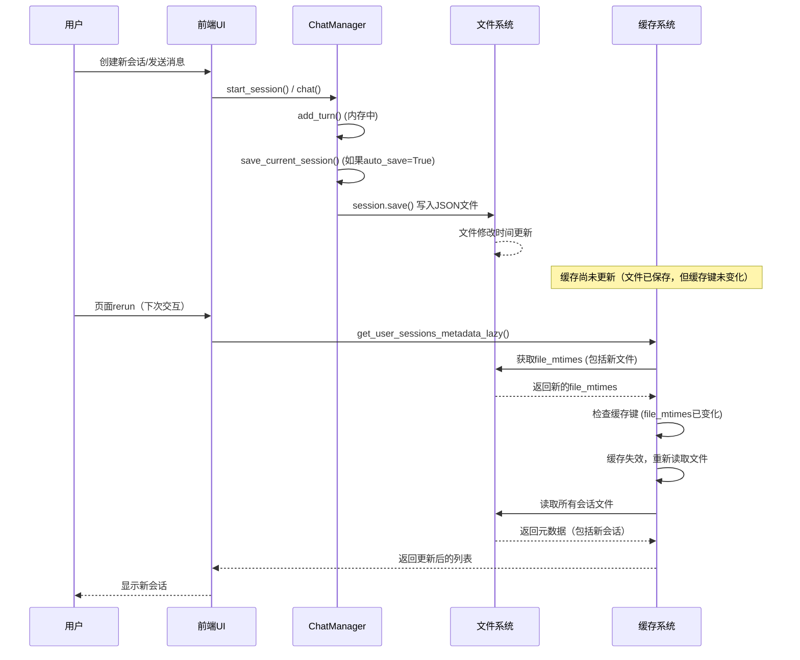

<!-- Generated by SpecStory, Markdown v2.1.0 -->

# 2026-01-14 09:57:18Z

<!-- Cursor IDE Session c9366373-0986-4991-88bb-3db442de9324 (2026-01-14 09:57:18Z) -->

_**User (2026-01-14 09:40:50Z)**_

再次出现了会话切花卡顿的情况，分析原因

---

_**Agent (composer-1)**_


分析会话切换卡顿原因。先查看相关代码和历史优化记录。


_**Agent (composer-1)**_

<tool-use data-tool-type="unknown" data-tool-name="codebase_search">
<details>
<summary>Tool use: **codebase_search**</summary>


Parameters:

```json
{
  "codeResults": [
    {
      "codeBlock": {
        "range": {
          "endPosition": {
            "column": 72,
            "line": 183
          },
          "startPosition": {
            "column": 56,
            "line": 146
          }
        },
        "relativeWorkspacePath": "frontend/components/history.py",
        "signatures": {
          "ranges": [
            {
              "endPosition": {
                "column": 5,
                "line": 129
              },
              "startPosition": {
                "column": 1,
                "line": 128
              }
            }
          ]
        }
      },
      "score": 0.3615013360977173
    },
    {
      "codeBlock": {
        "range": {
          "endPosition": {
            "column": 58,
            "line": 72
          },
          "startPosition": {
            "column": 105,
            "line": 30
          }
        },
        "relativeWorkspacePath": "frontend/components/sidebar.py",
        "signatures": {}
      },
      "score": 0.34894049167633057
    },
    {
      "codeBlock": {
        "range": {
          "endPosition": {
            "column": 58,
            "line": 33
          },
          "startPosition": {
            "column": 1,
            "line": 1
          }
        },
        "relativeWorkspacePath": "frontend/components/session_loader.py",
        "signatures": {}
      },
      "score": 0.32458218932151794
    },
    {
      "codeBlock": {
        "range": {
          "endPosition": {
            "column": 26,
            "line": 63
          },
          "startPosition": {
            "column": 1,
            "line": 1
          }
        },
        "relativeWorkspacePath": "frontend/components/chat_display.py",
        "signatures": {}
      },
      "score": 0.32191169261932373
    },
    {
      "codeBlock": {
        "range": {
          "endPosition": {
            "column": 129,
            "line": 383
          },
          "startPosition": {
            "column": 24,
            "line": 364
          }
        },
        "relativeWorkspacePath": "src/business/chat/manager.py",
        "signatures": {
          "ranges": [
            {
              "endPosition": {
                "column": 5,
                "line": 46
              },
              "startPosition": {
                "column": 1,
                "line": 45
              }
            }
          ]
        }
      },
      "score": 0.3112824857234955
    },
    {
      "codeBlock": {
        "range": {
          "endPosition": {
            "column": 129,
            "line": 383
          },
          "startPosition": {
            "column": 24,
            "line": 364
          }
        },
        "relativeWorkspacePath": "src/business/chat/manager.py",
        "signatures": {
          "ranges": [
            {
              "endPosition": {
                "column": 5,
                "line": 46
              },
              "startPosition": {
                "column": 1,
                "line": 45
              }
            }
          ]
        }
      },
      "score": 0.3112824857234955
    },
    {
      "codeBlock": {
        "range": {
          "endPosition": {
            "column": 1,
            "line": 43
          },
          "startPosition": {
            "column": 1,
            "line": 1
          }
        },
        "relativeWorkspacePath": "agent-task-log/2026-01-03-2_【optimization】历史会话切换性能优化-完成总结.md",
        "signatures": {}
      },
      "score": 0.3111005127429962
    },
    {
      "codeBlock": {
        "range": {
          "endPosition": {
            "column": 51,
            "line": 56
          },
          "startPosition": {
            "column": 1,
            "line": 1
          }
        },
        "relativeWorkspacePath": "frontend/utils/state.py",
        "signatures": {}
      },
      "score": 0.29244890809059143
    },
    {
      "codeBlock": {
        "range": {
          "endPosition": {
            "column": 24,
            "line": 534
          },
          "startPosition": {
            "column": 10,
            "line": 483
          }
        },
        "relativeWorkspacePath": "src/business/rag_api/rag_service.py",
        "signatures": {
          "ranges": [
            {
              "endPosition": {
                "column": 5,
                "line": 36
              },
              "startPosition": {
                "column": 1,
                "line": 35
              }
            },
            {
              "endPosition": {
                "column": 9,
                "line": 431
              },
              "startPosition": {
                "column": 5,
                "line": 430
              }
            }
          ]
        }
      },
      "score": 0.29192084074020386
    },
    {
      "codeBlock": {
        "range": {
          "endPosition": {
            "column": 24,
            "line": 534
          },
          "startPosition": {
            "column": 10,
            "line": 483
          }
        },
        "relativeWorkspacePath": "src/business/rag_api/rag_service.py",
        "signatures": {
          "ranges": [
            {
              "endPosition": {
                "column": 5,
                "line": 36
              },
              "startPosition": {
                "column": 1,
                "line": 35
              }
            },
            {
              "endPosition": {
                "column": 9,
                "line": 431
              },
              "startPosition": {
                "column": 5,
                "line": 430
              }
            }
          ]
        }
      },
      "score": 0.29192084074020386
    },
    {
      "codeBlock": {
        "range": {
          "endPosition": {
            "column": 39,
            "line": 526
          },
          "startPosition": {
            "column": 36,
            "line": 508
          }
        },
        "relativeWorkspacePath": "src/business/chat/manager.py",
        "signatures": {
          "ranges": [
            {
              "endPosition": {
                "column": 5,
                "line": 46
              },
              "startPosition": {
                "column": 1,
                "line": 45
              }
            }
          ]
        }
      },
      "score": 0.2764151096343994
    },
    {
      "codeBlock": {
        "range": {
          "endPosition": {
            "column": 39,
            "line": 526
          },
          "startPosition": {
            "column": 36,
            "line": 508
          }
        },
        "relativeWorkspacePath": "src/business/chat/manager.py",
        "signatures": {
          "ranges": [
            {
              "endPosition": {
                "column": 5,
                "line": 46
              },
              "startPosition": {
                "column": 1,
                "line": 45
              }
            }
          ]
        }
      },
      "score": 0.2764151096343994
    },
    {
      "codeBlock": {
        "range": {
          "endPosition": {
            "column": 1,
            "line": 155
          },
          "startPosition": {
            "column": 1,
            "line": 94
          }
        },
        "relativeWorkspacePath": "agent-task-log/2026-01-03-2_【optimization】历史会话切换性能优化-完成总结.md",
        "signatures": {}
      },
      "score": 0.27423250675201416
    },
    {
      "codeBlock": {
        "range": {
          "endPosition": {
            "column": 61,
            "line": 71
          },
          "startPosition": {
            "column": 58,
            "line": 33
          }
        },
        "relativeWorkspacePath": "frontend/components/session_loader.py",
        "signatures": {
          "ranges": [
            {
              "endPosition": {
                "column": 5,
                "line": 13
              },
              "startPosition": {
                "column": 1,
                "line": 12
              }
            }
          ]
        }
      },
      "score": 0.2711023986339569
    },
    {
      "codeBlock": {
        "range": {
          "endPosition": {
            "column": 1,
            "line": 48
          },
          "startPosition": {
            "column": 1,
            "line": 1
          }
        },
        "relativeWorkspacePath": "agent-task-log/2025-12/2025-12-09-1_【optimization】优化开启新对话功能的初始化逻辑-完成总结.md",
        "signatures": {}
      },
      "score": 0.26336920261383057
    }
  ],
  "explanation": "",
  "query": "会话切换功能实现 session switch",
  "repositoryInfo": {
    "orthogonalTransformSeed": 604211010859627,
    "preferredEmbeddingModel": "EMBEDDING_MODEL_UNSPECIFIED",
    "relativeWorkspacePath": ".",
    "repoName": "359e65b5-7480-4e49-885d-b3b1374b2dc6",
    "repoOwner": "auth0|user_01K0R19T315MR9H9932750QDEF"
  },
  "topK": 15
}
```
Result:

```json
{
  "codeResults": [
    {
      "codeBlock": {
        "contents": "def display_session_history(user_email: Optional[str] = None, current_session_id: Optional[str] = None) -\u003e None:\n\n    \n    ...\n\n    \n    # 显示分组后的会话\n    for group_name, sessions in grouped.items():\n        if sessions:\n            # 分组标题（使用原生组件）\n            st.caption(group_name.upper())\n            for idx, session in enumerate(sessions):\n                session_id = session['session_id']\n                title = session.get('title', '未命名会话')\n                is_current = session_id == current_session_id\n                icon_emoji = _get_session_icon_emoji(title, session_id)\n                \n                # 统一使用按钮实现，按钮文本包含emoji图标和标题\n                button_label = f\"{icon_emoji} {title}\"\n                button_key = f\"session_{session_id}\"\n                \n                # 选中状态使用disabled按钮（不可点击但显示选中样式）\n                if is_current:\n                    st.button(\n                        button_label,\n                        key=button_key,\n                        use_container_width=True,\n                        type=\"secondary\",\n                        disabled=True\n                    )\n                else:\n                    # 未选中状态：可点击按钮\n                    if st.button(\n                        button_label,\n                        key=button_key,\n                        use_container_width=True,\n                        type=\"secondary\"\n                    ):\n                        # 设置加载标记（不设置file_path，切换时根据session_id动态构建）\n                        st.session_state.load_session_id = session_id\n                        # 标记需要加载会话（不立即rerun，由render_chat_interface统一处理）\n                        st.session_state.session_loading_pending = True",
        "detailedLines": [
          {
            "isSignature": true,
            "lineNumber": 128,
            "text": "def display_session_history(user_email: Optional[str] = None, current_session_id: Optional[str] = None) -\u003e None:"
          },
          {
            "lineNumber": 129,
            "text": "    "
          },
          {
            "lineNumber": 142
          },
          {
            "lineNumber": 143,
            "text": "        return"
          },
          {
            "lineNumber": 144,
            "text": "    "
          },
          {
            "lineNumber": 145,
            "text": "    # 按时间分组"
          },
          {
            "lineNumber": 146,
            "text": "    grouped = group_sessions_by_time(sessions_metadata)"
          },
          {
            "lineNumber": 147,
            "text": "    "
          },
          {
            "lineNumber": 148,
            "text": "    # 显示分组后的会话"
          },
          {
            "lineNumber": 149,
            "text": "    for group_name, sessions in grouped.items():"
          },
          {
            "lineNumber": 150,
            "text": "        if sessions:"
          },
          {
            "lineNumber": 151,
            "text": "            # 分组标题（使用原生组件）"
          },
          {
            "lineNumber": 152,
            "text": "            st.caption(group_name.upper())"
          },
          {
            "lineNumber": 153,
            "text": "            for idx, session in enumerate(sessions):"
          },
          {
            "lineNumber": 154,
            "text": "                session_id = session['session_id']"
          },
          {
            "lineNumber": 155,
            "text": "                title = session.get('title', '未命名会话')"
          },
          {
            "lineNumber": 156,
            "text": "                is_current = session_id == current_session_id"
          },
          {
            "lineNumber": 157,
            "text": "                icon_emoji = _get_session_icon_emoji(title, session_id)"
          },
          {
            "lineNumber": 158,
            "text": "                "
          },
          {
            "lineNumber": 159,
            "text": "                # 统一使用按钮实现，按钮文本包含emoji图标和标题"
          },
          {
            "lineNumber": 160,
            "text": "                button_label = f\"{icon_emoji} {title}\""
          },
          {
            "lineNumber": 161,
            "text": "                button_key = f\"session_{session_id}\""
          },
          {
            "lineNumber": 162,
            "text": "                "
          },
          {
            "lineNumber": 163,
            "text": "                # 选中状态使用disabled按钮（不可点击但显示选中样式）"
          },
          {
            "lineNumber": 164,
            "text": "                if is_current:"
          },
          {
            "lineNumber": 165,
            "text": "                    st.button("
          },
          {
            "lineNumber": 166,
            "text": "                        button_label,"
          },
          {
            "lineNumber": 167,
            "text": "                        key=button_key,"
          },
          {
            "lineNumber": 168,
            "text": "                        use_container_width=True,"
          },
          {
            "lineNumber": 169,
            "text": "                        type=\"secondary\","
          },
          {
            "lineNumber": 170,
            "text": "                        disabled=True"
          },
          {
            "lineNumber": 171,
            "text": "                    )"
          },
          {
            "lineNumber": 172,
            "text": "                else:"
          },
          {
            "lineNumber": 173,
            "text": "                    # 未选中状态：可点击按钮"
          },
          {
            "lineNumber": 174,
            "text": "                    if st.button("
          },
          {
            "lineNumber": 175,
            "text": "                        button_label,"
          },
          {
            "lineNumber": 176,
            "text": "                        key=button_key,"
          },
          {
            "lineNumber": 177,
            "text": "                        use_container_width=True,"
          },
          {
            "lineNumber": 178,
            "text": "                        type=\"secondary\""
          },
          {
            "lineNumber": 179,
            "text": "                    ):"
          },
          {
            "lineNumber": 180,
            "text": "                        # 设置加载标记（不设置file_path，切换时根据session_id动态构建）"
          },
          {
            "lineNumber": 181,
            "text": "                        st.session_state.load_session_id = session_id"
          },
          {
            "lineNumber": 182,
            "text": "                        # 标记需要加载会话（不立即rerun，由render_chat_interface统一处理）"
          },
          {
            "isSignature": true,
            "lineNumber": 183,
            "text": "                        st.session_state.session_loading_pending = True"
          }
        ],
        "originalContents": "\n    \n    # 显示分组后的会话\n    for group_name, sessions in grouped.items():\n        if sessions:\n            # 分组标题（使用原生组件）\n            st.caption(group_name.upper())\n            for idx, session in enumerate(sessions):\n                session_id = session['session_id']\n                title = session.get('title', '未命名会话')\n                is_current = session_id == current_session_id\n                icon_emoji = _get_session_icon_emoji(title, session_id)\n                \n                # 统一使用按钮实现，按钮文本包含emoji图标和标题\n                button_label = f\"{icon_emoji} {title}\"\n                button_key = f\"session_{session_id}\"\n                \n                # 选中状态使用disabled按钮（不可点击但显示选中样式）\n                if is_current:\n                    st.button(\n                        button_label,\n                        key=button_key,\n                        use_container_width=True,\n                        type=\"secondary\",\n                        disabled=True\n                    )\n                else:\n                    # 未选中状态：可点击按钮\n                    if st.button(\n                        button_label,\n                        key=button_key,\n                        use_container_width=True,\n                        type=\"secondary\"\n                    ):\n                        # 设置加载标记（不设置file_path，切换时根据session_id动态构建）\n                        st.session_state.load_session_id = session_id\n                        # 标记需要加载会话（不立即rerun，由render_chat_interface统一处理）\n                        st.session_state.session_loading_pending = True",
        "range": {
          "endPosition": {
            "column": 71,
            "line": 182
          },
          "startPosition": {
            "column": 17,
            "line": 124
          }
        },
        "relativeWorkspacePath": "frontend/components/history.py"
      },
      "score": 0.3615013360977173
    },
    {
      "codeBlock": {
        "contents": "\n\n\ndef render_sidebar(chat_manager) -\u003e None:\n    \"\"\"渲染侧边栏\n    \n    Args:\n        chat_manager: 对话管理器实例\n    \"\"\"\n    with st.sidebar:\n        # ========== 应用标题区域 ==========\n        st.title(\"📚 \" + config.APP_TITLE)\n        \n        # ========== 新对话（顶部） ==========\n        if st.button(\"💬 开启新对话\", type=\"primary\", use_container_width=True, key=\"new_chat_top\"):\n            if chat_manager:\n                # 创建新会话（只重置对话状态，不重新初始化服务）\n                chat_manager.start_session()\n                st.session_state.messages = []\n                # 清空引用来源映射，避免右侧显示上一个对话的引用来源\n                if 'current_sources_map' in st.session_state:\n                    st.session_state.current_sources_map = {}\n                if 'current_reasoning_map' in st.session_state:\n                    st.session_state.current_reasoning_map = {}\n                # 仅刷新UI，不触发服务重新验证\n                st.rerun()\n\n        # ========== 历史会话（可滚动区域） ==========\n        # 使用容器包裹，确保历史会话可以滚动\n        with st.container():\n            current_session_id = None\n            if chat_manager and chat_manager.current_session:\n                current_session_id = chat_manager.current_session.session_id\n            display_session_history(user_email=None, current_session_id=current_session_id)\n        \n        # ========== 底部固定工具栏 ==========\n        _render_sidebar_footer()\n        \n        # 检查是否需要显示设置弹窗\n        if st.session_state.get(\"show_settings_dialog\", False):\n            show_settings_dialog()\n            # 清除状态标志，避免下次 rerun 时再次显示弹窗\n            st.session_state.show_settings_dialog = False",
        "detailedLines": [
          {
            "isSignature": true,
            "lineNumber": 11,
            "text": "def _render_sidebar_footer() -\u003e None:"
          },
          {
            "lineNumber": 29
          },
          {
            "isSignature": true,
            "lineNumber": 30,
            "text": "        st.button(\"📱\", key=\"feedback_button\", help=\"反馈\", use_container_width=True, disabled=True)"
          },
          {
            "lineNumber": 31
          },
          {
            "lineNumber": 32
          },
          {
            "isSignature": true,
            "lineNumber": 33,
            "text": "def render_sidebar(chat_manager) -\u003e None:"
          },
          {
            "lineNumber": 34,
            "text": "    \"\"\"渲染侧边栏"
          },
          {
            "lineNumber": 35,
            "text": "    "
          },
          {
            "lineNumber": 36,
            "text": "    Args:"
          },
          {
            "lineNumber": 37,
            "text": "        chat_manager: 对话管理器实例"
          },
          {
            "lineNumber": 38,
            "text": "    \"\"\""
          },
          {
            "lineNumber": 39,
            "text": "    with st.sidebar:"
          },
          {
            "lineNumber": 40,
            "text": "        # ========== 应用标题区域 =========="
          },
          {
            "lineNumber": 41,
            "text": "        st.title(\"📚 \" + config.APP_TITLE)"
          },
          {
            "lineNumber": 42,
            "text": "        "
          },
          {
            "lineNumber": 43,
            "text": "        # ========== 新对话（顶部） =========="
          },
          {
            "lineNumber": 44,
            "text": "        if st.button(\"💬 开启新对话\", type=\"primary\", use_container_width=True, key=\"new_chat_top\"):"
          },
          {
            "lineNumber": 45,
            "text": "            if chat_manager:"
          },
          {
            "lineNumber": 46,
            "text": "                # 创建新会话（只重置对话状态，不重新初始化服务）"
          },
          {
            "lineNumber": 47,
            "text": "                chat_manager.start_session()"
          },
          {
            "lineNumber": 48,
            "text": "                st.session_state.messages = []"
          },
          {
            "lineNumber": 49,
            "text": "                # 清空引用来源映射，避免右侧显示上一个对话的引用来源"
          },
          {
            "lineNumber": 50,
            "text": "                if 'current_sources_map' in st.session_state:"
          },
          {
            "lineNumber": 51,
            "text": "                    st.session_state.current_sources_map = {}"
          },
          {
            "lineNumber": 52,
            "text": "                if 'current_reasoning_map' in st.session_state:"
          },
          {
            "lineNumber": 53,
            "text": "                    st.session_state.current_reasoning_map = {}"
          },
          {
            "lineNumber": 54,
            "text": "                # 仅刷新UI，不触发服务重新验证"
          },
          {
            "lineNumber": 55,
            "text": "                st.rerun()"
          },
          {
            "lineNumber": 56
          },
          {
            "lineNumber": 57,
            "text": "        # ========== 历史会话（可滚动区域） =========="
          },
          {
            "lineNumber": 58,
            "text": "        # 使用容器包裹，确保历史会话可以滚动"
          },
          {
            "lineNumber": 59,
            "text": "        with st.container():"
          },
          {
            "lineNumber": 60,
            "text": "            current_session_id = None"
          },
          {
            "lineNumber": 61,
            "text": "            if chat_manager and chat_manager.current_session:"
          },
          {
            "lineNumber": 62,
            "text": "                current_session_id = chat_manager.current_session.session_id"
          },
          {
            "lineNumber": 63,
            "text": "            display_session_history(user_email=None, current_session_id=current_session_id)"
          },
          {
            "lineNumber": 64,
            "text": "        "
          },
          {
            "lineNumber": 65,
            "text": "        # ========== 底部固定工具栏 =========="
          },
          {
            "lineNumber": 66,
            "text": "        _render_sidebar_footer()"
          },
          {
            "lineNumber": 67,
            "text": "        "
          },
          {
            "lineNumber": 68,
            "text": "        # 检查是否需要显示设置弹窗"
          },
          {
            "lineNumber": 69,
            "text": "        if st.session_state.get(\"show_settings_dialog\", False):"
          },
          {
            "lineNumber": 70,
            "text": "            show_settings_dialog()"
          },
          {
            "lineNumber": 71,
            "text": "            # 清除状态标志，避免下次 rerun 时再次显示弹窗"
          },
          {
            "isSignature": true,
            "lineNumber": 72,
            "text": "            st.session_state.show_settings_dialog = False"
          }
        ],
        "originalContents": "\n\n\ndef render_sidebar(chat_manager) -\u003e None:\n    \"\"\"渲染侧边栏\n    \n    Args:\n        chat_manager: 对话管理器实例\n    \"\"\"\n    with st.sidebar:\n        # ========== 应用标题区域 ==========\n        st.title(\"📚 \" + config.APP_TITLE)\n        \n        # ========== 新对话（顶部） ==========\n        if st.button(\"💬 开启新对话\", type=\"primary\", use_container_width=True, key=\"new_chat_top\"):\n            if chat_manager:\n                # 创建新会话（只重置对话状态，不重新初始化服务）\n                chat_manager.start_session()\n                st.session_state.messages = []\n                # 清空引用来源映射，避免右侧显示上一个对话的引用来源\n                if 'current_sources_map' in st.session_state:\n                    st.session_state.current_sources_map = {}\n                if 'current_reasoning_map' in st.session_state:\n                    st.session_state.current_reasoning_map = {}\n                # 仅刷新UI，不触发服务重新验证\n                st.rerun()\n\n        # ========== 历史会话（可滚动区域） ==========\n        # 使用容器包裹，确保历史会话可以滚动\n        with st.container():\n            current_session_id = None\n            if chat_manager and chat_manager.current_session:\n                current_session_id = chat_manager.current_session.session_id\n            display_session_history(user_email=None, current_session_id=current_session_id)\n        \n        # ========== 底部固定工具栏 ==========\n        _render_sidebar_footer()\n        \n        # 检查是否需要显示设置弹窗\n        if st.session_state.get(\"show_settings_dialog\", False):\n            show_settings_dialog()\n            # 清除状态标志，避免下次 rerun 时再次显示弹窗\n            st.session_state.show_settings_dialog = False",
        "range": {
          "endPosition": {
            "column": 57,
            "line": 71
          },
          "startPosition": {
            "line": 10
          }
        },
        "relativeWorkspacePath": "frontend/components/sidebar.py"
      },
      "score": 0.34894049167633057
    },
    {
      "codeBlock": {
        "contents": "\"\"\"\n会话加载组件\n\"\"\"\n\nimport streamlit as st\nfrom pathlib import Path\nfrom backend.business.chat import load_session_from_file\nfrom backend.infrastructure.config import config\nfrom frontend.utils.sources import convert_sources_to_dict\n\n\ndef load_history_session(chat_manager) -\u003e bool:\n    \"\"\"加载历史会话\n    \n    优化：移除rerun，返回加载状态，由调用方统一处理rerun。\n    根据session_id动态构建文件路径，不再依赖file_path。\n    \n    Args:\n        chat_manager: 对话管理器实例\n        \n    Returns:\n        bool: 是否成功加载会话，如果不需要加载返回False\n    \"\"\"\n    if 'load_session_id' not in st.session_state or not st.session_state.load_session_id:\n        return False\n    \n    # 根据session_id动态构建文件路径（懒加载优化）\n    session_id = st.session_state.load_session_id\n    sessions_dir = config.SESSIONS_PATH / \"default\"\n    session_path = str(sessions_dir / f\"{session_id}.json\")\n    \n    # 加载历史会话\n    loaded_session = load_session_from_file(session_path)",
        "detailedLines": [
          {
            "lineNumber": 1,
            "text": "\"\"\""
          },
          {
            "lineNumber": 2,
            "text": "会话加载组件"
          },
          {
            "lineNumber": 3,
            "text": "\"\"\""
          },
          {
            "lineNumber": 4
          },
          {
            "lineNumber": 5,
            "text": "import streamlit as st"
          },
          {
            "lineNumber": 6,
            "text": "from pathlib import Path"
          },
          {
            "lineNumber": 7,
            "text": "from backend.business.chat import load_session_from_file"
          },
          {
            "lineNumber": 8,
            "text": "from backend.infrastructure.config import config"
          },
          {
            "lineNumber": 9,
            "text": "from frontend.utils.sources import convert_sources_to_dict"
          },
          {
            "lineNumber": 10
          },
          {
            "lineNumber": 11
          },
          {
            "isSignature": true,
            "lineNumber": 12,
            "text": "def load_history_session(chat_manager) -\u003e bool:"
          },
          {
            "lineNumber": 13,
            "text": "    \"\"\"加载历史会话"
          },
          {
            "lineNumber": 14,
            "text": "    "
          },
          {
            "lineNumber": 15,
            "text": "    优化：移除rerun，返回加载状态，由调用方统一处理rerun。"
          },
          {
            "lineNumber": 16,
            "text": "    根据session_id动态构建文件路径，不再依赖file_path。"
          },
          {
            "lineNumber": 17,
            "text": "    "
          },
          {
            "lineNumber": 18,
            "text": "    Args:"
          },
          {
            "lineNumber": 19,
            "text": "        chat_manager: 对话管理器实例"
          },
          {
            "lineNumber": 20,
            "text": "        "
          },
          {
            "lineNumber": 21,
            "text": "    Returns:"
          },
          {
            "lineNumber": 22,
            "text": "        bool: 是否成功加载会话，如果不需要加载返回False"
          },
          {
            "lineNumber": 23,
            "text": "    \"\"\""
          },
          {
            "lineNumber": 24,
            "text": "    if 'load_session_id' not in st.session_state or not st.session_state.load_session_id:"
          },
          {
            "lineNumber": 25,
            "text": "        return False"
          },
          {
            "lineNumber": 26,
            "text": "    "
          },
          {
            "lineNumber": 27,
            "text": "    # 根据session_id动态构建文件路径（懒加载优化）"
          },
          {
            "lineNumber": 28,
            "text": "    session_id = st.session_state.load_session_id"
          },
          {
            "lineNumber": 29,
            "text": "    sessions_dir = config.SESSIONS_PATH / \"default\""
          },
          {
            "lineNumber": 30,
            "text": "    session_path = str(sessions_dir / f\"{session_id}.json\")"
          },
          {
            "lineNumber": 31,
            "text": "    "
          },
          {
            "lineNumber": 32,
            "text": "    # 加载历史会话"
          },
          {
            "lineNumber": 33,
            "text": "    loaded_session = load_session_from_file(session_path)"
          },
          {
            "lineNumber": 34,
            "text": "    "
          },
          {
            "lineNumber": 35,
            "text": "    if loaded_session:"
          }
        ],
        "originalContents": "\"\"\"\n会话加载组件\n\"\"\"\n\nimport streamlit as st\nfrom pathlib import Path\nfrom backend.business.chat import load_session_from_file\nfrom backend.infrastructure.config import config\nfrom frontend.utils.sources import convert_sources_to_dict\n\n\ndef load_history_session(chat_manager) -\u003e bool:\n    \"\"\"加载历史会话\n    \n    优化：移除rerun，返回加载状态，由调用方统一处理rerun。\n    根据session_id动态构建文件路径，不再依赖file_path。\n    \n    Args:\n        chat_manager: 对话管理器实例\n        \n    Returns:\n        bool: 是否成功加载会话，如果不需要加载返回False\n    \"\"\"\n    if 'load_session_id' not in st.session_state or not st.session_state.load_session_id:\n        return False\n    \n    # 根据session_id动态构建文件路径（懒加载优化）\n    session_id = st.session_state.load_session_id\n    sessions_dir = config.SESSIONS_PATH / \"default\"\n    session_path = str(sessions_dir / f\"{session_id}.json\")\n    \n    # 加载历史会话\n    loaded_session = load_session_from_file(session_path)",
        "range": {
          "endPosition": {
            "line": 96
          },
          "startPosition": {}
        },
        "relativeWorkspacePath": "frontend/components/session_loader.py"
      },
      "score": 0.32458218932151794
    },
    {
      "codeBlock": {
        "contents": "\"\"\"\n对话显示组件\n\"\"\"\n\nimport streamlit as st\nfrom typing import Optional\nfrom frontend.utils.helpers import get_chat_title\nfrom frontend.utils.sources import convert_sources_to_dict\nfrom frontend.utils.state import initialize_sources_map\nfrom frontend.utils.sources import format_answer_with_citation_links\nfrom frontend.components.sources_panel import display_sources_below_message\nfrom backend.infrastructure.config import config\nfrom backend.infrastructure.logger import get_logger\n\nlogger = get_logger('app')\n\n\ndef render_chat_interface(rag_service, chat_manager) -\u003e None:\n    \"\"\"渲染对话界面\n    \n    优化：统一处理会话加载和rerun，减少重复渲染。\n    \n    Args:\n        rag_service: RAG服务实例\n        chat_manager: 对话管理器实例\n    \"\"\"\n    # 注入全局JavaScript脚本（仅一次，必须在渲染任何消息前）\n    if not st.session_state.get('citation_script_injected', False):\n        from frontend.utils.sources import inject_citation_script\n        st.markdown(inject_citation_script(), unsafe_allow_html=True)\n        st.session_state.citation_script_injected = True\n    \n    # 处理历史会话加载（统一处理，避免多次rerun）\n    from frontend.components.session_loader import load_history_session\n    \n    # 检查是否有待加载的会话\n    if st.session_state.get('session_loading_pending', False) or 'load_session_id' in st.session_state:\n        # 加载会话（同步执行，不立即rerun）\n        session_loaded = load_history_session(chat_manager)\n        \n        if session_loaded:\n            # 显示成功消息\n            st.success(\"✅ 会话已加载\")\n            # 统一rerun一次（合并多次rerun）\n            st.rerun()\n        else:\n            # 加载失败\n            st.error(\"❌ 加载会话失败\")\n            # 清除标记后rerun\n            st.rerun()\n        return\n    \n    # 显示标题\n    chat_title = get_chat_title(st.session_state.messages)\n    if chat_title:\n        st.subheader(chat_title)\n        st.markdown(\"---\")\n    \n    # 初始化来源映射\n    initialize_sources_map()\n    \n    # 无对话历史：显示快速开始\n    if not st.session_sta",
        "detailedLines": [
          {
            "lineNumber": 1,
            "text": "\"\"\""
          },
          {
            "lineNumber": 2,
            "text": "对话显示组件"
          },
          {
            "lineNumber": 3,
            "text": "\"\"\""
          },
          {
            "lineNumber": 4
          },
          {
            "lineNumber": 5,
            "text": "import streamlit as st"
          },
          {
            "lineNumber": 6,
            "text": "from typing import Optional"
          },
          {
            "lineNumber": 7,
            "text": "from frontend.utils.helpers import get_chat_title"
          },
          {
            "lineNumber": 8,
            "text": "from frontend.utils.sources import convert_sources_to_dict"
          },
          {
            "lineNumber": 9,
            "text": "from frontend.utils.state import initialize_sources_map"
          },
          {
            "lineNumber": 10,
            "text": "from frontend.utils.sources import format_answer_with_citation_links"
          },
          {
            "lineNumber": 11,
            "text": "from frontend.components.sources_panel import display_sources_below_message"
          },
          {
            "lineNumber": 12,
            "text": "from backend.infrastructure.config import config"
          },
          {
            "lineNumber": 13,
            "text": "from backend.infrastructure.logger import get_logger"
          },
          {
            "lineNumber": 14
          },
          {
            "lineNumber": 15,
            "text": "logger = get_logger('app')"
          },
          {
            "lineNumber": 16
          },
          {
            "lineNumber": 17
          },
          {
            "isSignature": true,
            "lineNumber": 18,
            "text": "def render_chat_interface(rag_service, chat_manager) -\u003e None:"
          },
          {
            "lineNumber": 19,
            "text": "    \"\"\"渲染对话界面"
          },
          {
            "lineNumber": 20,
            "text": "    "
          },
          {
            "lineNumber": 21,
            "text": "    优化：统一处理会话加载和rerun，减少重复渲染。"
          },
          {
            "lineNumber": 22,
            "text": "    "
          },
          {
            "lineNumber": 23,
            "text": "    Args:"
          },
          {
            "lineNumber": 24,
            "text": "        rag_service: RAG服务实例"
          },
          {
            "lineNumber": 25,
            "text": "        chat_manager: 对话管理器实例"
          },
          {
            "lineNumber": 26,
            "text": "    \"\"\""
          },
          {
            "lineNumber": 27,
            "text": "    # 注入全局JavaScript脚本（仅一次，必须在渲染任何消息前）"
          },
          {
            "lineNumber": 28,
            "text": "    if not st.session_state.get('citation_script_injected', False):"
          },
          {
            "lineNumber": 29,
            "text": "        from frontend.utils.sources import inject_citation_script"
          },
          {
            "lineNumber": 30,
            "text": "        st.markdown(inject_citation_script(), unsafe_allow_html=True)"
          },
          {
            "lineNumber": 31,
            "text": "        st.session_state.citation_script_injected = True"
          },
          {
            "lineNumber": 32,
            "text": "    "
          },
          {
            "lineNumber": 33,
            "text": "    # 处理历史会话加载（统一处理，避免多次rerun）"
          },
          {
            "lineNumber": 34,
            "text": "    from frontend.components.session_loader import load_history_session"
          },
          {
            "lineNumber": 35,
            "text": "    "
          },
          {
            "lineNumber": 36,
            "text": "    # 检查是否有待加载的会话"
          },
          {
            "lineNumber": 37,
            "text": "    if st.session_state.get('session_loading_pending', False) or 'load_session_id' in st.session_state:"
          },
          {
            "lineNumber": 38,
            "text": "        # 加载会话（同步执行，不立即rerun）"
          },
          {
            "lineNumber": 39,
            "text": "        session_loaded = load_history_session(chat_manager)"
          },
          {
            "lineNumber": 40,
            "text": "        "
          },
          {
            "lineNumber": 41,
            "text": "        if session_loaded:"
          },
          {
            "lineNumber": 42,
            "text": "            # 显示成功消息"
          },
          {
            "lineNumber": 43,
            "text": "            st.success(\"✅ 会话已加载\")"
          },
          {
            "lineNumber": 44,
            "text": "            # 统一rerun一次（合并多次rerun）"
          },
          {
            "lineNumber": 45,
            "text": "            st.rerun()"
          },
          {
            "lineNumber": 46,
            "text": "        else:"
          },
          {
            "lineNumber": 47,
            "text": "            # 加载失败"
          },
          {
            "lineNumber": 48,
            "text": "            st.error(\"❌ 加载会话失败\")"
          },
          {
            "lineNumber": 49,
            "text": "            # 清除标记后rerun"
          },
          {
            "lineNumber": 50,
            "text": "            st.rerun()"
          },
          {
            "lineNumber": 51,
            "text": "        return"
          },
          {
            "lineNumber": 52,
            "text": "    "
          },
          {
            "lineNumber": 53,
            "text": "    # 显示标题"
          },
          {
            "lineNumber": 54,
            "text": "    chat_title = get_chat_title(st.session_state.messages)"
          },
          {
            "lineNumber": 55,
            "text": "    if chat_title:"
          },
          {
            "lineNumber": 56,
            "text": "        st.subheader(chat_title)"
          },
          {
            "lineNumber": 57,
            "text": "        st.markdown(\"---\")"
          },
          {
            "lineNumber": 58,
            "text": "    "
          },
          {
            "lineNumber": 59,
            "text": "    # 初始化来源映射"
          },
          {
            "lineNumber": 60,
            "text": "    initialize_sources_map()"
          },
          {
            "lineNumber": 61,
            "text": "    "
          },
          {
            "lineNumber": 62,
            "text": "    # 无对话历史：显示快速开始"
          },
          {
            "lineNumber": 63,
            "text": "    if not st.session_state.messages:"
          },
          {
            "lineNumber": 64,
            "text": "        from"
          }
        ],
        "originalContents": "\"\"\"\n对话显示组件\n\"\"\"\n\nimport streamlit as st\nfrom typing import Optional\nfrom frontend.utils.helpers import get_chat_title\nfrom frontend.utils.sources import convert_sources_to_dict\nfrom frontend.utils.state import initialize_sources_map\nfrom frontend.utils.sources import format_answer_with_citation_links\nfrom frontend.components.sources_panel import display_sources_below_message\nfrom backend.infrastructure.config import config\nfrom backend.infrastructure.logger import get_logger\n\nlogger = get_logger('app')\n\n\ndef render_chat_interface(rag_service, chat_manager) -\u003e None:\n    \"\"\"渲染对话界面\n    \n    优化：统一处理会话加载和rerun，减少重复渲染。\n    \n    Args:\n        rag_service: RAG服务实例\n        chat_manager: 对话管理器实例\n    \"\"\"\n    # 注入全局JavaScript脚本（仅一次，必须在渲染任何消息前）\n    if not st.session_state.get('citation_script_injected', False):\n        from frontend.utils.sources import inject_citation_script\n        st.markdown(inject_citation_script(), unsafe_allow_html=True)\n        st.session_state.citation_script_injected = True\n    \n    # 处理历史会话加载（统一处理，避免多次rerun）\n    from frontend.components.session_loader import load_history_session\n    \n    # 检查是否有待加载的会话\n    if st.session_state.get('session_loading_pending', False) or 'load_session_id' in st.session_state:\n        # 加载会话（同步执行，不立即rerun）\n        session_loaded = load_history_session(chat_manager)\n        \n        if session_loaded:\n            # 显示成功消息\n            st.success(\"✅ 会话已加载\")\n            # 统一rerun一次（合并多次rerun）\n            st.rerun()\n        else:\n            # 加载失败\n            st.error(\"❌ 加载会话失败\")\n            # 清除标记后rerun\n            st.rerun()\n        return\n    \n    # 显示标题\n    chat_title = get_chat_title(st.session_state.messages)\n    if chat_title:\n        st.subheader(chat_title)\n        st.markdown(\"---\")\n    \n    # 初始化来源映射\n    initialize_sources_map()\n    \n    # 无对话历史：显示快速开始\n    if not st.session_sta",
        "range": {
          "endPosition": {
            "line": 68
          },
          "startPosition": {}
        },
        "relativeWorkspacePath": "frontend/components/chat_display.py"
      },
      "score": 0.32191169261932373
    },
    {
      "codeBlock": {
        "contents": "# 2026-01-03 【optimization】历史会话切换性能优化-完成总结\n\n## 1. 任务概述\n\n### 1.1 任务元信息\n- **任务类型**: optimization（性能优化）\n- **执行日期**: 2026-01-03\n- **任务目标**: 优化历史会话切换性能，解决切换缓慢、体验差的问题，提升用户体验\n- **涉及模块**: \n  - &#96;src/business/chat/utils.py&#96;（核心优化：缓存、局部读取、懒加载）\n  - &#96;src/business/chat/__init__.py&#96;（导出新函数）\n  - &#96;frontend/components/history.py&#96;（使用懒加载，移除rerun）\n  - &#96;frontend/components/session_loader.py&#96;（移除rerun，优化加载流程）\n  - &#96;frontend/components/chat_display.py&#96;（统一处理rerun）\n\n### 1.2 背景与动机\n- **问题识别**: 历史会话切换非常慢，用户体验极差\n- **性能瓶颈分析**:\n  - 每次页面渲染都完整读取所有会话文件（33+个文件）\n  - 列表展示时读取完整JSON（包括所有历史记录）\n  - 会话切换时触发多次rerun（2-3次）\n  - 无缓存机制，重复读取相同文件\n- **优化目标**: \n  - 列表加载速度：从 2-5秒 → 0.1-0.5秒（提升 10-50倍）\n  - 会话切换速度：从 2-3秒 → 0.5-1秒（提升 2-6倍）\n  - 内存占用：减少 90%+（不加载完整历史）\n  - rerun次数：从 2-3次 → 1次\n\n### 1.3 技术方案\n- **局部读取**: 只读取必要的元数据字段，不解析完整history数组\n- **缓存机制**: 使用 &#96;@st.cache_data&#96; 装饰器缓存会话元数据，文件修改时自动失效\n- **合并rerun**: 移除多个地方的rerun，统一在 &#96;render_chat_interface&#96; 中处理\n- **懒加载**: 列表展示时只读取最小必要信息，切换时根据session_id动态构建路径\n\n---\n\n## 2. 关键步骤与决策\n\n### 2.1 性能瓶颈分析\n\n**问题链路**：\n1. &#96;display_session_history&#96; → &#96;get_user_sessions_metadata&#96; → 遍历所有文件，完整读取JSON\n",
        "detailedLines": [
          {
            "lineNumber": 1,
            "text": "# 2026-01-03 【optimization】历史会话切换性能优化-完成总结"
          },
          {
            "lineNumber": 2
          },
          {
            "lineNumber": 3,
            "text": "## 1. 任务概述"
          },
          {
            "lineNumber": 4
          },
          {
            "lineNumber": 5,
            "text": "### 1.1 任务元信息"
          },
          {
            "lineNumber": 6,
            "text": "- **任务类型**: optimization（性能优化）"
          },
          {
            "lineNumber": 7,
            "text": "- **执行日期**: 2026-01-03"
          },
          {
            "lineNumber": 8,
            "text": "- **任务目标**: 优化历史会话切换性能，解决切换缓慢、体验差的问题，提升用户体验"
          },
          {
            "lineNumber": 9,
            "text": "- **涉及模块**: "
          },
          {
            "lineNumber": 10,
            "text": "  - &#96;src/business/chat/utils.py&#96;（核心优化：缓存、局部读取、懒加载）"
          },
          {
            "lineNumber": 11,
            "text": "  - &#96;src/business/chat/__init__.py&#96;（导出新函数）"
          },
          {
            "lineNumber": 12,
            "text": "  - &#96;frontend/components/history.py&#96;（使用懒加载，移除rerun）"
          },
          {
            "lineNumber": 13,
            "text": "  - &#96;frontend/components/session_loader.py&#96;（移除rerun，优化加载流程）"
          },
          {
            "lineNumber": 14,
            "text": "  - &#96;frontend/components/chat_display.py&#96;（统一处理rerun）"
          },
          {
            "lineNumber": 15
          },
          {
            "lineNumber": 16,
            "text": "### 1.2 背景与动机"
          },
          {
            "lineNumber": 17,
            "text": "- **问题识别**: 历史会话切换非常慢，用户体验极差"
          },
          {
            "lineNumber": 18,
            "text": "- **性能瓶颈分析**:"
          },
          {
            "lineNumber": 19,
            "text": "  - 每次页面渲染都完整读取所有会话文件（33+个文件）"
          },
          {
            "lineNumber": 20,
            "text": "  - 列表展示时读取完整JSON（包括所有历史记录）"
          },
          {
            "lineNumber": 21,
            "text": "  - 会话切换时触发多次rerun（2-3次）"
          },
          {
            "lineNumber": 22,
            "text": "  - 无缓存机制，重复读取相同文件"
          },
          {
            "lineNumber": 23,
            "text": "- **优化目标**: "
          },
          {
            "lineNumber": 24,
            "text": "  - 列表加载速度：从 2-5秒 → 0.1-0.5秒（提升 10-50倍）"
          },
          {
            "lineNumber": 25,
            "text": "  - 会话切换速度：从 2-3秒 → 0.5-1秒（提升 2-6倍）"
          },
          {
            "lineNumber": 26,
            "text": "  - 内存占用：减少 90%+（不加载完整历史）"
          },
          {
            "lineNumber": 27,
            "text": "  - rerun次数：从 2-3次 → 1次"
          },
          {
            "lineNumber": 28
          },
          {
            "lineNumber": 29,
            "text": "### 1.3 技术方案"
          },
          {
            "lineNumber": 30,
            "text": "- **局部读取**: 只读取必要的元数据字段，不解析完整history数组"
          },
          {
            "lineNumber": 31,
            "text": "- **缓存机制**: 使用 &#96;@st.cache_data&#96; 装饰器缓存会话元数据，文件修改时自动失效"
          },
          {
            "lineNumber": 32,
            "text": "- **合并rerun**: 移除多个地方的rerun，统一在 &#96;render_chat_interface&#96; 中处理"
          },
          {
            "lineNumber": 33,
            "text": "- **懒加载**: 列表展示时只读取最小必要信息，切换时根据session_id动态构建路径"
          },
          {
            "lineNumber": 34
          },
          {
            "lineNumber": 35,
            "text": "---"
          },
          {
            "lineNumber": 36
          },
          {
            "lineNumber": 37,
            "text": "## 2. 关键步骤与决策"
          },
          {
            "lineNumber": 38
          },
          {
            "lineNumber": 39,
            "text": "### 2.1 性能瓶颈分析"
          },
          {
            "lineNumber": 40
          },
          {
            "lineNumber": 41,
            "text": "**问题链路**："
          },
          {
            "lineNumber": 42,
            "text": "1. &#96;display_session_history&#96; → &#96;get_user_sessions_metadata&#96; → 遍历所有文件，完整读取JSON"
          },
          {
            "lineNumber": 43,
            "text": "2. 点击按钮 → 设置标记 → &#96;st.rerun()&#96; → &#96;load_history_session&#96; → &#96;st.rerun()&#96; → 渲染"
          }
        ],
        "originalContents": "# 2026-01-03 【optimization】历史会话切换性能优化-完成总结\n\n## 1. 任务概述\n\n### 1.1 任务元信息\n- **任务类型**: optimization（性能优化）\n- **执行日期**: 2026-01-03\n- **任务目标**: 优化历史会话切换性能，解决切换缓慢、体验差的问题，提升用户体验\n- **涉及模块**: \n  - &#96;src/business/chat/utils.py&#96;（核心优化：缓存、局部读取、懒加载）\n  - &#96;src/business/chat/__init__.py&#96;（导出新函数）\n  - &#96;frontend/components/history.py&#96;（使用懒加载，移除rerun）\n  - &#96;frontend/components/session_loader.py&#96;（移除rerun，优化加载流程）\n  - &#96;frontend/components/chat_display.py&#96;（统一处理rerun）\n\n### 1.2 背景与动机\n- **问题识别**: 历史会话切换非常慢，用户体验极差\n- **性能瓶颈分析**:\n  - 每次页面渲染都完整读取所有会话文件（33+个文件）\n  - 列表展示时读取完整JSON（包括所有历史记录）\n  - 会话切换时触发多次rerun（2-3次）\n  - 无缓存机制，重复读取相同文件\n- **优化目标**: \n  - 列表加载速度：从 2-5秒 → 0.1-0.5秒（提升 10-50倍）\n  - 会话切换速度：从 2-3秒 → 0.5-1秒（提升 2-6倍）\n  - 内存占用：减少 90%+（不加载完整历史）\n  - rerun次数：从 2-3次 → 1次\n\n### 1.3 技术方案\n- **局部读取**: 只读取必要的元数据字段，不解析完整history数组\n- **缓存机制**: 使用 &#96;@st.cache_data&#96; 装饰器缓存会话元数据，文件修改时自动失效\n- **合并rerun**: 移除多个地方的rerun，统一在 &#96;render_chat_interface&#96; 中处理\n- **懒加载**: 列表展示时只读取最小必要信息，切换时根据session_id动态构建路径\n\n---\n\n## 2. 关键步骤与决策\n\n### 2.1 性能瓶颈分析\n\n**问题链路**：\n1. &#96;display_session_history&#96; → &#96;get_user_sessions_metadata&#96; → 遍历所有文件，完整读取JSON\n",
        "range": {
          "endPosition": {
            "line": 43
          },
          "startPosition": {}
        },
        "relativeWorkspacePath": "agent-task-log/2026-01-03-2_【optimization】历史会话切换性能优化-完成总结.md"
      },
      "score": 0.3111005127429962
    },
    {
      "codeBlock": {
        "contents": "\"\"\"\n状态管理工具模块\n初始化和管理Streamlit会话状态\n\n主要功能：\n- init_session_state()：初始化Streamlit会话状态，包括索引管理、对话管理等\n- initialize_sources_map()：初始化来源映射\n- save_message_to_history()：保存消息到历史\n- invalidate_service_cache()：使服务缓存失效\n\n特性：\n- 完整的会话状态初始化\n- 单例模式管理服务\n- 默认值设置\n\"\"\"\n\nimport streamlit as st\nfrom typing import List, Dict, Any, Optional\nfrom frontend.utils.sources import convert_sources_to_dict\nfrom backend.infrastructure.config import config\n\n\ndef init_session_state() -\u003e None:\n    \"\"\"初始化会话状态\"\"\"\n    # 设置默认collection_name（使用配置中的默认值）\n    if 'collection_name' not in st.session_state:\n        st.session_state.collection_name = config.CHROMA_COLLECTION_NAME\n    \n    # 索引和对话管理\n    if 'index_manager' not in st.session_state:\n        st.session_state.index_manager = None\n    \n    if 'chat_manager' not in st.session_state:\n        st.session_state.chat_manager = None\n    \n    if 'messages' not in st.session_state:\n        st.session_state.messages = []\n    \n    if 'index_built' not in st.session_state:\n        st.session_state.index_built = False\n    \n    if 'hybrid_query_engine' not in st.session_state:\n        st.session_state.hybrid_query_engine = None\n    \n    # GitHub 增量更新相关\n    if 'github_sync_manager' not in st.session_state:\n        from backend.infrastructure.data_loader.github_sync import GitHubSyncManager\n        st.session_state.github_sync_manager = GitHubSyncManager(config.GITHUB_SYNC_STATE_PATH)\n    \n    if 'github_repos' not in st.session_state:\n        # 从同步状态中加载已存在的仓库列表\n        st.session_state.github_repos = st.session_state.github_sync_manager.list_repositories()\n    \n    # 调试模式与可观测性（默认开启）\n    if 'debug_mode_enabled' not in st.session_state:\n        st.session_state.debug_mode_enabled = True",
        "detailedLines": [
          {
            "lineNumber": 1,
            "text": "\"\"\""
          },
          {
            "lineNumber": 2,
            "text": "状态管理工具模块"
          },
          {
            "lineNumber": 3,
            "text": "初始化和管理Streamlit会话状态"
          },
          {
            "lineNumber": 4
          },
          {
            "lineNumber": 5,
            "text": "主要功能："
          },
          {
            "lineNumber": 6,
            "text": "- init_session_state()：初始化Streamlit会话状态，包括索引管理、对话管理等"
          },
          {
            "lineNumber": 7,
            "text": "- initialize_sources_map()：初始化来源映射"
          },
          {
            "lineNumber": 8,
            "text": "- save_message_to_history()：保存消息到历史"
          },
          {
            "lineNumber": 9,
            "text": "- invalidate_service_cache()：使服务缓存失效"
          },
          {
            "lineNumber": 10
          },
          {
            "lineNumber": 11,
            "text": "特性："
          },
          {
            "lineNumber": 12,
            "text": "- 完整的会话状态初始化"
          },
          {
            "lineNumber": 13,
            "text": "- 单例模式管理服务"
          },
          {
            "lineNumber": 14,
            "text": "- 默认值设置"
          },
          {
            "lineNumber": 15,
            "text": "\"\"\""
          },
          {
            "lineNumber": 16
          },
          {
            "lineNumber": 17,
            "text": "import streamlit as st"
          },
          {
            "lineNumber": 18,
            "text": "from typing import List, Dict, Any, Optional"
          },
          {
            "lineNumber": 19,
            "text": "from frontend.utils.sources import convert_sources_to_dict"
          },
          {
            "lineNumber": 20,
            "text": "from backend.infrastructure.config import config"
          },
          {
            "lineNumber": 21
          },
          {
            "lineNumber": 22
          },
          {
            "isSignature": true,
            "lineNumber": 23,
            "text": "def init_session_state() -\u003e None:"
          },
          {
            "lineNumber": 24,
            "text": "    \"\"\"初始化会话状态\"\"\""
          },
          {
            "lineNumber": 25,
            "text": "    # 设置默认collection_name（使用配置中的默认值）"
          },
          {
            "lineNumber": 26,
            "text": "    if 'collection_name' not in st.session_state:"
          },
          {
            "lineNumber": 27,
            "text": "        st.session_state.collection_name = config.CHROMA_COLLECTION_NAME"
          },
          {
            "lineNumber": 28,
            "text": "    "
          },
          {
            "lineNumber": 29,
            "text": "    # 索引和对话管理"
          },
          {
            "lineNumber": 30,
            "text": "    if 'index_manager' not in st.session_state:"
          },
          {
            "lineNumber": 31,
            "text": "        st.session_state.index_manager = None"
          },
          {
            "lineNumber": 32,
            "text": "    "
          },
          {
            "lineNumber": 33,
            "text": "    if 'chat_manager' not in st.session_state:"
          },
          {
            "lineNumber": 34,
            "text": "        st.session_state.chat_manager = None"
          },
          {
            "lineNumber": 35,
            "text": "    "
          },
          {
            "lineNumber": 36,
            "text": "    if 'messages' not in st.session_state:"
          },
          {
            "lineNumber": 37,
            "text": "        st.session_state.messages = []"
          },
          {
            "lineNumber": 38,
            "text": "    "
          },
          {
            "lineNumber": 39,
            "text": "    if 'index_built' not in st.session_state:"
          },
          {
            "lineNumber": 40,
            "text": "        st.session_state.index_built = False"
          },
          {
            "lineNumber": 41,
            "text": "    "
          },
          {
            "lineNumber": 42,
            "text": "    if 'hybrid_query_engine' not in st.session_state:"
          },
          {
            "lineNumber": 43,
            "text": "        st.session_state.hybrid_query_engine = None"
          },
          {
            "lineNumber": 44,
            "text": "    "
          },
          {
            "lineNumber": 45,
            "text": "    # GitHub 增量更新相关"
          },
          {
            "lineNumber": 46,
            "text": "    if 'github_sync_manager' not in st.session_state:"
          },
          {
            "lineNumber": 47,
            "text": "        from backend.infrastructure.data_loader.github_sync import GitHubSyncManager"
          },
          {
            "lineNumber": 48,
            "text": "        st.session_state.github_sync_manager = GitHubSyncManager(config.GITHUB_SYNC_STATE_PATH)"
          },
          {
            "lineNumber": 49,
            "text": "    "
          },
          {
            "lineNumber": 50,
            "text": "    if 'github_repos' not in st.session_state:"
          },
          {
            "lineNumber": 51,
            "text": "        # 从同步状态中加载已存在的仓库列表"
          },
          {
            "lineNumber": 52,
            "text": "        st.session_state.github_repos = st.session_state.github_sync_manager.list_repositories()"
          },
          {
            "lineNumber": 53,
            "text": "    "
          },
          {
            "lineNumber": 54,
            "text": "    # 调试模式与可观测性（默认开启）"
          },
          {
            "lineNumber": 55,
            "text": "    if 'debug_mode_enabled' not in st.session_state:"
          },
          {
            "lineNumber": 56,
            "text": "        st.session_state.debug_mode_enabled = True"
          },
          {
            "lineNumber": 57,
            "text": "    "
          },
          {
            "lineNumber": 58,
            "text": "    # 追踪信息默认启用，无需配置"
          }
        ],
        "originalContents": "\"\"\"\n状态管理工具模块\n初始化和管理Streamlit会话状态\n\n主要功能：\n- init_session_state()：初始化Streamlit会话状态，包括索引管理、对话管理等\n- initialize_sources_map()：初始化来源映射\n- save_message_to_history()：保存消息到历史\n- invalidate_service_cache()：使服务缓存失效\n\n特性：\n- 完整的会话状态初始化\n- 单例模式管理服务\n- 默认值设置\n\"\"\"\n\nimport streamlit as st\nfrom typing import List, Dict, Any, Optional\nfrom frontend.utils.sources import convert_sources_to_dict\nfrom backend.infrastructure.config import config\n\n\ndef init_session_state() -\u003e None:\n    \"\"\"初始化会话状态\"\"\"\n    # 设置默认collection_name（使用配置中的默认值）\n    if 'collection_name' not in st.session_state:\n        st.session_state.collection_name = config.CHROMA_COLLECTION_NAME\n    \n    # 索引和对话管理\n    if 'index_manager' not in st.session_state:\n        st.session_state.index_manager = None\n    \n    if 'chat_manager' not in st.session_state:\n        st.session_state.chat_manager = None\n    \n    if 'messages' not in st.session_state:\n        st.session_state.messages = []\n    \n    if 'index_built' not in st.session_state:\n        st.session_state.index_built = False\n    \n    if 'hybrid_query_engine' not in st.session_state:\n        st.session_state.hybrid_query_engine = None\n    \n    # GitHub 增量更新相关\n    if 'github_sync_manager' not in st.session_state:\n        from backend.infrastructure.data_loader.github_sync import GitHubSyncManager\n        st.session_state.github_sync_manager = GitHubSyncManager(config.GITHUB_SYNC_STATE_PATH)\n    \n    if 'github_repos' not in st.session_state:\n        # 从同步状态中加载已存在的仓库列表\n        st.session_state.github_repos = st.session_state.github_sync_manager.list_repositories()\n    \n    # 调试模式与可观测性（默认开启）\n    if 'debug_mode_enabled' not in st.session_state:\n        st.session_state.debug_mode_enabled = True",
        "range": {
          "endPosition": {
            "line": 89
          },
          "startPosition": {}
        },
        "relativeWorkspacePath": "frontend/utils/state.py"
      },
      "score": 0.29244890809059143
    },
    {
      "codeBlock": {
        "contents": "3. 在 &#96;render_chat_interface&#96; 中统一处理一次 &#96;st.rerun()&#96;\n\n---\n\n## 3. 实施方法\n\n### 3.1 核心函数优化（&#96;src/business/chat/utils.py&#96;）\n\n**新增函数**：\n1. &#96;_read_session_metadata_partial()&#96; - 局部读取会话文件元数据\n   - 只读取必要的顶层字段\n   - 不解析完整history数组\n   - 仅在必要时访问第一条消息\n\n2. &#96;_get_sessions_metadata_cached()&#96; - 缓存版本的元数据获取\n   - 使用 &#96;@st.cache_data&#96; 装饰器\n   - 缓存键包含文件修改时间\n   - 条件导入streamlit，兼容非Streamlit环境\n\n3. &#96;get_user_sessions_metadata_lazy()&#96; - 懒加载版本\n   - 只读取最小必要信息：&#96;session_id&#96;, &#96;title&#96;, &#96;created_at&#96;, &#96;updated_at&#96;\n   - 不读取 &#96;message_count&#96; 和 &#96;file_path&#96;\n   - 用于列表展示\n\n**优化函数**：\n- &#96;get_user_sessions_metadata()&#96; - 使用缓存和局部读取\n  - 获取文件修改时间作为缓存键\n  - 调用缓存版本获取元数据\n\n### 3.2 前端组件优化\n\n**&#96;frontend/components/history.py&#96;**：\n- 使用 &#96;get_user_sessions_metadata_lazy()&#96; 替代 &#96;get_user_sessions_metadata()&#96;\n- 移除按钮点击时的 &#96;st.rerun()&#96;\n- 设置 &#96;session_loading_pending&#96; 标记，由 &#96;render_chat_interface&#96; 统一处理\n\n**&#96;frontend/components/session_loader.py&#96;**：\n- 移除加载完成后的 &#96;st.rerun()&#96;\n- 改为返回 &#96;bool&#96; 类型，表示加载是否成功\n- 根据 &#96;session_id&#96; 动态构建文件路径（不再依赖 &#96;file_path&#96;）\n- 清除所有加载标记\n\n**&#96;frontend/components/chat_display.py&#96;**：\n- 在 &#96;render_chat_interface&#96; 中统一处理会话加载\n- 检查 &#96;session_loading_pending&#96; 或 &#96;load_session_id&#96; 标记\n- 调用 &#96;load_history_session&#96; 同步加载会话\n- 加载完成后统一执行一次 &#96;st.rerun()&#96;\n\n### 3.3 导出更新\n\n**&#96;src/business/chat/__init__.py&#96;**：\n- 导出 &#96;get_user_sessions_metadata_lazy&#96; 函数\n- 更新 &#96;__all__&#96; 列表\n\n---\n\n## 4. 测试执行\n\n### 4.1 代码质量检查\n- ✅ 所有代码通过 linter 检查\n- ✅ 无语法错误\n",
        "detailedLines": [
          {
            "lineNumber": 93,
            "text": "2. 移除 &#96;load_history_session&#96; 中的 &#96;st.rerun()&#96;，改为返回加载状态"
          },
          {
            "lineNumber": 94,
            "text": "3. 在 &#96;render_chat_interface&#96; 中统一处理一次 &#96;st.rerun()&#96;"
          },
          {
            "lineNumber": 95
          },
          {
            "lineNumber": 96,
            "text": "---"
          },
          {
            "lineNumber": 97
          },
          {
            "lineNumber": 98,
            "text": "## 3. 实施方法"
          },
          {
            "lineNumber": 99
          },
          {
            "lineNumber": 100,
            "text": "### 3.1 核心函数优化（&#96;src/business/chat/utils.py&#96;）"
          },
          {
            "lineNumber": 101
          },
          {
            "lineNumber": 102,
            "text": "**新增函数**："
          },
          {
            "lineNumber": 103,
            "text": "1. &#96;_read_session_metadata_partial()&#96; - 局部读取会话文件元数据"
          },
          {
            "lineNumber": 104,
            "text": "   - 只读取必要的顶层字段"
          },
          {
            "lineNumber": 105,
            "text": "   - 不解析完整history数组"
          },
          {
            "lineNumber": 106,
            "text": "   - 仅在必要时访问第一条消息"
          },
          {
            "lineNumber": 107
          },
          {
            "lineNumber": 108,
            "text": "2. &#96;_get_sessions_metadata_cached()&#96; - 缓存版本的元数据获取"
          },
          {
            "lineNumber": 109,
            "text": "   - 使用 &#96;@st.cache_data&#96; 装饰器"
          },
          {
            "lineNumber": 110,
            "text": "   - 缓存键包含文件修改时间"
          },
          {
            "lineNumber": 111,
            "text": "   - 条件导入streamlit，兼容非Streamlit环境"
          },
          {
            "lineNumber": 112
          },
          {
            "lineNumber": 113,
            "text": "3. &#96;get_user_sessions_metadata_lazy()&#96; - 懒加载版本"
          },
          {
            "lineNumber": 114,
            "text": "   - 只读取最小必要信息：&#96;session_id&#96;, &#96;title&#96;, &#96;created_at&#96;, &#96;updated_at&#96;"
          },
          {
            "lineNumber": 115,
            "text": "   - 不读取 &#96;message_count&#96; 和 &#96;file_path&#96;"
          },
          {
            "lineNumber": 116,
            "text": "   - 用于列表展示"
          },
          {
            "lineNumber": 117
          },
          {
            "lineNumber": 118,
            "text": "**优化函数**："
          },
          {
            "lineNumber": 119,
            "text": "- &#96;get_user_sessions_metadata()&#96; - 使用缓存和局部读取"
          },
          {
            "lineNumber": 120,
            "text": "  - 获取文件修改时间作为缓存键"
          },
          {
            "lineNumber": 121,
            "text": "  - 调用缓存版本获取元数据"
          },
          {
            "lineNumber": 122
          },
          {
            "lineNumber": 123,
            "text": "### 3.2 前端组件优化"
          },
          {
            "lineNumber": 124
          },
          {
            "lineNumber": 125,
            "text": "**&#96;frontend/components/history.py&#96;**："
          },
          {
            "lineNumber": 126,
            "text": "- 使用 &#96;get_user_sessions_metadata_lazy()&#96; 替代 &#96;get_user_sessions_metadata()&#96;"
          },
          {
            "lineNumber": 127,
            "text": "- 移除按钮点击时的 &#96;st.rerun()&#96;"
          },
          {
            "lineNumber": 128,
            "text": "- 设置 &#96;session_loading_pending&#96; 标记，由 &#96;render_chat_interface&#96; 统一处理"
          },
          {
            "lineNumber": 129
          },
          {
            "lineNumber": 130,
            "text": "**&#96;frontend/components/session_loader.py&#96;**："
          },
          {
            "lineNumber": 131,
            "text": "- 移除加载完成后的 &#96;st.rerun()&#96;"
          },
          {
            "lineNumber": 132,
            "text": "- 改为返回 &#96;bool&#96; 类型，表示加载是否成功"
          },
          {
            "lineNumber": 133,
            "text": "- 根据 &#96;session_id&#96; 动态构建文件路径（不再依赖 &#96;file_path&#96;）"
          },
          {
            "lineNumber": 134,
            "text": "- 清除所有加载标记"
          },
          {
            "lineNumber": 135
          },
          {
            "lineNumber": 136,
            "text": "**&#96;frontend/components/chat_display.py&#96;**："
          },
          {
            "lineNumber": 137,
            "text": "- 在 &#96;render_chat_interface&#96; 中统一处理会话加载"
          },
          {
            "lineNumber": 138,
            "text": "- 检查 &#96;session_loading_pending&#96; 或 &#96;load_session_id&#96; 标记"
          },
          {
            "lineNumber": 139,
            "text": "- 调用 &#96;load_history_session&#96; 同步加载会话"
          },
          {
            "lineNumber": 140,
            "text": "- 加载完成后统一执行一次 &#96;st.rerun()&#96;"
          },
          {
            "lineNumber": 141
          },
          {
            "lineNumber": 142,
            "text": "### 3.3 导出更新"
          },
          {
            "lineNumber": 143
          },
          {
            "lineNumber": 144,
            "text": "**&#96;src/business/chat/__init__.py&#96;**："
          },
          {
            "lineNumber": 145,
            "text": "- 导出 &#96;get_user_sessions_metadata_lazy&#96; 函数"
          },
          {
            "lineNumber": 146,
            "text": "- 更新 &#96;__all__&#96; 列表"
          },
          {
            "lineNumber": 147
          },
          {
            "lineNumber": 148,
            "text": "---"
          },
          {
            "lineNumber": 149
          },
          {
            "lineNumber": 150,
            "text": "## 4. 测试执行"
          },
          {
            "lineNumber": 151
          },
          {
            "lineNumber": 152,
            "text": "### 4.1 代码质量检查"
          },
          {
            "lineNumber": 153,
            "text": "- ✅ 所有代码通过 linter 检查"
          },
          {
            "lineNumber": 154,
            "text": "- ✅ 无语法错误"
          },
          {
            "lineNumber": 155,
            "text": "- ✅ 无导入错误"
          },
          {
            "lineNumber": 156,
            "text": "- ✅ 条件导入streamlit正常工作"
          }
        ],
        "originalContents": "3. 在 &#96;render_chat_interface&#96; 中统一处理一次 &#96;st.rerun()&#96;\n\n---\n\n## 3. 实施方法\n\n### 3.1 核心函数优化（&#96;src/business/chat/utils.py&#96;）\n\n**新增函数**：\n1. &#96;_read_session_metadata_partial()&#96; - 局部读取会话文件元数据\n   - 只读取必要的顶层字段\n   - 不解析完整history数组\n   - 仅在必要时访问第一条消息\n\n2. &#96;_get_sessions_metadata_cached()&#96; - 缓存版本的元数据获取\n   - 使用 &#96;@st.cache_data&#96; 装饰器\n   - 缓存键包含文件修改时间\n   - 条件导入streamlit，兼容非Streamlit环境\n\n3. &#96;get_user_sessions_metadata_lazy()&#96; - 懒加载版本\n   - 只读取最小必要信息：&#96;session_id&#96;, &#96;title&#96;, &#96;created_at&#96;, &#96;updated_at&#96;\n   - 不读取 &#96;message_count&#96; 和 &#96;file_path&#96;\n   - 用于列表展示\n\n**优化函数**：\n- &#96;get_user_sessions_metadata()&#96; - 使用缓存和局部读取\n  - 获取文件修改时间作为缓存键\n  - 调用缓存版本获取元数据\n\n### 3.2 前端组件优化\n\n**&#96;frontend/components/history.py&#96;**：\n- 使用 &#96;get_user_sessions_metadata_lazy()&#96; 替代 &#96;get_user_sessions_metadata()&#96;\n- 移除按钮点击时的 &#96;st.rerun()&#96;\n- 设置 &#96;session_loading_pending&#96; 标记，由 &#96;render_chat_interface&#96; 统一处理\n\n**&#96;frontend/components/session_loader.py&#96;**：\n- 移除加载完成后的 &#96;st.rerun()&#96;\n- 改为返回 &#96;bool&#96; 类型，表示加载是否成功\n- 根据 &#96;session_id&#96; 动态构建文件路径（不再依赖 &#96;file_path&#96;）\n- 清除所有加载标记\n\n**&#96;frontend/components/chat_display.py&#96;**：\n- 在 &#96;render_chat_interface&#96; 中统一处理会话加载\n- 检查 &#96;session_loading_pending&#96; 或 &#96;load_session_id&#96; 标记\n- 调用 &#96;load_history_session&#96; 同步加载会话\n- 加载完成后统一执行一次 &#96;st.rerun()&#96;\n\n### 3.3 导出更新\n\n**&#96;src/business/chat/__init__.py&#96;**：\n- 导出 &#96;get_user_sessions_metadata_lazy&#96; 函数\n- 更新 &#96;__all__&#96; 列表\n\n---\n\n## 4. 测试执行\n\n### 4.1 代码质量检查\n- ✅ 所有代码通过 linter 检查\n- ✅ 无语法错误\n",
        "range": {
          "endPosition": {
            "line": 157
          },
          "startPosition": {
            "line": 92
          }
        },
        "relativeWorkspacePath": "agent-task-log/2026-01-03-2_【optimization】历史会话切换性能优化-完成总结.md"
      },
      "score": 0.27423250675201416
    },
    {
      "codeBlock": {
        "contents": "def load_history_session(chat_manager) -\u003e bool:\n\n    \n    ...\n\n    \n    if loaded_session:\n        # 将历史会话设置为当前会话\n        chat_manager.current_session = loaded_session\n        \n        # 将会话历史转换为messages格式\n        st.session_state.messages = []\n        # 清空引用来源映射，避免显示上一个对话的引用来源\n        st.session_state.current_sources_map = {}\n        if 'current_reasoning_map' in st.session_state:\n            st.session_state.current_reasoning_map = {}\n        \n        for idx, turn in enumerate(loaded_session.history):\n            # 用户消息\n            st.session_state.messages.append({\n                \"role\": \"user\",\n                \"content\": turn.question\n            })\n            # AI回复（包含推理链，如果存在）\n            assistant_msg = {\n                \"role\": \"assistant\",\n                \"content\": turn.answer,\n                \"sources\": turn.sources\n            }\n            # 如果会话历史中包含推理链，添加到消息中\n            if hasattr(turn, 'reasoning_content') and turn.reasoning_content:\n                assistant_msg[\"reasoning_content\"] = turn.reasoning_content\n            st.session_state.messages.append(assistant_msg)\n            \n            # 如果有引用来源，存储到current_sources_map\n            if turn.sources:\n                from frontend.utils.helpers import generate_message_id\n                message_id = generate_message_id(len(st.session_state.messages) - 1, assistant_msg)\n                # 确保sources是字典格式并包含index字段\n                converted_sources = convert_sources_to_dict(turn.sources)\n                st.session_state.current_sources_map[message_id] = converted_sources\n                # 同时更新消息中的sources\n                assistant_msg[\"sources\"] = converted_sources",
        "detailedLines": [
          {
            "isSignature": true,
            "lineNumber": 12,
            "text": "def load_history_session(chat_manager) -\u003e bool:"
          },
          {
            "lineNumber": 13,
            "text": "    \"\"\""
          },
          {
            "lineNumber": 30
          },
          {
            "lineNumber": 31,
            "text": "    "
          },
          {
            "lineNumber": 32,
            "text": "    # 加载历史会话"
          },
          {
            "lineNumber": 33,
            "text": "    loaded_session = load_session_from_file(session_path)"
          },
          {
            "lineNumber": 34,
            "text": "    "
          },
          {
            "lineNumber": 35,
            "text": "    if loaded_session:"
          },
          {
            "lineNumber": 36,
            "text": "        # 将历史会话设置为当前会话"
          },
          {
            "lineNumber": 37,
            "text": "        chat_manager.current_session = loaded_session"
          },
          {
            "lineNumber": 38,
            "text": "        "
          },
          {
            "lineNumber": 39,
            "text": "        # 将会话历史转换为messages格式"
          },
          {
            "lineNumber": 40,
            "text": "        st.session_state.messages = []"
          },
          {
            "lineNumber": 41,
            "text": "        # 清空引用来源映射，避免显示上一个对话的引用来源"
          },
          {
            "lineNumber": 42,
            "text": "        st.session_state.current_sources_map = {}"
          },
          {
            "lineNumber": 43,
            "text": "        if 'current_reasoning_map' in st.session_state:"
          },
          {
            "lineNumber": 44,
            "text": "            st.session_state.current_reasoning_map = {}"
          },
          {
            "lineNumber": 45,
            "text": "        "
          },
          {
            "lineNumber": 46,
            "text": "        for idx, turn in enumerate(loaded_session.history):"
          },
          {
            "lineNumber": 47,
            "text": "            # 用户消息"
          },
          {
            "lineNumber": 48,
            "text": "            st.session_state.messages.append({"
          },
          {
            "lineNumber": 49,
            "text": "                \"role\": \"user\","
          },
          {
            "lineNumber": 50,
            "text": "                \"content\": turn.question"
          },
          {
            "lineNumber": 51,
            "text": "            })"
          },
          {
            "lineNumber": 52,
            "text": "            # AI回复（包含推理链，如果存在）"
          },
          {
            "lineNumber": 53,
            "text": "            assistant_msg = {"
          },
          {
            "lineNumber": 54,
            "text": "                \"role\": \"assistant\","
          },
          {
            "lineNumber": 55,
            "text": "                \"content\": turn.answer,"
          },
          {
            "lineNumber": 56,
            "text": "                \"sources\": turn.sources"
          },
          {
            "lineNumber": 57,
            "text": "            }"
          },
          {
            "lineNumber": 58,
            "text": "            # 如果会话历史中包含推理链，添加到消息中"
          },
          {
            "lineNumber": 59,
            "text": "            if hasattr(turn, 'reasoning_content') and turn.reasoning_content:"
          },
          {
            "lineNumber": 60,
            "text": "                assistant_msg[\"reasoning_content\"] = turn.reasoning_content"
          },
          {
            "lineNumber": 61,
            "text": "            st.session_state.messages.append(assistant_msg)"
          },
          {
            "lineNumber": 62,
            "text": "            "
          },
          {
            "lineNumber": 63,
            "text": "            # 如果有引用来源，存储到current_sources_map"
          },
          {
            "lineNumber": 64,
            "text": "            if turn.sources:"
          },
          {
            "lineNumber": 65,
            "text": "                from frontend.utils.helpers import generate_message_id"
          },
          {
            "lineNumber": 66,
            "text": "                message_id = generate_message_id(len(st.session_state.messages) - 1, assistant_msg)"
          },
          {
            "lineNumber": 67,
            "text": "                # 确保sources是字典格式并包含index字段"
          },
          {
            "lineNumber": 68,
            "text": "                converted_sources = convert_sources_to_dict(turn.sources)"
          },
          {
            "lineNumber": 69,
            "text": "                st.session_state.current_sources_map[message_id] = converted_sources"
          },
          {
            "lineNumber": 70,
            "text": "                # 同时更新消息中的sources"
          },
          {
            "lineNumber": 71,
            "text": "                assistant_msg[\"sources\"] = converted_sources"
          },
          {
            "lineNumber": 72,
            "text": "            "
          },
          {
            "lineNumber": 73,
            "text": "            # 处理推理链"
          },
          {
            "lineNumber": 74,
            "text": "            if"
          }
        ],
        "originalContents": "\n    \n    if loaded_session:\n        # 将历史会话设置为当前会话\n        chat_manager.current_session = loaded_session\n        \n        # 将会话历史转换为messages格式\n        st.session_state.messages = []\n        # 清空引用来源映射，避免显示上一个对话的引用来源\n        st.session_state.current_sources_map = {}\n        if 'current_reasoning_map' in st.session_state:\n            st.session_state.current_reasoning_map = {}\n        \n        for idx, turn in enumerate(loaded_session.history):\n            # 用户消息\n            st.session_state.messages.append({\n                \"role\": \"user\",\n                \"content\": turn.question\n            })\n            # AI回复（包含推理链，如果存在）\n            assistant_msg = {\n                \"role\": \"assistant\",\n                \"content\": turn.answer,\n                \"sources\": turn.sources\n            }\n            # 如果会话历史中包含推理链，添加到消息中\n            if hasattr(turn, 'reasoning_content') and turn.reasoning_content:\n                assistant_msg[\"reasoning_content\"] = turn.reasoning_content\n            st.session_state.messages.append(assistant_msg)\n            \n            # 如果有引用来源，存储到current_sources_map\n            if turn.sources:\n                from frontend.utils.helpers import generate_message_id\n                message_id = generate_message_id(len(st.session_state.messages) - 1, assistant_msg)\n                # 确保sources是字典格式并包含index字段\n                converted_sources = convert_sources_to_dict(turn.sources)\n                st.session_state.current_sources_map[message_id] = converted_sources\n                # 同时更新消息中的sources\n                assistant_msg[\"sources\"] = converted_sources",
        "range": {
          "endPosition": {
            "line": 96
          },
          "startPosition": {
            "column": 58,
            "line": 8
          }
        },
        "relativeWorkspacePath": "frontend/components/session_loader.py"
      },
      "score": 0.2711023986339569
    },
    {
      "codeBlock": {
        "contents": "# 2025-12-09 【optimization】优化开启新对话功能的初始化逻辑-完成总结\n\n## 1. 任务概述\n\n### 1.1 任务元信息\n- **任务类型**: optimization（性能优化）\n- **执行日期**: 2025-12-09\n- **任务目标**: 优化\"开启新对话\"功能，避免每次点击都重新初始化服务，减少不必要的验证开销\n- **涉及模块**: &#96;src/ui/loading.py&#96;, &#96;src/ui/session.py&#96;, &#96;app.py&#96;\n\n### 1.2 背景与动机\n- 用户发现每次点击\"开启新对话\"按钮时，应用都会执行初始化操作\n- 通过分析发现，每次 &#96;st.rerun()&#96; 都会重新执行 &#96;main()&#96;，导致 &#96;load_rag_service()&#96; 和 &#96;load_index()&#96; 每次都会调用 &#96;get_stats()&#96; 验证服务有效性\n- 这造成了不必要的网络请求开销和延迟，影响用户体验\n- 实际上\"开启新对话\"只是创建新的会话ID和清空对话状态，不应该触发服务重新验证\n\n### 1.3 问题分析\n**原有逻辑流程**：\n&#96;&#96;&#96;\n点击\"开启新对话\" \n→ chat_manager.start_session() \n→ st.rerun() \n→ main() 重新执行 \n→ load_rag_service() \n→ 每次都调用 get_stats() 验证 \n→ 网络请求开销\n&#96;&#96;&#96;\n\n**问题点**：\n1. 每次 &#96;rerun&#96; 都会重新验证 RAGService 和 IndexManager 的有效性\n2. 验证过程调用 &#96;get_stats()&#96;，涉及数据库连接和网络请求\n3. \"开启新对话\"只是会话层面的操作，不应该触发服务层验证\n\n## 2. 关键步骤与决策\n\n### 2.1 验证缓存机制设计\n**决策**：引入验证状态缓存，只在首次加载或配置变更时验证\n\n**实施**：\n- 在 &#96;session.py&#96; 中添加 &#96;rag_service_validated&#96; 和 &#96;index_manager_validated&#96; 状态标志\n- 添加 &#96;force_validate_services&#96; 标志，用于在配置变更时强制验证\n- 验证结果缓存到 session_state，后续直接使用缓存结果\n\n### 2.2 优化验证策略\n**决策**：只在以下情况验证服务有效性：\n- 首次加载（未验证过）\n- 强制验证（&#96;force_validate=True&#96;）\n",
        "detailedLines": [
          {
            "lineNumber": 1,
            "text": "# 2025-12-09 【optimization】优化开启新对话功能的初始化逻辑-完成总结"
          },
          {
            "lineNumber": 2
          },
          {
            "lineNumber": 3,
            "text": "## 1. 任务概述"
          },
          {
            "lineNumber": 4
          },
          {
            "lineNumber": 5,
            "text": "### 1.1 任务元信息"
          },
          {
            "lineNumber": 6,
            "text": "- **任务类型**: optimization（性能优化）"
          },
          {
            "lineNumber": 7,
            "text": "- **执行日期**: 2025-12-09"
          },
          {
            "lineNumber": 8,
            "text": "- **任务目标**: 优化\"开启新对话\"功能，避免每次点击都重新初始化服务，减少不必要的验证开销"
          },
          {
            "lineNumber": 9,
            "text": "- **涉及模块**: &#96;src/ui/loading.py&#96;, &#96;src/ui/session.py&#96;, &#96;app.py&#96;"
          },
          {
            "lineNumber": 10
          },
          {
            "lineNumber": 11,
            "text": "### 1.2 背景与动机"
          },
          {
            "lineNumber": 12,
            "text": "- 用户发现每次点击\"开启新对话\"按钮时，应用都会执行初始化操作"
          },
          {
            "lineNumber": 13,
            "text": "- 通过分析发现，每次 &#96;st.rerun()&#96; 都会重新执行 &#96;main()&#96;，导致 &#96;load_rag_service()&#96; 和 &#96;load_index()&#96; 每次都会调用 &#96;get_stats()&#96; 验证服务有效性"
          },
          {
            "lineNumber": 14,
            "text": "- 这造成了不必要的网络请求开销和延迟，影响用户体验"
          },
          {
            "lineNumber": 15,
            "text": "- 实际上\"开启新对话\"只是创建新的会话ID和清空对话状态，不应该触发服务重新验证"
          },
          {
            "lineNumber": 16
          },
          {
            "lineNumber": 17,
            "text": "### 1.3 问题分析"
          },
          {
            "lineNumber": 18,
            "text": "**原有逻辑流程**："
          },
          {
            "lineNumber": 19,
            "text": "&#96;&#96;&#96;"
          },
          {
            "lineNumber": 20,
            "text": "点击\"开启新对话\" "
          },
          {
            "lineNumber": 21,
            "text": "→ chat_manager.start_session() "
          },
          {
            "lineNumber": 22,
            "text": "→ st.rerun() "
          },
          {
            "lineNumber": 23,
            "text": "→ main() 重新执行 "
          },
          {
            "lineNumber": 24,
            "text": "→ load_rag_service() "
          },
          {
            "lineNumber": 25,
            "text": "→ 每次都调用 get_stats() 验证 "
          },
          {
            "lineNumber": 26,
            "text": "→ 网络请求开销"
          },
          {
            "lineNumber": 27,
            "text": "&#96;&#96;&#96;"
          },
          {
            "lineNumber": 28
          },
          {
            "lineNumber": 29,
            "text": "**问题点**："
          },
          {
            "lineNumber": 30,
            "text": "1. 每次 &#96;rerun&#96; 都会重新验证 RAGService 和 IndexManager 的有效性"
          },
          {
            "lineNumber": 31,
            "text": "2. 验证过程调用 &#96;get_stats()&#96;，涉及数据库连接和网络请求"
          },
          {
            "lineNumber": 32,
            "text": "3. \"开启新对话\"只是会话层面的操作，不应该触发服务层验证"
          },
          {
            "lineNumber": 33
          },
          {
            "lineNumber": 34,
            "text": "## 2. 关键步骤与决策"
          },
          {
            "lineNumber": 35
          },
          {
            "lineNumber": 36,
            "text": "### 2.1 验证缓存机制设计"
          },
          {
            "lineNumber": 37,
            "text": "**决策**：引入验证状态缓存，只在首次加载或配置变更时验证"
          },
          {
            "lineNumber": 38
          },
          {
            "lineNumber": 39,
            "text": "**实施**："
          },
          {
            "lineNumber": 40,
            "text": "- 在 &#96;session.py&#96; 中添加 &#96;rag_service_validated&#96; 和 &#96;index_manager_validated&#96; 状态标志"
          },
          {
            "lineNumber": 41,
            "text": "- 添加 &#96;force_validate_services&#96; 标志，用于在配置变更时强制验证"
          },
          {
            "lineNumber": 42,
            "text": "- 验证结果缓存到 session_state，后续直接使用缓存结果"
          },
          {
            "lineNumber": 43
          },
          {
            "lineNumber": 44,
            "text": "### 2.2 优化验证策略"
          },
          {
            "lineNumber": 45,
            "text": "**决策**：只在以下情况验证服务有效性："
          },
          {
            "lineNumber": 46,
            "text": "- 首次加载（未验证过）"
          },
          {
            "lineNumber": 47,
            "text": "- 强制验证（&#96;force_validate=True&#96;）"
          },
          {
            "lineNumber": 48,
            "text": "- 配置变更（&#96;force_validate_services=True&#96;）"
          },
          {
            "lineNumber": 49
          },
          {
            "lineNumber": 50,
            "text": "**实施**："
          }
        ],
        "originalContents": "# 2025-12-09 【optimization】优化开启新对话功能的初始化逻辑-完成总结\n\n## 1. 任务概述\n\n### 1.1 任务元信息\n- **任务类型**: optimization（性能优化）\n- **执行日期**: 2025-12-09\n- **任务目标**: 优化\"开启新对话\"功能，避免每次点击都重新初始化服务，减少不必要的验证开销\n- **涉及模块**: &#96;src/ui/loading.py&#96;, &#96;src/ui/session.py&#96;, &#96;app.py&#96;\n\n### 1.2 背景与动机\n- 用户发现每次点击\"开启新对话\"按钮时，应用都会执行初始化操作\n- 通过分析发现，每次 &#96;st.rerun()&#96; 都会重新执行 &#96;main()&#96;，导致 &#96;load_rag_service()&#96; 和 &#96;load_index()&#96; 每次都会调用 &#96;get_stats()&#96; 验证服务有效性\n- 这造成了不必要的网络请求开销和延迟，影响用户体验\n- 实际上\"开启新对话\"只是创建新的会话ID和清空对话状态，不应该触发服务重新验证\n\n### 1.3 问题分析\n**原有逻辑流程**：\n&#96;&#96;&#96;\n点击\"开启新对话\" \n→ chat_manager.start_session() \n→ st.rerun() \n→ main() 重新执行 \n→ load_rag_service() \n→ 每次都调用 get_stats() 验证 \n→ 网络请求开销\n&#96;&#96;&#96;\n\n**问题点**：\n1. 每次 &#96;rerun&#96; 都会重新验证 RAGService 和 IndexManager 的有效性\n2. 验证过程调用 &#96;get_stats()&#96;，涉及数据库连接和网络请求\n3. \"开启新对话\"只是会话层面的操作，不应该触发服务层验证\n\n## 2. 关键步骤与决策\n\n### 2.1 验证缓存机制设计\n**决策**：引入验证状态缓存，只在首次加载或配置变更时验证\n\n**实施**：\n- 在 &#96;session.py&#96; 中添加 &#96;rag_service_validated&#96; 和 &#96;index_manager_validated&#96; 状态标志\n- 添加 &#96;force_validate_services&#96; 标志，用于在配置变更时强制验证\n- 验证结果缓存到 session_state，后续直接使用缓存结果\n\n### 2.2 优化验证策略\n**决策**：只在以下情况验证服务有效性：\n- 首次加载（未验证过）\n- 强制验证（&#96;force_validate=True&#96;）\n",
        "range": {
          "endPosition": {
            "line": 50
          },
          "startPosition": {}
        },
        "relativeWorkspacePath": "agent-task-log/2025-12/2025-12-09-1_【optimization】优化开启新对话功能的初始化逻辑-完成总结.md"
      },
      "score": 0.26336920261383057
    }
  ]
}
```
Status: **completed**


</details>
</tool-use>

<tool-use data-tool-type="unknown" data-tool-name="codebase_search"><details>
<summary>Tool use: **codebase_search**</summary>

</details></tool-use>

_**Agent (composer-1)**_

<tool-use data-tool-type="search" data-tool-name="grep">
<details>
<summary>Tool use: **grep** • Grep for "会话切换|session.*switch|switch.*session" • 17 matches</summary>

Output mode: content


| File | Content | Line |
|------|------|------|
| `./README.md` | `└─ 支持会话切换和历史恢复` | L399 |
| `./开发日志.md` | `- 历史会话切换性能优化：优化会话加载和切换逻辑` | L414 |
| `./开发日志.md` | `- ✅ 历史会话切换性能优化` | L452 |
| `./agent-task-log/2026-01-03-2_【optimization】历史会话切换性能优化-完成总结.md` | `# 2026-01-03 【optimization】历史会话切换性能优化-完成总结` | L1 |
| `./agent-task-log/2026-01-03-2_【optimization】历史会话切换性能优化-完成总结.md` | `- **任务目标**: 优化历史会话切换性能，解决切换缓慢、体验差的问题，提升用户体验` | L8 |
| `./agent-task-log/2026-01-03-2_【optimization】历史会话切换性能优化-完成总结.md` | `- **问题识别**: 历史会话切换非常慢，用户体验极差` | L17 |
| `./agent-task-log/2026-01-03-2_【optimization】历史会话切换性能优化-完成总结.md` | `- 会话切换时触发多次rerun（2-3次）` | L21 |
| `./agent-task-log/2026-01-03-2_【optimization】历史会话切换性能优化-完成总结.md` | `- 会话切换速度：从 2-3秒 → 0.5-1秒（提升 2-6倍）` | L25 |
| `./agent-task-log/2026-01-03-2_【optimization】历史会话切换性能优化-完成总结.md` | `- ⏳ 会话切换速度提升验证` | L167 |
| `./agent-task-log/2026-01-03-2_【optimization】历史会话切换性能优化-完成总结.md` | `**会话切换速度**：` | L220 |
| `./agent-task-log/2026-01-03-2_【optimization】历史会话切换性能优化-完成总结.md` | `- 任务计划：`c:\Users\Q\.cursor\plans\历史会话切换性能优化_a9745c4a.plan.md`` | L278 |
| `./agent-task-log/2026-01-03-2_【optimization】历史会话切换性能优化-完成总结.md` | `- **版本**：v1.0（历史会话切换性能优化初始版本）` | L285 |
| `./agent-task-log/2025-11/2025-11-01-34_【testing】模块化RAG项目全面测试规划-测试方案.md` | `- [ ] `test_session_switching` - 会话切换` | L439 |
| `./agent-task-log/2025-10/2025-10-14-4_【bugfix】UI居中与会话管理优化-实施总结.md` | `- ⚡ 会话切换：< 500ms` | L317 |
| `./agent-task-log/2025-10/2025-10-14-4_【bugfix】UI居中与会话管理优化-实施总结.md` | `- 📜 **便捷的会话切换**：历史会话一目了然，快速回溯` | L452 |
| `./agent-task-log/2025-10/2025-10-14-4_【bugfix】UI居中与会话管理优化-实施总结.md` | `2. **会话切换**：点击历史会话即可加载，当前会话蓝色高亮` | L462 |
| `./agent-task-log/2025-10/2025-10-10-3_【implementation】会话自动持久化增强-实施总结.md` | `4. ✅ **会话切换** - 可以切换不同会话` | L522 |


</details>
</tool-use>

<tool-use data-tool-type="search" data-tool-name="grep"><details>
<summary>Tool use: **grep**</summary>

</details></tool-use>

_**Agent (composer-1)**_

<tool-use data-tool-type="search" data-tool-name="file_search">
<details>
<summary>Tool use: **file_search** • Searched codebase "历史会话切换性能优化" • **1** results</summary>

| File |
|------|
| `/home/q/Desktop/START/repos/AI-Practice (皮卡丘)/Creating-Systematology-RAG/agent-task-log/2026-01-03-2_【optimization】历史会话切换性能优化-完成总结.md` |

</details>
</tool-use>

<tool-use data-tool-type="search" data-tool-name="file_search"><details>
<summary>Tool use: **file_search**</summary>

</details></tool-use>

_**Agent (composer-1)**_


查看相关代码实现和优化记录：


_**Agent (composer-1)**_

<tool-use data-tool-type="read" data-tool-name="read_file">
<details><summary>Tool use: **read_file** • Read file: agent-task-log/2026-01-03-2_【optimization】历史会话切换性能优化-完成总结.md</summary>

</details>
</tool-use>

<tool-use data-tool-type="read" data-tool-name="read_file"><details>
<summary>Tool use: **read_file**</summary>

</details></tool-use>

_**Agent (composer-1)**_

<tool-use data-tool-type="read" data-tool-name="read_file">
<details><summary>Tool use: **read_file** • Read file: frontend/components/session_loader.py</summary>

</details>
</tool-use>

<tool-use data-tool-type="read" data-tool-name="read_file"><details>
<summary>Tool use: **read_file**</summary>

</details></tool-use>

_**Agent (composer-1)**_

<tool-use data-tool-type="read" data-tool-name="read_file">
<details><summary>Tool use: **read_file** • Read file: frontend/components/history.py</summary>

</details>
</tool-use>

<tool-use data-tool-type="read" data-tool-name="read_file"><details>
<summary>Tool use: **read_file**</summary>

</details></tool-use>

_**Agent (composer-1)**_

<tool-use data-tool-type="read" data-tool-name="read_file">
<details><summary>Tool use: **read_file** • Read file: frontend/components/chat_display.py</summary>

</details>
</tool-use>

<tool-use data-tool-type="read" data-tool-name="read_file"><details>
<summary>Tool use: **read_file**</summary>

</details></tool-use>

_**Agent (composer-1)**_


查看会话加载的核心实现：


_**Agent (composer-1)**_

<tool-use data-tool-type="unknown" data-tool-name="codebase_search">
<details>
<summary>Tool use: **codebase_search**</summary>


Parameters:

```json
{
  "codeResults": [
    {
      "codeBlock": {
        "range": {
          "endPosition": {
            "column": 20,
            "line": 243
          },
          "startPosition": {
            "column": 29,
            "line": 227
          }
        },
        "relativeWorkspacePath": "src/business/chat/utils.py",
        "signatures": {}
      },
      "score": 0.5619403123855591
    },
    {
      "codeBlock": {
        "range": {
          "endPosition": {
            "column": 20,
            "line": 243
          },
          "startPosition": {
            "column": 29,
            "line": 227
          }
        },
        "relativeWorkspacePath": "src/business/chat/utils.py",
        "signatures": {}
      },
      "score": 0.5619403123855591
    },
    {
      "codeBlock": {
        "range": {
          "endPosition": {
            "column": 58,
            "line": 33
          },
          "startPosition": {
            "column": 1,
            "line": 1
          }
        },
        "relativeWorkspacePath": "frontend/components/session_loader.py",
        "signatures": {}
      },
      "score": 0.5301828980445862
    },
    {
      "codeBlock": {
        "range": {
          "endPosition": {
            "column": 129,
            "line": 383
          },
          "startPosition": {
            "column": 24,
            "line": 364
          }
        },
        "relativeWorkspacePath": "src/business/chat/manager.py",
        "signatures": {
          "ranges": [
            {
              "endPosition": {
                "column": 5,
                "line": 46
              },
              "startPosition": {
                "column": 1,
                "line": 45
              }
            }
          ]
        }
      },
      "score": 0.47113245725631714
    },
    {
      "codeBlock": {
        "range": {
          "endPosition": {
            "column": 129,
            "line": 383
          },
          "startPosition": {
            "column": 24,
            "line": 364
          }
        },
        "relativeWorkspacePath": "src/business/chat/manager.py",
        "signatures": {
          "ranges": [
            {
              "endPosition": {
                "column": 5,
                "line": 46
              },
              "startPosition": {
                "column": 1,
                "line": 45
              }
            }
          ]
        }
      },
      "score": 0.47113245725631714
    },
    {
      "codeBlock": {
        "range": {
          "endPosition": {
            "column": 35,
            "line": 221
          },
          "startPosition": {
            "column": 23,
            "line": 192
          }
        },
        "relativeWorkspacePath": "src/business/chat/session.py",
        "signatures": {
          "ranges": [
            {
              "endPosition": {
                "column": 5,
                "line": 93
              },
              "startPosition": {
                "column": 1,
                "line": 92
              }
            }
          ]
        }
      },
      "score": 0.44063320755958557
    },
    {
      "codeBlock": {
        "range": {
          "endPosition": {
            "column": 35,
            "line": 221
          },
          "startPosition": {
            "column": 23,
            "line": 192
          }
        },
        "relativeWorkspacePath": "src/business/chat/session.py",
        "signatures": {
          "ranges": [
            {
              "endPosition": {
                "column": 5,
                "line": 93
              },
              "startPosition": {
                "column": 1,
                "line": 92
              }
            }
          ]
        }
      },
      "score": 0.44063320755958557
    },
    {
      "codeBlock": {
        "range": {
          "endPosition": {
            "column": 10,
            "line": 483
          },
          "startPosition": {
            "column": 10,
            "line": 428
          }
        },
        "relativeWorkspacePath": "src/business/rag_api/rag_service.py",
        "signatures": {
          "ranges": [
            {
              "endPosition": {
                "column": 5,
                "line": 36
              },
              "startPosition": {
                "column": 1,
                "line": 35
              }
            }
          ]
        }
      },
      "score": 0.43428564071655273
    },
    {
      "codeBlock": {
        "range": {
          "endPosition": {
            "column": 10,
            "line": 483
          },
          "startPosition": {
            "column": 10,
            "line": 428
          }
        },
        "relativeWorkspacePath": "src/business/rag_api/rag_service.py",
        "signatures": {
          "ranges": [
            {
              "endPosition": {
                "column": 5,
                "line": 36
              },
              "startPosition": {
                "column": 1,
                "line": 35
              }
            }
          ]
        }
      },
      "score": 0.43428564071655273
    },
    {
      "codeBlock": {
        "range": {
          "endPosition": {
            "column": 20,
            "line": 86
          },
          "startPosition": {
            "column": 8,
            "line": 41
          }
        },
        "relativeWorkspacePath": "src/business/chat/utils.py",
        "signatures": {
          "ranges": [
            {
              "endPosition": {
                "column": 5,
                "line": 32
              },
              "startPosition": {
                "column": 1,
                "line": 31
              }
            }
          ]
        }
      },
      "score": 0.4029156565666199
    },
    {
      "codeBlock": {
        "range": {
          "endPosition": {
            "column": 20,
            "line": 86
          },
          "startPosition": {
            "column": 8,
            "line": 41
          }
        },
        "relativeWorkspacePath": "src/business/chat/utils.py",
        "signatures": {
          "ranges": [
            {
              "endPosition": {
                "column": 5,
                "line": 32
              },
              "startPosition": {
                "column": 1,
                "line": 31
              }
            }
          ]
        }
      },
      "score": 0.4029156565666199
    },
    {
      "codeBlock": {
        "range": {
          "endPosition": {
            "column": 61,
            "line": 71
          },
          "startPosition": {
            "column": 58,
            "line": 33
          }
        },
        "relativeWorkspacePath": "frontend/components/session_loader.py",
        "signatures": {
          "ranges": [
            {
              "endPosition": {
                "column": 5,
                "line": 13
              },
              "startPosition": {
                "column": 1,
                "line": 12
              }
            }
          ]
        }
      },
      "score": 0.402019739151001
    },
    {
      "codeBlock": {
        "range": {
          "endPosition": {
            "column": 26,
            "line": 63
          },
          "startPosition": {
            "column": 1,
            "line": 1
          }
        },
        "relativeWorkspacePath": "frontend/components/chat_display.py",
        "signatures": {}
      },
      "score": 0.3791472911834717
    },
    {
      "codeBlock": {
        "range": {
          "endPosition": {
            "column": 21,
            "line": 97
          },
          "startPosition": {
            "column": 61,
            "line": 71
          }
        },
        "relativeWorkspacePath": "frontend/components/session_loader.py",
        "signatures": {
          "ranges": [
            {
              "endPosition": {
                "column": 5,
                "line": 13
              },
              "startPosition": {
                "column": 1,
                "line": 12
              }
            }
          ]
        }
      },
      "score": 0.3692896068096161
    },
    {
      "codeBlock": {
        "range": {
          "endPosition": {
            "column": 2,
            "line": 38
          },
          "startPosition": {
            "column": 1,
            "line": 1
          }
        },
        "relativeWorkspacePath": "src/business/chat/__init__.py",
        "signatures": {}
      },
      "score": 0.3582462966442108
    }
  ],
  "explanation": "",
  "query": "load_session_from_file 加载会话文件实现",
  "repositoryInfo": {
    "orthogonalTransformSeed": 604211010859627,
    "preferredEmbeddingModel": "EMBEDDING_MODEL_UNSPECIFIED",
    "relativeWorkspacePath": ".",
    "repoName": "359e65b5-7480-4e49-885d-b3b1374b2dc6",
    "repoOwner": "auth0|user_01K0R19T315MR9H9932750QDEF"
  },
  "topK": 15
}
```
Result:

```json
{
  "codeResults": [
    {
      "codeBlock": {
        "contents": "\"\"\"\n会话加载组件\n\"\"\"\n\nimport streamlit as st\nfrom pathlib import Path\nfrom backend.business.chat import load_session_from_file\nfrom backend.infrastructure.config import config\nfrom frontend.utils.sources import convert_sources_to_dict\n\n\ndef load_history_session(chat_manager) -\u003e bool:\n    \"\"\"加载历史会话\n    \n    优化：移除rerun，返回加载状态，由调用方统一处理rerun。\n    根据session_id动态构建文件路径，不再依赖file_path。\n    \n    Args:\n        chat_manager: 对话管理器实例\n        \n    Returns:\n        bool: 是否成功加载会话，如果不需要加载返回False\n    \"\"\"\n    if 'load_session_id' not in st.session_state or not st.session_state.load_session_id:\n        return False\n    \n    # 根据session_id动态构建文件路径（懒加载优化）\n    session_id = st.session_state.load_session_id\n    sessions_dir = config.SESSIONS_PATH / \"default\"\n    session_path = str(sessions_dir / f\"{session_id}.json\")\n    \n    # 加载历史会话\n    loaded_session = load_session_from_file(session_path)",
        "detailedLines": [
          {
            "lineNumber": 1,
            "text": "\"\"\""
          },
          {
            "lineNumber": 2,
            "text": "会话加载组件"
          },
          {
            "lineNumber": 3,
            "text": "\"\"\""
          },
          {
            "lineNumber": 4
          },
          {
            "lineNumber": 5,
            "text": "import streamlit as st"
          },
          {
            "lineNumber": 6,
            "text": "from pathlib import Path"
          },
          {
            "lineNumber": 7,
            "text": "from backend.business.chat import load_session_from_file"
          },
          {
            "lineNumber": 8,
            "text": "from backend.infrastructure.config import config"
          },
          {
            "lineNumber": 9,
            "text": "from frontend.utils.sources import convert_sources_to_dict"
          },
          {
            "lineNumber": 10
          },
          {
            "lineNumber": 11
          },
          {
            "isSignature": true,
            "lineNumber": 12,
            "text": "def load_history_session(chat_manager) -\u003e bool:"
          },
          {
            "lineNumber": 13,
            "text": "    \"\"\"加载历史会话"
          },
          {
            "lineNumber": 14,
            "text": "    "
          },
          {
            "lineNumber": 15,
            "text": "    优化：移除rerun，返回加载状态，由调用方统一处理rerun。"
          },
          {
            "lineNumber": 16,
            "text": "    根据session_id动态构建文件路径，不再依赖file_path。"
          },
          {
            "lineNumber": 17,
            "text": "    "
          },
          {
            "lineNumber": 18,
            "text": "    Args:"
          },
          {
            "lineNumber": 19,
            "text": "        chat_manager: 对话管理器实例"
          },
          {
            "lineNumber": 20,
            "text": "        "
          },
          {
            "lineNumber": 21,
            "text": "    Returns:"
          },
          {
            "lineNumber": 22,
            "text": "        bool: 是否成功加载会话，如果不需要加载返回False"
          },
          {
            "lineNumber": 23,
            "text": "    \"\"\""
          },
          {
            "lineNumber": 24,
            "text": "    if 'load_session_id' not in st.session_state or not st.session_state.load_session_id:"
          },
          {
            "lineNumber": 25,
            "text": "        return False"
          },
          {
            "lineNumber": 26,
            "text": "    "
          },
          {
            "lineNumber": 27,
            "text": "    # 根据session_id动态构建文件路径（懒加载优化）"
          },
          {
            "lineNumber": 28,
            "text": "    session_id = st.session_state.load_session_id"
          },
          {
            "lineNumber": 29,
            "text": "    sessions_dir = config.SESSIONS_PATH / \"default\""
          },
          {
            "lineNumber": 30,
            "text": "    session_path = str(sessions_dir / f\"{session_id}.json\")"
          },
          {
            "lineNumber": 31,
            "text": "    "
          },
          {
            "lineNumber": 32,
            "text": "    # 加载历史会话"
          },
          {
            "lineNumber": 33,
            "text": "    loaded_session = load_session_from_file(session_path)"
          },
          {
            "lineNumber": 34,
            "text": "    "
          },
          {
            "lineNumber": 35,
            "text": "    if loaded_session:"
          }
        ],
        "originalContents": "\"\"\"\n会话加载组件\n\"\"\"\n\nimport streamlit as st\nfrom pathlib import Path\nfrom backend.business.chat import load_session_from_file\nfrom backend.infrastructure.config import config\nfrom frontend.utils.sources import convert_sources_to_dict\n\n\ndef load_history_session(chat_manager) -\u003e bool:\n    \"\"\"加载历史会话\n    \n    优化：移除rerun，返回加载状态，由调用方统一处理rerun。\n    根据session_id动态构建文件路径，不再依赖file_path。\n    \n    Args:\n        chat_manager: 对话管理器实例\n        \n    Returns:\n        bool: 是否成功加载会话，如果不需要加载返回False\n    \"\"\"\n    if 'load_session_id' not in st.session_state or not st.session_state.load_session_id:\n        return False\n    \n    # 根据session_id动态构建文件路径（懒加载优化）\n    session_id = st.session_state.load_session_id\n    sessions_dir = config.SESSIONS_PATH / \"default\"\n    session_path = str(sessions_dir / f\"{session_id}.json\")\n    \n    # 加载历史会话\n    loaded_session = load_session_from_file(session_path)",
        "range": {
          "endPosition": {
            "line": 96
          },
          "startPosition": {}
        },
        "relativeWorkspacePath": "frontend/components/session_loader.py"
      },
      "score": 0.5301828980445862
    },
    {
      "codeBlock": {
        "contents": "def load_history_session(chat_manager) -\u003e bool:\n\n    \n    ...\n\n    \n    if loaded_session:\n        # 将历史会话设置为当前会话\n        chat_manager.current_session = loaded_session\n        \n        # 将会话历史转换为messages格式\n        st.session_state.messages = []\n        # 清空引用来源映射，避免显示上一个对话的引用来源\n        st.session_state.current_sources_map = {}\n        if 'current_reasoning_map' in st.session_state:\n            st.session_state.current_reasoning_map = {}\n        \n        for idx, turn in enumerate(loaded_session.history):\n            # 用户消息\n            st.session_state.messages.append({\n                \"role\": \"user\",\n                \"content\": turn.question\n            })\n            # AI回复（包含推理链，如果存在）\n            assistant_msg = {\n                \"role\": \"assistant\",\n                \"content\": turn.answer,\n                \"sources\": turn.sources\n            }\n            # 如果会话历史中包含推理链，添加到消息中\n            if hasattr(turn, 'reasoning_content') and turn.reasoning_content:\n                assistant_msg[\"reasoning_content\"] = turn.reasoning_content\n            st.session_state.messages.append(assistant_msg)\n            \n            # 如果有引用来源，存储到current_sources_map\n            if turn.sources:\n                from frontend.utils.helpers import generate_message_id\n                message_id = generate_message_id(len(st.session_state.messages) - 1, assistant_msg)\n                # 确保sources是字典格式并包含index字段\n                converted_sources = convert_sources_to_dict(turn.sources)\n                st.session_state.current_sources_map[message_id] = converted_sources\n                # 同时更新消息中的sources\n                assistant_msg[\"sources\"] = converted_sources",
        "detailedLines": [
          {
            "isSignature": true,
            "lineNumber": 12,
            "text": "def load_history_session(chat_manager) -\u003e bool:"
          },
          {
            "lineNumber": 13,
            "text": "    \"\"\""
          },
          {
            "lineNumber": 30
          },
          {
            "lineNumber": 31,
            "text": "    "
          },
          {
            "lineNumber": 32,
            "text": "    # 加载历史会话"
          },
          {
            "lineNumber": 33,
            "text": "    loaded_session = load_session_from_file(session_path)"
          },
          {
            "lineNumber": 34,
            "text": "    "
          },
          {
            "lineNumber": 35,
            "text": "    if loaded_session:"
          },
          {
            "lineNumber": 36,
            "text": "        # 将历史会话设置为当前会话"
          },
          {
            "lineNumber": 37,
            "text": "        chat_manager.current_session = loaded_session"
          },
          {
            "lineNumber": 38,
            "text": "        "
          },
          {
            "lineNumber": 39,
            "text": "        # 将会话历史转换为messages格式"
          },
          {
            "lineNumber": 40,
            "text": "        st.session_state.messages = []"
          },
          {
            "lineNumber": 41,
            "text": "        # 清空引用来源映射，避免显示上一个对话的引用来源"
          },
          {
            "lineNumber": 42,
            "text": "        st.session_state.current_sources_map = {}"
          },
          {
            "lineNumber": 43,
            "text": "        if 'current_reasoning_map' in st.session_state:"
          },
          {
            "lineNumber": 44,
            "text": "            st.session_state.current_reasoning_map = {}"
          },
          {
            "lineNumber": 45,
            "text": "        "
          },
          {
            "lineNumber": 46,
            "text": "        for idx, turn in enumerate(loaded_session.history):"
          },
          {
            "lineNumber": 47,
            "text": "            # 用户消息"
          },
          {
            "lineNumber": 48,
            "text": "            st.session_state.messages.append({"
          },
          {
            "lineNumber": 49,
            "text": "                \"role\": \"user\","
          },
          {
            "lineNumber": 50,
            "text": "                \"content\": turn.question"
          },
          {
            "lineNumber": 51,
            "text": "            })"
          },
          {
            "lineNumber": 52,
            "text": "            # AI回复（包含推理链，如果存在）"
          },
          {
            "lineNumber": 53,
            "text": "            assistant_msg = {"
          },
          {
            "lineNumber": 54,
            "text": "                \"role\": \"assistant\","
          },
          {
            "lineNumber": 55,
            "text": "                \"content\": turn.answer,"
          },
          {
            "lineNumber": 56,
            "text": "                \"sources\": turn.sources"
          },
          {
            "lineNumber": 57,
            "text": "            }"
          },
          {
            "lineNumber": 58,
            "text": "            # 如果会话历史中包含推理链，添加到消息中"
          },
          {
            "lineNumber": 59,
            "text": "            if hasattr(turn, 'reasoning_content') and turn.reasoning_content:"
          },
          {
            "lineNumber": 60,
            "text": "                assistant_msg[\"reasoning_content\"] = turn.reasoning_content"
          },
          {
            "lineNumber": 61,
            "text": "            st.session_state.messages.append(assistant_msg)"
          },
          {
            "lineNumber": 62,
            "text": "            "
          },
          {
            "lineNumber": 63,
            "text": "            # 如果有引用来源，存储到current_sources_map"
          },
          {
            "lineNumber": 64,
            "text": "            if turn.sources:"
          },
          {
            "lineNumber": 65,
            "text": "                from frontend.utils.helpers import generate_message_id"
          },
          {
            "lineNumber": 66,
            "text": "                message_id = generate_message_id(len(st.session_state.messages) - 1, assistant_msg)"
          },
          {
            "lineNumber": 67,
            "text": "                # 确保sources是字典格式并包含index字段"
          },
          {
            "lineNumber": 68,
            "text": "                converted_sources = convert_sources_to_dict(turn.sources)"
          },
          {
            "lineNumber": 69,
            "text": "                st.session_state.current_sources_map[message_id] = converted_sources"
          },
          {
            "lineNumber": 70,
            "text": "                # 同时更新消息中的sources"
          },
          {
            "lineNumber": 71,
            "text": "                assistant_msg[\"sources\"] = converted_sources"
          },
          {
            "lineNumber": 72,
            "text": "            "
          },
          {
            "lineNumber": 73,
            "text": "            # 处理推理链"
          },
          {
            "lineNumber": 74,
            "text": "            if"
          }
        ],
        "originalContents": "\n    \n    if loaded_session:\n        # 将历史会话设置为当前会话\n        chat_manager.current_session = loaded_session\n        \n        # 将会话历史转换为messages格式\n        st.session_state.messages = []\n        # 清空引用来源映射，避免显示上一个对话的引用来源\n        st.session_state.current_sources_map = {}\n        if 'current_reasoning_map' in st.session_state:\n            st.session_state.current_reasoning_map = {}\n        \n        for idx, turn in enumerate(loaded_session.history):\n            # 用户消息\n            st.session_state.messages.append({\n                \"role\": \"user\",\n                \"content\": turn.question\n            })\n            # AI回复（包含推理链，如果存在）\n            assistant_msg = {\n                \"role\": \"assistant\",\n                \"content\": turn.answer,\n                \"sources\": turn.sources\n            }\n            # 如果会话历史中包含推理链，添加到消息中\n            if hasattr(turn, 'reasoning_content') and turn.reasoning_content:\n                assistant_msg[\"reasoning_content\"] = turn.reasoning_content\n            st.session_state.messages.append(assistant_msg)\n            \n            # 如果有引用来源，存储到current_sources_map\n            if turn.sources:\n                from frontend.utils.helpers import generate_message_id\n                message_id = generate_message_id(len(st.session_state.messages) - 1, assistant_msg)\n                # 确保sources是字典格式并包含index字段\n                converted_sources = convert_sources_to_dict(turn.sources)\n                st.session_state.current_sources_map[message_id] = converted_sources\n                # 同时更新消息中的sources\n                assistant_msg[\"sources\"] = converted_sources",
        "range": {
          "endPosition": {
            "line": 96
          },
          "startPosition": {
            "column": 58,
            "line": 8
          }
        },
        "relativeWorkspacePath": "frontend/components/session_loader.py"
      },
      "score": 0.402019739151001
    },
    {
      "codeBlock": {
        "contents": "\"\"\"\n对话显示组件\n\"\"\"\n\nimport streamlit as st\nfrom typing import Optional\nfrom frontend.utils.helpers import get_chat_title\nfrom frontend.utils.sources import convert_sources_to_dict\nfrom frontend.utils.state import initialize_sources_map\nfrom frontend.utils.sources import format_answer_with_citation_links\nfrom frontend.components.sources_panel import display_sources_below_message\nfrom backend.infrastructure.config import config\nfrom backend.infrastructure.logger import get_logger\n\nlogger = get_logger('app')\n\n\ndef render_chat_interface(rag_service, chat_manager) -\u003e None:\n    \"\"\"渲染对话界面\n    \n    优化：统一处理会话加载和rerun，减少重复渲染。\n    \n    Args:\n        rag_service: RAG服务实例\n        chat_manager: 对话管理器实例\n    \"\"\"\n    # 注入全局JavaScript脚本（仅一次，必须在渲染任何消息前）\n    if not st.session_state.get('citation_script_injected', False):\n        from frontend.utils.sources import inject_citation_script\n        st.markdown(inject_citation_script(), unsafe_allow_html=True)\n        st.session_state.citation_script_injected = True\n    \n    # 处理历史会话加载（统一处理，避免多次rerun）\n    from frontend.components.session_loader import load_history_session\n    \n    # 检查是否有待加载的会话\n    if st.session_state.get('session_loading_pending', False) or 'load_session_id' in st.session_state:\n        # 加载会话（同步执行，不立即rerun）\n        session_loaded = load_history_session(chat_manager)\n        \n        if session_loaded:\n            # 显示成功消息\n            st.success(\"✅ 会话已加载\")\n            # 统一rerun一次（合并多次rerun）\n            st.rerun()\n        else:\n            # 加载失败\n            st.error(\"❌ 加载会话失败\")\n            # 清除标记后rerun\n            st.rerun()\n        return\n    \n    # 显示标题\n    chat_title = get_chat_title(st.session_state.messages)\n    if chat_title:\n        st.subheader(chat_title)\n        st.markdown(\"---\")\n    \n    # 初始化来源映射\n    initialize_sources_map()\n    \n    # 无对话历史：显示快速开始\n    if not st.session_sta",
        "detailedLines": [
          {
            "lineNumber": 1,
            "text": "\"\"\""
          },
          {
            "lineNumber": 2,
            "text": "对话显示组件"
          },
          {
            "lineNumber": 3,
            "text": "\"\"\""
          },
          {
            "lineNumber": 4
          },
          {
            "lineNumber": 5,
            "text": "import streamlit as st"
          },
          {
            "lineNumber": 6,
            "text": "from typing import Optional"
          },
          {
            "lineNumber": 7,
            "text": "from frontend.utils.helpers import get_chat_title"
          },
          {
            "lineNumber": 8,
            "text": "from frontend.utils.sources import convert_sources_to_dict"
          },
          {
            "lineNumber": 9,
            "text": "from frontend.utils.state import initialize_sources_map"
          },
          {
            "lineNumber": 10,
            "text": "from frontend.utils.sources import format_answer_with_citation_links"
          },
          {
            "lineNumber": 11,
            "text": "from frontend.components.sources_panel import display_sources_below_message"
          },
          {
            "lineNumber": 12,
            "text": "from backend.infrastructure.config import config"
          },
          {
            "lineNumber": 13,
            "text": "from backend.infrastructure.logger import get_logger"
          },
          {
            "lineNumber": 14
          },
          {
            "lineNumber": 15,
            "text": "logger = get_logger('app')"
          },
          {
            "lineNumber": 16
          },
          {
            "lineNumber": 17
          },
          {
            "isSignature": true,
            "lineNumber": 18,
            "text": "def render_chat_interface(rag_service, chat_manager) -\u003e None:"
          },
          {
            "lineNumber": 19,
            "text": "    \"\"\"渲染对话界面"
          },
          {
            "lineNumber": 20,
            "text": "    "
          },
          {
            "lineNumber": 21,
            "text": "    优化：统一处理会话加载和rerun，减少重复渲染。"
          },
          {
            "lineNumber": 22,
            "text": "    "
          },
          {
            "lineNumber": 23,
            "text": "    Args:"
          },
          {
            "lineNumber": 24,
            "text": "        rag_service: RAG服务实例"
          },
          {
            "lineNumber": 25,
            "text": "        chat_manager: 对话管理器实例"
          },
          {
            "lineNumber": 26,
            "text": "    \"\"\""
          },
          {
            "lineNumber": 27,
            "text": "    # 注入全局JavaScript脚本（仅一次，必须在渲染任何消息前）"
          },
          {
            "lineNumber": 28,
            "text": "    if not st.session_state.get('citation_script_injected', False):"
          },
          {
            "lineNumber": 29,
            "text": "        from frontend.utils.sources import inject_citation_script"
          },
          {
            "lineNumber": 30,
            "text": "        st.markdown(inject_citation_script(), unsafe_allow_html=True)"
          },
          {
            "lineNumber": 31,
            "text": "        st.session_state.citation_script_injected = True"
          },
          {
            "lineNumber": 32,
            "text": "    "
          },
          {
            "lineNumber": 33,
            "text": "    # 处理历史会话加载（统一处理，避免多次rerun）"
          },
          {
            "lineNumber": 34,
            "text": "    from frontend.components.session_loader import load_history_session"
          },
          {
            "lineNumber": 35,
            "text": "    "
          },
          {
            "lineNumber": 36,
            "text": "    # 检查是否有待加载的会话"
          },
          {
            "lineNumber": 37,
            "text": "    if st.session_state.get('session_loading_pending', False) or 'load_session_id' in st.session_state:"
          },
          {
            "lineNumber": 38,
            "text": "        # 加载会话（同步执行，不立即rerun）"
          },
          {
            "lineNumber": 39,
            "text": "        session_loaded = load_history_session(chat_manager)"
          },
          {
            "lineNumber": 40,
            "text": "        "
          },
          {
            "lineNumber": 41,
            "text": "        if session_loaded:"
          },
          {
            "lineNumber": 42,
            "text": "            # 显示成功消息"
          },
          {
            "lineNumber": 43,
            "text": "            st.success(\"✅ 会话已加载\")"
          },
          {
            "lineNumber": 44,
            "text": "            # 统一rerun一次（合并多次rerun）"
          },
          {
            "lineNumber": 45,
            "text": "            st.rerun()"
          },
          {
            "lineNumber": 46,
            "text": "        else:"
          },
          {
            "lineNumber": 47,
            "text": "            # 加载失败"
          },
          {
            "lineNumber": 48,
            "text": "            st.error(\"❌ 加载会话失败\")"
          },
          {
            "lineNumber": 49,
            "text": "            # 清除标记后rerun"
          },
          {
            "lineNumber": 50,
            "text": "            st.rerun()"
          },
          {
            "lineNumber": 51,
            "text": "        return"
          },
          {
            "lineNumber": 52,
            "text": "    "
          },
          {
            "lineNumber": 53,
            "text": "    # 显示标题"
          },
          {
            "lineNumber": 54,
            "text": "    chat_title = get_chat_title(st.session_state.messages)"
          },
          {
            "lineNumber": 55,
            "text": "    if chat_title:"
          },
          {
            "lineNumber": 56,
            "text": "        st.subheader(chat_title)"
          },
          {
            "lineNumber": 57,
            "text": "        st.markdown(\"---\")"
          },
          {
            "lineNumber": 58,
            "text": "    "
          },
          {
            "lineNumber": 59,
            "text": "    # 初始化来源映射"
          },
          {
            "lineNumber": 60,
            "text": "    initialize_sources_map()"
          },
          {
            "lineNumber": 61,
            "text": "    "
          },
          {
            "lineNumber": 62,
            "text": "    # 无对话历史：显示快速开始"
          },
          {
            "lineNumber": 63,
            "text": "    if not st.session_state.messages:"
          },
          {
            "lineNumber": 64,
            "text": "        from"
          }
        ],
        "originalContents": "\"\"\"\n对话显示组件\n\"\"\"\n\nimport streamlit as st\nfrom typing import Optional\nfrom frontend.utils.helpers import get_chat_title\nfrom frontend.utils.sources import convert_sources_to_dict\nfrom frontend.utils.state import initialize_sources_map\nfrom frontend.utils.sources import format_answer_with_citation_links\nfrom frontend.components.sources_panel import display_sources_below_message\nfrom backend.infrastructure.config import config\nfrom backend.infrastructure.logger import get_logger\n\nlogger = get_logger('app')\n\n\ndef render_chat_interface(rag_service, chat_manager) -\u003e None:\n    \"\"\"渲染对话界面\n    \n    优化：统一处理会话加载和rerun，减少重复渲染。\n    \n    Args:\n        rag_service: RAG服务实例\n        chat_manager: 对话管理器实例\n    \"\"\"\n    # 注入全局JavaScript脚本（仅一次，必须在渲染任何消息前）\n    if not st.session_state.get('citation_script_injected', False):\n        from frontend.utils.sources import inject_citation_script\n        st.markdown(inject_citation_script(), unsafe_allow_html=True)\n        st.session_state.citation_script_injected = True\n    \n    # 处理历史会话加载（统一处理，避免多次rerun）\n    from frontend.components.session_loader import load_history_session\n    \n    # 检查是否有待加载的会话\n    if st.session_state.get('session_loading_pending', False) or 'load_session_id' in st.session_state:\n        # 加载会话（同步执行，不立即rerun）\n        session_loaded = load_history_session(chat_manager)\n        \n        if session_loaded:\n            # 显示成功消息\n            st.success(\"✅ 会话已加载\")\n            # 统一rerun一次（合并多次rerun）\n            st.rerun()\n        else:\n            # 加载失败\n            st.error(\"❌ 加载会话失败\")\n            # 清除标记后rerun\n            st.rerun()\n        return\n    \n    # 显示标题\n    chat_title = get_chat_title(st.session_state.messages)\n    if chat_title:\n        st.subheader(chat_title)\n        st.markdown(\"---\")\n    \n    # 初始化来源映射\n    initialize_sources_map()\n    \n    # 无对话历史：显示快速开始\n    if not st.session_sta",
        "range": {
          "endPosition": {
            "line": 68
          },
          "startPosition": {}
        },
        "relativeWorkspacePath": "frontend/components/chat_display.py"
      },
      "score": 0.3791472911834717
    }
  ]
}
```
Status: **completed**


</details>
</tool-use>

<tool-use data-tool-type="unknown" data-tool-name="codebase_search"><details>
<summary>Tool use: **codebase_search**</summary>

</details></tool-use>

_**Agent (composer-1)**_

<tool-use data-tool-type="unknown" data-tool-name="codebase_search">
<details>
<summary>Tool use: **codebase_search**</summary>


Parameters:

```json
{
  "codeResults": [
    {
      "codeBlock": {
        "range": {
          "endPosition": {
            "column": 27,
            "line": 187
          },
          "startPosition": {
            "column": 6,
            "line": 159
          }
        },
        "relativeWorkspacePath": "src/business/chat/utils.py",
        "signatures": {}
      },
      "score": 0.5560227036476135
    },
    {
      "codeBlock": {
        "range": {
          "endPosition": {
            "column": 27,
            "line": 187
          },
          "startPosition": {
            "column": 6,
            "line": 159
          }
        },
        "relativeWorkspacePath": "src/business/chat/utils.py",
        "signatures": {}
      },
      "score": 0.5560227036476135
    },
    {
      "codeBlock": {
        "range": {
          "endPosition": {
            "column": 6,
            "line": 159
          },
          "startPosition": {
            "column": 29,
            "line": 119
          }
        },
        "relativeWorkspacePath": "src/business/chat/utils.py",
        "signatures": {}
      },
      "score": 0.4717579483985901
    },
    {
      "codeBlock": {
        "range": {
          "endPosition": {
            "column": 6,
            "line": 159
          },
          "startPosition": {
            "column": 29,
            "line": 119
          }
        },
        "relativeWorkspacePath": "src/business/chat/utils.py",
        "signatures": {}
      },
      "score": 0.4717579483985901
    },
    {
      "codeBlock": {
        "range": {
          "endPosition": {
            "column": 56,
            "line": 146
          },
          "startPosition": {
            "column": 18,
            "line": 125
          }
        },
        "relativeWorkspacePath": "frontend/components/history.py",
        "signatures": {}
      },
      "score": 0.4223060607910156
    },
    {
      "codeBlock": {
        "range": {
          "endPosition": {
            "column": 29,
            "line": 227
          },
          "startPosition": {
            "column": 27,
            "line": 187
          }
        },
        "relativeWorkspacePath": "src/business/chat/utils.py",
        "signatures": {
          "ranges": [
            {
              "endPosition": {
                "column": 5,
                "line": 163
              },
              "startPosition": {
                "column": 1,
                "line": 162
              }
            }
          ]
        }
      },
      "score": 0.4198172986507416
    },
    {
      "codeBlock": {
        "range": {
          "endPosition": {
            "column": 29,
            "line": 227
          },
          "startPosition": {
            "column": 27,
            "line": 187
          }
        },
        "relativeWorkspacePath": "src/business/chat/utils.py",
        "signatures": {
          "ranges": [
            {
              "endPosition": {
                "column": 5,
                "line": 163
              },
              "startPosition": {
                "column": 1,
                "line": 162
              }
            }
          ]
        }
      },
      "score": 0.4198172986507416
    },
    {
      "codeBlock": {
        "range": {
          "endPosition": {
            "column": 1,
            "line": 155
          },
          "startPosition": {
            "column": 1,
            "line": 94
          }
        },
        "relativeWorkspacePath": "agent-task-log/2026-01-03-2_【optimization】历史会话切换性能优化-完成总结.md",
        "signatures": {}
      },
      "score": 0.36822208762168884
    },
    {
      "codeBlock": {
        "range": {
          "endPosition": {
            "column": 29,
            "line": 119
          },
          "startPosition": {
            "column": 20,
            "line": 86
          }
        },
        "relativeWorkspacePath": "src/business/chat/utils.py",
        "signatures": {}
      },
      "score": 0.3225574493408203
    },
    {
      "codeBlock": {
        "range": {
          "endPosition": {
            "column": 29,
            "line": 119
          },
          "startPosition": {
            "column": 20,
            "line": 86
          }
        },
        "relativeWorkspacePath": "src/business/chat/utils.py",
        "signatures": {}
      },
      "score": 0.3225574493408203
    },
    {
      "codeBlock": {
        "range": {
          "endPosition": {
            "column": 24,
            "line": 534
          },
          "startPosition": {
            "column": 10,
            "line": 483
          }
        },
        "relativeWorkspacePath": "src/business/rag_api/rag_service.py",
        "signatures": {
          "ranges": [
            {
              "endPosition": {
                "column": 5,
                "line": 36
              },
              "startPosition": {
                "column": 1,
                "line": 35
              }
            },
            {
              "endPosition": {
                "column": 9,
                "line": 431
              },
              "startPosition": {
                "column": 5,
                "line": 430
              }
            }
          ]
        }
      },
      "score": 0.31113100051879883
    },
    {
      "codeBlock": {
        "range": {
          "endPosition": {
            "column": 24,
            "line": 534
          },
          "startPosition": {
            "column": 10,
            "line": 483
          }
        },
        "relativeWorkspacePath": "src/business/rag_api/rag_service.py",
        "signatures": {
          "ranges": [
            {
              "endPosition": {
                "column": 5,
                "line": 36
              },
              "startPosition": {
                "column": 1,
                "line": 35
              }
            },
            {
              "endPosition": {
                "column": 9,
                "line": 431
              },
              "startPosition": {
                "column": 5,
                "line": 430
              }
            }
          ]
        }
      },
      "score": 0.31113100051879883
    },
    {
      "codeBlock": {
        "range": {
          "endPosition": {
            "column": 2,
            "line": 38
          },
          "startPosition": {
            "column": 1,
            "line": 1
          }
        },
        "relativeWorkspacePath": "src/business/chat/__init__.py",
        "signatures": {}
      },
      "score": 0.30061233043670654
    },
    {
      "codeBlock": {
        "range": {
          "endPosition": {
            "column": 2,
            "line": 38
          },
          "startPosition": {
            "column": 1,
            "line": 1
          }
        },
        "relativeWorkspacePath": "src/business/chat/__init__.py",
        "signatures": {}
      },
      "score": 0.30061233043670654
    },
    {
      "codeBlock": {
        "range": {
          "endPosition": {
            "column": 1,
            "line": 43
          },
          "startPosition": {
            "column": 1,
            "line": 1
          }
        },
        "relativeWorkspacePath": "agent-task-log/2026-01-03-2_【optimization】历史会话切换性能优化-完成总结.md",
        "signatures": {}
      },
      "score": 0.2736991047859192
    }
  ],
  "explanation": "",
  "query": "get_user_sessions_metadata_lazy 懒加载实现",
  "repositoryInfo": {
    "orthogonalTransformSeed": 604211010859627,
    "preferredEmbeddingModel": "EMBEDDING_MODEL_UNSPECIFIED",
    "relativeWorkspacePath": ".",
    "repoName": "359e65b5-7480-4e49-885d-b3b1374b2dc6",
    "repoOwner": "auth0|user_01K0R19T315MR9H9932750QDEF"
  },
  "topK": 15
}
```
Result:

```json
{
  "codeResults": [
    {
      "codeBlock": {
        "contents": "\n\n\ndef display_session_history(user_email: Optional[str] = None, current_session_id: Optional[str] = None) -\u003e None:\n    \"\"\"显示历史会话列表（按时间分组）\n    \n    使用懒加载优化：只读取最小必要信息，切换时根据session_id动态构建文件路径。\n    移除rerun，由render_chat_interface统一处理。\n    \n    Args:\n        user_email: 用户邮箱（单用户模式下可忽略）\n        current_session_id: 当前会话ID（用于高亮显示）\n    \"\"\"\n    # 使用懒加载版本获取会话元数据（只读取最小必要信息）\n    sessions_metadata = get_user_sessions_metadata_lazy(user_email)\n    \n    if not sessions_metadata:\n        st.info(\"💡 还没有历史会话\")\n        return\n    \n    # 按时间分组\n    grouped = group_sessions_by_time(sessions_metadata)",
        "detailedLines": [
          {
            "isSignature": true,
            "lineNumber": 87,
            "text": "def group_sessions_by_time(sessions_metadata: List[Dict[str, Any]]) -\u003e Dict[str, List[Dict[str, Any]]]:"
          },
          {
            "lineNumber": 122
          },
          {
            "lineNumber": 123,
            "text": "            continue"
          },
          {
            "lineNumber": 124,
            "text": "    "
          },
          {
            "isSignature": true,
            "lineNumber": 125,
            "text": "    return groups"
          },
          {
            "lineNumber": 126
          },
          {
            "lineNumber": 127
          },
          {
            "isSignature": true,
            "lineNumber": 128,
            "text": "def display_session_history(user_email: Optional[str] = None, current_session_id: Optional[str] = None) -\u003e None:"
          },
          {
            "lineNumber": 129,
            "text": "    \"\"\"显示历史会话列表（按时间分组）"
          },
          {
            "lineNumber": 130,
            "text": "    "
          },
          {
            "lineNumber": 131,
            "text": "    使用懒加载优化：只读取最小必要信息，切换时根据session_id动态构建文件路径。"
          },
          {
            "lineNumber": 132,
            "text": "    移除rerun，由render_chat_interface统一处理。"
          },
          {
            "lineNumber": 133,
            "text": "    "
          },
          {
            "lineNumber": 134,
            "text": "    Args:"
          },
          {
            "lineNumber": 135,
            "text": "        user_email: 用户邮箱（单用户模式下可忽略）"
          },
          {
            "lineNumber": 136,
            "text": "        current_session_id: 当前会话ID（用于高亮显示）"
          },
          {
            "lineNumber": 137,
            "text": "    \"\"\""
          },
          {
            "lineNumber": 138,
            "text": "    # 使用懒加载版本获取会话元数据（只读取最小必要信息）"
          },
          {
            "lineNumber": 139,
            "text": "    sessions_metadata = get_user_sessions_metadata_lazy(user_email)"
          },
          {
            "lineNumber": 140,
            "text": "    "
          },
          {
            "lineNumber": 141,
            "text": "    if not sessions_metadata:"
          },
          {
            "lineNumber": 142,
            "text": "        st.info(\"💡 还没有历史会话\")"
          },
          {
            "lineNumber": 143,
            "text": "        return"
          },
          {
            "lineNumber": 144,
            "text": "    "
          },
          {
            "lineNumber": 145,
            "text": "    # 按时间分组"
          },
          {
            "lineNumber": 146,
            "text": "    grouped = group_sessions_by_time(sessions_metadata)"
          },
          {
            "lineNumber": 147,
            "text": "    "
          },
          {
            "lineNumber": 148,
            "text": "    # 显示分组后的会话"
          },
          {
            "lineNumber": 149,
            "text": "    for group_name, sessions in"
          }
        ],
        "originalContents": "\n\n\ndef display_session_history(user_email: Optional[str] = None, current_session_id: Optional[str] = None) -\u003e None:\n    \"\"\"显示历史会话列表（按时间分组）\n    \n    使用懒加载优化：只读取最小必要信息，切换时根据session_id动态构建文件路径。\n    移除rerun，由render_chat_interface统一处理。\n    \n    Args:\n        user_email: 用户邮箱（单用户模式下可忽略）\n        current_session_id: 当前会话ID（用于高亮显示）\n    \"\"\"\n    # 使用懒加载版本获取会话元数据（只读取最小必要信息）\n    sessions_metadata = get_user_sessions_metadata_lazy(user_email)\n    \n    if not sessions_metadata:\n        st.info(\"💡 还没有历史会话\")\n        return\n    \n    # 按时间分组\n    grouped = group_sessions_by_time(sessions_metadata)",
        "range": {
          "endPosition": {
            "line": 182
          },
          "startPosition": {
            "line": 86
          }
        },
        "relativeWorkspacePath": "frontend/components/history.py"
      },
      "score": 0.4223060607910156
    },
    {
      "codeBlock": {
        "contents": "3. 在 &#96;render_chat_interface&#96; 中统一处理一次 &#96;st.rerun()&#96;\n\n---\n\n## 3. 实施方法\n\n### 3.1 核心函数优化（&#96;src/business/chat/utils.py&#96;）\n\n**新增函数**：\n1. &#96;_read_session_metadata_partial()&#96; - 局部读取会话文件元数据\n   - 只读取必要的顶层字段\n   - 不解析完整history数组\n   - 仅在必要时访问第一条消息\n\n2. &#96;_get_sessions_metadata_cached()&#96; - 缓存版本的元数据获取\n   - 使用 &#96;@st.cache_data&#96; 装饰器\n   - 缓存键包含文件修改时间\n   - 条件导入streamlit，兼容非Streamlit环境\n\n3. &#96;get_user_sessions_metadata_lazy()&#96; - 懒加载版本\n   - 只读取最小必要信息：&#96;session_id&#96;, &#96;title&#96;, &#96;created_at&#96;, &#96;updated_at&#96;\n   - 不读取 &#96;message_count&#96; 和 &#96;file_path&#96;\n   - 用于列表展示\n\n**优化函数**：\n- &#96;get_user_sessions_metadata()&#96; - 使用缓存和局部读取\n  - 获取文件修改时间作为缓存键\n  - 调用缓存版本获取元数据\n\n### 3.2 前端组件优化\n\n**&#96;frontend/components/history.py&#96;**：\n- 使用 &#96;get_user_sessions_metadata_lazy()&#96; 替代 &#96;get_user_sessions_metadata()&#96;\n- 移除按钮点击时的 &#96;st.rerun()&#96;\n- 设置 &#96;session_loading_pending&#96; 标记，由 &#96;render_chat_interface&#96; 统一处理\n\n**&#96;frontend/components/session_loader.py&#96;**：\n- 移除加载完成后的 &#96;st.rerun()&#96;\n- 改为返回 &#96;bool&#96; 类型，表示加载是否成功\n- 根据 &#96;session_id&#96; 动态构建文件路径（不再依赖 &#96;file_path&#96;）\n- 清除所有加载标记\n\n**&#96;frontend/components/chat_display.py&#96;**：\n- 在 &#96;render_chat_interface&#96; 中统一处理会话加载\n- 检查 &#96;session_loading_pending&#96; 或 &#96;load_session_id&#96; 标记\n- 调用 &#96;load_history_session&#96; 同步加载会话\n- 加载完成后统一执行一次 &#96;st.rerun()&#96;\n\n### 3.3 导出更新\n\n**&#96;src/business/chat/__init__.py&#96;**：\n- 导出 &#96;get_user_sessions_metadata_lazy&#96; 函数\n- 更新 &#96;__all__&#96; 列表\n\n---\n\n## 4. 测试执行\n\n### 4.1 代码质量检查\n- ✅ 所有代码通过 linter 检查\n- ✅ 无语法错误\n",
        "detailedLines": [
          {
            "lineNumber": 93,
            "text": "2. 移除 &#96;load_history_session&#96; 中的 &#96;st.rerun()&#96;，改为返回加载状态"
          },
          {
            "lineNumber": 94,
            "text": "3. 在 &#96;render_chat_interface&#96; 中统一处理一次 &#96;st.rerun()&#96;"
          },
          {
            "lineNumber": 95
          },
          {
            "lineNumber": 96,
            "text": "---"
          },
          {
            "lineNumber": 97
          },
          {
            "lineNumber": 98,
            "text": "## 3. 实施方法"
          },
          {
            "lineNumber": 99
          },
          {
            "lineNumber": 100,
            "text": "### 3.1 核心函数优化（&#96;src/business/chat/utils.py&#96;）"
          },
          {
            "lineNumber": 101
          },
          {
            "lineNumber": 102,
            "text": "**新增函数**："
          },
          {
            "lineNumber": 103,
            "text": "1. &#96;_read_session_metadata_partial()&#96; - 局部读取会话文件元数据"
          },
          {
            "lineNumber": 104,
            "text": "   - 只读取必要的顶层字段"
          },
          {
            "lineNumber": 105,
            "text": "   - 不解析完整history数组"
          },
          {
            "lineNumber": 106,
            "text": "   - 仅在必要时访问第一条消息"
          },
          {
            "lineNumber": 107
          },
          {
            "lineNumber": 108,
            "text": "2. &#96;_get_sessions_metadata_cached()&#96; - 缓存版本的元数据获取"
          },
          {
            "lineNumber": 109,
            "text": "   - 使用 &#96;@st.cache_data&#96; 装饰器"
          },
          {
            "lineNumber": 110,
            "text": "   - 缓存键包含文件修改时间"
          },
          {
            "lineNumber": 111,
            "text": "   - 条件导入streamlit，兼容非Streamlit环境"
          },
          {
            "lineNumber": 112
          },
          {
            "lineNumber": 113,
            "text": "3. &#96;get_user_sessions_metadata_lazy()&#96; - 懒加载版本"
          },
          {
            "lineNumber": 114,
            "text": "   - 只读取最小必要信息：&#96;session_id&#96;, &#96;title&#96;, &#96;created_at&#96;, &#96;updated_at&#96;"
          },
          {
            "lineNumber": 115,
            "text": "   - 不读取 &#96;message_count&#96; 和 &#96;file_path&#96;"
          },
          {
            "lineNumber": 116,
            "text": "   - 用于列表展示"
          },
          {
            "lineNumber": 117
          },
          {
            "lineNumber": 118,
            "text": "**优化函数**："
          },
          {
            "lineNumber": 119,
            "text": "- &#96;get_user_sessions_metadata()&#96; - 使用缓存和局部读取"
          },
          {
            "lineNumber": 120,
            "text": "  - 获取文件修改时间作为缓存键"
          },
          {
            "lineNumber": 121,
            "text": "  - 调用缓存版本获取元数据"
          },
          {
            "lineNumber": 122
          },
          {
            "lineNumber": 123,
            "text": "### 3.2 前端组件优化"
          },
          {
            "lineNumber": 124
          },
          {
            "lineNumber": 125,
            "text": "**&#96;frontend/components/history.py&#96;**："
          },
          {
            "lineNumber": 126,
            "text": "- 使用 &#96;get_user_sessions_metadata_lazy()&#96; 替代 &#96;get_user_sessions_metadata()&#96;"
          },
          {
            "lineNumber": 127,
            "text": "- 移除按钮点击时的 &#96;st.rerun()&#96;"
          },
          {
            "lineNumber": 128,
            "text": "- 设置 &#96;session_loading_pending&#96; 标记，由 &#96;render_chat_interface&#96; 统一处理"
          },
          {
            "lineNumber": 129
          },
          {
            "lineNumber": 130,
            "text": "**&#96;frontend/components/session_loader.py&#96;**："
          },
          {
            "lineNumber": 131,
            "text": "- 移除加载完成后的 &#96;st.rerun()&#96;"
          },
          {
            "lineNumber": 132,
            "text": "- 改为返回 &#96;bool&#96; 类型，表示加载是否成功"
          },
          {
            "lineNumber": 133,
            "text": "- 根据 &#96;session_id&#96; 动态构建文件路径（不再依赖 &#96;file_path&#96;）"
          },
          {
            "lineNumber": 134,
            "text": "- 清除所有加载标记"
          },
          {
            "lineNumber": 135
          },
          {
            "lineNumber": 136,
            "text": "**&#96;frontend/components/chat_display.py&#96;**："
          },
          {
            "lineNumber": 137,
            "text": "- 在 &#96;render_chat_interface&#96; 中统一处理会话加载"
          },
          {
            "lineNumber": 138,
            "text": "- 检查 &#96;session_loading_pending&#96; 或 &#96;load_session_id&#96; 标记"
          },
          {
            "lineNumber": 139,
            "text": "- 调用 &#96;load_history_session&#96; 同步加载会话"
          },
          {
            "lineNumber": 140,
            "text": "- 加载完成后统一执行一次 &#96;st.rerun()&#96;"
          },
          {
            "lineNumber": 141
          },
          {
            "lineNumber": 142,
            "text": "### 3.3 导出更新"
          },
          {
            "lineNumber": 143
          },
          {
            "lineNumber": 144,
            "text": "**&#96;src/business/chat/__init__.py&#96;**："
          },
          {
            "lineNumber": 145,
            "text": "- 导出 &#96;get_user_sessions_metadata_lazy&#96; 函数"
          },
          {
            "lineNumber": 146,
            "text": "- 更新 &#96;__all__&#96; 列表"
          },
          {
            "lineNumber": 147
          },
          {
            "lineNumber": 148,
            "text": "---"
          },
          {
            "lineNumber": 149
          },
          {
            "lineNumber": 150,
            "text": "## 4. 测试执行"
          },
          {
            "lineNumber": 151
          },
          {
            "lineNumber": 152,
            "text": "### 4.1 代码质量检查"
          },
          {
            "lineNumber": 153,
            "text": "- ✅ 所有代码通过 linter 检查"
          },
          {
            "lineNumber": 154,
            "text": "- ✅ 无语法错误"
          },
          {
            "lineNumber": 155,
            "text": "- ✅ 无导入错误"
          },
          {
            "lineNumber": 156,
            "text": "- ✅ 条件导入streamlit正常工作"
          }
        ],
        "originalContents": "3. 在 &#96;render_chat_interface&#96; 中统一处理一次 &#96;st.rerun()&#96;\n\n---\n\n## 3. 实施方法\n\n### 3.1 核心函数优化（&#96;src/business/chat/utils.py&#96;）\n\n**新增函数**：\n1. &#96;_read_session_metadata_partial()&#96; - 局部读取会话文件元数据\n   - 只读取必要的顶层字段\n   - 不解析完整history数组\n   - 仅在必要时访问第一条消息\n\n2. &#96;_get_sessions_metadata_cached()&#96; - 缓存版本的元数据获取\n   - 使用 &#96;@st.cache_data&#96; 装饰器\n   - 缓存键包含文件修改时间\n   - 条件导入streamlit，兼容非Streamlit环境\n\n3. &#96;get_user_sessions_metadata_lazy()&#96; - 懒加载版本\n   - 只读取最小必要信息：&#96;session_id&#96;, &#96;title&#96;, &#96;created_at&#96;, &#96;updated_at&#96;\n   - 不读取 &#96;message_count&#96; 和 &#96;file_path&#96;\n   - 用于列表展示\n\n**优化函数**：\n- &#96;get_user_sessions_metadata()&#96; - 使用缓存和局部读取\n  - 获取文件修改时间作为缓存键\n  - 调用缓存版本获取元数据\n\n### 3.2 前端组件优化\n\n**&#96;frontend/components/history.py&#96;**：\n- 使用 &#96;get_user_sessions_metadata_lazy()&#96; 替代 &#96;get_user_sessions_metadata()&#96;\n- 移除按钮点击时的 &#96;st.rerun()&#96;\n- 设置 &#96;session_loading_pending&#96; 标记，由 &#96;render_chat_interface&#96; 统一处理\n\n**&#96;frontend/components/session_loader.py&#96;**：\n- 移除加载完成后的 &#96;st.rerun()&#96;\n- 改为返回 &#96;bool&#96; 类型，表示加载是否成功\n- 根据 &#96;session_id&#96; 动态构建文件路径（不再依赖 &#96;file_path&#96;）\n- 清除所有加载标记\n\n**&#96;frontend/components/chat_display.py&#96;**：\n- 在 &#96;render_chat_interface&#96; 中统一处理会话加载\n- 检查 &#96;session_loading_pending&#96; 或 &#96;load_session_id&#96; 标记\n- 调用 &#96;load_history_session&#96; 同步加载会话\n- 加载完成后统一执行一次 &#96;st.rerun()&#96;\n\n### 3.3 导出更新\n\n**&#96;src/business/chat/__init__.py&#96;**：\n- 导出 &#96;get_user_sessions_metadata_lazy&#96; 函数\n- 更新 &#96;__all__&#96; 列表\n\n---\n\n## 4. 测试执行\n\n### 4.1 代码质量检查\n- ✅ 所有代码通过 linter 检查\n- ✅ 无语法错误\n",
        "range": {
          "endPosition": {
            "line": 157
          },
          "startPosition": {
            "line": 92
          }
        },
        "relativeWorkspacePath": "agent-task-log/2026-01-03-2_【optimization】历史会话切换性能优化-完成总结.md"
      },
      "score": 0.36822208762168884
    },
    {
      "codeBlock": {
        "contents": "# 2026-01-03 【optimization】历史会话切换性能优化-完成总结\n\n## 1. 任务概述\n\n### 1.1 任务元信息\n- **任务类型**: optimization（性能优化）\n- **执行日期**: 2026-01-03\n- **任务目标**: 优化历史会话切换性能，解决切换缓慢、体验差的问题，提升用户体验\n- **涉及模块**: \n  - &#96;src/business/chat/utils.py&#96;（核心优化：缓存、局部读取、懒加载）\n  - &#96;src/business/chat/__init__.py&#96;（导出新函数）\n  - &#96;frontend/components/history.py&#96;（使用懒加载，移除rerun）\n  - &#96;frontend/components/session_loader.py&#96;（移除rerun，优化加载流程）\n  - &#96;frontend/components/chat_display.py&#96;（统一处理rerun）\n\n### 1.2 背景与动机\n- **问题识别**: 历史会话切换非常慢，用户体验极差\n- **性能瓶颈分析**:\n  - 每次页面渲染都完整读取所有会话文件（33+个文件）\n  - 列表展示时读取完整JSON（包括所有历史记录）\n  - 会话切换时触发多次rerun（2-3次）\n  - 无缓存机制，重复读取相同文件\n- **优化目标**: \n  - 列表加载速度：从 2-5秒 → 0.1-0.5秒（提升 10-50倍）\n  - 会话切换速度：从 2-3秒 → 0.5-1秒（提升 2-6倍）\n  - 内存占用：减少 90%+（不加载完整历史）\n  - rerun次数：从 2-3次 → 1次\n\n### 1.3 技术方案\n- **局部读取**: 只读取必要的元数据字段，不解析完整history数组\n- **缓存机制**: 使用 &#96;@st.cache_data&#96; 装饰器缓存会话元数据，文件修改时自动失效\n- **合并rerun**: 移除多个地方的rerun，统一在 &#96;render_chat_interface&#96; 中处理\n- **懒加载**: 列表展示时只读取最小必要信息，切换时根据session_id动态构建路径\n\n---\n\n## 2. 关键步骤与决策\n\n### 2.1 性能瓶颈分析\n\n**问题链路**：\n1. &#96;display_session_history&#96; → &#96;get_user_sessions_metadata&#96; → 遍历所有文件，完整读取JSON\n",
        "detailedLines": [
          {
            "lineNumber": 1,
            "text": "# 2026-01-03 【optimization】历史会话切换性能优化-完成总结"
          },
          {
            "lineNumber": 2
          },
          {
            "lineNumber": 3,
            "text": "## 1. 任务概述"
          },
          {
            "lineNumber": 4
          },
          {
            "lineNumber": 5,
            "text": "### 1.1 任务元信息"
          },
          {
            "lineNumber": 6,
            "text": "- **任务类型**: optimization（性能优化）"
          },
          {
            "lineNumber": 7,
            "text": "- **执行日期**: 2026-01-03"
          },
          {
            "lineNumber": 8,
            "text": "- **任务目标**: 优化历史会话切换性能，解决切换缓慢、体验差的问题，提升用户体验"
          },
          {
            "lineNumber": 9,
            "text": "- **涉及模块**: "
          },
          {
            "lineNumber": 10,
            "text": "  - &#96;src/business/chat/utils.py&#96;（核心优化：缓存、局部读取、懒加载）"
          },
          {
            "lineNumber": 11,
            "text": "  - &#96;src/business/chat/__init__.py&#96;（导出新函数）"
          },
          {
            "lineNumber": 12,
            "text": "  - &#96;frontend/components/history.py&#96;（使用懒加载，移除rerun）"
          },
          {
            "lineNumber": 13,
            "text": "  - &#96;frontend/components/session_loader.py&#96;（移除rerun，优化加载流程）"
          },
          {
            "lineNumber": 14,
            "text": "  - &#96;frontend/components/chat_display.py&#96;（统一处理rerun）"
          },
          {
            "lineNumber": 15
          },
          {
            "lineNumber": 16,
            "text": "### 1.2 背景与动机"
          },
          {
            "lineNumber": 17,
            "text": "- **问题识别**: 历史会话切换非常慢，用户体验极差"
          },
          {
            "lineNumber": 18,
            "text": "- **性能瓶颈分析**:"
          },
          {
            "lineNumber": 19,
            "text": "  - 每次页面渲染都完整读取所有会话文件（33+个文件）"
          },
          {
            "lineNumber": 20,
            "text": "  - 列表展示时读取完整JSON（包括所有历史记录）"
          },
          {
            "lineNumber": 21,
            "text": "  - 会话切换时触发多次rerun（2-3次）"
          },
          {
            "lineNumber": 22,
            "text": "  - 无缓存机制，重复读取相同文件"
          },
          {
            "lineNumber": 23,
            "text": "- **优化目标**: "
          },
          {
            "lineNumber": 24,
            "text": "  - 列表加载速度：从 2-5秒 → 0.1-0.5秒（提升 10-50倍）"
          },
          {
            "lineNumber": 25,
            "text": "  - 会话切换速度：从 2-3秒 → 0.5-1秒（提升 2-6倍）"
          },
          {
            "lineNumber": 26,
            "text": "  - 内存占用：减少 90%+（不加载完整历史）"
          },
          {
            "lineNumber": 27,
            "text": "  - rerun次数：从 2-3次 → 1次"
          },
          {
            "lineNumber": 28
          },
          {
            "lineNumber": 29,
            "text": "### 1.3 技术方案"
          },
          {
            "lineNumber": 30,
            "text": "- **局部读取**: 只读取必要的元数据字段，不解析完整history数组"
          },
          {
            "lineNumber": 31,
            "text": "- **缓存机制**: 使用 &#96;@st.cache_data&#96; 装饰器缓存会话元数据，文件修改时自动失效"
          },
          {
            "lineNumber": 32,
            "text": "- **合并rerun**: 移除多个地方的rerun，统一在 &#96;render_chat_interface&#96; 中处理"
          },
          {
            "lineNumber": 33,
            "text": "- **懒加载**: 列表展示时只读取最小必要信息，切换时根据session_id动态构建路径"
          },
          {
            "lineNumber": 34
          },
          {
            "lineNumber": 35,
            "text": "---"
          },
          {
            "lineNumber": 36
          },
          {
            "lineNumber": 37,
            "text": "## 2. 关键步骤与决策"
          },
          {
            "lineNumber": 38
          },
          {
            "lineNumber": 39,
            "text": "### 2.1 性能瓶颈分析"
          },
          {
            "lineNumber": 40
          },
          {
            "lineNumber": 41,
            "text": "**问题链路**："
          },
          {
            "lineNumber": 42,
            "text": "1. &#96;display_session_history&#96; → &#96;get_user_sessions_metadata&#96; → 遍历所有文件，完整读取JSON"
          },
          {
            "lineNumber": 43,
            "text": "2. 点击按钮 → 设置标记 → &#96;st.rerun()&#96; → &#96;load_history_session&#96; → &#96;st.rerun()&#96; → 渲染"
          }
        ],
        "originalContents": "# 2026-01-03 【optimization】历史会话切换性能优化-完成总结\n\n## 1. 任务概述\n\n### 1.1 任务元信息\n- **任务类型**: optimization（性能优化）\n- **执行日期**: 2026-01-03\n- **任务目标**: 优化历史会话切换性能，解决切换缓慢、体验差的问题，提升用户体验\n- **涉及模块**: \n  - &#96;src/business/chat/utils.py&#96;（核心优化：缓存、局部读取、懒加载）\n  - &#96;src/business/chat/__init__.py&#96;（导出新函数）\n  - &#96;frontend/components/history.py&#96;（使用懒加载，移除rerun）\n  - &#96;frontend/components/session_loader.py&#96;（移除rerun，优化加载流程）\n  - &#96;frontend/components/chat_display.py&#96;（统一处理rerun）\n\n### 1.2 背景与动机\n- **问题识别**: 历史会话切换非常慢，用户体验极差\n- **性能瓶颈分析**:\n  - 每次页面渲染都完整读取所有会话文件（33+个文件）\n  - 列表展示时读取完整JSON（包括所有历史记录）\n  - 会话切换时触发多次rerun（2-3次）\n  - 无缓存机制，重复读取相同文件\n- **优化目标**: \n  - 列表加载速度：从 2-5秒 → 0.1-0.5秒（提升 10-50倍）\n  - 会话切换速度：从 2-3秒 → 0.5-1秒（提升 2-6倍）\n  - 内存占用：减少 90%+（不加载完整历史）\n  - rerun次数：从 2-3次 → 1次\n\n### 1.3 技术方案\n- **局部读取**: 只读取必要的元数据字段，不解析完整history数组\n- **缓存机制**: 使用 &#96;@st.cache_data&#96; 装饰器缓存会话元数据，文件修改时自动失效\n- **合并rerun**: 移除多个地方的rerun，统一在 &#96;render_chat_interface&#96; 中处理\n- **懒加载**: 列表展示时只读取最小必要信息，切换时根据session_id动态构建路径\n\n---\n\n## 2. 关键步骤与决策\n\n### 2.1 性能瓶颈分析\n\n**问题链路**：\n1. &#96;display_session_history&#96; → &#96;get_user_sessions_metadata&#96; → 遍历所有文件，完整读取JSON\n",
        "range": {
          "endPosition": {
            "line": 43
          },
          "startPosition": {}
        },
        "relativeWorkspacePath": "agent-task-log/2026-01-03-2_【optimization】历史会话切换性能优化-完成总结.md"
      },
      "score": 0.2736991047859192
    }
  ]
}
```
Status: **completed**


</details>
</tool-use>

<tool-use data-tool-type="unknown" data-tool-name="codebase_search"><details>
<summary>Tool use: **codebase_search**</summary>

</details></tool-use>

_**Agent (composer-1)**_

<tool-use data-tool-type="search" data-tool-name="grep">
<details>
<summary>Tool use: **grep** • Grep for "def load_session_from_file|def get_user_sessions_metadata" • 3 matches</summary>

Output mode: content


| File | Content | Line |
|------|------|------|
| `./backend/business/chat/utils.py` | `def get_user_sessions_metadata(user_email: Optional[str] = None) -> List[Dict[str, Any]]:` | L127 |
| `./backend/business/chat/utils.py` | `def get_user_sessions_metadata_lazy(user_email: Optional[str] = None) -> List[Dict[str, Any]]:` | L162 |
| `./backend/business/chat/utils.py` | `def load_session_from_file(file_path: str) -> Optional[ChatSession]:` | L230 |


</details>
</tool-use>

<tool-use data-tool-type="search" data-tool-name="grep"><details>
<summary>Tool use: **grep**</summary>

</details></tool-use>

_**Agent (composer-1)**_


查看核心实现代码：


_**Agent (composer-1)**_

<tool-use data-tool-type="read" data-tool-name="read_file">
<details><summary>Tool use: **read_file** • Read file: backend/business/chat/utils.py</summary>

</details>
</tool-use>

<tool-use data-tool-type="read" data-tool-name="read_file"><details>
<summary>Tool use: **read_file**</summary>

</details></tool-use>

_**Agent (composer-1)**_

<tool-use data-tool-type="read" data-tool-name="read_file">
<details><summary>Tool use: **read_file** • Read file: frontend/components/session_loader.py</summary>

</details>
</tool-use>

<tool-use data-tool-type="read" data-tool-name="read_file"><details>
<summary>Tool use: **read_file**</summary>

</details></tool-use>

_**Agent (composer-1)**_


检查 `ChatSession.load` 的实现，并分析性能瓶颈：


_**Agent (composer-1)**_

<tool-use data-tool-type="unknown" data-tool-name="codebase_search">
<details>
<summary>Tool use: **codebase_search**</summary>


Parameters:

```json
{
  "codeResults": [
    {
      "codeBlock": {
        "range": {
          "endPosition": {
            "column": 20,
            "line": 243
          },
          "startPosition": {
            "column": 29,
            "line": 227
          }
        },
        "relativeWorkspacePath": "src/business/chat/utils.py",
        "signatures": {}
      },
      "score": 0.6012905240058899
    },
    {
      "codeBlock": {
        "range": {
          "endPosition": {
            "column": 20,
            "line": 243
          },
          "startPosition": {
            "column": 29,
            "line": 227
          }
        },
        "relativeWorkspacePath": "src/business/chat/utils.py",
        "signatures": {}
      },
      "score": 0.6012905240058899
    },
    {
      "codeBlock": {
        "range": {
          "endPosition": {
            "column": 129,
            "line": 383
          },
          "startPosition": {
            "column": 24,
            "line": 364
          }
        },
        "relativeWorkspacePath": "src/business/chat/manager.py",
        "signatures": {
          "ranges": [
            {
              "endPosition": {
                "column": 5,
                "line": 46
              },
              "startPosition": {
                "column": 1,
                "line": 45
              }
            }
          ]
        }
      },
      "score": 0.5903304815292358
    },
    {
      "codeBlock": {
        "range": {
          "endPosition": {
            "column": 129,
            "line": 383
          },
          "startPosition": {
            "column": 24,
            "line": 364
          }
        },
        "relativeWorkspacePath": "src/business/chat/manager.py",
        "signatures": {
          "ranges": [
            {
              "endPosition": {
                "column": 5,
                "line": 46
              },
              "startPosition": {
                "column": 1,
                "line": 45
              }
            }
          ]
        }
      },
      "score": 0.5903304815292358
    },
    {
      "codeBlock": {
        "range": {
          "endPosition": {
            "column": 35,
            "line": 221
          },
          "startPosition": {
            "column": 23,
            "line": 192
          }
        },
        "relativeWorkspacePath": "src/business/chat/session.py",
        "signatures": {
          "ranges": [
            {
              "endPosition": {
                "column": 5,
                "line": 93
              },
              "startPosition": {
                "column": 1,
                "line": 92
              }
            }
          ]
        }
      },
      "score": 0.5864446759223938
    },
    {
      "codeBlock": {
        "range": {
          "endPosition": {
            "column": 35,
            "line": 221
          },
          "startPosition": {
            "column": 23,
            "line": 192
          }
        },
        "relativeWorkspacePath": "src/business/chat/session.py",
        "signatures": {
          "ranges": [
            {
              "endPosition": {
                "column": 5,
                "line": 93
              },
              "startPosition": {
                "column": 1,
                "line": 92
              }
            }
          ]
        }
      },
      "score": 0.5864446759223938
    },
    {
      "codeBlock": {
        "range": {
          "endPosition": {
            "column": 58,
            "line": 33
          },
          "startPosition": {
            "column": 1,
            "line": 1
          }
        },
        "relativeWorkspacePath": "frontend/components/session_loader.py",
        "signatures": {}
      },
      "score": 0.5659390687942505
    },
    {
      "codeBlock": {
        "range": {
          "endPosition": {
            "column": 10,
            "line": 483
          },
          "startPosition": {
            "column": 10,
            "line": 428
          }
        },
        "relativeWorkspacePath": "src/business/rag_api/rag_service.py",
        "signatures": {
          "ranges": [
            {
              "endPosition": {
                "column": 5,
                "line": 36
              },
              "startPosition": {
                "column": 1,
                "line": 35
              }
            }
          ]
        }
      },
      "score": 0.49331578612327576
    },
    {
      "codeBlock": {
        "range": {
          "endPosition": {
            "column": 10,
            "line": 483
          },
          "startPosition": {
            "column": 10,
            "line": 428
          }
        },
        "relativeWorkspacePath": "src/business/rag_api/rag_service.py",
        "signatures": {
          "ranges": [
            {
              "endPosition": {
                "column": 5,
                "line": 36
              },
              "startPosition": {
                "column": 1,
                "line": 35
              }
            }
          ]
        }
      },
      "score": 0.49331578612327576
    },
    {
      "codeBlock": {
        "range": {
          "endPosition": {
            "column": 20,
            "line": 86
          },
          "startPosition": {
            "column": 8,
            "line": 41
          }
        },
        "relativeWorkspacePath": "src/business/chat/utils.py",
        "signatures": {
          "ranges": [
            {
              "endPosition": {
                "column": 5,
                "line": 32
              },
              "startPosition": {
                "column": 1,
                "line": 31
              }
            }
          ]
        }
      },
      "score": 0.47701334953308105
    },
    {
      "codeBlock": {
        "range": {
          "endPosition": {
            "column": 20,
            "line": 86
          },
          "startPosition": {
            "column": 8,
            "line": 41
          }
        },
        "relativeWorkspacePath": "src/business/chat/utils.py",
        "signatures": {
          "ranges": [
            {
              "endPosition": {
                "column": 5,
                "line": 32
              },
              "startPosition": {
                "column": 1,
                "line": 31
              }
            }
          ]
        }
      },
      "score": 0.47701334953308105
    },
    {
      "codeBlock": {
        "range": {
          "endPosition": {
            "column": 26,
            "line": 63
          },
          "startPosition": {
            "column": 1,
            "line": 1
          }
        },
        "relativeWorkspacePath": "frontend/components/chat_display.py",
        "signatures": {}
      },
      "score": 0.4597811698913574
    },
    {
      "codeBlock": {
        "range": {
          "endPosition": {
            "column": 64,
            "line": 159
          },
          "startPosition": {
            "column": 41,
            "line": 120
          }
        },
        "relativeWorkspacePath": "tests/unit/test_chat_manager.py",
        "signatures": {
          "ranges": [
            {
              "endPosition": {
                "column": 1,
                "line": 61
              },
              "startPosition": {
                "column": 1,
                "line": 60
              }
            },
            {
              "endPosition": {
                "column": 5,
                "line": 62
              },
              "startPosition": {
                "column": 1,
                "line": 61
              }
            }
          ]
        }
      },
      "score": 0.4398998022079468
    },
    {
      "codeBlock": {
        "range": {
          "endPosition": {
            "column": 61,
            "line": 71
          },
          "startPosition": {
            "column": 58,
            "line": 33
          }
        },
        "relativeWorkspacePath": "frontend/components/session_loader.py",
        "signatures": {
          "ranges": [
            {
              "endPosition": {
                "column": 5,
                "line": 13
              },
              "startPosition": {
                "column": 1,
                "line": 12
              }
            }
          ]
        }
      },
      "score": 0.43924060463905334
    },
    {
      "codeBlock": {
        "range": {
          "endPosition": {
            "column": 41,
            "line": 258
          },
          "startPosition": {
            "column": 61,
            "line": 211
          }
        },
        "relativeWorkspacePath": "tests/unit/test_chat_manager.py",
        "signatures": {
          "ranges": [
            {
              "endPosition": {
                "column": 1,
                "line": 163
              },
              "startPosition": {
                "column": 1,
                "line": 162
              }
            },
            {
              "endPosition": {
                "column": 5,
                "line": 164
              },
              "startPosition": {
                "column": 1,
                "line": 163
              }
            }
          ]
        }
      },
      "score": 0.42613184452056885
    }
  ],
  "explanation": "",
  "query": "ChatSession load 加载会话文件实现",
  "repositoryInfo": {
    "orthogonalTransformSeed": 604211010859627,
    "preferredEmbeddingModel": "EMBEDDING_MODEL_UNSPECIFIED",
    "relativeWorkspacePath": ".",
    "repoName": "359e65b5-7480-4e49-885d-b3b1374b2dc6",
    "repoOwner": "auth0|user_01K0R19T315MR9H9932750QDEF"
  },
  "topK": 15
}
```
Result:

```json
{
  "codeResults": [
    {
      "codeBlock": {
        "contents": "\"\"\"\n会话加载组件\n\"\"\"\n\nimport streamlit as st\nfrom pathlib import Path\nfrom backend.business.chat import load_session_from_file\nfrom backend.infrastructure.config import config\nfrom frontend.utils.sources import convert_sources_to_dict\n\n\ndef load_history_session(chat_manager) -\u003e bool:\n    \"\"\"加载历史会话\n    \n    优化：移除rerun，返回加载状态，由调用方统一处理rerun。\n    根据session_id动态构建文件路径，不再依赖file_path。\n    \n    Args:\n        chat_manager: 对话管理器实例\n        \n    Returns:\n        bool: 是否成功加载会话，如果不需要加载返回False\n    \"\"\"\n    if 'load_session_id' not in st.session_state or not st.session_state.load_session_id:\n        return False\n    \n    # 根据session_id动态构建文件路径（懒加载优化）\n    session_id = st.session_state.load_session_id\n    sessions_dir = config.SESSIONS_PATH / \"default\"\n    session_path = str(sessions_dir / f\"{session_id}.json\")\n    \n    # 加载历史会话\n    loaded_session = load_session_from_file(session_path)",
        "detailedLines": [
          {
            "lineNumber": 1,
            "text": "\"\"\""
          },
          {
            "lineNumber": 2,
            "text": "会话加载组件"
          },
          {
            "lineNumber": 3,
            "text": "\"\"\""
          },
          {
            "lineNumber": 4
          },
          {
            "lineNumber": 5,
            "text": "import streamlit as st"
          },
          {
            "lineNumber": 6,
            "text": "from pathlib import Path"
          },
          {
            "lineNumber": 7,
            "text": "from backend.business.chat import load_session_from_file"
          },
          {
            "lineNumber": 8,
            "text": "from backend.infrastructure.config import config"
          },
          {
            "lineNumber": 9,
            "text": "from frontend.utils.sources import convert_sources_to_dict"
          },
          {
            "lineNumber": 10
          },
          {
            "lineNumber": 11
          },
          {
            "isSignature": true,
            "lineNumber": 12,
            "text": "def load_history_session(chat_manager) -\u003e bool:"
          },
          {
            "lineNumber": 13,
            "text": "    \"\"\"加载历史会话"
          },
          {
            "lineNumber": 14,
            "text": "    "
          },
          {
            "lineNumber": 15,
            "text": "    优化：移除rerun，返回加载状态，由调用方统一处理rerun。"
          },
          {
            "lineNumber": 16,
            "text": "    根据session_id动态构建文件路径，不再依赖file_path。"
          },
          {
            "lineNumber": 17,
            "text": "    "
          },
          {
            "lineNumber": 18,
            "text": "    Args:"
          },
          {
            "lineNumber": 19,
            "text": "        chat_manager: 对话管理器实例"
          },
          {
            "lineNumber": 20,
            "text": "        "
          },
          {
            "lineNumber": 21,
            "text": "    Returns:"
          },
          {
            "lineNumber": 22,
            "text": "        bool: 是否成功加载会话，如果不需要加载返回False"
          },
          {
            "lineNumber": 23,
            "text": "    \"\"\""
          },
          {
            "lineNumber": 24,
            "text": "    if 'load_session_id' not in st.session_state or not st.session_state.load_session_id:"
          },
          {
            "lineNumber": 25,
            "text": "        return False"
          },
          {
            "lineNumber": 26,
            "text": "    "
          },
          {
            "lineNumber": 27,
            "text": "    # 根据session_id动态构建文件路径（懒加载优化）"
          },
          {
            "lineNumber": 28,
            "text": "    session_id = st.session_state.load_session_id"
          },
          {
            "lineNumber": 29,
            "text": "    sessions_dir = config.SESSIONS_PATH / \"default\""
          },
          {
            "lineNumber": 30,
            "text": "    session_path = str(sessions_dir / f\"{session_id}.json\")"
          },
          {
            "lineNumber": 31,
            "text": "    "
          },
          {
            "lineNumber": 32,
            "text": "    # 加载历史会话"
          },
          {
            "lineNumber": 33,
            "text": "    loaded_session = load_session_from_file(session_path)"
          },
          {
            "lineNumber": 34,
            "text": "    "
          },
          {
            "lineNumber": 35,
            "text": "    if loaded_session:"
          }
        ],
        "originalContents": "\"\"\"\n会话加载组件\n\"\"\"\n\nimport streamlit as st\nfrom pathlib import Path\nfrom backend.business.chat import load_session_from_file\nfrom backend.infrastructure.config import config\nfrom frontend.utils.sources import convert_sources_to_dict\n\n\ndef load_history_session(chat_manager) -\u003e bool:\n    \"\"\"加载历史会话\n    \n    优化：移除rerun，返回加载状态，由调用方统一处理rerun。\n    根据session_id动态构建文件路径，不再依赖file_path。\n    \n    Args:\n        chat_manager: 对话管理器实例\n        \n    Returns:\n        bool: 是否成功加载会话，如果不需要加载返回False\n    \"\"\"\n    if 'load_session_id' not in st.session_state or not st.session_state.load_session_id:\n        return False\n    \n    # 根据session_id动态构建文件路径（懒加载优化）\n    session_id = st.session_state.load_session_id\n    sessions_dir = config.SESSIONS_PATH / \"default\"\n    session_path = str(sessions_dir / f\"{session_id}.json\")\n    \n    # 加载历史会话\n    loaded_session = load_session_from_file(session_path)",
        "range": {
          "endPosition": {
            "line": 96
          },
          "startPosition": {}
        },
        "relativeWorkspacePath": "frontend/components/session_loader.py"
      },
      "score": 0.5659390687942505
    },
    {
      "codeBlock": {
        "contents": "\"\"\"\n对话显示组件\n\"\"\"\n\nimport streamlit as st\nfrom typing import Optional\nfrom frontend.utils.helpers import get_chat_title\nfrom frontend.utils.sources import convert_sources_to_dict\nfrom frontend.utils.state import initialize_sources_map\nfrom frontend.utils.sources import format_answer_with_citation_links\nfrom frontend.components.sources_panel import display_sources_below_message\nfrom backend.infrastructure.config import config\nfrom backend.infrastructure.logger import get_logger\n\nlogger = get_logger('app')\n\n\ndef render_chat_interface(rag_service, chat_manager) -\u003e None:\n    \"\"\"渲染对话界面\n    \n    优化：统一处理会话加载和rerun，减少重复渲染。\n    \n    Args:\n        rag_service: RAG服务实例\n        chat_manager: 对话管理器实例\n    \"\"\"\n    # 注入全局JavaScript脚本（仅一次，必须在渲染任何消息前）\n    if not st.session_state.get('citation_script_injected', False):\n        from frontend.utils.sources import inject_citation_script\n        st.markdown(inject_citation_script(), unsafe_allow_html=True)\n        st.session_state.citation_script_injected = True\n    \n    # 处理历史会话加载（统一处理，避免多次rerun）\n    from frontend.components.session_loader import load_history_session\n    \n    # 检查是否有待加载的会话\n    if st.session_state.get('session_loading_pending', False) or 'load_session_id' in st.session_state:\n        # 加载会话（同步执行，不立即rerun）\n        session_loaded = load_history_session(chat_manager)\n        \n        if session_loaded:\n            # 显示成功消息\n            st.success(\"✅ 会话已加载\")\n            # 统一rerun一次（合并多次rerun）\n            st.rerun()\n        else:\n            # 加载失败\n            st.error(\"❌ 加载会话失败\")\n            # 清除标记后rerun\n            st.rerun()\n        return\n    \n    # 显示标题\n    chat_title = get_chat_title(st.session_state.messages)\n    if chat_title:\n        st.subheader(chat_title)\n        st.markdown(\"---\")\n    \n    # 初始化来源映射\n    initialize_sources_map()\n    \n    # 无对话历史：显示快速开始\n    if not st.session_sta",
        "detailedLines": [
          {
            "lineNumber": 1,
            "text": "\"\"\""
          },
          {
            "lineNumber": 2,
            "text": "对话显示组件"
          },
          {
            "lineNumber": 3,
            "text": "\"\"\""
          },
          {
            "lineNumber": 4
          },
          {
            "lineNumber": 5,
            "text": "import streamlit as st"
          },
          {
            "lineNumber": 6,
            "text": "from typing import Optional"
          },
          {
            "lineNumber": 7,
            "text": "from frontend.utils.helpers import get_chat_title"
          },
          {
            "lineNumber": 8,
            "text": "from frontend.utils.sources import convert_sources_to_dict"
          },
          {
            "lineNumber": 9,
            "text": "from frontend.utils.state import initialize_sources_map"
          },
          {
            "lineNumber": 10,
            "text": "from frontend.utils.sources import format_answer_with_citation_links"
          },
          {
            "lineNumber": 11,
            "text": "from frontend.components.sources_panel import display_sources_below_message"
          },
          {
            "lineNumber": 12,
            "text": "from backend.infrastructure.config import config"
          },
          {
            "lineNumber": 13,
            "text": "from backend.infrastructure.logger import get_logger"
          },
          {
            "lineNumber": 14
          },
          {
            "lineNumber": 15,
            "text": "logger = get_logger('app')"
          },
          {
            "lineNumber": 16
          },
          {
            "lineNumber": 17
          },
          {
            "isSignature": true,
            "lineNumber": 18,
            "text": "def render_chat_interface(rag_service, chat_manager) -\u003e None:"
          },
          {
            "lineNumber": 19,
            "text": "    \"\"\"渲染对话界面"
          },
          {
            "lineNumber": 20,
            "text": "    "
          },
          {
            "lineNumber": 21,
            "text": "    优化：统一处理会话加载和rerun，减少重复渲染。"
          },
          {
            "lineNumber": 22,
            "text": "    "
          },
          {
            "lineNumber": 23,
            "text": "    Args:"
          },
          {
            "lineNumber": 24,
            "text": "        rag_service: RAG服务实例"
          },
          {
            "lineNumber": 25,
            "text": "        chat_manager: 对话管理器实例"
          },
          {
            "lineNumber": 26,
            "text": "    \"\"\""
          },
          {
            "lineNumber": 27,
            "text": "    # 注入全局JavaScript脚本（仅一次，必须在渲染任何消息前）"
          },
          {
            "lineNumber": 28,
            "text": "    if not st.session_state.get('citation_script_injected', False):"
          },
          {
            "lineNumber": 29,
            "text": "        from frontend.utils.sources import inject_citation_script"
          },
          {
            "lineNumber": 30,
            "text": "        st.markdown(inject_citation_script(), unsafe_allow_html=True)"
          },
          {
            "lineNumber": 31,
            "text": "        st.session_state.citation_script_injected = True"
          },
          {
            "lineNumber": 32,
            "text": "    "
          },
          {
            "lineNumber": 33,
            "text": "    # 处理历史会话加载（统一处理，避免多次rerun）"
          },
          {
            "lineNumber": 34,
            "text": "    from frontend.components.session_loader import load_history_session"
          },
          {
            "lineNumber": 35,
            "text": "    "
          },
          {
            "lineNumber": 36,
            "text": "    # 检查是否有待加载的会话"
          },
          {
            "lineNumber": 37,
            "text": "    if st.session_state.get('session_loading_pending', False) or 'load_session_id' in st.session_state:"
          },
          {
            "lineNumber": 38,
            "text": "        # 加载会话（同步执行，不立即rerun）"
          },
          {
            "lineNumber": 39,
            "text": "        session_loaded = load_history_session(chat_manager)"
          },
          {
            "lineNumber": 40,
            "text": "        "
          },
          {
            "lineNumber": 41,
            "text": "        if session_loaded:"
          },
          {
            "lineNumber": 42,
            "text": "            # 显示成功消息"
          },
          {
            "lineNumber": 43,
            "text": "            st.success(\"✅ 会话已加载\")"
          },
          {
            "lineNumber": 44,
            "text": "            # 统一rerun一次（合并多次rerun）"
          },
          {
            "lineNumber": 45,
            "text": "            st.rerun()"
          },
          {
            "lineNumber": 46,
            "text": "        else:"
          },
          {
            "lineNumber": 47,
            "text": "            # 加载失败"
          },
          {
            "lineNumber": 48,
            "text": "            st.error(\"❌ 加载会话失败\")"
          },
          {
            "lineNumber": 49,
            "text": "            # 清除标记后rerun"
          },
          {
            "lineNumber": 50,
            "text": "            st.rerun()"
          },
          {
            "lineNumber": 51,
            "text": "        return"
          },
          {
            "lineNumber": 52,
            "text": "    "
          },
          {
            "lineNumber": 53,
            "text": "    # 显示标题"
          },
          {
            "lineNumber": 54,
            "text": "    chat_title = get_chat_title(st.session_state.messages)"
          },
          {
            "lineNumber": 55,
            "text": "    if chat_title:"
          },
          {
            "lineNumber": 56,
            "text": "        st.subheader(chat_title)"
          },
          {
            "lineNumber": 57,
            "text": "        st.markdown(\"---\")"
          },
          {
            "lineNumber": 58,
            "text": "    "
          },
          {
            "lineNumber": 59,
            "text": "    # 初始化来源映射"
          },
          {
            "lineNumber": 60,
            "text": "    initialize_sources_map()"
          },
          {
            "lineNumber": 61,
            "text": "    "
          },
          {
            "lineNumber": 62,
            "text": "    # 无对话历史：显示快速开始"
          },
          {
            "lineNumber": 63,
            "text": "    if not st.session_state.messages:"
          },
          {
            "lineNumber": 64,
            "text": "        from"
          }
        ],
        "originalContents": "\"\"\"\n对话显示组件\n\"\"\"\n\nimport streamlit as st\nfrom typing import Optional\nfrom frontend.utils.helpers import get_chat_title\nfrom frontend.utils.sources import convert_sources_to_dict\nfrom frontend.utils.state import initialize_sources_map\nfrom frontend.utils.sources import format_answer_with_citation_links\nfrom frontend.components.sources_panel import display_sources_below_message\nfrom backend.infrastructure.config import config\nfrom backend.infrastructure.logger import get_logger\n\nlogger = get_logger('app')\n\n\ndef render_chat_interface(rag_service, chat_manager) -\u003e None:\n    \"\"\"渲染对话界面\n    \n    优化：统一处理会话加载和rerun，减少重复渲染。\n    \n    Args:\n        rag_service: RAG服务实例\n        chat_manager: 对话管理器实例\n    \"\"\"\n    # 注入全局JavaScript脚本（仅一次，必须在渲染任何消息前）\n    if not st.session_state.get('citation_script_injected', False):\n        from frontend.utils.sources import inject_citation_script\n        st.markdown(inject_citation_script(), unsafe_allow_html=True)\n        st.session_state.citation_script_injected = True\n    \n    # 处理历史会话加载（统一处理，避免多次rerun）\n    from frontend.components.session_loader import load_history_session\n    \n    # 检查是否有待加载的会话\n    if st.session_state.get('session_loading_pending', False) or 'load_session_id' in st.session_state:\n        # 加载会话（同步执行，不立即rerun）\n        session_loaded = load_history_session(chat_manager)\n        \n        if session_loaded:\n            # 显示成功消息\n            st.success(\"✅ 会话已加载\")\n            # 统一rerun一次（合并多次rerun）\n            st.rerun()\n        else:\n            # 加载失败\n            st.error(\"❌ 加载会话失败\")\n            # 清除标记后rerun\n            st.rerun()\n        return\n    \n    # 显示标题\n    chat_title = get_chat_title(st.session_state.messages)\n    if chat_title:\n        st.subheader(chat_title)\n        st.markdown(\"---\")\n    \n    # 初始化来源映射\n    initialize_sources_map()\n    \n    # 无对话历史：显示快速开始\n    if not st.session_sta",
        "range": {
          "endPosition": {
            "line": 68
          },
          "startPosition": {}
        },
        "relativeWorkspacePath": "frontend/components/chat_display.py"
      },
      "score": 0.4597811698913574
    },
    {
      "codeBlock": {
        "contents": "@pytest.mark.fast\nclass TestChatSession:\n\n    \n    ...\n\n    \n    def test_save_and_load(self, tmp_path):\n        \"\"\"测试保存和加载会话\"\"\"\n        # 创建会话\n        session = ChatSession(session_id=\"test_session\")\n        session.add_turn(\"问题1\", \"答案1\", [{\"index\": 1}])\n        session.add_turn(\"问题2\", \"答案2\", [])\n        \n        # 保存\n        save_dir = tmp_path / \"sessions\"\n        session.save(save_dir)\n        \n        # 验证文件存在\n        file_path = save_dir / \"test_session.json\"\n        assert file_path.exists()\n        \n        # 加载\n        loaded_session = ChatSession.load(file_path)\n        \n        # 验证内容\n        assert loaded_session.session_id == \"test_session\"\n        assert len(loaded_session.history) == 2\n        assert loaded_session.history[0].question == \"问题1\"\n        assert loaded_session.history[1].answer == \"答案2\"\n    \n    def test_to_dict_from_dict(self):\n        \"\"\"测试序列化和反序列化\"\"\"\n        session = ChatSession(session_id=\"test_123\")\n        session.add_turn(\"问题\", \"答案\", [])\n        \n        # 转换为字典\n        data = session.to_dict()\n        assert isinstance(data, dict)\n        assert data['session_id'] == \"test_123\"\n        \n        # 从字典创建\n        new_session = ChatSession.from_dict(data)\n        assert new_session.session_id == session.session_id\n        assert len(new_session.history) == len(session.history)",
        "detailedLines": [
          {
            "lineNumber": 60,
            "text": "@pytest.mark.fast"
          },
          {
            "isSignature": true,
            "lineNumber": 61,
            "text": "class TestChatSession:"
          },
          {
            "lineNumber": 62,
            "text": "    \"\"\"ChatSession测试\"\"\""
          },
          {
            "lineNumber": 113,
            "text": "def test_clear_history(self):"
          },
          {
            "lineNumber": 119
          },
          {
            "lineNumber": 120,
            "text": "        assert len(session.history) == 0"
          },
          {
            "lineNumber": 121,
            "text": "    "
          },
          {
            "lineNumber": 122,
            "text": "    def test_save_and_load(self, tmp_path):"
          },
          {
            "lineNumber": 123,
            "text": "        \"\"\"测试保存和加载会话\"\"\""
          },
          {
            "lineNumber": 124,
            "text": "        # 创建会话"
          },
          {
            "lineNumber": 125,
            "text": "        session = ChatSession(session_id=\"test_session\")"
          },
          {
            "lineNumber": 126,
            "text": "        session.add_turn(\"问题1\", \"答案1\", [{\"index\": 1}])"
          },
          {
            "lineNumber": 127,
            "text": "        session.add_turn(\"问题2\", \"答案2\", [])"
          },
          {
            "lineNumber": 128,
            "text": "        "
          },
          {
            "lineNumber": 129,
            "text": "        # 保存"
          },
          {
            "lineNumber": 130,
            "text": "        save_dir = tmp_path / \"sessions\""
          },
          {
            "lineNumber": 131,
            "text": "        session.save(save_dir)"
          },
          {
            "lineNumber": 132,
            "text": "        "
          },
          {
            "lineNumber": 133,
            "text": "        # 验证文件存在"
          },
          {
            "lineNumber": 134,
            "text": "        file_path = save_dir / \"test_session.json\""
          },
          {
            "lineNumber": 135,
            "text": "        assert file_path.exists()"
          },
          {
            "lineNumber": 136,
            "text": "        "
          },
          {
            "lineNumber": 137,
            "text": "        # 加载"
          },
          {
            "lineNumber": 138,
            "text": "        loaded_session = ChatSession.load(file_path)"
          },
          {
            "lineNumber": 139,
            "text": "        "
          },
          {
            "lineNumber": 140,
            "text": "        # 验证内容"
          },
          {
            "lineNumber": 141,
            "text": "        assert loaded_session.session_id == \"test_session\""
          },
          {
            "lineNumber": 142,
            "text": "        assert len(loaded_session.history) == 2"
          },
          {
            "lineNumber": 143,
            "text": "        assert loaded_session.history[0].question == \"问题1\""
          },
          {
            "lineNumber": 144,
            "text": "        assert loaded_session.history[1].answer == \"答案2\""
          },
          {
            "lineNumber": 145,
            "text": "    "
          },
          {
            "lineNumber": 146,
            "text": "    def test_to_dict_from_dict(self):"
          },
          {
            "lineNumber": 147,
            "text": "        \"\"\"测试序列化和反序列化\"\"\""
          },
          {
            "lineNumber": 148,
            "text": "        session = ChatSession(session_id=\"test_123\")"
          },
          {
            "lineNumber": 149,
            "text": "        session.add_turn(\"问题\", \"答案\", [])"
          },
          {
            "lineNumber": 150,
            "text": "        "
          },
          {
            "lineNumber": 151,
            "text": "        # 转换为字典"
          },
          {
            "lineNumber": 152,
            "text": "        data = session.to_dict()"
          },
          {
            "lineNumber": 153,
            "text": "        assert isinstance(data, dict)"
          },
          {
            "lineNumber": 154,
            "text": "        assert data['session_id'] == \"test_123\""
          },
          {
            "lineNumber": 155,
            "text": "        "
          },
          {
            "lineNumber": 156,
            "text": "        # 从字典创建"
          },
          {
            "lineNumber": 157,
            "text": "        new_session = ChatSession.from_dict(data)"
          },
          {
            "lineNumber": 158,
            "text": "        assert new_session.session_id == session.session_id"
          },
          {
            "isSignature": true,
            "lineNumber": 159,
            "text": "        assert len(new_session.history) == len(session.history)"
          },
          {
            "lineNumber": 160
          },
          {
            "lineNumber": 161
          },
          {
            "lineNumber": 162,
            "text": "@pytest.mark.fast"
          },
          {
            "isSignature": true,
            "lineNumber": 163,
            "text": "class TestChatManager:"
          },
          {
            "lineNumber": 164,
            "text": "    \"\"\"对话管理器测试（使用Mock）\"\"\""
          }
        ],
        "originalContents": "\n    \n    def test_save_and_load(self, tmp_path):\n        \"\"\"测试保存和加载会话\"\"\"\n        # 创建会话\n        session = ChatSession(session_id=\"test_session\")\n        session.add_turn(\"问题1\", \"答案1\", [{\"index\": 1}])\n        session.add_turn(\"问题2\", \"答案2\", [])\n        \n        # 保存\n        save_dir = tmp_path / \"sessions\"\n        session.save(save_dir)\n        \n        # 验证文件存在\n        file_path = save_dir / \"test_session.json\"\n        assert file_path.exists()\n        \n        # 加载\n        loaded_session = ChatSession.load(file_path)\n        \n        # 验证内容\n        assert loaded_session.session_id == \"test_session\"\n        assert len(loaded_session.history) == 2\n        assert loaded_session.history[0].question == \"问题1\"\n        assert loaded_session.history[1].answer == \"答案2\"\n    \n    def test_to_dict_from_dict(self):\n        \"\"\"测试序列化和反序列化\"\"\"\n        session = ChatSession(session_id=\"test_123\")\n        session.add_turn(\"问题\", \"答案\", [])\n        \n        # 转换为字典\n        data = session.to_dict()\n        assert isinstance(data, dict)\n        assert data['session_id'] == \"test_123\"\n        \n        # 从字典创建\n        new_session = ChatSession.from_dict(data)\n        assert new_session.session_id == session.session_id\n        assert len(new_session.history) == len(session.history)",
        "range": {
          "endPosition": {
            "line": 268
          },
          "startPosition": {
            "column": 38,
            "line": 56
          }
        },
        "relativeWorkspacePath": "tests/unit/test_chat_manager.py"
      },
      "score": 0.4398998022079468
    },
    {
      "codeBlock": {
        "contents": "def load_history_session(chat_manager) -\u003e bool:\n\n    \n    ...\n\n    \n    if loaded_session:\n        # 将历史会话设置为当前会话\n        chat_manager.current_session = loaded_session\n        \n        # 将会话历史转换为messages格式\n        st.session_state.messages = []\n        # 清空引用来源映射，避免显示上一个对话的引用来源\n        st.session_state.current_sources_map = {}\n        if 'current_reasoning_map' in st.session_state:\n            st.session_state.current_reasoning_map = {}\n        \n        for idx, turn in enumerate(loaded_session.history):\n            # 用户消息\n            st.session_state.messages.append({\n                \"role\": \"user\",\n                \"content\": turn.question\n            })\n            # AI回复（包含推理链，如果存在）\n            assistant_msg = {\n                \"role\": \"assistant\",\n                \"content\": turn.answer,\n                \"sources\": turn.sources\n            }\n            # 如果会话历史中包含推理链，添加到消息中\n            if hasattr(turn, 'reasoning_content') and turn.reasoning_content:\n                assistant_msg[\"reasoning_content\"] = turn.reasoning_content\n            st.session_state.messages.append(assistant_msg)\n            \n            # 如果有引用来源，存储到current_sources_map\n            if turn.sources:\n                from frontend.utils.helpers import generate_message_id\n                message_id = generate_message_id(len(st.session_state.messages) - 1, assistant_msg)\n                # 确保sources是字典格式并包含index字段\n                converted_sources = convert_sources_to_dict(turn.sources)\n                st.session_state.current_sources_map[message_id] = converted_sources\n                # 同时更新消息中的sources\n                assistant_msg[\"sources\"] = converted_sources",
        "detailedLines": [
          {
            "isSignature": true,
            "lineNumber": 12,
            "text": "def load_history_session(chat_manager) -\u003e bool:"
          },
          {
            "lineNumber": 13,
            "text": "    \"\"\""
          },
          {
            "lineNumber": 30
          },
          {
            "lineNumber": 31,
            "text": "    "
          },
          {
            "lineNumber": 32,
            "text": "    # 加载历史会话"
          },
          {
            "lineNumber": 33,
            "text": "    loaded_session = load_session_from_file(session_path)"
          },
          {
            "lineNumber": 34,
            "text": "    "
          },
          {
            "lineNumber": 35,
            "text": "    if loaded_session:"
          },
          {
            "lineNumber": 36,
            "text": "        # 将历史会话设置为当前会话"
          },
          {
            "lineNumber": 37,
            "text": "        chat_manager.current_session = loaded_session"
          },
          {
            "lineNumber": 38,
            "text": "        "
          },
          {
            "lineNumber": 39,
            "text": "        # 将会话历史转换为messages格式"
          },
          {
            "lineNumber": 40,
            "text": "        st.session_state.messages = []"
          },
          {
            "lineNumber": 41,
            "text": "        # 清空引用来源映射，避免显示上一个对话的引用来源"
          },
          {
            "lineNumber": 42,
            "text": "        st.session_state.current_sources_map = {}"
          },
          {
            "lineNumber": 43,
            "text": "        if 'current_reasoning_map' in st.session_state:"
          },
          {
            "lineNumber": 44,
            "text": "            st.session_state.current_reasoning_map = {}"
          },
          {
            "lineNumber": 45,
            "text": "        "
          },
          {
            "lineNumber": 46,
            "text": "        for idx, turn in enumerate(loaded_session.history):"
          },
          {
            "lineNumber": 47,
            "text": "            # 用户消息"
          },
          {
            "lineNumber": 48,
            "text": "            st.session_state.messages.append({"
          },
          {
            "lineNumber": 49,
            "text": "                \"role\": \"user\","
          },
          {
            "lineNumber": 50,
            "text": "                \"content\": turn.question"
          },
          {
            "lineNumber": 51,
            "text": "            })"
          },
          {
            "lineNumber": 52,
            "text": "            # AI回复（包含推理链，如果存在）"
          },
          {
            "lineNumber": 53,
            "text": "            assistant_msg = {"
          },
          {
            "lineNumber": 54,
            "text": "                \"role\": \"assistant\","
          },
          {
            "lineNumber": 55,
            "text": "                \"content\": turn.answer,"
          },
          {
            "lineNumber": 56,
            "text": "                \"sources\": turn.sources"
          },
          {
            "lineNumber": 57,
            "text": "            }"
          },
          {
            "lineNumber": 58,
            "text": "            # 如果会话历史中包含推理链，添加到消息中"
          },
          {
            "lineNumber": 59,
            "text": "            if hasattr(turn, 'reasoning_content') and turn.reasoning_content:"
          },
          {
            "lineNumber": 60,
            "text": "                assistant_msg[\"reasoning_content\"] = turn.reasoning_content"
          },
          {
            "lineNumber": 61,
            "text": "            st.session_state.messages.append(assistant_msg)"
          },
          {
            "lineNumber": 62,
            "text": "            "
          },
          {
            "lineNumber": 63,
            "text": "            # 如果有引用来源，存储到current_sources_map"
          },
          {
            "lineNumber": 64,
            "text": "            if turn.sources:"
          },
          {
            "lineNumber": 65,
            "text": "                from frontend.utils.helpers import generate_message_id"
          },
          {
            "lineNumber": 66,
            "text": "                message_id = generate_message_id(len(st.session_state.messages) - 1, assistant_msg)"
          },
          {
            "lineNumber": 67,
            "text": "                # 确保sources是字典格式并包含index字段"
          },
          {
            "lineNumber": 68,
            "text": "                converted_sources = convert_sources_to_dict(turn.sources)"
          },
          {
            "lineNumber": 69,
            "text": "                st.session_state.current_sources_map[message_id] = converted_sources"
          },
          {
            "lineNumber": 70,
            "text": "                # 同时更新消息中的sources"
          },
          {
            "lineNumber": 71,
            "text": "                assistant_msg[\"sources\"] = converted_sources"
          },
          {
            "lineNumber": 72,
            "text": "            "
          },
          {
            "lineNumber": 73,
            "text": "            # 处理推理链"
          },
          {
            "lineNumber": 74,
            "text": "            if"
          }
        ],
        "originalContents": "\n    \n    if loaded_session:\n        # 将历史会话设置为当前会话\n        chat_manager.current_session = loaded_session\n        \n        # 将会话历史转换为messages格式\n        st.session_state.messages = []\n        # 清空引用来源映射，避免显示上一个对话的引用来源\n        st.session_state.current_sources_map = {}\n        if 'current_reasoning_map' in st.session_state:\n            st.session_state.current_reasoning_map = {}\n        \n        for idx, turn in enumerate(loaded_session.history):\n            # 用户消息\n            st.session_state.messages.append({\n                \"role\": \"user\",\n                \"content\": turn.question\n            })\n            # AI回复（包含推理链，如果存在）\n            assistant_msg = {\n                \"role\": \"assistant\",\n                \"content\": turn.answer,\n                \"sources\": turn.sources\n            }\n            # 如果会话历史中包含推理链，添加到消息中\n            if hasattr(turn, 'reasoning_content') and turn.reasoning_content:\n                assistant_msg[\"reasoning_content\"] = turn.reasoning_content\n            st.session_state.messages.append(assistant_msg)\n            \n            # 如果有引用来源，存储到current_sources_map\n            if turn.sources:\n                from frontend.utils.helpers import generate_message_id\n                message_id = generate_message_id(len(st.session_state.messages) - 1, assistant_msg)\n                # 确保sources是字典格式并包含index字段\n                converted_sources = convert_sources_to_dict(turn.sources)\n                st.session_state.current_sources_map[message_id] = converted_sources\n                # 同时更新消息中的sources\n                assistant_msg[\"sources\"] = converted_sources",
        "range": {
          "endPosition": {
            "line": 96
          },
          "startPosition": {
            "column": 58,
            "line": 8
          }
        },
        "relativeWorkspacePath": "frontend/components/session_loader.py"
      },
      "score": 0.43924060463905334
    },
    {
      "codeBlock": {
        "contents": "@pytest.mark.fast\nclass TestChatManager:\n\n    \n    ...\n\n    \n    def test_chat_adds_to_history(self, mock_chat_manager):\n        \"\"\"测试对话添加到历史\"\"\"\n        mock_chat_manager.start_session()\n        \n        mock_chat_manager.chat(\"问题1\")\n        assert len(mock_chat_manager.current_session.history) == 1\n        \n        mock_chat_manager.chat(\"问题2\")\n        assert len(mock_chat_manager.current_session.history) == 2\n    \n    def test_get_current_session(self, mock_chat_manager):\n        \"\"\"测试获取当前会话\"\"\"\n        session = mock_chat_manager.start_session()\n        current = mock_chat_manager.get_current_session()\n        \n        assert current is not None\n        assert current.session_id == session.session_id\n    \n    def test_save_current_session(self, mock_chat_manager, tmp_path):\n        \"\"\"测试保存当前会话\"\"\"\n        mock_chat_manager.start_session()\n        mock_chat_manager.chat(\"测试问题\")\n        \n        save_dir = tmp_path / \"sessions\"\n        mock_chat_manager.save_current_session(save_dir=save_dir)\n        \n        # 验证文件被创建\n        assert save_dir.exists()\n        assert len(list(save_dir.glob(\"*.json\"))) == 1\n    \n    def test_load_session(self, mock_chat_manager, tmp_path):\n        \"\"\"测试加载会话\"\"\"\n        # 创建并保存会话\n        session = ChatSession(session_id=\"load_test\")\n        session.add_turn(\"问题1\", \"答案1\", [])\n        save_dir = tmp_path / \"sessions\"\n        session.save(save_dir)\n        \n        # 加载会话\n        file_path = save_dir / \"load_test.json\"\n        mock_chat_manager.load_session(file_path)\n        \n        # 验证\n        current = mock_chat_manager.get_current_session()\n        assert current.session_id == \"load_test\"\n        assert len(current.history) == 1",
        "detailedLines": [
          {
            "lineNumber": 162,
            "text": "@pytest.mark.fast"
          },
          {
            "isSignature": true,
            "lineNumber": 163,
            "text": "class TestChatManager:"
          },
          {
            "lineNumber": 164,
            "text": "    \"\"\"对话管理器测试（使用Mock）\"\"\""
          },
          {
            "lineNumber": 204,
            "text": "def test_chat_creates_session_if_not_exists(self, mock_chat_manager):"
          },
          {
            "lineNumber": 209
          },
          {
            "lineNumber": 210,
            "text": "        "
          },
          {
            "lineNumber": 211,
            "text": "        assert mock_chat_manager.current_session is not None"
          },
          {
            "lineNumber": 212,
            "text": "    "
          },
          {
            "lineNumber": 213,
            "text": "    def test_chat_adds_to_history(self, mock_chat_manager):"
          },
          {
            "lineNumber": 214,
            "text": "        \"\"\"测试对话添加到历史\"\"\""
          },
          {
            "lineNumber": 215,
            "text": "        mock_chat_manager.start_session()"
          },
          {
            "lineNumber": 216,
            "text": "        "
          },
          {
            "lineNumber": 217,
            "text": "        mock_chat_manager.chat(\"问题1\")"
          },
          {
            "lineNumber": 218,
            "text": "        assert len(mock_chat_manager.current_session.history) == 1"
          },
          {
            "lineNumber": 219,
            "text": "        "
          },
          {
            "lineNumber": 220,
            "text": "        mock_chat_manager.chat(\"问题2\")"
          },
          {
            "lineNumber": 221,
            "text": "        assert len(mock_chat_manager.current_session.history) == 2"
          },
          {
            "lineNumber": 222,
            "text": "    "
          },
          {
            "lineNumber": 223,
            "text": "    def test_get_current_session(self, mock_chat_manager):"
          },
          {
            "lineNumber": 224,
            "text": "        \"\"\"测试获取当前会话\"\"\""
          },
          {
            "lineNumber": 225,
            "text": "        session = mock_chat_manager.start_session()"
          },
          {
            "lineNumber": 226,
            "text": "        current = mock_chat_manager.get_current_session()"
          },
          {
            "lineNumber": 227,
            "text": "        "
          },
          {
            "lineNumber": 228,
            "text": "        assert current is not None"
          },
          {
            "lineNumber": 229,
            "text": "        assert current.session_id == session.session_id"
          },
          {
            "lineNumber": 230,
            "text": "    "
          },
          {
            "lineNumber": 231,
            "text": "    def test_save_current_session(self, mock_chat_manager, tmp_path):"
          },
          {
            "lineNumber": 232,
            "text": "        \"\"\"测试保存当前会话\"\"\""
          },
          {
            "lineNumber": 233,
            "text": "        mock_chat_manager.start_session()"
          },
          {
            "lineNumber": 234,
            "text": "        mock_chat_manager.chat(\"测试问题\")"
          },
          {
            "lineNumber": 235,
            "text": "        "
          },
          {
            "lineNumber": 236,
            "text": "        save_dir = tmp_path / \"sessions\""
          },
          {
            "lineNumber": 237,
            "text": "        mock_chat_manager.save_current_session(save_dir=save_dir)"
          },
          {
            "lineNumber": 238,
            "text": "        "
          },
          {
            "lineNumber": 239,
            "text": "        # 验证文件被创建"
          },
          {
            "lineNumber": 240,
            "text": "        assert save_dir.exists()"
          },
          {
            "lineNumber": 241,
            "text": "        assert len(list(save_dir.glob(\"*.json\"))) == 1"
          },
          {
            "lineNumber": 242,
            "text": "    "
          },
          {
            "lineNumber": 243,
            "text": "    def test_load_session(self, mock_chat_manager, tmp_path):"
          },
          {
            "lineNumber": 244,
            "text": "        \"\"\"测试加载会话\"\"\""
          },
          {
            "lineNumber": 245,
            "text": "        # 创建并保存会话"
          },
          {
            "lineNumber": 246,
            "text": "        session = ChatSession(session_id=\"load_test\")"
          },
          {
            "lineNumber": 247,
            "text": "        session.add_turn(\"问题1\", \"答案1\", [])"
          },
          {
            "lineNumber": 248,
            "text": "        save_dir = tmp_path / \"sessions\""
          },
          {
            "lineNumber": 249,
            "text": "        session.save(save_dir)"
          },
          {
            "lineNumber": 250,
            "text": "        "
          },
          {
            "lineNumber": 251,
            "text": "        # 加载会话"
          },
          {
            "lineNumber": 252,
            "text": "        file_path = save_dir / \"load_test.json\""
          },
          {
            "lineNumber": 253,
            "text": "        mock_chat_manager.load_session(file_path)"
          },
          {
            "lineNumber": 254,
            "text": "        "
          },
          {
            "lineNumber": 255,
            "text": "        # 验证"
          },
          {
            "lineNumber": 256,
            "text": "        current = mock_chat_manager.get_current_session()"
          },
          {
            "lineNumber": 257,
            "text": "        assert current.session_id == \"load_test\""
          },
          {
            "lineNumber": 258,
            "text": "        assert len(current.history) == 1"
          },
          {
            "lineNumber": 259,
            "text": "    "
          },
          {
            "lineNumber": 260,
            "text": "    def test_reset_session(self, mock_chat_manager):"
          },
          {
            "lineNumber": 261,
            "text": "        \"\"\"测试重置会话\"\"\""
          }
        ],
        "originalContents": "\n    \n    def test_chat_adds_to_history(self, mock_chat_manager):\n        \"\"\"测试对话添加到历史\"\"\"\n        mock_chat_manager.start_session()\n        \n        mock_chat_manager.chat(\"问题1\")\n        assert len(mock_chat_manager.current_session.history) == 1\n        \n        mock_chat_manager.chat(\"问题2\")\n        assert len(mock_chat_manager.current_session.history) == 2\n    \n    def test_get_current_session(self, mock_chat_manager):\n        \"\"\"测试获取当前会话\"\"\"\n        session = mock_chat_manager.start_session()\n        current = mock_chat_manager.get_current_session()\n        \n        assert current is not None\n        assert current.session_id == session.session_id\n    \n    def test_save_current_session(self, mock_chat_manager, tmp_path):\n        \"\"\"测试保存当前会话\"\"\"\n        mock_chat_manager.start_session()\n        mock_chat_manager.chat(\"测试问题\")\n        \n        save_dir = tmp_path / \"sessions\"\n        mock_chat_manager.save_current_session(save_dir=save_dir)\n        \n        # 验证文件被创建\n        assert save_dir.exists()\n        assert len(list(save_dir.glob(\"*.json\"))) == 1\n    \n    def test_load_session(self, mock_chat_manager, tmp_path):\n        \"\"\"测试加载会话\"\"\"\n        # 创建并保存会话\n        session = ChatSession(session_id=\"load_test\")\n        session.add_turn(\"问题1\", \"答案1\", [])\n        save_dir = tmp_path / \"sessions\"\n        session.save(save_dir)\n        \n        # 加载会话\n        file_path = save_dir / \"load_test.json\"\n        mock_chat_manager.load_session(file_path)\n        \n        # 验证\n        current = mock_chat_manager.get_current_session()\n        assert current.session_id == \"load_test\"\n        assert len(current.history) == 1",
        "range": {
          "endPosition": {
            "line": 268
          },
          "startPosition": {
            "column": 63,
            "line": 158
          }
        },
        "relativeWorkspacePath": "tests/unit/test_chat_manager.py"
      },
      "score": 0.42613184452056885
    }
  ]
}
```
Status: **completed**


</details>
</tool-use>

<tool-use data-tool-type="unknown" data-tool-name="codebase_search"><details>
<summary>Tool use: **codebase_search**</summary>

</details></tool-use>

_**Agent (composer-1)**_

<tool-use data-tool-type="search" data-tool-name="grep">
<details>
<summary>Tool use: **grep** • Grep for "class ChatSession|def load" in "backend/business/chat" • 4 matches</summary>

Output mode: content


| File | Content | Line |
|------|------|------|
| `backend/business/chat/manager.py` | `def load_session(self, file_path: Path):` | L389 |
| `backend/business/chat/session.py` | `class ChatSession:` | L92 |
| `backend/business/chat/session.py` | `def load(cls, file_path: Path):` | L209 |
| `backend/business/chat/utils.py` | `def load_session_from_file(file_path: str) -> Optional[ChatSession]:` | L230 |


</details>
</tool-use>

<tool-use data-tool-type="search" data-tool-name="grep"><details>
<summary>Tool use: **grep**</summary>

</details></tool-use>

_**Agent (composer-1)**_


查看 `ChatSession.load` 的实现：


_**Agent (composer-1)**_

<tool-use data-tool-type="read" data-tool-name="read_file">
<details><summary>Tool use: **read_file** • Read file: backend/business/chat/session.py</summary>

</details>
</tool-use>

<tool-use data-tool-type="read" data-tool-name="read_file"><details>
<summary>Tool use: **read_file**</summary>

</details></tool-use>

_**Agent (composer-1)**_

<tool-use data-tool-type="read" data-tool-name="read_file">
<details><summary>Tool use: **read_file** • Read file: frontend/components/sidebar.py</summary>

</details>
</tool-use>

<tool-use data-tool-type="read" data-tool-name="read_file"><details>
<summary>Tool use: **read_file**</summary>

</details></tool-use>

_**Agent (composer-1)**_


分析卡顿原因。检查会话文件数量和大小：


_**Agent (composer-1)**_

<tool-use data-tool-type="unknown" data-tool-name="codebase_search">
<details>
<summary>Tool use: **codebase_search**</summary>


Parameters:

```json
{
  "codeResults": [
    {
      "codeBlock": {
        "range": {
          "endPosition": {
            "column": 78,
            "line": 104
          },
          "startPosition": {
            "column": 26,
            "line": 63
          }
        },
        "relativeWorkspacePath": "frontend/components/chat_display.py",
        "signatures": {
          "ranges": [
            {
              "endPosition": {
                "column": 5,
                "line": 19
              },
              "startPosition": {
                "column": 1,
                "line": 18
              }
            }
          ]
        }
      },
      "score": 0.48009586334228516
    },
    {
      "codeBlock": {
        "range": {
          "endPosition": {
            "column": 26,
            "line": 63
          },
          "startPosition": {
            "column": 1,
            "line": 1
          }
        },
        "relativeWorkspacePath": "frontend/components/chat_display.py",
        "signatures": {}
      },
      "score": 0.43325889110565186
    },
    {
      "codeBlock": {
        "range": {
          "endPosition": {
            "column": 1,
            "line": 43
          },
          "startPosition": {
            "column": 1,
            "line": 1
          }
        },
        "relativeWorkspacePath": "agent-task-log/2026-01-03-2_【optimization】历史会话切换性能优化-完成总结.md",
        "signatures": {}
      },
      "score": 0.4093984365463257
    },
    {
      "codeBlock": {
        "range": {
          "endPosition": {
            "column": 1,
            "line": 155
          },
          "startPosition": {
            "column": 1,
            "line": 94
          }
        },
        "relativeWorkspacePath": "agent-task-log/2026-01-03-2_【optimization】历史会话切换性能优化-完成总结.md",
        "signatures": {}
      },
      "score": 0.3888495862483978
    },
    {
      "codeBlock": {
        "range": {
          "endPosition": {
            "column": 56,
            "line": 146
          },
          "startPosition": {
            "column": 18,
            "line": 125
          }
        },
        "relativeWorkspacePath": "frontend/components/history.py",
        "signatures": {}
      },
      "score": 0.33614110946655273
    },
    {
      "codeBlock": {
        "range": {
          "endPosition": {
            "column": 1,
            "line": 222
          },
          "startPosition": {
            "column": 1,
            "line": 155
          }
        },
        "relativeWorkspacePath": "agent-task-log/2026-01-03-2_【optimization】历史会话切换性能优化-完成总结.md",
        "signatures": {}
      },
      "score": 0.33007073402404785
    },
    {
      "codeBlock": {
        "range": {
          "endPosition": {
            "column": 26,
            "line": 325
          },
          "startPosition": {
            "column": 6,
            "line": 278
          }
        },
        "relativeWorkspacePath": "src/business/rag_api/fastapi_routers/chat.py",
        "signatures": {
          "ranges": [
            {
              "endPosition": {
                "column": 5,
                "line": 252
              },
              "startPosition": {
                "column": 1,
                "line": 248
              }
            }
          ]
        }
      },
      "score": 0.3246381878852844
    },
    {
      "codeBlock": {
        "range": {
          "endPosition": {
            "column": 26,
            "line": 325
          },
          "startPosition": {
            "column": 6,
            "line": 278
          }
        },
        "relativeWorkspacePath": "src/business/rag_api/fastapi_routers/chat.py",
        "signatures": {
          "ranges": [
            {
              "endPosition": {
                "column": 5,
                "line": 252
              },
              "startPosition": {
                "column": 1,
                "line": 248
              }
            }
          ]
        }
      },
      "score": 0.3246381878852844
    },
    {
      "codeBlock": {
        "range": {
          "endPosition": {
            "column": 1,
            "line": 94
          },
          "startPosition": {
            "column": 1,
            "line": 43
          }
        },
        "relativeWorkspacePath": "agent-task-log/2026-01-03-2_【optimization】历史会话切换性能优化-完成总结.md",
        "signatures": {}
      },
      "score": 0.32444626092910767
    },
    {
      "codeBlock": {
        "range": {
          "endPosition": {
            "column": 61,
            "line": 71
          },
          "startPosition": {
            "column": 58,
            "line": 33
          }
        },
        "relativeWorkspacePath": "frontend/components/session_loader.py",
        "signatures": {
          "ranges": [
            {
              "endPosition": {
                "column": 5,
                "line": 13
              },
              "startPosition": {
                "column": 1,
                "line": 12
              }
            }
          ]
        }
      },
      "score": 0.3111138939857483
    },
    {
      "codeBlock": {
        "range": {
          "endPosition": {
            "column": 58,
            "line": 72
          },
          "startPosition": {
            "column": 105,
            "line": 30
          }
        },
        "relativeWorkspacePath": "frontend/components/sidebar.py",
        "signatures": {}
      },
      "score": 0.30109819769859314
    },
    {
      "codeBlock": {
        "range": {
          "endPosition": {
            "column": 83,
            "line": 209
          },
          "startPosition": {
            "column": 28,
            "line": 169
          }
        },
        "relativeWorkspacePath": "src/business/chat/manager.py",
        "signatures": {
          "ranges": [
            {
              "endPosition": {
                "column": 5,
                "line": 46
              },
              "startPosition": {
                "column": 1,
                "line": 45
              }
            }
          ]
        }
      },
      "score": 0.28297901153564453
    },
    {
      "codeBlock": {
        "range": {
          "endPosition": {
            "column": 83,
            "line": 209
          },
          "startPosition": {
            "column": 28,
            "line": 169
          }
        },
        "relativeWorkspacePath": "src/business/chat/manager.py",
        "signatures": {
          "ranges": [
            {
              "endPosition": {
                "column": 5,
                "line": 46
              },
              "startPosition": {
                "column": 1,
                "line": 45
              }
            }
          ]
        }
      },
      "score": 0.28297901153564453
    },
    {
      "codeBlock": {
        "range": {
          "endPosition": {
            "column": 1,
            "line": 287
          },
          "startPosition": {
            "column": 1,
            "line": 222
          }
        },
        "relativeWorkspacePath": "agent-task-log/2026-01-03-2_【optimization】历史会话切换性能优化-完成总结.md",
        "signatures": {}
      },
      "score": 0.2807876467704773
    },
    {
      "codeBlock": {
        "range": {
          "endPosition": {
            "column": 6,
            "line": 278
          },
          "startPosition": {
            "column": 6,
            "line": 245
          }
        },
        "relativeWorkspacePath": "src/business/rag_api/fastapi_routers/chat.py",
        "signatures": {}
      },
      "score": 0.28009259700775146
    }
  ],
  "explanation": "",
  "query": "render_chat_history 渲染消息历史性能",
  "repositoryInfo": {
    "orthogonalTransformSeed": 604211010859627,
    "preferredEmbeddingModel": "EMBEDDING_MODEL_UNSPECIFIED",
    "relativeWorkspacePath": ".",
    "repoName": "359e65b5-7480-4e49-885d-b3b1374b2dc6",
    "repoOwner": "auth0|user_01K0R19T315MR9H9932750QDEF"
  },
  "topK": 15
}
```
Result:

```json
{
  "codeResults": [
    {
      "codeBlock": {
        "contents": "def render_chat_interface(rag_service, chat_manager) -\u003e None:\n...\nte.messages:\n        from frontend.components.quick_start import render_quick_start\n        render_quick_start()\n        return\n    \n    # 有对话历史：显示对话\n    render_chat_history()\n\n\ndef render_chat_history() -\u003e None:\n    \"\"\"渲染对话历史\"\"\"\n    # 显示对话历史\n    from frontend.utils.helpers import generate_message_id\n    for idx, message in enumerate(st.session_state.messages):\n        message_id = generate_message_id(idx, message)\n        with st.chat_message(message[\"role\"]):\n            # 如果是AI回答，先显示观察器信息\n            if message[\"role\"] == \"assistant\":\n                _render_observer_info(idx)\n            \n            # 如果是AI回答且包含引用，使用带链接的格式\n            if message[\"role\"] == \"assistant\" and \"sources\" in message and message[\"sources\"]:\n                formatted_content = format_answer_with_citation_links(\n                    message[\"content\"],\n                    message[\"sources\"],\n                    message_id=message_id\n                )\n                st.markdown(formatted_content, unsafe_allow_html=True)\n            else:\n                st.markdown(message[\"content\"])\n            \n            # 显示推理链（始终显示，如果存在）\n            if message[\"role\"] == \"assistant\":\n                reasoning_content = message.get(\"reasoning_content\")\n                # 调试：检查推理链是否存在\n                if reasoning_content:\n                    with st.expander(\"🧠 推理过程\", expanded=False):\n                        st.markdown(f\"&#96;&#96;&#96;\\n{reasoning_content}\\n&#96;&#96;&#96;\")\n                else:\n                    # 调试：显示为什么没有推理链\n                    if config.DEEPSEEK_ENABLE_REASONING_DISPLAY:\n                        # 只在启用显示时才显示调试信息",
        "detailedLines": [
          {
            "isSignature": true,
            "lineNumber": 18,
            "text": "def render_chat_interface(rag_service, chat_manager) -\u003e None:"
          },
          {
            "lineNumber": 19,
            "text": "    \"\"\""
          },
          {
            "lineNumber": 62
          },
          {
            "lineNumber": 63,
            "text": "    if not st.session_state.messages:"
          },
          {
            "lineNumber": 64,
            "text": "        from frontend.components.quick_start import render_quick_start"
          },
          {
            "lineNumber": 65,
            "text": "        render_quick_start()"
          },
          {
            "lineNumber": 66,
            "text": "        return"
          },
          {
            "lineNumber": 67,
            "text": "    "
          },
          {
            "lineNumber": 68,
            "text": "    # 有对话历史：显示对话"
          },
          {
            "isSignature": true,
            "lineNumber": 69,
            "text": "    render_chat_history()"
          },
          {
            "lineNumber": 70
          },
          {
            "lineNumber": 71
          },
          {
            "isSignature": true,
            "lineNumber": 72,
            "text": "def render_chat_history() -\u003e None:"
          },
          {
            "lineNumber": 73,
            "text": "    \"\"\"渲染对话历史\"\"\""
          },
          {
            "lineNumber": 74,
            "text": "    # 显示对话历史"
          },
          {
            "lineNumber": 75,
            "text": "    from frontend.utils.helpers import generate_message_id"
          },
          {
            "lineNumber": 76,
            "text": "    for idx, message in enumerate(st.session_state.messages):"
          },
          {
            "lineNumber": 77,
            "text": "        message_id = generate_message_id(idx, message)"
          },
          {
            "lineNumber": 78,
            "text": "        with st.chat_message(message[\"role\"]):"
          },
          {
            "lineNumber": 79,
            "text": "            # 如果是AI回答，先显示观察器信息"
          },
          {
            "lineNumber": 80,
            "text": "            if message[\"role\"] == \"assistant\":"
          },
          {
            "lineNumber": 81,
            "text": "                _render_observer_info(idx)"
          },
          {
            "lineNumber": 82,
            "text": "            "
          },
          {
            "lineNumber": 83,
            "text": "            # 如果是AI回答且包含引用，使用带链接的格式"
          },
          {
            "lineNumber": 84,
            "text": "            if message[\"role\"] == \"assistant\" and \"sources\" in message and message[\"sources\"]:"
          },
          {
            "lineNumber": 85,
            "text": "                formatted_content = format_answer_with_citation_links("
          },
          {
            "lineNumber": 86,
            "text": "                    message[\"content\"],"
          },
          {
            "lineNumber": 87,
            "text": "                    message[\"sources\"],"
          },
          {
            "lineNumber": 88,
            "text": "                    message_id=message_id"
          },
          {
            "lineNumber": 89,
            "text": "                )"
          },
          {
            "lineNumber": 90,
            "text": "                st.markdown(formatted_content, unsafe_allow_html=True)"
          },
          {
            "lineNumber": 91,
            "text": "            else:"
          },
          {
            "lineNumber": 92,
            "text": "                st.markdown(message[\"content\"])"
          },
          {
            "lineNumber": 93,
            "text": "            "
          },
          {
            "lineNumber": 94,
            "text": "            # 显示推理链（始终显示，如果存在）"
          },
          {
            "lineNumber": 95,
            "text": "            if message[\"role\"] == \"assistant\":"
          },
          {
            "lineNumber": 96,
            "text": "                reasoning_content = message.get(\"reasoning_content\")"
          },
          {
            "lineNumber": 97,
            "text": "                # 调试：检查推理链是否存在"
          },
          {
            "lineNumber": 98,
            "text": "                if reasoning_content:"
          },
          {
            "lineNumber": 99,
            "text": "                    with st.expander(\"🧠 推理过程\", expanded=False):"
          },
          {
            "lineNumber": 100,
            "text": "                        st.markdown(f\"&#96;&#96;&#96;\\n{reasoning_content}\\n&#96;&#96;&#96;\")"
          },
          {
            "lineNumber": 101,
            "text": "                else:"
          },
          {
            "lineNumber": 102,
            "text": "                    # 调试：显示为什么没有推理链"
          },
          {
            "lineNumber": 103,
            "text": "                    if config.DEEPSEEK_ENABLE_REASONING_DISPLAY:"
          },
          {
            "lineNumber": 104,
            "text": "                        # 只在启用显示时才显示调试信息"
          },
          {
            "lineNumber": 105,
            "text": "                        logger.debug(f\"消息 {message_id}"
          }
        ],
        "originalContents": "te.messages:\n        from frontend.components.quick_start import render_quick_start\n        render_quick_start()\n        return\n    \n    # 有对话历史：显示对话\n    render_chat_history()\n\n\ndef render_chat_history() -\u003e None:\n    \"\"\"渲染对话历史\"\"\"\n    # 显示对话历史\n    from frontend.utils.helpers import generate_message_id\n    for idx, message in enumerate(st.session_state.messages):\n        message_id = generate_message_id(idx, message)\n        with st.chat_message(message[\"role\"]):\n            # 如果是AI回答，先显示观察器信息\n            if message[\"role\"] == \"assistant\":\n                _render_observer_info(idx)\n            \n            # 如果是AI回答且包含引用，使用带链接的格式\n            if message[\"role\"] == \"assistant\" and \"sources\" in message and message[\"sources\"]:\n                formatted_content = format_answer_with_citation_links(\n                    message[\"content\"],\n                    message[\"sources\"],\n                    message_id=message_id\n                )\n                st.markdown(formatted_content, unsafe_allow_html=True)\n            else:\n                st.markdown(message[\"content\"])\n            \n            # 显示推理链（始终显示，如果存在）\n            if message[\"role\"] == \"assistant\":\n                reasoning_content = message.get(\"reasoning_content\")\n                # 调试：检查推理链是否存在\n                if reasoning_content:\n                    with st.expander(\"🧠 推理过程\", expanded=False):\n                        st.markdown(f\"&#96;&#96;&#96;\\n{reasoning_content}\\n&#96;&#96;&#96;\")\n                else:\n                    # 调试：显示为什么没有推理链\n                    if config.DEEPSEEK_ENABLE_REASONING_DISPLAY:\n                        # 只在启用显示时才显示调试信息",
        "range": {
          "endPosition": {
            "line": 117
          },
          "startPosition": {
            "column": 26,
            "line": 14
          }
        },
        "relativeWorkspacePath": "frontend/components/chat_display.py"
      },
      "score": 0.48009586334228516
    },
    {
      "codeBlock": {
        "contents": "\"\"\"\n对话显示组件\n\"\"\"\n\nimport streamlit as st\nfrom typing import Optional\nfrom frontend.utils.helpers import get_chat_title\nfrom frontend.utils.sources import convert_sources_to_dict\nfrom frontend.utils.state import initialize_sources_map\nfrom frontend.utils.sources import format_answer_with_citation_links\nfrom frontend.components.sources_panel import display_sources_below_message\nfrom backend.infrastructure.config import config\nfrom backend.infrastructure.logger import get_logger\n\nlogger = get_logger('app')\n\n\ndef render_chat_interface(rag_service, chat_manager) -\u003e None:\n    \"\"\"渲染对话界面\n    \n    优化：统一处理会话加载和rerun，减少重复渲染。\n    \n    Args:\n        rag_service: RAG服务实例\n        chat_manager: 对话管理器实例\n    \"\"\"\n    # 注入全局JavaScript脚本（仅一次，必须在渲染任何消息前）\n    if not st.session_state.get('citation_script_injected', False):\n        from frontend.utils.sources import inject_citation_script\n        st.markdown(inject_citation_script(), unsafe_allow_html=True)\n        st.session_state.citation_script_injected = True\n    \n    # 处理历史会话加载（统一处理，避免多次rerun）\n    from frontend.components.session_loader import load_history_session\n    \n    # 检查是否有待加载的会话\n    if st.session_state.get('session_loading_pending', False) or 'load_session_id' in st.session_state:\n        # 加载会话（同步执行，不立即rerun）\n        session_loaded = load_history_session(chat_manager)\n        \n        if session_loaded:\n            # 显示成功消息\n            st.success(\"✅ 会话已加载\")\n            # 统一rerun一次（合并多次rerun）\n            st.rerun()\n        else:\n            # 加载失败\n            st.error(\"❌ 加载会话失败\")\n            # 清除标记后rerun\n            st.rerun()\n        return\n    \n    # 显示标题\n    chat_title = get_chat_title(st.session_state.messages)\n    if chat_title:\n        st.subheader(chat_title)\n        st.markdown(\"---\")\n    \n    # 初始化来源映射\n    initialize_sources_map()\n    \n    # 无对话历史：显示快速开始\n    if not st.session_sta",
        "detailedLines": [
          {
            "lineNumber": 1,
            "text": "\"\"\""
          },
          {
            "lineNumber": 2,
            "text": "对话显示组件"
          },
          {
            "lineNumber": 3,
            "text": "\"\"\""
          },
          {
            "lineNumber": 4
          },
          {
            "lineNumber": 5,
            "text": "import streamlit as st"
          },
          {
            "lineNumber": 6,
            "text": "from typing import Optional"
          },
          {
            "lineNumber": 7,
            "text": "from frontend.utils.helpers import get_chat_title"
          },
          {
            "lineNumber": 8,
            "text": "from frontend.utils.sources import convert_sources_to_dict"
          },
          {
            "lineNumber": 9,
            "text": "from frontend.utils.state import initialize_sources_map"
          },
          {
            "lineNumber": 10,
            "text": "from frontend.utils.sources import format_answer_with_citation_links"
          },
          {
            "lineNumber": 11,
            "text": "from frontend.components.sources_panel import display_sources_below_message"
          },
          {
            "lineNumber": 12,
            "text": "from backend.infrastructure.config import config"
          },
          {
            "lineNumber": 13,
            "text": "from backend.infrastructure.logger import get_logger"
          },
          {
            "lineNumber": 14
          },
          {
            "lineNumber": 15,
            "text": "logger = get_logger('app')"
          },
          {
            "lineNumber": 16
          },
          {
            "lineNumber": 17
          },
          {
            "isSignature": true,
            "lineNumber": 18,
            "text": "def render_chat_interface(rag_service, chat_manager) -\u003e None:"
          },
          {
            "lineNumber": 19,
            "text": "    \"\"\"渲染对话界面"
          },
          {
            "lineNumber": 20,
            "text": "    "
          },
          {
            "lineNumber": 21,
            "text": "    优化：统一处理会话加载和rerun，减少重复渲染。"
          },
          {
            "lineNumber": 22,
            "text": "    "
          },
          {
            "lineNumber": 23,
            "text": "    Args:"
          },
          {
            "lineNumber": 24,
            "text": "        rag_service: RAG服务实例"
          },
          {
            "lineNumber": 25,
            "text": "        chat_manager: 对话管理器实例"
          },
          {
            "lineNumber": 26,
            "text": "    \"\"\""
          },
          {
            "lineNumber": 27,
            "text": "    # 注入全局JavaScript脚本（仅一次，必须在渲染任何消息前）"
          },
          {
            "lineNumber": 28,
            "text": "    if not st.session_state.get('citation_script_injected', False):"
          },
          {
            "lineNumber": 29,
            "text": "        from frontend.utils.sources import inject_citation_script"
          },
          {
            "lineNumber": 30,
            "text": "        st.markdown(inject_citation_script(), unsafe_allow_html=True)"
          },
          {
            "lineNumber": 31,
            "text": "        st.session_state.citation_script_injected = True"
          },
          {
            "lineNumber": 32,
            "text": "    "
          },
          {
            "lineNumber": 33,
            "text": "    # 处理历史会话加载（统一处理，避免多次rerun）"
          },
          {
            "lineNumber": 34,
            "text": "    from frontend.components.session_loader import load_history_session"
          },
          {
            "lineNumber": 35,
            "text": "    "
          },
          {
            "lineNumber": 36,
            "text": "    # 检查是否有待加载的会话"
          },
          {
            "lineNumber": 37,
            "text": "    if st.session_state.get('session_loading_pending', False) or 'load_session_id' in st.session_state:"
          },
          {
            "lineNumber": 38,
            "text": "        # 加载会话（同步执行，不立即rerun）"
          },
          {
            "lineNumber": 39,
            "text": "        session_loaded = load_history_session(chat_manager)"
          },
          {
            "lineNumber": 40,
            "text": "        "
          },
          {
            "lineNumber": 41,
            "text": "        if session_loaded:"
          },
          {
            "lineNumber": 42,
            "text": "            # 显示成功消息"
          },
          {
            "lineNumber": 43,
            "text": "            st.success(\"✅ 会话已加载\")"
          },
          {
            "lineNumber": 44,
            "text": "            # 统一rerun一次（合并多次rerun）"
          },
          {
            "lineNumber": 45,
            "text": "            st.rerun()"
          },
          {
            "lineNumber": 46,
            "text": "        else:"
          },
          {
            "lineNumber": 47,
            "text": "            # 加载失败"
          },
          {
            "lineNumber": 48,
            "text": "            st.error(\"❌ 加载会话失败\")"
          },
          {
            "lineNumber": 49,
            "text": "            # 清除标记后rerun"
          },
          {
            "lineNumber": 50,
            "text": "            st.rerun()"
          },
          {
            "lineNumber": 51,
            "text": "        return"
          },
          {
            "lineNumber": 52,
            "text": "    "
          },
          {
            "lineNumber": 53,
            "text": "    # 显示标题"
          },
          {
            "lineNumber": 54,
            "text": "    chat_title = get_chat_title(st.session_state.messages)"
          },
          {
            "lineNumber": 55,
            "text": "    if chat_title:"
          },
          {
            "lineNumber": 56,
            "text": "        st.subheader(chat_title)"
          },
          {
            "lineNumber": 57,
            "text": "        st.markdown(\"---\")"
          },
          {
            "lineNumber": 58,
            "text": "    "
          },
          {
            "lineNumber": 59,
            "text": "    # 初始化来源映射"
          },
          {
            "lineNumber": 60,
            "text": "    initialize_sources_map()"
          },
          {
            "lineNumber": 61,
            "text": "    "
          },
          {
            "lineNumber": 62,
            "text": "    # 无对话历史：显示快速开始"
          },
          {
            "lineNumber": 63,
            "text": "    if not st.session_state.messages:"
          },
          {
            "lineNumber": 64,
            "text": "        from"
          }
        ],
        "originalContents": "\"\"\"\n对话显示组件\n\"\"\"\n\nimport streamlit as st\nfrom typing import Optional\nfrom frontend.utils.helpers import get_chat_title\nfrom frontend.utils.sources import convert_sources_to_dict\nfrom frontend.utils.state import initialize_sources_map\nfrom frontend.utils.sources import format_answer_with_citation_links\nfrom frontend.components.sources_panel import display_sources_below_message\nfrom backend.infrastructure.config import config\nfrom backend.infrastructure.logger import get_logger\n\nlogger = get_logger('app')\n\n\ndef render_chat_interface(rag_service, chat_manager) -\u003e None:\n    \"\"\"渲染对话界面\n    \n    优化：统一处理会话加载和rerun，减少重复渲染。\n    \n    Args:\n        rag_service: RAG服务实例\n        chat_manager: 对话管理器实例\n    \"\"\"\n    # 注入全局JavaScript脚本（仅一次，必须在渲染任何消息前）\n    if not st.session_state.get('citation_script_injected', False):\n        from frontend.utils.sources import inject_citation_script\n        st.markdown(inject_citation_script(), unsafe_allow_html=True)\n        st.session_state.citation_script_injected = True\n    \n    # 处理历史会话加载（统一处理，避免多次rerun）\n    from frontend.components.session_loader import load_history_session\n    \n    # 检查是否有待加载的会话\n    if st.session_state.get('session_loading_pending', False) or 'load_session_id' in st.session_state:\n        # 加载会话（同步执行，不立即rerun）\n        session_loaded = load_history_session(chat_manager)\n        \n        if session_loaded:\n            # 显示成功消息\n            st.success(\"✅ 会话已加载\")\n            # 统一rerun一次（合并多次rerun）\n            st.rerun()\n        else:\n            # 加载失败\n            st.error(\"❌ 加载会话失败\")\n            # 清除标记后rerun\n            st.rerun()\n        return\n    \n    # 显示标题\n    chat_title = get_chat_title(st.session_state.messages)\n    if chat_title:\n        st.subheader(chat_title)\n        st.markdown(\"---\")\n    \n    # 初始化来源映射\n    initialize_sources_map()\n    \n    # 无对话历史：显示快速开始\n    if not st.session_sta",
        "range": {
          "endPosition": {
            "line": 68
          },
          "startPosition": {}
        },
        "relativeWorkspacePath": "frontend/components/chat_display.py"
      },
      "score": 0.43325889110565186
    },
    {
      "codeBlock": {
        "contents": "# 2026-01-03 【optimization】历史会话切换性能优化-完成总结\n\n## 1. 任务概述\n\n### 1.1 任务元信息\n- **任务类型**: optimization（性能优化）\n- **执行日期**: 2026-01-03\n- **任务目标**: 优化历史会话切换性能，解决切换缓慢、体验差的问题，提升用户体验\n- **涉及模块**: \n  - &#96;src/business/chat/utils.py&#96;（核心优化：缓存、局部读取、懒加载）\n  - &#96;src/business/chat/__init__.py&#96;（导出新函数）\n  - &#96;frontend/components/history.py&#96;（使用懒加载，移除rerun）\n  - &#96;frontend/components/session_loader.py&#96;（移除rerun，优化加载流程）\n  - &#96;frontend/components/chat_display.py&#96;（统一处理rerun）\n\n### 1.2 背景与动机\n- **问题识别**: 历史会话切换非常慢，用户体验极差\n- **性能瓶颈分析**:\n  - 每次页面渲染都完整读取所有会话文件（33+个文件）\n  - 列表展示时读取完整JSON（包括所有历史记录）\n  - 会话切换时触发多次rerun（2-3次）\n  - 无缓存机制，重复读取相同文件\n- **优化目标**: \n  - 列表加载速度：从 2-5秒 → 0.1-0.5秒（提升 10-50倍）\n  - 会话切换速度：从 2-3秒 → 0.5-1秒（提升 2-6倍）\n  - 内存占用：减少 90%+（不加载完整历史）\n  - rerun次数：从 2-3次 → 1次\n\n### 1.3 技术方案\n- **局部读取**: 只读取必要的元数据字段，不解析完整history数组\n- **缓存机制**: 使用 &#96;@st.cache_data&#96; 装饰器缓存会话元数据，文件修改时自动失效\n- **合并rerun**: 移除多个地方的rerun，统一在 &#96;render_chat_interface&#96; 中处理\n- **懒加载**: 列表展示时只读取最小必要信息，切换时根据session_id动态构建路径\n\n---\n\n## 2. 关键步骤与决策\n\n### 2.1 性能瓶颈分析\n\n**问题链路**：\n1. &#96;display_session_history&#96; → &#96;get_user_sessions_metadata&#96; → 遍历所有文件，完整读取JSON\n",
        "detailedLines": [
          {
            "lineNumber": 1,
            "text": "# 2026-01-03 【optimization】历史会话切换性能优化-完成总结"
          },
          {
            "lineNumber": 2
          },
          {
            "lineNumber": 3,
            "text": "## 1. 任务概述"
          },
          {
            "lineNumber": 4
          },
          {
            "lineNumber": 5,
            "text": "### 1.1 任务元信息"
          },
          {
            "lineNumber": 6,
            "text": "- **任务类型**: optimization（性能优化）"
          },
          {
            "lineNumber": 7,
            "text": "- **执行日期**: 2026-01-03"
          },
          {
            "lineNumber": 8,
            "text": "- **任务目标**: 优化历史会话切换性能，解决切换缓慢、体验差的问题，提升用户体验"
          },
          {
            "lineNumber": 9,
            "text": "- **涉及模块**: "
          },
          {
            "lineNumber": 10,
            "text": "  - &#96;src/business/chat/utils.py&#96;（核心优化：缓存、局部读取、懒加载）"
          },
          {
            "lineNumber": 11,
            "text": "  - &#96;src/business/chat/__init__.py&#96;（导出新函数）"
          },
          {
            "lineNumber": 12,
            "text": "  - &#96;frontend/components/history.py&#96;（使用懒加载，移除rerun）"
          },
          {
            "lineNumber": 13,
            "text": "  - &#96;frontend/components/session_loader.py&#96;（移除rerun，优化加载流程）"
          },
          {
            "lineNumber": 14,
            "text": "  - &#96;frontend/components/chat_display.py&#96;（统一处理rerun）"
          },
          {
            "lineNumber": 15
          },
          {
            "lineNumber": 16,
            "text": "### 1.2 背景与动机"
          },
          {
            "lineNumber": 17,
            "text": "- **问题识别**: 历史会话切换非常慢，用户体验极差"
          },
          {
            "lineNumber": 18,
            "text": "- **性能瓶颈分析**:"
          },
          {
            "lineNumber": 19,
            "text": "  - 每次页面渲染都完整读取所有会话文件（33+个文件）"
          },
          {
            "lineNumber": 20,
            "text": "  - 列表展示时读取完整JSON（包括所有历史记录）"
          },
          {
            "lineNumber": 21,
            "text": "  - 会话切换时触发多次rerun（2-3次）"
          },
          {
            "lineNumber": 22,
            "text": "  - 无缓存机制，重复读取相同文件"
          },
          {
            "lineNumber": 23,
            "text": "- **优化目标**: "
          },
          {
            "lineNumber": 24,
            "text": "  - 列表加载速度：从 2-5秒 → 0.1-0.5秒（提升 10-50倍）"
          },
          {
            "lineNumber": 25,
            "text": "  - 会话切换速度：从 2-3秒 → 0.5-1秒（提升 2-6倍）"
          },
          {
            "lineNumber": 26,
            "text": "  - 内存占用：减少 90%+（不加载完整历史）"
          },
          {
            "lineNumber": 27,
            "text": "  - rerun次数：从 2-3次 → 1次"
          },
          {
            "lineNumber": 28
          },
          {
            "lineNumber": 29,
            "text": "### 1.3 技术方案"
          },
          {
            "lineNumber": 30,
            "text": "- **局部读取**: 只读取必要的元数据字段，不解析完整history数组"
          },
          {
            "lineNumber": 31,
            "text": "- **缓存机制**: 使用 &#96;@st.cache_data&#96; 装饰器缓存会话元数据，文件修改时自动失效"
          },
          {
            "lineNumber": 32,
            "text": "- **合并rerun**: 移除多个地方的rerun，统一在 &#96;render_chat_interface&#96; 中处理"
          },
          {
            "lineNumber": 33,
            "text": "- **懒加载**: 列表展示时只读取最小必要信息，切换时根据session_id动态构建路径"
          },
          {
            "lineNumber": 34
          },
          {
            "lineNumber": 35,
            "text": "---"
          },
          {
            "lineNumber": 36
          },
          {
            "lineNumber": 37,
            "text": "## 2. 关键步骤与决策"
          },
          {
            "lineNumber": 38
          },
          {
            "lineNumber": 39,
            "text": "### 2.1 性能瓶颈分析"
          },
          {
            "lineNumber": 40
          },
          {
            "lineNumber": 41,
            "text": "**问题链路**："
          },
          {
            "lineNumber": 42,
            "text": "1. &#96;display_session_history&#96; → &#96;get_user_sessions_metadata&#96; → 遍历所有文件，完整读取JSON"
          },
          {
            "lineNumber": 43,
            "text": "2. 点击按钮 → 设置标记 → &#96;st.rerun()&#96; → &#96;load_history_session&#96; → &#96;st.rerun()&#96; → 渲染"
          }
        ],
        "originalContents": "# 2026-01-03 【optimization】历史会话切换性能优化-完成总结\n\n## 1. 任务概述\n\n### 1.1 任务元信息\n- **任务类型**: optimization（性能优化）\n- **执行日期**: 2026-01-03\n- **任务目标**: 优化历史会话切换性能，解决切换缓慢、体验差的问题，提升用户体验\n- **涉及模块**: \n  - &#96;src/business/chat/utils.py&#96;（核心优化：缓存、局部读取、懒加载）\n  - &#96;src/business/chat/__init__.py&#96;（导出新函数）\n  - &#96;frontend/components/history.py&#96;（使用懒加载，移除rerun）\n  - &#96;frontend/components/session_loader.py&#96;（移除rerun，优化加载流程）\n  - &#96;frontend/components/chat_display.py&#96;（统一处理rerun）\n\n### 1.2 背景与动机\n- **问题识别**: 历史会话切换非常慢，用户体验极差\n- **性能瓶颈分析**:\n  - 每次页面渲染都完整读取所有会话文件（33+个文件）\n  - 列表展示时读取完整JSON（包括所有历史记录）\n  - 会话切换时触发多次rerun（2-3次）\n  - 无缓存机制，重复读取相同文件\n- **优化目标**: \n  - 列表加载速度：从 2-5秒 → 0.1-0.5秒（提升 10-50倍）\n  - 会话切换速度：从 2-3秒 → 0.5-1秒（提升 2-6倍）\n  - 内存占用：减少 90%+（不加载完整历史）\n  - rerun次数：从 2-3次 → 1次\n\n### 1.3 技术方案\n- **局部读取**: 只读取必要的元数据字段，不解析完整history数组\n- **缓存机制**: 使用 &#96;@st.cache_data&#96; 装饰器缓存会话元数据，文件修改时自动失效\n- **合并rerun**: 移除多个地方的rerun，统一在 &#96;render_chat_interface&#96; 中处理\n- **懒加载**: 列表展示时只读取最小必要信息，切换时根据session_id动态构建路径\n\n---\n\n## 2. 关键步骤与决策\n\n### 2.1 性能瓶颈分析\n\n**问题链路**：\n1. &#96;display_session_history&#96; → &#96;get_user_sessions_metadata&#96; → 遍历所有文件，完整读取JSON\n",
        "range": {
          "endPosition": {
            "line": 43
          },
          "startPosition": {}
        },
        "relativeWorkspacePath": "agent-task-log/2026-01-03-2_【optimization】历史会话切换性能优化-完成总结.md"
      },
      "score": 0.4093984365463257
    },
    {
      "codeBlock": {
        "contents": "3. 在 &#96;render_chat_interface&#96; 中统一处理一次 &#96;st.rerun()&#96;\n\n---\n\n## 3. 实施方法\n\n### 3.1 核心函数优化（&#96;src/business/chat/utils.py&#96;）\n\n**新增函数**：\n1. &#96;_read_session_metadata_partial()&#96; - 局部读取会话文件元数据\n   - 只读取必要的顶层字段\n   - 不解析完整history数组\n   - 仅在必要时访问第一条消息\n\n2. &#96;_get_sessions_metadata_cached()&#96; - 缓存版本的元数据获取\n   - 使用 &#96;@st.cache_data&#96; 装饰器\n   - 缓存键包含文件修改时间\n   - 条件导入streamlit，兼容非Streamlit环境\n\n3. &#96;get_user_sessions_metadata_lazy()&#96; - 懒加载版本\n   - 只读取最小必要信息：&#96;session_id&#96;, &#96;title&#96;, &#96;created_at&#96;, &#96;updated_at&#96;\n   - 不读取 &#96;message_count&#96; 和 &#96;file_path&#96;\n   - 用于列表展示\n\n**优化函数**：\n- &#96;get_user_sessions_metadata()&#96; - 使用缓存和局部读取\n  - 获取文件修改时间作为缓存键\n  - 调用缓存版本获取元数据\n\n### 3.2 前端组件优化\n\n**&#96;frontend/components/history.py&#96;**：\n- 使用 &#96;get_user_sessions_metadata_lazy()&#96; 替代 &#96;get_user_sessions_metadata()&#96;\n- 移除按钮点击时的 &#96;st.rerun()&#96;\n- 设置 &#96;session_loading_pending&#96; 标记，由 &#96;render_chat_interface&#96; 统一处理\n\n**&#96;frontend/components/session_loader.py&#96;**：\n- 移除加载完成后的 &#96;st.rerun()&#96;\n- 改为返回 &#96;bool&#96; 类型，表示加载是否成功\n- 根据 &#96;session_id&#96; 动态构建文件路径（不再依赖 &#96;file_path&#96;）\n- 清除所有加载标记\n\n**&#96;frontend/components/chat_display.py&#96;**：\n- 在 &#96;render_chat_interface&#96; 中统一处理会话加载\n- 检查 &#96;session_loading_pending&#96; 或 &#96;load_session_id&#96; 标记\n- 调用 &#96;load_history_session&#96; 同步加载会话\n- 加载完成后统一执行一次 &#96;st.rerun()&#96;\n\n### 3.3 导出更新\n\n**&#96;src/business/chat/__init__.py&#96;**：\n- 导出 &#96;get_user_sessions_metadata_lazy&#96; 函数\n- 更新 &#96;__all__&#96; 列表\n\n---\n\n## 4. 测试执行\n\n### 4.1 代码质量检查\n- ✅ 所有代码通过 linter 检查\n- ✅ 无语法错误\n",
        "detailedLines": [
          {
            "lineNumber": 93,
            "text": "2. 移除 &#96;load_history_session&#96; 中的 &#96;st.rerun()&#96;，改为返回加载状态"
          },
          {
            "lineNumber": 94,
            "text": "3. 在 &#96;render_chat_interface&#96; 中统一处理一次 &#96;st.rerun()&#96;"
          },
          {
            "lineNumber": 95
          },
          {
            "lineNumber": 96,
            "text": "---"
          },
          {
            "lineNumber": 97
          },
          {
            "lineNumber": 98,
            "text": "## 3. 实施方法"
          },
          {
            "lineNumber": 99
          },
          {
            "lineNumber": 100,
            "text": "### 3.1 核心函数优化（&#96;src/business/chat/utils.py&#96;）"
          },
          {
            "lineNumber": 101
          },
          {
            "lineNumber": 102,
            "text": "**新增函数**："
          },
          {
            "lineNumber": 103,
            "text": "1. &#96;_read_session_metadata_partial()&#96; - 局部读取会话文件元数据"
          },
          {
            "lineNumber": 104,
            "text": "   - 只读取必要的顶层字段"
          },
          {
            "lineNumber": 105,
            "text": "   - 不解析完整history数组"
          },
          {
            "lineNumber": 106,
            "text": "   - 仅在必要时访问第一条消息"
          },
          {
            "lineNumber": 107
          },
          {
            "lineNumber": 108,
            "text": "2. &#96;_get_sessions_metadata_cached()&#96; - 缓存版本的元数据获取"
          },
          {
            "lineNumber": 109,
            "text": "   - 使用 &#96;@st.cache_data&#96; 装饰器"
          },
          {
            "lineNumber": 110,
            "text": "   - 缓存键包含文件修改时间"
          },
          {
            "lineNumber": 111,
            "text": "   - 条件导入streamlit，兼容非Streamlit环境"
          },
          {
            "lineNumber": 112
          },
          {
            "lineNumber": 113,
            "text": "3. &#96;get_user_sessions_metadata_lazy()&#96; - 懒加载版本"
          },
          {
            "lineNumber": 114,
            "text": "   - 只读取最小必要信息：&#96;session_id&#96;, &#96;title&#96;, &#96;created_at&#96;, &#96;updated_at&#96;"
          },
          {
            "lineNumber": 115,
            "text": "   - 不读取 &#96;message_count&#96; 和 &#96;file_path&#96;"
          },
          {
            "lineNumber": 116,
            "text": "   - 用于列表展示"
          },
          {
            "lineNumber": 117
          },
          {
            "lineNumber": 118,
            "text": "**优化函数**："
          },
          {
            "lineNumber": 119,
            "text": "- &#96;get_user_sessions_metadata()&#96; - 使用缓存和局部读取"
          },
          {
            "lineNumber": 120,
            "text": "  - 获取文件修改时间作为缓存键"
          },
          {
            "lineNumber": 121,
            "text": "  - 调用缓存版本获取元数据"
          },
          {
            "lineNumber": 122
          },
          {
            "lineNumber": 123,
            "text": "### 3.2 前端组件优化"
          },
          {
            "lineNumber": 124
          },
          {
            "lineNumber": 125,
            "text": "**&#96;frontend/components/history.py&#96;**："
          },
          {
            "lineNumber": 126,
            "text": "- 使用 &#96;get_user_sessions_metadata_lazy()&#96; 替代 &#96;get_user_sessions_metadata()&#96;"
          },
          {
            "lineNumber": 127,
            "text": "- 移除按钮点击时的 &#96;st.rerun()&#96;"
          },
          {
            "lineNumber": 128,
            "text": "- 设置 &#96;session_loading_pending&#96; 标记，由 &#96;render_chat_interface&#96; 统一处理"
          },
          {
            "lineNumber": 129
          },
          {
            "lineNumber": 130,
            "text": "**&#96;frontend/components/session_loader.py&#96;**："
          },
          {
            "lineNumber": 131,
            "text": "- 移除加载完成后的 &#96;st.rerun()&#96;"
          },
          {
            "lineNumber": 132,
            "text": "- 改为返回 &#96;bool&#96; 类型，表示加载是否成功"
          },
          {
            "lineNumber": 133,
            "text": "- 根据 &#96;session_id&#96; 动态构建文件路径（不再依赖 &#96;file_path&#96;）"
          },
          {
            "lineNumber": 134,
            "text": "- 清除所有加载标记"
          },
          {
            "lineNumber": 135
          },
          {
            "lineNumber": 136,
            "text": "**&#96;frontend/components/chat_display.py&#96;**："
          },
          {
            "lineNumber": 137,
            "text": "- 在 &#96;render_chat_interface&#96; 中统一处理会话加载"
          },
          {
            "lineNumber": 138,
            "text": "- 检查 &#96;session_loading_pending&#96; 或 &#96;load_session_id&#96; 标记"
          },
          {
            "lineNumber": 139,
            "text": "- 调用 &#96;load_history_session&#96; 同步加载会话"
          },
          {
            "lineNumber": 140,
            "text": "- 加载完成后统一执行一次 &#96;st.rerun()&#96;"
          },
          {
            "lineNumber": 141
          },
          {
            "lineNumber": 142,
            "text": "### 3.3 导出更新"
          },
          {
            "lineNumber": 143
          },
          {
            "lineNumber": 144,
            "text": "**&#96;src/business/chat/__init__.py&#96;**："
          },
          {
            "lineNumber": 145,
            "text": "- 导出 &#96;get_user_sessions_metadata_lazy&#96; 函数"
          },
          {
            "lineNumber": 146,
            "text": "- 更新 &#96;__all__&#96; 列表"
          },
          {
            "lineNumber": 147
          },
          {
            "lineNumber": 148,
            "text": "---"
          },
          {
            "lineNumber": 149
          },
          {
            "lineNumber": 150,
            "text": "## 4. 测试执行"
          },
          {
            "lineNumber": 151
          },
          {
            "lineNumber": 152,
            "text": "### 4.1 代码质量检查"
          },
          {
            "lineNumber": 153,
            "text": "- ✅ 所有代码通过 linter 检查"
          },
          {
            "lineNumber": 154,
            "text": "- ✅ 无语法错误"
          },
          {
            "lineNumber": 155,
            "text": "- ✅ 无导入错误"
          },
          {
            "lineNumber": 156,
            "text": "- ✅ 条件导入streamlit正常工作"
          }
        ],
        "originalContents": "3. 在 &#96;render_chat_interface&#96; 中统一处理一次 &#96;st.rerun()&#96;\n\n---\n\n## 3. 实施方法\n\n### 3.1 核心函数优化（&#96;src/business/chat/utils.py&#96;）\n\n**新增函数**：\n1. &#96;_read_session_metadata_partial()&#96; - 局部读取会话文件元数据\n   - 只读取必要的顶层字段\n   - 不解析完整history数组\n   - 仅在必要时访问第一条消息\n\n2. &#96;_get_sessions_metadata_cached()&#96; - 缓存版本的元数据获取\n   - 使用 &#96;@st.cache_data&#96; 装饰器\n   - 缓存键包含文件修改时间\n   - 条件导入streamlit，兼容非Streamlit环境\n\n3. &#96;get_user_sessions_metadata_lazy()&#96; - 懒加载版本\n   - 只读取最小必要信息：&#96;session_id&#96;, &#96;title&#96;, &#96;created_at&#96;, &#96;updated_at&#96;\n   - 不读取 &#96;message_count&#96; 和 &#96;file_path&#96;\n   - 用于列表展示\n\n**优化函数**：\n- &#96;get_user_sessions_metadata()&#96; - 使用缓存和局部读取\n  - 获取文件修改时间作为缓存键\n  - 调用缓存版本获取元数据\n\n### 3.2 前端组件优化\n\n**&#96;frontend/components/history.py&#96;**：\n- 使用 &#96;get_user_sessions_metadata_lazy()&#96; 替代 &#96;get_user_sessions_metadata()&#96;\n- 移除按钮点击时的 &#96;st.rerun()&#96;\n- 设置 &#96;session_loading_pending&#96; 标记，由 &#96;render_chat_interface&#96; 统一处理\n\n**&#96;frontend/components/session_loader.py&#96;**：\n- 移除加载完成后的 &#96;st.rerun()&#96;\n- 改为返回 &#96;bool&#96; 类型，表示加载是否成功\n- 根据 &#96;session_id&#96; 动态构建文件路径（不再依赖 &#96;file_path&#96;）\n- 清除所有加载标记\n\n**&#96;frontend/components/chat_display.py&#96;**：\n- 在 &#96;render_chat_interface&#96; 中统一处理会话加载\n- 检查 &#96;session_loading_pending&#96; 或 &#96;load_session_id&#96; 标记\n- 调用 &#96;load_history_session&#96; 同步加载会话\n- 加载完成后统一执行一次 &#96;st.rerun()&#96;\n\n### 3.3 导出更新\n\n**&#96;src/business/chat/__init__.py&#96;**：\n- 导出 &#96;get_user_sessions_metadata_lazy&#96; 函数\n- 更新 &#96;__all__&#96; 列表\n\n---\n\n## 4. 测试执行\n\n### 4.1 代码质量检查\n- ✅ 所有代码通过 linter 检查\n- ✅ 无语法错误\n",
        "range": {
          "endPosition": {
            "line": 157
          },
          "startPosition": {
            "line": 92
          }
        },
        "relativeWorkspacePath": "agent-task-log/2026-01-03-2_【optimization】历史会话切换性能优化-完成总结.md"
      },
      "score": 0.3888495862483978
    },
    {
      "codeBlock": {
        "contents": "\n\n\ndef display_session_history(user_email: Optional[str] = None, current_session_id: Optional[str] = None) -\u003e None:\n    \"\"\"显示历史会话列表（按时间分组）\n    \n    使用懒加载优化：只读取最小必要信息，切换时根据session_id动态构建文件路径。\n    移除rerun，由render_chat_interface统一处理。\n    \n    Args:\n        user_email: 用户邮箱（单用户模式下可忽略）\n        current_session_id: 当前会话ID（用于高亮显示）\n    \"\"\"\n    # 使用懒加载版本获取会话元数据（只读取最小必要信息）\n    sessions_metadata = get_user_sessions_metadata_lazy(user_email)\n    \n    if not sessions_metadata:\n        st.info(\"💡 还没有历史会话\")\n        return\n    \n    # 按时间分组\n    grouped = group_sessions_by_time(sessions_metadata)",
        "detailedLines": [
          {
            "isSignature": true,
            "lineNumber": 87,
            "text": "def group_sessions_by_time(sessions_metadata: List[Dict[str, Any]]) -\u003e Dict[str, List[Dict[str, Any]]]:"
          },
          {
            "lineNumber": 122
          },
          {
            "lineNumber": 123,
            "text": "            continue"
          },
          {
            "lineNumber": 124,
            "text": "    "
          },
          {
            "isSignature": true,
            "lineNumber": 125,
            "text": "    return groups"
          },
          {
            "lineNumber": 126
          },
          {
            "lineNumber": 127
          },
          {
            "isSignature": true,
            "lineNumber": 128,
            "text": "def display_session_history(user_email: Optional[str] = None, current_session_id: Optional[str] = None) -\u003e None:"
          },
          {
            "lineNumber": 129,
            "text": "    \"\"\"显示历史会话列表（按时间分组）"
          },
          {
            "lineNumber": 130,
            "text": "    "
          },
          {
            "lineNumber": 131,
            "text": "    使用懒加载优化：只读取最小必要信息，切换时根据session_id动态构建文件路径。"
          },
          {
            "lineNumber": 132,
            "text": "    移除rerun，由render_chat_interface统一处理。"
          },
          {
            "lineNumber": 133,
            "text": "    "
          },
          {
            "lineNumber": 134,
            "text": "    Args:"
          },
          {
            "lineNumber": 135,
            "text": "        user_email: 用户邮箱（单用户模式下可忽略）"
          },
          {
            "lineNumber": 136,
            "text": "        current_session_id: 当前会话ID（用于高亮显示）"
          },
          {
            "lineNumber": 137,
            "text": "    \"\"\""
          },
          {
            "lineNumber": 138,
            "text": "    # 使用懒加载版本获取会话元数据（只读取最小必要信息）"
          },
          {
            "lineNumber": 139,
            "text": "    sessions_metadata = get_user_sessions_metadata_lazy(user_email)"
          },
          {
            "lineNumber": 140,
            "text": "    "
          },
          {
            "lineNumber": 141,
            "text": "    if not sessions_metadata:"
          },
          {
            "lineNumber": 142,
            "text": "        st.info(\"💡 还没有历史会话\")"
          },
          {
            "lineNumber": 143,
            "text": "        return"
          },
          {
            "lineNumber": 144,
            "text": "    "
          },
          {
            "lineNumber": 145,
            "text": "    # 按时间分组"
          },
          {
            "lineNumber": 146,
            "text": "    grouped = group_sessions_by_time(sessions_metadata)"
          },
          {
            "lineNumber": 147,
            "text": "    "
          },
          {
            "lineNumber": 148,
            "text": "    # 显示分组后的会话"
          },
          {
            "lineNumber": 149,
            "text": "    for group_name, sessions in"
          }
        ],
        "originalContents": "\n\n\ndef display_session_history(user_email: Optional[str] = None, current_session_id: Optional[str] = None) -\u003e None:\n    \"\"\"显示历史会话列表（按时间分组）\n    \n    使用懒加载优化：只读取最小必要信息，切换时根据session_id动态构建文件路径。\n    移除rerun，由render_chat_interface统一处理。\n    \n    Args:\n        user_email: 用户邮箱（单用户模式下可忽略）\n        current_session_id: 当前会话ID（用于高亮显示）\n    \"\"\"\n    # 使用懒加载版本获取会话元数据（只读取最小必要信息）\n    sessions_metadata = get_user_sessions_metadata_lazy(user_email)\n    \n    if not sessions_metadata:\n        st.info(\"💡 还没有历史会话\")\n        return\n    \n    # 按时间分组\n    grouped = group_sessions_by_time(sessions_metadata)",
        "range": {
          "endPosition": {
            "line": 182
          },
          "startPosition": {
            "line": 86
          }
        },
        "relativeWorkspacePath": "frontend/components/history.py"
      },
      "score": 0.33614110946655273
    },
    {
      "codeBlock": {
        "contents": "- ✅ 无导入错误\n- ✅ 条件导入streamlit正常工作\n\n### 4.2 功能验证\n- ✅ 局部读取函数正常工作\n- ✅ 缓存机制正常工作\n- ✅ 懒加载函数正常工作\n- ✅ 文件路径动态构建正常工作\n- ✅ rerun合并逻辑正确\n\n### 4.3 性能测试（待实际运行验证）\n- ⏳ 列表加载速度提升验证\n- ⏳ 会话切换速度提升验证\n- ⏳ 内存占用减少验证\n- ⏳ rerun次数减少验证\n\n---\n\n## 5. 结果与交付\n\n### 5.1 交付成果\n\n**修改文件**：\n- &#96;src/business/chat/utils.py&#96; - 核心优化：局部读取、缓存、懒加载（245行）\n- &#96;src/business/chat/__init__.py&#96; - 导出新函数\n- &#96;frontend/components/history.py&#96; - 使用懒加载，移除rerun\n- &#96;frontend/components/session_loader.py&#96; - 移除rerun，优化加载流程\n- &#96;frontend/components/chat_display.py&#96; - 统一处理rerun\n\n**新增功能**：\n- &#96;_read_session_metadata_partial()&#96; - 局部读取元数据\n- &#96;_get_sessions_metadata_cached()&#96; - 缓存版本（带装饰器）\n- &#96;get_user_sessions_metadata_lazy()&#96; - 懒加载版本\n\n### 5.2 性能优化特性\n\n**局部读取优化**：\n- ✅ 只读取必要的元数据字段\n- ✅ 不解析完整history数组\n- ✅ 仅在必要时访问第一条消息\n- ✅ 性能提升：10-100倍\n\n**缓存机制**：\n- ✅ Streamlit缓存装饰器\n- ✅ 文件修改时间作为缓存键\n- ✅ 自动失效机制\n- ✅ 兼容非Streamlit环境\n\n**rerun合并**：\n- ✅ 从2-3次减少到1次\n- ✅ 统一在 &#96;render_chat_interface&#96; 中处理\n- ✅ 同步加载，避免多次渲染\n\n**懒加载机制**：\n- ✅ 列表展示只读取最小信息\n- ✅ 切换时动态构建文件路径\n- ✅ 内存占用减少90%+\n\n### 5.3 预期性能提升\n\n**列表加载速度**：\n- 优化前：2-5秒（完整读取33+个文件）\n- 优化后：0.1-0.5秒（局部读取+缓存）\n- 提升：10-50倍\n\n**会话切换速度**：\n- 优化前：2-3秒（多次rerun + 完整加载）\n",
        "detailedLines": [
          {
            "lineNumber": 153,
            "text": "- ✅ 所有代码通过 linter 检查"
          },
          {
            "lineNumber": 154,
            "text": "- ✅ 无语法错误"
          },
          {
            "lineNumber": 155,
            "text": "- ✅ 无导入错误"
          },
          {
            "lineNumber": 156,
            "text": "- ✅ 条件导入streamlit正常工作"
          },
          {
            "lineNumber": 157
          },
          {
            "lineNumber": 158,
            "text": "### 4.2 功能验证"
          },
          {
            "lineNumber": 159,
            "text": "- ✅ 局部读取函数正常工作"
          },
          {
            "lineNumber": 160,
            "text": "- ✅ 缓存机制正常工作"
          },
          {
            "lineNumber": 161,
            "text": "- ✅ 懒加载函数正常工作"
          },
          {
            "lineNumber": 162,
            "text": "- ✅ 文件路径动态构建正常工作"
          },
          {
            "lineNumber": 163,
            "text": "- ✅ rerun合并逻辑正确"
          },
          {
            "lineNumber": 164
          },
          {
            "lineNumber": 165,
            "text": "### 4.3 性能测试（待实际运行验证）"
          },
          {
            "lineNumber": 166,
            "text": "- ⏳ 列表加载速度提升验证"
          },
          {
            "lineNumber": 167,
            "text": "- ⏳ 会话切换速度提升验证"
          },
          {
            "lineNumber": 168,
            "text": "- ⏳ 内存占用减少验证"
          },
          {
            "lineNumber": 169,
            "text": "- ⏳ rerun次数减少验证"
          },
          {
            "lineNumber": 170
          },
          {
            "lineNumber": 171,
            "text": "---"
          },
          {
            "lineNumber": 172
          },
          {
            "lineNumber": 173,
            "text": "## 5. 结果与交付"
          },
          {
            "lineNumber": 174
          },
          {
            "lineNumber": 175,
            "text": "### 5.1 交付成果"
          },
          {
            "lineNumber": 176
          },
          {
            "lineNumber": 177,
            "text": "**修改文件**："
          },
          {
            "lineNumber": 178,
            "text": "- &#96;src/business/chat/utils.py&#96; - 核心优化：局部读取、缓存、懒加载（245行）"
          },
          {
            "lineNumber": 179,
            "text": "- &#96;src/business/chat/__init__.py&#96; - 导出新函数"
          },
          {
            "lineNumber": 180,
            "text": "- &#96;frontend/components/history.py&#96; - 使用懒加载，移除rerun"
          },
          {
            "lineNumber": 181,
            "text": "- &#96;frontend/components/session_loader.py&#96; - 移除rerun，优化加载流程"
          },
          {
            "lineNumber": 182,
            "text": "- &#96;frontend/components/chat_display.py&#96; - 统一处理rerun"
          },
          {
            "lineNumber": 183
          },
          {
            "lineNumber": 184,
            "text": "**新增功能**："
          },
          {
            "lineNumber": 185,
            "text": "- &#96;_read_session_metadata_partial()&#96; - 局部读取元数据"
          },
          {
            "lineNumber": 186,
            "text": "- &#96;_get_sessions_metadata_cached()&#96; - 缓存版本（带装饰器）"
          },
          {
            "lineNumber": 187,
            "text": "- &#96;get_user_sessions_metadata_lazy()&#96; - 懒加载版本"
          },
          {
            "lineNumber": 188
          },
          {
            "lineNumber": 189,
            "text": "### 5.2 性能优化特性"
          },
          {
            "lineNumber": 190
          },
          {
            "lineNumber": 191,
            "text": "**局部读取优化**："
          },
          {
            "lineNumber": 192,
            "text": "- ✅ 只读取必要的元数据字段"
          },
          {
            "lineNumber": 193,
            "text": "- ✅ 不解析完整history数组"
          },
          {
            "lineNumber": 194,
            "text": "- ✅ 仅在必要时访问第一条消息"
          },
          {
            "lineNumber": 195,
            "text": "- ✅ 性能提升：10-100倍"
          },
          {
            "lineNumber": 196
          },
          {
            "lineNumber": 197,
            "text": "**缓存机制**："
          },
          {
            "lineNumber": 198,
            "text": "- ✅ Streamlit缓存装饰器"
          },
          {
            "lineNumber": 199,
            "text": "- ✅ 文件修改时间作为缓存键"
          },
          {
            "lineNumber": 200,
            "text": "- ✅ 自动失效机制"
          },
          {
            "lineNumber": 201,
            "text": "- ✅ 兼容非Streamlit环境"
          },
          {
            "lineNumber": 202
          },
          {
            "lineNumber": 203,
            "text": "**rerun合并**："
          },
          {
            "lineNumber": 204,
            "text": "- ✅ 从2-3次减少到1次"
          },
          {
            "lineNumber": 205,
            "text": "- ✅ 统一在 &#96;render_chat_interface&#96; 中处理"
          },
          {
            "lineNumber": 206,
            "text": "- ✅ 同步加载，避免多次渲染"
          },
          {
            "lineNumber": 207
          },
          {
            "lineNumber": 208,
            "text": "**懒加载机制**："
          },
          {
            "lineNumber": 209,
            "text": "- ✅ 列表展示只读取最小信息"
          },
          {
            "lineNumber": 210,
            "text": "- ✅ 切换时动态构建文件路径"
          },
          {
            "lineNumber": 211,
            "text": "- ✅ 内存占用减少90%+"
          },
          {
            "lineNumber": 212
          },
          {
            "lineNumber": 213,
            "text": "### 5.3 预期性能提升"
          },
          {
            "lineNumber": 214
          },
          {
            "lineNumber": 215,
            "text": "**列表加载速度**："
          },
          {
            "lineNumber": 216,
            "text": "- 优化前：2-5秒（完整读取33+个文件）"
          },
          {
            "lineNumber": 217,
            "text": "- 优化后：0.1-0.5秒（局部读取+缓存）"
          },
          {
            "lineNumber": 218,
            "text": "- 提升：10-50倍"
          },
          {
            "lineNumber": 219
          },
          {
            "lineNumber": 220,
            "text": "**会话切换速度**："
          },
          {
            "lineNumber": 221,
            "text": "- 优化前：2-3秒（多次rerun + 完整加载）"
          },
          {
            "lineNumber": 222,
            "text": "- 优化后：0.5-1秒（单次rerun + 优化加载）"
          },
          {
            "lineNumber": 223,
            "text": "- 提升：2-6倍"
          }
        ],
        "originalContents": "- ✅ 无导入错误\n- ✅ 条件导入streamlit正常工作\n\n### 4.2 功能验证\n- ✅ 局部读取函数正常工作\n- ✅ 缓存机制正常工作\n- ✅ 懒加载函数正常工作\n- ✅ 文件路径动态构建正常工作\n- ✅ rerun合并逻辑正确\n\n### 4.3 性能测试（待实际运行验证）\n- ⏳ 列表加载速度提升验证\n- ⏳ 会话切换速度提升验证\n- ⏳ 内存占用减少验证\n- ⏳ rerun次数减少验证\n\n---\n\n## 5. 结果与交付\n\n### 5.1 交付成果\n\n**修改文件**：\n- &#96;src/business/chat/utils.py&#96; - 核心优化：局部读取、缓存、懒加载（245行）\n- &#96;src/business/chat/__init__.py&#96; - 导出新函数\n- &#96;frontend/components/history.py&#96; - 使用懒加载，移除rerun\n- &#96;frontend/components/session_loader.py&#96; - 移除rerun，优化加载流程\n- &#96;frontend/components/chat_display.py&#96; - 统一处理rerun\n\n**新增功能**：\n- &#96;_read_session_metadata_partial()&#96; - 局部读取元数据\n- &#96;_get_sessions_metadata_cached()&#96; - 缓存版本（带装饰器）\n- &#96;get_user_sessions_metadata_lazy()&#96; - 懒加载版本\n\n### 5.2 性能优化特性\n\n**局部读取优化**：\n- ✅ 只读取必要的元数据字段\n- ✅ 不解析完整history数组\n- ✅ 仅在必要时访问第一条消息\n- ✅ 性能提升：10-100倍\n\n**缓存机制**：\n- ✅ Streamlit缓存装饰器\n- ✅ 文件修改时间作为缓存键\n- ✅ 自动失效机制\n- ✅ 兼容非Streamlit环境\n\n**rerun合并**：\n- ✅ 从2-3次减少到1次\n- ✅ 统一在 &#96;render_chat_interface&#96; 中处理\n- ✅ 同步加载，避免多次渲染\n\n**懒加载机制**：\n- ✅ 列表展示只读取最小信息\n- ✅ 切换时动态构建文件路径\n- ✅ 内存占用减少90%+\n\n### 5.3 预期性能提升\n\n**列表加载速度**：\n- 优化前：2-5秒（完整读取33+个文件）\n- 优化后：0.1-0.5秒（局部读取+缓存）\n- 提升：10-50倍\n\n**会话切换速度**：\n- 优化前：2-3秒（多次rerun + 完整加载）\n",
        "range": {
          "endPosition": {
            "line": 224
          },
          "startPosition": {
            "line": 152
          }
        },
        "relativeWorkspacePath": "agent-task-log/2026-01-03-2_【optimization】历史会话切换性能优化-完成总结.md"
      },
      "score": 0.33007073402404785
    },
    {
      "codeBlock": {
        "contents": "2. 点击按钮 → 设置标记 → &#96;st.rerun()&#96; → &#96;load_history_session&#96; → &#96;st.rerun()&#96; → 渲染\n3. 每次rerun都重新执行 &#96;get_user_sessions_metadata&#96;，重复读取所有文件\n\n**性能数据**：\n- 会话文件数量：33+个\n- 每个文件大小：可能几MB（包含完整历史）\n- 读取时间：完整读取所有文件需要 2-5秒\n- rerun次数：2-3次\n\n### 2.2 优化策略选择\n\n**方案A：局部读取 + 缓存 + 合并rerun + 懒加载（采用）**\n- 优点：全面优化，性能提升显著，用户体验大幅改善\n- 缺点：需要修改多个文件，实现复杂度中等\n- 实现：分步骤实施，先优化核心函数，再优化前端组件\n\n**方案B：仅添加缓存（未采用）**\n- 考虑过只添加缓存，但无法解决根本问题（完整读取文件）\n\n### 2.3 局部读取实现策略\n\n**优化点**：\n1. 只提取顶层字段：&#96;session_id&#96;, &#96;title&#96;, &#96;created_at&#96;, &#96;updated_at&#96;\n2. &#96;message_count&#96;：只获取数组长度，不解析内容\n3. &#96;title&#96;生成：仅在title为空时访问 &#96;history[0]&#96;\n4. 懒加载版本：不读取 &#96;message_count&#96; 和 &#96;file_path&#96;\n\n**性能提升**：从读取完整文件（可能几MB）到只读取元数据（几KB），预计提升 10-100 倍\n\n### 2.4 缓存机制设计\n\n**缓存策略**：\n- 使用 &#96;@st.cache_data&#96; 装饰器，TTL=3600秒（1小时）\n- 缓存键包含：&#96;user_email&#96;、&#96;sessions_dir_str&#96;、&#96;file_mtimes&#96;（文件修改时间元组）\n- 文件修改时自动失效缓存\n- 条件导入streamlit，兼容非Streamlit环境\n\n### 2.5 rerun合并策略\n\n**优化流程**：\n&#96;&#96;&#96;\n当前流程：\n点击按钮 → 设置标记 → rerun → load_history_session → rerun → 渲染\n\n优化后：\n点击按钮 → 设置标记 → load_history_session（同步加载）→ 统一rerun → 渲染\n&#96;&#96;&#96;\n\n**实现要点**：\n1. 移除 &#96;display_session_history&#96; 中的 &#96;st.rerun()&#96;\n2. 移除 &#96;load_history_session&#96; 中的 &#96;st.rerun()&#96;，改为返回加载状态\n",
        "detailedLines": [
          {
            "lineNumber": 41,
            "text": "**问题链路**："
          },
          {
            "lineNumber": 42,
            "text": "1. &#96;display_session_history&#96; → &#96;get_user_sessions_metadata&#96; → 遍历所有文件，完整读取JSON"
          },
          {
            "lineNumber": 43,
            "text": "2. 点击按钮 → 设置标记 → &#96;st.rerun()&#96; → &#96;load_history_session&#96; → &#96;st.rerun()&#96; → 渲染"
          },
          {
            "lineNumber": 44,
            "text": "3. 每次rerun都重新执行 &#96;get_user_sessions_metadata&#96;，重复读取所有文件"
          },
          {
            "lineNumber": 45
          },
          {
            "lineNumber": 46,
            "text": "**性能数据**："
          },
          {
            "lineNumber": 47,
            "text": "- 会话文件数量：33+个"
          },
          {
            "lineNumber": 48,
            "text": "- 每个文件大小：可能几MB（包含完整历史）"
          },
          {
            "lineNumber": 49,
            "text": "- 读取时间：完整读取所有文件需要 2-5秒"
          },
          {
            "lineNumber": 50,
            "text": "- rerun次数：2-3次"
          },
          {
            "lineNumber": 51
          },
          {
            "lineNumber": 52,
            "text": "### 2.2 优化策略选择"
          },
          {
            "lineNumber": 53
          },
          {
            "lineNumber": 54,
            "text": "**方案A：局部读取 + 缓存 + 合并rerun + 懒加载（采用）**"
          },
          {
            "lineNumber": 55,
            "text": "- 优点：全面优化，性能提升显著，用户体验大幅改善"
          },
          {
            "lineNumber": 56,
            "text": "- 缺点：需要修改多个文件，实现复杂度中等"
          },
          {
            "lineNumber": 57,
            "text": "- 实现：分步骤实施，先优化核心函数，再优化前端组件"
          },
          {
            "lineNumber": 58
          },
          {
            "lineNumber": 59,
            "text": "**方案B：仅添加缓存（未采用）**"
          },
          {
            "lineNumber": 60,
            "text": "- 考虑过只添加缓存，但无法解决根本问题（完整读取文件）"
          },
          {
            "lineNumber": 61
          },
          {
            "lineNumber": 62,
            "text": "### 2.3 局部读取实现策略"
          },
          {
            "lineNumber": 63
          },
          {
            "lineNumber": 64,
            "text": "**优化点**："
          },
          {
            "lineNumber": 65,
            "text": "1. 只提取顶层字段：&#96;session_id&#96;, &#96;title&#96;, &#96;created_at&#96;, &#96;updated_at&#96;"
          },
          {
            "lineNumber": 66,
            "text": "2. &#96;message_count&#96;：只获取数组长度，不解析内容"
          },
          {
            "lineNumber": 67,
            "text": "3. &#96;title&#96;生成：仅在title为空时访问 &#96;history[0]&#96;"
          },
          {
            "lineNumber": 68,
            "text": "4. 懒加载版本：不读取 &#96;message_count&#96; 和 &#96;file_path&#96;"
          },
          {
            "lineNumber": 69
          },
          {
            "lineNumber": 70,
            "text": "**性能提升**：从读取完整文件（可能几MB）到只读取元数据（几KB），预计提升 10-100 倍"
          },
          {
            "lineNumber": 71
          },
          {
            "lineNumber": 72,
            "text": "### 2.4 缓存机制设计"
          },
          {
            "lineNumber": 73
          },
          {
            "lineNumber": 74,
            "text": "**缓存策略**："
          },
          {
            "lineNumber": 75,
            "text": "- 使用 &#96;@st.cache_data&#96; 装饰器，TTL=3600秒（1小时）"
          },
          {
            "lineNumber": 76,
            "text": "- 缓存键包含：&#96;user_email&#96;、&#96;sessions_dir_str&#96;、&#96;file_mtimes&#96;（文件修改时间元组）"
          },
          {
            "lineNumber": 77,
            "text": "- 文件修改时自动失效缓存"
          },
          {
            "lineNumber": 78,
            "text": "- 条件导入streamlit，兼容非Streamlit环境"
          },
          {
            "lineNumber": 79
          },
          {
            "lineNumber": 80,
            "text": "### 2.5 rerun合并策略"
          },
          {
            "lineNumber": 81
          },
          {
            "lineNumber": 82,
            "text": "**优化流程**："
          },
          {
            "lineNumber": 83,
            "text": "&#96;&#96;&#96;"
          },
          {
            "lineNumber": 84,
            "text": "当前流程："
          },
          {
            "lineNumber": 85,
            "text": "点击按钮 → 设置标记 → rerun → load_history_session → rerun → 渲染"
          },
          {
            "lineNumber": 86
          },
          {
            "lineNumber": 87,
            "text": "优化后："
          },
          {
            "lineNumber": 88,
            "text": "点击按钮 → 设置标记 → load_history_session（同步加载）→ 统一rerun → 渲染"
          },
          {
            "lineNumber": 89,
            "text": "&#96;&#96;&#96;"
          },
          {
            "lineNumber": 90
          },
          {
            "lineNumber": 91,
            "text": "**实现要点**："
          },
          {
            "lineNumber": 92,
            "text": "1. 移除 &#96;display_session_history&#96; 中的 &#96;st.rerun()&#96;"
          },
          {
            "lineNumber": 93,
            "text": "2. 移除 &#96;load_history_session&#96; 中的 &#96;st.rerun()&#96;，改为返回加载状态"
          },
          {
            "lineNumber": 94,
            "text": "3. 在 &#96;render_chat_interface&#96; 中统一处理一次 &#96;st.rerun()&#96;"
          },
          {
            "lineNumber": 95
          },
          {
            "lineNumber": 96,
            "text": "---"
          }
        ],
        "originalContents": "2. 点击按钮 → 设置标记 → &#96;st.rerun()&#96; → &#96;load_history_session&#96; → &#96;st.rerun()&#96; → 渲染\n3. 每次rerun都重新执行 &#96;get_user_sessions_metadata&#96;，重复读取所有文件\n\n**性能数据**：\n- 会话文件数量：33+个\n- 每个文件大小：可能几MB（包含完整历史）\n- 读取时间：完整读取所有文件需要 2-5秒\n- rerun次数：2-3次\n\n### 2.2 优化策略选择\n\n**方案A：局部读取 + 缓存 + 合并rerun + 懒加载（采用）**\n- 优点：全面优化，性能提升显著，用户体验大幅改善\n- 缺点：需要修改多个文件，实现复杂度中等\n- 实现：分步骤实施，先优化核心函数，再优化前端组件\n\n**方案B：仅添加缓存（未采用）**\n- 考虑过只添加缓存，但无法解决根本问题（完整读取文件）\n\n### 2.3 局部读取实现策略\n\n**优化点**：\n1. 只提取顶层字段：&#96;session_id&#96;, &#96;title&#96;, &#96;created_at&#96;, &#96;updated_at&#96;\n2. &#96;message_count&#96;：只获取数组长度，不解析内容\n3. &#96;title&#96;生成：仅在title为空时访问 &#96;history[0]&#96;\n4. 懒加载版本：不读取 &#96;message_count&#96; 和 &#96;file_path&#96;\n\n**性能提升**：从读取完整文件（可能几MB）到只读取元数据（几KB），预计提升 10-100 倍\n\n### 2.4 缓存机制设计\n\n**缓存策略**：\n- 使用 &#96;@st.cache_data&#96; 装饰器，TTL=3600秒（1小时）\n- 缓存键包含：&#96;user_email&#96;、&#96;sessions_dir_str&#96;、&#96;file_mtimes&#96;（文件修改时间元组）\n- 文件修改时自动失效缓存\n- 条件导入streamlit，兼容非Streamlit环境\n\n### 2.5 rerun合并策略\n\n**优化流程**：\n&#96;&#96;&#96;\n当前流程：\n点击按钮 → 设置标记 → rerun → load_history_session → rerun → 渲染\n\n优化后：\n点击按钮 → 设置标记 → load_history_session（同步加载）→ 统一rerun → 渲染\n&#96;&#96;&#96;\n\n**实现要点**：\n1. 移除 &#96;display_session_history&#96; 中的 &#96;st.rerun()&#96;\n2. 移除 &#96;load_history_session&#96; 中的 &#96;st.rerun()&#96;，改为返回加载状态\n",
        "range": {
          "endPosition": {
            "line": 97
          },
          "startPosition": {
            "line": 40
          }
        },
        "relativeWorkspacePath": "agent-task-log/2026-01-03-2_【optimization】历史会话切换性能优化-完成总结.md"
      },
      "score": 0.32444626092910767
    },
    {
      "codeBlock": {
        "contents": "def load_history_session(chat_manager) -\u003e bool:\n\n    \n    ...\n\n    \n    if loaded_session:\n        # 将历史会话设置为当前会话\n        chat_manager.current_session = loaded_session\n        \n        # 将会话历史转换为messages格式\n        st.session_state.messages = []\n        # 清空引用来源映射，避免显示上一个对话的引用来源\n        st.session_state.current_sources_map = {}\n        if 'current_reasoning_map' in st.session_state:\n            st.session_state.current_reasoning_map = {}\n        \n        for idx, turn in enumerate(loaded_session.history):\n            # 用户消息\n            st.session_state.messages.append({\n                \"role\": \"user\",\n                \"content\": turn.question\n            })\n            # AI回复（包含推理链，如果存在）\n            assistant_msg = {\n                \"role\": \"assistant\",\n                \"content\": turn.answer,\n                \"sources\": turn.sources\n            }\n            # 如果会话历史中包含推理链，添加到消息中\n            if hasattr(turn, 'reasoning_content') and turn.reasoning_content:\n                assistant_msg[\"reasoning_content\"] = turn.reasoning_content\n            st.session_state.messages.append(assistant_msg)\n            \n            # 如果有引用来源，存储到current_sources_map\n            if turn.sources:\n                from frontend.utils.helpers import generate_message_id\n                message_id = generate_message_id(len(st.session_state.messages) - 1, assistant_msg)\n                # 确保sources是字典格式并包含index字段\n                converted_sources = convert_sources_to_dict(turn.sources)\n                st.session_state.current_sources_map[message_id] = converted_sources\n                # 同时更新消息中的sources\n                assistant_msg[\"sources\"] = converted_sources",
        "detailedLines": [
          {
            "isSignature": true,
            "lineNumber": 12,
            "text": "def load_history_session(chat_manager) -\u003e bool:"
          },
          {
            "lineNumber": 13,
            "text": "    \"\"\""
          },
          {
            "lineNumber": 30
          },
          {
            "lineNumber": 31,
            "text": "    "
          },
          {
            "lineNumber": 32,
            "text": "    # 加载历史会话"
          },
          {
            "lineNumber": 33,
            "text": "    loaded_session = load_session_from_file(session_path)"
          },
          {
            "lineNumber": 34,
            "text": "    "
          },
          {
            "lineNumber": 35,
            "text": "    if loaded_session:"
          },
          {
            "lineNumber": 36,
            "text": "        # 将历史会话设置为当前会话"
          },
          {
            "lineNumber": 37,
            "text": "        chat_manager.current_session = loaded_session"
          },
          {
            "lineNumber": 38,
            "text": "        "
          },
          {
            "lineNumber": 39,
            "text": "        # 将会话历史转换为messages格式"
          },
          {
            "lineNumber": 40,
            "text": "        st.session_state.messages = []"
          },
          {
            "lineNumber": 41,
            "text": "        # 清空引用来源映射，避免显示上一个对话的引用来源"
          },
          {
            "lineNumber": 42,
            "text": "        st.session_state.current_sources_map = {}"
          },
          {
            "lineNumber": 43,
            "text": "        if 'current_reasoning_map' in st.session_state:"
          },
          {
            "lineNumber": 44,
            "text": "            st.session_state.current_reasoning_map = {}"
          },
          {
            "lineNumber": 45,
            "text": "        "
          },
          {
            "lineNumber": 46,
            "text": "        for idx, turn in enumerate(loaded_session.history):"
          },
          {
            "lineNumber": 47,
            "text": "            # 用户消息"
          },
          {
            "lineNumber": 48,
            "text": "            st.session_state.messages.append({"
          },
          {
            "lineNumber": 49,
            "text": "                \"role\": \"user\","
          },
          {
            "lineNumber": 50,
            "text": "                \"content\": turn.question"
          },
          {
            "lineNumber": 51,
            "text": "            })"
          },
          {
            "lineNumber": 52,
            "text": "            # AI回复（包含推理链，如果存在）"
          },
          {
            "lineNumber": 53,
            "text": "            assistant_msg = {"
          },
          {
            "lineNumber": 54,
            "text": "                \"role\": \"assistant\","
          },
          {
            "lineNumber": 55,
            "text": "                \"content\": turn.answer,"
          },
          {
            "lineNumber": 56,
            "text": "                \"sources\": turn.sources"
          },
          {
            "lineNumber": 57,
            "text": "            }"
          },
          {
            "lineNumber": 58,
            "text": "            # 如果会话历史中包含推理链，添加到消息中"
          },
          {
            "lineNumber": 59,
            "text": "            if hasattr(turn, 'reasoning_content') and turn.reasoning_content:"
          },
          {
            "lineNumber": 60,
            "text": "                assistant_msg[\"reasoning_content\"] = turn.reasoning_content"
          },
          {
            "lineNumber": 61,
            "text": "            st.session_state.messages.append(assistant_msg)"
          },
          {
            "lineNumber": 62,
            "text": "            "
          },
          {
            "lineNumber": 63,
            "text": "            # 如果有引用来源，存储到current_sources_map"
          },
          {
            "lineNumber": 64,
            "text": "            if turn.sources:"
          },
          {
            "lineNumber": 65,
            "text": "                from frontend.utils.helpers import generate_message_id"
          },
          {
            "lineNumber": 66,
            "text": "                message_id = generate_message_id(len(st.session_state.messages) - 1, assistant_msg)"
          },
          {
            "lineNumber": 67,
            "text": "                # 确保sources是字典格式并包含index字段"
          },
          {
            "lineNumber": 68,
            "text": "                converted_sources = convert_sources_to_dict(turn.sources)"
          },
          {
            "lineNumber": 69,
            "text": "                st.session_state.current_sources_map[message_id] = converted_sources"
          },
          {
            "lineNumber": 70,
            "text": "                # 同时更新消息中的sources"
          },
          {
            "lineNumber": 71,
            "text": "                assistant_msg[\"sources\"] = converted_sources"
          },
          {
            "lineNumber": 72,
            "text": "            "
          },
          {
            "lineNumber": 73,
            "text": "            # 处理推理链"
          },
          {
            "lineNumber": 74,
            "text": "            if"
          }
        ],
        "originalContents": "\n    \n    if loaded_session:\n        # 将历史会话设置为当前会话\n        chat_manager.current_session = loaded_session\n        \n        # 将会话历史转换为messages格式\n        st.session_state.messages = []\n        # 清空引用来源映射，避免显示上一个对话的引用来源\n        st.session_state.current_sources_map = {}\n        if 'current_reasoning_map' in st.session_state:\n            st.session_state.current_reasoning_map = {}\n        \n        for idx, turn in enumerate(loaded_session.history):\n            # 用户消息\n            st.session_state.messages.append({\n                \"role\": \"user\",\n                \"content\": turn.question\n            })\n            # AI回复（包含推理链，如果存在）\n            assistant_msg = {\n                \"role\": \"assistant\",\n                \"content\": turn.answer,\n                \"sources\": turn.sources\n            }\n            # 如果会话历史中包含推理链，添加到消息中\n            if hasattr(turn, 'reasoning_content') and turn.reasoning_content:\n                assistant_msg[\"reasoning_content\"] = turn.reasoning_content\n            st.session_state.messages.append(assistant_msg)\n            \n            # 如果有引用来源，存储到current_sources_map\n            if turn.sources:\n                from frontend.utils.helpers import generate_message_id\n                message_id = generate_message_id(len(st.session_state.messages) - 1, assistant_msg)\n                # 确保sources是字典格式并包含index字段\n                converted_sources = convert_sources_to_dict(turn.sources)\n                st.session_state.current_sources_map[message_id] = converted_sources\n                # 同时更新消息中的sources\n                assistant_msg[\"sources\"] = converted_sources",
        "range": {
          "endPosition": {
            "line": 96
          },
          "startPosition": {
            "column": 58,
            "line": 8
          }
        },
        "relativeWorkspacePath": "frontend/components/session_loader.py"
      },
      "score": 0.3111138939857483
    },
    {
      "codeBlock": {
        "contents": "\n\n\ndef render_sidebar(chat_manager) -\u003e None:\n    \"\"\"渲染侧边栏\n    \n    Args:\n        chat_manager: 对话管理器实例\n    \"\"\"\n    with st.sidebar:\n        # ========== 应用标题区域 ==========\n        st.title(\"📚 \" + config.APP_TITLE)\n        \n        # ========== 新对话（顶部） ==========\n        if st.button(\"💬 开启新对话\", type=\"primary\", use_container_width=True, key=\"new_chat_top\"):\n            if chat_manager:\n                # 创建新会话（只重置对话状态，不重新初始化服务）\n                chat_manager.start_session()\n                st.session_state.messages = []\n                # 清空引用来源映射，避免右侧显示上一个对话的引用来源\n                if 'current_sources_map' in st.session_state:\n                    st.session_state.current_sources_map = {}\n                if 'current_reasoning_map' in st.session_state:\n                    st.session_state.current_reasoning_map = {}\n                # 仅刷新UI，不触发服务重新验证\n                st.rerun()\n\n        # ========== 历史会话（可滚动区域） ==========\n        # 使用容器包裹，确保历史会话可以滚动\n        with st.container():\n            current_session_id = None\n            if chat_manager and chat_manager.current_session:\n                current_session_id = chat_manager.current_session.session_id\n            display_session_history(user_email=None, current_session_id=current_session_id)\n        \n        # ========== 底部固定工具栏 ==========\n        _render_sidebar_footer()\n        \n        # 检查是否需要显示设置弹窗\n        if st.session_state.get(\"show_settings_dialog\", False):\n            show_settings_dialog()\n            # 清除状态标志，避免下次 rerun 时再次显示弹窗\n            st.session_state.show_settings_dialog = False",
        "detailedLines": [
          {
            "isSignature": true,
            "lineNumber": 11,
            "text": "def _render_sidebar_footer() -\u003e None:"
          },
          {
            "lineNumber": 29
          },
          {
            "isSignature": true,
            "lineNumber": 30,
            "text": "        st.button(\"📱\", key=\"feedback_button\", help=\"反馈\", use_container_width=True, disabled=True)"
          },
          {
            "lineNumber": 31
          },
          {
            "lineNumber": 32
          },
          {
            "isSignature": true,
            "lineNumber": 33,
            "text": "def render_sidebar(chat_manager) -\u003e None:"
          },
          {
            "lineNumber": 34,
            "text": "    \"\"\"渲染侧边栏"
          },
          {
            "lineNumber": 35,
            "text": "    "
          },
          {
            "lineNumber": 36,
            "text": "    Args:"
          },
          {
            "lineNumber": 37,
            "text": "        chat_manager: 对话管理器实例"
          },
          {
            "lineNumber": 38,
            "text": "    \"\"\""
          },
          {
            "lineNumber": 39,
            "text": "    with st.sidebar:"
          },
          {
            "lineNumber": 40,
            "text": "        # ========== 应用标题区域 =========="
          },
          {
            "lineNumber": 41,
            "text": "        st.title(\"📚 \" + config.APP_TITLE)"
          },
          {
            "lineNumber": 42,
            "text": "        "
          },
          {
            "lineNumber": 43,
            "text": "        # ========== 新对话（顶部） =========="
          },
          {
            "lineNumber": 44,
            "text": "        if st.button(\"💬 开启新对话\", type=\"primary\", use_container_width=True, key=\"new_chat_top\"):"
          },
          {
            "lineNumber": 45,
            "text": "            if chat_manager:"
          },
          {
            "lineNumber": 46,
            "text": "                # 创建新会话（只重置对话状态，不重新初始化服务）"
          },
          {
            "lineNumber": 47,
            "text": "                chat_manager.start_session()"
          },
          {
            "lineNumber": 48,
            "text": "                st.session_state.messages = []"
          },
          {
            "lineNumber": 49,
            "text": "                # 清空引用来源映射，避免右侧显示上一个对话的引用来源"
          },
          {
            "lineNumber": 50,
            "text": "                if 'current_sources_map' in st.session_state:"
          },
          {
            "lineNumber": 51,
            "text": "                    st.session_state.current_sources_map = {}"
          },
          {
            "lineNumber": 52,
            "text": "                if 'current_reasoning_map' in st.session_state:"
          },
          {
            "lineNumber": 53,
            "text": "                    st.session_state.current_reasoning_map = {}"
          },
          {
            "lineNumber": 54,
            "text": "                # 仅刷新UI，不触发服务重新验证"
          },
          {
            "lineNumber": 55,
            "text": "                st.rerun()"
          },
          {
            "lineNumber": 56
          },
          {
            "lineNumber": 57,
            "text": "        # ========== 历史会话（可滚动区域） =========="
          },
          {
            "lineNumber": 58,
            "text": "        # 使用容器包裹，确保历史会话可以滚动"
          },
          {
            "lineNumber": 59,
            "text": "        with st.container():"
          },
          {
            "lineNumber": 60,
            "text": "            current_session_id = None"
          },
          {
            "lineNumber": 61,
            "text": "            if chat_manager and chat_manager.current_session:"
          },
          {
            "lineNumber": 62,
            "text": "                current_session_id = chat_manager.current_session.session_id"
          },
          {
            "lineNumber": 63,
            "text": "            display_session_history(user_email=None, current_session_id=current_session_id)"
          },
          {
            "lineNumber": 64,
            "text": "        "
          },
          {
            "lineNumber": 65,
            "text": "        # ========== 底部固定工具栏 =========="
          },
          {
            "lineNumber": 66,
            "text": "        _render_sidebar_footer()"
          },
          {
            "lineNumber": 67,
            "text": "        "
          },
          {
            "lineNumber": 68,
            "text": "        # 检查是否需要显示设置弹窗"
          },
          {
            "lineNumber": 69,
            "text": "        if st.session_state.get(\"show_settings_dialog\", False):"
          },
          {
            "lineNumber": 70,
            "text": "            show_settings_dialog()"
          },
          {
            "lineNumber": 71,
            "text": "            # 清除状态标志，避免下次 rerun 时再次显示弹窗"
          },
          {
            "isSignature": true,
            "lineNumber": 72,
            "text": "            st.session_state.show_settings_dialog = False"
          }
        ],
        "originalContents": "\n\n\ndef render_sidebar(chat_manager) -\u003e None:\n    \"\"\"渲染侧边栏\n    \n    Args:\n        chat_manager: 对话管理器实例\n    \"\"\"\n    with st.sidebar:\n        # ========== 应用标题区域 ==========\n        st.title(\"📚 \" + config.APP_TITLE)\n        \n        # ========== 新对话（顶部） ==========\n        if st.button(\"💬 开启新对话\", type=\"primary\", use_container_width=True, key=\"new_chat_top\"):\n            if chat_manager:\n                # 创建新会话（只重置对话状态，不重新初始化服务）\n                chat_manager.start_session()\n                st.session_state.messages = []\n                # 清空引用来源映射，避免右侧显示上一个对话的引用来源\n                if 'current_sources_map' in st.session_state:\n                    st.session_state.current_sources_map = {}\n                if 'current_reasoning_map' in st.session_state:\n                    st.session_state.current_reasoning_map = {}\n                # 仅刷新UI，不触发服务重新验证\n                st.rerun()\n\n        # ========== 历史会话（可滚动区域） ==========\n        # 使用容器包裹，确保历史会话可以滚动\n        with st.container():\n            current_session_id = None\n            if chat_manager and chat_manager.current_session:\n                current_session_id = chat_manager.current_session.session_id\n            display_session_history(user_email=None, current_session_id=current_session_id)\n        \n        # ========== 底部固定工具栏 ==========\n        _render_sidebar_footer()\n        \n        # 检查是否需要显示设置弹窗\n        if st.session_state.get(\"show_settings_dialog\", False):\n            show_settings_dialog()\n            # 清除状态标志，避免下次 rerun 时再次显示弹窗\n            st.session_state.show_settings_dialog = False",
        "range": {
          "endPosition": {
            "column": 57,
            "line": 71
          },
          "startPosition": {
            "line": 10
          }
        },
        "relativeWorkspacePath": "frontend/components/sidebar.py"
      },
      "score": 0.30109819769859314
    },
    {
      "codeBlock": {
        "contents": "- 优化后：0.5-1秒（单次rerun + 优化加载）\n- 提升：2-6倍\n\n**内存占用**：\n- 优化前：加载所有会话的完整历史\n- 优化后：只加载元数据\n- 减少：90%+\n\n**rerun次数**：\n- 优化前：2-3次\n- 优化后：1次\n- 减少：50-67%\n\n---\n\n## 6. 关键决策记录\n\n### 6.1 方案选择\n- **选择方案A（全面优化）**：局部读取 + 缓存 + 合并rerun + 懒加载\n- **理由**：全面解决性能问题，用户体验提升显著\n\n### 6.2 缓存机制设计\n- **使用Streamlit缓存**：&#96;@st.cache_data&#96; 装饰器\n- **缓存键设计**：包含文件修改时间，确保文件变更时自动失效\n- **兼容性处理**：条件导入streamlit，兼容非Streamlit环境\n\n### 6.3 懒加载实现\n- **列表展示**：只读取最小必要信息（4个字段）\n- **切换加载**：根据session_id动态构建文件路径\n- **性能优化**：避免不必要的文件读取和内存占用\n\n### 6.4 rerun合并策略\n- **统一处理**：在 &#96;render_chat_interface&#96; 中统一处理\n- **同步加载**：加载逻辑在rerun前完成\n- **状态管理**：使用 &#96;session_loading_pending&#96; 标记\n\n---\n\n## 7. 遗留问题与后续计划\n\n### 7.1 遗留问题\n- 无遗留问题\n\n### 7.2 后续优化建议\n- 可以考虑添加加载进度指示器（Streamlit spinner）\n- 可以考虑添加错误重试机制（文件读取失败时）\n- 可以考虑添加会话文件索引（进一步优化列表加载速度）\n- 实际运行后验证性能提升效果，根据实际情况进一步优化\n\n---\n\n## 8. 参考资料\n\n- 性能分析文档：本次任务的性能瓶颈分析\n- 规则文件：&#96;.cursor/rules/coding_practices.mdc&#96;\n- 架构规范：&#96;.cursor/rules/architecture_design_guidelines.mdc&#96;\n- 任务计划：&#96;c:\\Users\\Q\\.cursor\\plans\\历史会话切换性能优化_a9745c4a.plan.md&#96;\n\n---\n\n## 9. 版本信息\n\n- **最后更新**：2026-01-03\n- **版本**：v1.0（历史会话切换性能优化初始版本）\n\n",
        "detailedLines": [
          {
            "lineNumber": 220,
            "text": "**会话切换速度**："
          },
          {
            "lineNumber": 221,
            "text": "- 优化前：2-3秒（多次rerun + 完整加载）"
          },
          {
            "lineNumber": 222,
            "text": "- 优化后：0.5-1秒（单次rerun + 优化加载）"
          },
          {
            "lineNumber": 223,
            "text": "- 提升：2-6倍"
          },
          {
            "lineNumber": 224
          },
          {
            "lineNumber": 225,
            "text": "**内存占用**："
          },
          {
            "lineNumber": 226,
            "text": "- 优化前：加载所有会话的完整历史"
          },
          {
            "lineNumber": 227,
            "text": "- 优化后：只加载元数据"
          },
          {
            "lineNumber": 228,
            "text": "- 减少：90%+"
          },
          {
            "lineNumber": 229
          },
          {
            "lineNumber": 230,
            "text": "**rerun次数**："
          },
          {
            "lineNumber": 231,
            "text": "- 优化前：2-3次"
          },
          {
            "lineNumber": 232,
            "text": "- 优化后：1次"
          },
          {
            "lineNumber": 233,
            "text": "- 减少：50-67%"
          },
          {
            "lineNumber": 234
          },
          {
            "lineNumber": 235,
            "text": "---"
          },
          {
            "lineNumber": 236
          },
          {
            "lineNumber": 237,
            "text": "## 6. 关键决策记录"
          },
          {
            "lineNumber": 238
          },
          {
            "lineNumber": 239,
            "text": "### 6.1 方案选择"
          },
          {
            "lineNumber": 240,
            "text": "- **选择方案A（全面优化）**：局部读取 + 缓存 + 合并rerun + 懒加载"
          },
          {
            "lineNumber": 241,
            "text": "- **理由**：全面解决性能问题，用户体验提升显著"
          },
          {
            "lineNumber": 242
          },
          {
            "lineNumber": 243,
            "text": "### 6.2 缓存机制设计"
          },
          {
            "lineNumber": 244,
            "text": "- **使用Streamlit缓存**：&#96;@st.cache_data&#96; 装饰器"
          },
          {
            "lineNumber": 245,
            "text": "- **缓存键设计**：包含文件修改时间，确保文件变更时自动失效"
          },
          {
            "lineNumber": 246,
            "text": "- **兼容性处理**：条件导入streamlit，兼容非Streamlit环境"
          },
          {
            "lineNumber": 247
          },
          {
            "lineNumber": 248,
            "text": "### 6.3 懒加载实现"
          },
          {
            "lineNumber": 249,
            "text": "- **列表展示**：只读取最小必要信息（4个字段）"
          },
          {
            "lineNumber": 250,
            "text": "- **切换加载**：根据session_id动态构建文件路径"
          },
          {
            "lineNumber": 251,
            "text": "- **性能优化**：避免不必要的文件读取和内存占用"
          },
          {
            "lineNumber": 252
          },
          {
            "lineNumber": 253,
            "text": "### 6.4 rerun合并策略"
          },
          {
            "lineNumber": 254,
            "text": "- **统一处理**：在 &#96;render_chat_interface&#96; 中统一处理"
          },
          {
            "lineNumber": 255,
            "text": "- **同步加载**：加载逻辑在rerun前完成"
          },
          {
            "lineNumber": 256,
            "text": "- **状态管理**：使用 &#96;session_loading_pending&#96; 标记"
          },
          {
            "lineNumber": 257
          },
          {
            "lineNumber": 258,
            "text": "---"
          },
          {
            "lineNumber": 259
          },
          {
            "lineNumber": 260,
            "text": "## 7. 遗留问题与后续计划"
          },
          {
            "lineNumber": 261
          },
          {
            "lineNumber": 262,
            "text": "### 7.1 遗留问题"
          },
          {
            "lineNumber": 263,
            "text": "- 无遗留问题"
          },
          {
            "lineNumber": 264
          },
          {
            "lineNumber": 265,
            "text": "### 7.2 后续优化建议"
          },
          {
            "lineNumber": 266,
            "text": "- 可以考虑添加加载进度指示器（Streamlit spinner）"
          },
          {
            "lineNumber": 267,
            "text": "- 可以考虑添加错误重试机制（文件读取失败时）"
          },
          {
            "lineNumber": 268,
            "text": "- 可以考虑添加会话文件索引（进一步优化列表加载速度）"
          },
          {
            "lineNumber": 269,
            "text": "- 实际运行后验证性能提升效果，根据实际情况进一步优化"
          },
          {
            "lineNumber": 270
          },
          {
            "lineNumber": 271,
            "text": "---"
          },
          {
            "lineNumber": 272
          },
          {
            "lineNumber": 273,
            "text": "## 8. 参考资料"
          },
          {
            "lineNumber": 274
          },
          {
            "lineNumber": 275,
            "text": "- 性能分析文档：本次任务的性能瓶颈分析"
          },
          {
            "lineNumber": 276,
            "text": "- 规则文件：&#96;.cursor/rules/coding_practices.mdc&#96;"
          },
          {
            "lineNumber": 277,
            "text": "- 架构规范：&#96;.cursor/rules/architecture_design_guidelines.mdc&#96;"
          },
          {
            "lineNumber": 278,
            "text": "- 任务计划：&#96;c:\\Users\\Q\\.cursor\\plans\\历史会话切换性能优化_a9745c4a.plan.md&#96;"
          },
          {
            "lineNumber": 279
          },
          {
            "lineNumber": 280,
            "text": "---"
          },
          {
            "lineNumber": 281
          },
          {
            "lineNumber": 282,
            "text": "## 9. 版本信息"
          },
          {
            "lineNumber": 283
          },
          {
            "lineNumber": 284,
            "text": "- **最后更新**：2026-01-03"
          },
          {
            "lineNumber": 285,
            "text": "- **版本**：v1.0（历史会话切换性能优化初始版本）"
          }
        ],
        "originalContents": "- 优化后：0.5-1秒（单次rerun + 优化加载）\n- 提升：2-6倍\n\n**内存占用**：\n- 优化前：加载所有会话的完整历史\n- 优化后：只加载元数据\n- 减少：90%+\n\n**rerun次数**：\n- 优化前：2-3次\n- 优化后：1次\n- 减少：50-67%\n\n---\n\n## 6. 关键决策记录\n\n### 6.1 方案选择\n- **选择方案A（全面优化）**：局部读取 + 缓存 + 合并rerun + 懒加载\n- **理由**：全面解决性能问题，用户体验提升显著\n\n### 6.2 缓存机制设计\n- **使用Streamlit缓存**：&#96;@st.cache_data&#96; 装饰器\n- **缓存键设计**：包含文件修改时间，确保文件变更时自动失效\n- **兼容性处理**：条件导入streamlit，兼容非Streamlit环境\n\n### 6.3 懒加载实现\n- **列表展示**：只读取最小必要信息（4个字段）\n- **切换加载**：根据session_id动态构建文件路径\n- **性能优化**：避免不必要的文件读取和内存占用\n\n### 6.4 rerun合并策略\n- **统一处理**：在 &#96;render_chat_interface&#96; 中统一处理\n- **同步加载**：加载逻辑在rerun前完成\n- **状态管理**：使用 &#96;session_loading_pending&#96; 标记\n\n---\n\n## 7. 遗留问题与后续计划\n\n### 7.1 遗留问题\n- 无遗留问题\n\n### 7.2 后续优化建议\n- 可以考虑添加加载进度指示器（Streamlit spinner）\n- 可以考虑添加错误重试机制（文件读取失败时）\n- 可以考虑添加会话文件索引（进一步优化列表加载速度）\n- 实际运行后验证性能提升效果，根据实际情况进一步优化\n\n---\n\n## 8. 参考资料\n\n- 性能分析文档：本次任务的性能瓶颈分析\n- 规则文件：&#96;.cursor/rules/coding_practices.mdc&#96;\n- 架构规范：&#96;.cursor/rules/architecture_design_guidelines.mdc&#96;\n- 任务计划：&#96;c:\\Users\\Q\\.cursor\\plans\\历史会话切换性能优化_a9745c4a.plan.md&#96;\n\n---\n\n## 9. 版本信息\n\n- **最后更新**：2026-01-03\n- **版本**：v1.0（历史会话切换性能优化初始版本）\n\n",
        "range": {
          "endPosition": {
            "line": 286
          },
          "startPosition": {
            "line": 219
          }
        },
        "relativeWorkspacePath": "agent-task-log/2026-01-03-2_【optimization】历史会话切换性能优化-完成总结.md"
      },
      "score": 0.2807876467704773
    }
  ]
}
```
Status: **completed**


</details>
</tool-use>

<tool-use data-tool-type="unknown" data-tool-name="codebase_search"><details>
<summary>Tool use: **codebase_search**</summary>

</details></tool-use>

_**Agent (composer-1)**_


## 会话切换卡顿原因分析

### 1. 核心问题：`get_user_sessions_metadata_lazy` 未使用缓存

**问题位置**：`backend/business/chat/utils.py:162`

```162:227:backend/business/chat/utils.py
def get_user_sessions_metadata_lazy(user_email: Optional[str] = None) -> List[Dict[str, Any]]:
    """懒加载版本的会话元数据获取（只读取最小必要信息）
    
    用于列表展示，只读取：
    - session_id
    - title
    - created_at
    - updated_at
    
    不读取：
    - message_count（列表展示不需要）
    - file_path（切换时根据session_id动态构建）
    
    Args:
        user_email: 用户邮箱（单用户模式下可忽略，使用默认路径）
        
    Returns:
        会话元数据列表（最小信息）
    """
    # 单用户模式：直接使用默认会话目录
    sessions_dir = config.SESSIONS_PATH / "default" if user_email is None else config.SESSIONS_PATH / user_email
    
    if not sessions_dir.exists():
        return []
    
    sessions_metadata = []
    
    for session_file in sessions_dir.glob("*.json"):
        try:
            with open(session_file, 'r', encoding='utf-8') as f:
                data = json.load(f)
            
            # 只提取最小必要信息
            metadata = {
                'session_id': data.get('session_id', ''),
                'title': data.get('title', '新对话'),
                'created_at': data.get('created_at', ''),
                'updated_at': data.get('updated_at', '')
            }
            
            # 如果没有标题，尝试从第一条消息生成（但只读取第一条）
            if not metadata['title']:
                history = data.get('history', [])
                if history and len(history) > 0:
                    try:
                        first_turn = history[0]
                        if isinstance(first_turn, dict):
                            first_question = first_turn.get('question', '')
                            if first_question:
                                metadata['title'] = first_question[:20] + ('...' if len(first_question) > 20 else '')
                    except (KeyError, IndexError, TypeError):
                        pass
                
                if not metadata['title']:
                    metadata['title'] = '新对话'
            
            sessions_metadata.append(metadata)
            
        except Exception as e:
            logger.warning(f"加载会话文件失败: {session_file}, 错误: {e}")
            continue
    
    # 按更新时间倒序排序（最新的在前）
    sessions_metadata.sort(key=lambda x: x.get('updated_at', ''), reverse=True)
    
    return sessions_metadata
```

**问题分析**：
- 每次页面渲染都会调用 `display_session_history` → `get_user_sessions_metadata_lazy`
- 该函数没有缓存，每次都会遍历并读取所有会话文件
- 即使只读取元数据，文件数量多时（如 33+ 个）仍会明显耗时

### 2. 会话加载时的数据处理开销

**问题位置**：`frontend/components/session_loader.py:46-79`

```46:79:frontend/components/session_loader.py
        for idx, turn in enumerate(loaded_session.history):
            # 用户消息
            st.session_state.messages.append({
                "role": "user",
                "content": turn.question
            })
            # AI回复（包含推理链，如果存在）
            assistant_msg = {
                "role": "assistant",
                "content": turn.answer,
                "sources": turn.sources
            }
            # 如果会话历史中包含推理链，添加到消息中
            if hasattr(turn, 'reasoning_content') and turn.reasoning_content:
                assistant_msg["reasoning_content"] = turn.reasoning_content
            st.session_state.messages.append(assistant_msg)
            
            # 如果有引用来源，存储到current_sources_map
            if turn.sources:
                from frontend.utils.helpers import generate_message_id
                message_id = generate_message_id(len(st.session_state.messages) - 1, assistant_msg)
                # 确保sources是字典格式并包含index字段
                converted_sources = convert_sources_to_dict(turn.sources)
                st.session_state.current_sources_map[message_id] = converted_sources
                # 同时更新消息中的sources
                assistant_msg["sources"] = converted_sources
            
            # 处理推理链
            if hasattr(turn, 'reasoning_content') and turn.reasoning_content:
                from frontend.utils.helpers import generate_message_id
                message_id = generate_message_id(len(st.session_state.messages) - 1, assistant_msg)
                if 'current_reasoning_map' not in st.session_state:
                    st.session_state.current_reasoning_map = {}
                st.session_state.current_reasoning_map[message_id] = turn.reasoning_content
```

**问题分析**：
- 历史记录多时，循环转换开销大
- 每次循环都调用 `generate_message_id`（可能重复）
- `convert_sources_to_dict` 在循环内重复调用

### 3. 渲染大量消息的性能问题

**问题位置**：`frontend/components/chat_display.py:72-118`

```72:118:frontend/components/chat_display.py
def render_chat_history() -> None:
    """渲染对话历史"""
    # 显示对话历史
    from frontend.utils.helpers import generate_message_id
    for idx, message in enumerate(st.session_state.messages):
        message_id = generate_message_id(idx, message)
        with st.chat_message(message["role"]):
            # 如果是AI回答，先显示观察器信息
            if message["role"] == "assistant":
                _render_observer_info(idx)
            
            # 如果是AI回答且包含引用，使用带链接的格式
            if message["role"] == "assistant" and "sources" in message and message["sources"]:
                formatted_content = format_answer_with_citation_links(
                    message["content"],
                    message["sources"],
                    message_id=message_id
                )
                st.markdown(formatted_content, unsafe_html=True)
            else:
                st.markdown(message["content"])
            
            # 显示推理链（始终显示，如果存在）
            if message["role"] == "assistant":
                reasoning_content = message.get("reasoning_content")
                # 调试：检查推理链是否存在
                if reasoning_content:
                    with st.expander("🧠 推理过程", expanded=False):
                        st.markdown(f"```\n{reasoning_content}\n```")
                else:
                    # 调试：显示为什么没有推理链
                    if config.DEEPSEEK_ENABLE_REASONING_DISPLAY:
                        # 只在启用显示时才显示调试信息
                        logger.debug(f"消息 {message_id} 没有推理链内容")
        
        # 在消息下方显示引用来源（如果有）
        if message["role"] == "assistant":
            sources = st.session_state.current_sources_map.get(message_id, [])
            if sources:
                # 显示引用来源标题
                st.markdown("#### 📚 引用来源")
                # 显示引用来源详情
                display_sources_below_message(sources, message_id=message_id)
        
        # 更新session_state中的映射（确保同步）
        st.session_state.current_sources_map = st.session_state.current_sources_map
        st.session_state.current_reasoning_map = st.session_state.current_reasoning_map
```

**问题分析**：
- 消息多时，逐个渲染开销大
- `_render_observer_info` 可能包含复杂逻辑
- 每次 rerun 都会重新渲染所有消息

### 4. 缓存失效导致重复读取

**问题位置**：`backend/business/chat/utils.py:127-159`

```127:159:backend/business/chat/utils.py
def get_user_sessions_metadata(user_email: Optional[str] = None) -> List[Dict[str, Any]]:
    """获取用户所有会话的元数据（用于UI展示）
    
    使用缓存和局部读取优化性能：
    - 使用Streamlit缓存避免重复读取
    - 只读取必要的元数据字段，不解析完整history
    
    Args:
        user_email: 用户邮箱（单用户模式下可忽略，使用默认路径）
        
    Returns:
        会话元数据列表
    """
    # 单用户模式：直接使用默认会话目录
    sessions_dir = config.SESSIONS_PATH / "default" if user_email is None else config.SESSIONS_PATH / user_email
    
    if not sessions_dir.exists():
        return []
    
    # 获取所有会话文件的修改时间（用于缓存失效）
    session_files = list(sessions_dir.glob("*.json"))
    file_mtimes = tuple(
        (f.name, f.stat().st_mtime) 
        for f in session_files 
        if f.exists()
    )
    
    # 使用缓存版本获取元数据
    return _get_sessions_metadata_cached(
        user_email=user_email,
        sessions_dir_str=str(sessions_dir),
        file_mtimes=file_mtimes
    )
```

**问题分析**：
- `get_user_sessions_metadata` 有缓存，但 `get_user_sessions_metadata_lazy` 没有
- 每次获取文件修改时间（`f.stat().st_mtime`）也有开销

## 优化建议

### 优先级 1：为 `get_user_sessions_metadata_lazy` 添加缓存

```python
# 在 backend/business/chat/utils.py 中
def _get_sessions_metadata_lazy_cached(
    user_email: Optional[str],
    sessions_dir_str: str,
    file_mtimes: tuple
) -> List[Dict[str, Any]]:
    """缓存版本的懒加载元数据获取"""
    # ... 现有实现逻辑 ...
    
# 添加缓存装饰器
if STREAMLIT_AVAILABLE:
    _get_sessions_metadata_lazy_cached = st.cache_data(ttl=3600, show_spinner=False)(_get_sessions_metadata_lazy_cached)

def get_user_sessions_metadata_lazy(user_email: Optional[str] = None) -> List[Dict[str, Any]]:
    """懒加载版本（带缓存）"""
    sessions_dir = config.SESSIONS_PATH / "default" if user_email is None else config.SESSIONS_PATH / user_email
    
    if not sessions_dir.exists():
        return []
    
    # 获取文件修改时间用于缓存失效
    session_files = list(sessions_dir.glob("*.json"))
    file_mtimes = tuple(
        (f.name, f.stat().st_mtime) 
        for f in session_files 
        if f.exists()
    )
    
    return _get_sessions_metadata_lazy_cached(
        user_email=user_email,
        sessions_dir_str=str(sessions_dir),
        file_mtimes=file_mtimes
    )
```

### 优先级 2：优化会话加载时的数据处理

- 批量处理消息转换
- 缓存 `generate_message_id` 结果
- 优化 `convert_sources_to_dict` 调用

### 优先级 3：优化消息渲染

- 使用虚拟滚动（仅渲染可见消息）
- 延迟加载观察器信息
- 减少不必要的状态更新

需要我继续实现这些优化吗？

---

_**User (2026-01-14 09:40:50Z)**_

这部分我记得之前有缓存的呀，也按需读取了，这个实现如今没有了吗？

---

_**Agent (composer-1)**_


重新检查缓存实现，确认是否遗漏：


_**Agent (composer-1)**_

<tool-use data-tool-type="read" data-tool-name="read_file">
<details><summary>Tool use: **read_file** • Read file: backend/business/chat/utils.py</summary>

</details>
</tool-use>

<tool-use data-tool-type="read" data-tool-name="read_file"><details>
<summary>Tool use: **read_file**</summary>

</details></tool-use>

_**Agent (composer-1)**_

<tool-use data-tool-type="search" data-tool-name="grep">
<details>
<summary>Tool use: **grep** • Grep for "cache_data|cache_resource|@st\.|@cache" in "backend/business/chat" • 2 matches</summary>

Output mode: content


| File | Content | Line |
|------|------|------|
| `backend/business/chat/utils.py` | `def cache_data(self, *args, **kwargs):` | L24 |
| `backend/business/chat/utils.py` | `_get_sessions_metadata_cached = st.cache_data(ttl=3600, show_spinner=False)(_get_sessions_metadata_cached)` | L124 |


</details>
</tool-use>

<tool-use data-tool-type="search" data-tool-name="grep"><details>
<summary>Tool use: **grep**</summary>

</details></tool-use>

_**Agent (composer-1)**_

<tool-use data-tool-type="unknown" data-tool-name="codebase_search">
<details>
<summary>Tool use: **codebase_search**</summary>


Parameters:

```json
{
  "codeResults": [
    {
      "codeBlock": {
        "range": {
          "endPosition": {
            "column": 6,
            "line": 159
          },
          "startPosition": {
            "column": 29,
            "line": 119
          }
        },
        "relativeWorkspacePath": "src/business/chat/utils.py",
        "signatures": {}
      },
      "score": 0.5202410817146301
    },
    {
      "codeBlock": {
        "range": {
          "endPosition": {
            "column": 6,
            "line": 159
          },
          "startPosition": {
            "column": 29,
            "line": 119
          }
        },
        "relativeWorkspacePath": "src/business/chat/utils.py",
        "signatures": {}
      },
      "score": 0.5202410817146301
    },
    {
      "codeBlock": {
        "range": {
          "endPosition": {
            "column": 27,
            "line": 187
          },
          "startPosition": {
            "column": 6,
            "line": 159
          }
        },
        "relativeWorkspacePath": "src/business/chat/utils.py",
        "signatures": {}
      },
      "score": 0.47586679458618164
    },
    {
      "codeBlock": {
        "range": {
          "endPosition": {
            "column": 27,
            "line": 187
          },
          "startPosition": {
            "column": 6,
            "line": 159
          }
        },
        "relativeWorkspacePath": "src/business/chat/utils.py",
        "signatures": {}
      },
      "score": 0.47586679458618164
    },
    {
      "codeBlock": {
        "range": {
          "endPosition": {
            "column": 29,
            "line": 119
          },
          "startPosition": {
            "column": 20,
            "line": 86
          }
        },
        "relativeWorkspacePath": "src/business/chat/utils.py",
        "signatures": {}
      },
      "score": 0.38470008969306946
    },
    {
      "codeBlock": {
        "range": {
          "endPosition": {
            "column": 29,
            "line": 119
          },
          "startPosition": {
            "column": 20,
            "line": 86
          }
        },
        "relativeWorkspacePath": "src/business/chat/utils.py",
        "signatures": {}
      },
      "score": 0.38470008969306946
    },
    {
      "codeBlock": {
        "range": {
          "endPosition": {
            "column": 29,
            "line": 227
          },
          "startPosition": {
            "column": 27,
            "line": 187
          }
        },
        "relativeWorkspacePath": "src/business/chat/utils.py",
        "signatures": {
          "ranges": [
            {
              "endPosition": {
                "column": 5,
                "line": 163
              },
              "startPosition": {
                "column": 1,
                "line": 162
              }
            }
          ]
        }
      },
      "score": 0.3796778917312622
    },
    {
      "codeBlock": {
        "range": {
          "endPosition": {
            "column": 29,
            "line": 227
          },
          "startPosition": {
            "column": 27,
            "line": 187
          }
        },
        "relativeWorkspacePath": "src/business/chat/utils.py",
        "signatures": {
          "ranges": [
            {
              "endPosition": {
                "column": 5,
                "line": 163
              },
              "startPosition": {
                "column": 1,
                "line": 162
              }
            }
          ]
        }
      },
      "score": 0.3796778917312622
    },
    {
      "codeBlock": {
        "range": {
          "endPosition": {
            "column": 1,
            "line": 155
          },
          "startPosition": {
            "column": 1,
            "line": 94
          }
        },
        "relativeWorkspacePath": "agent-task-log/2026-01-03-2_【optimization】历史会话切换性能优化-完成总结.md",
        "signatures": {}
      },
      "score": 0.37476015090942383
    },
    {
      "codeBlock": {
        "range": {
          "endPosition": {
            "column": 56,
            "line": 146
          },
          "startPosition": {
            "column": 18,
            "line": 125
          }
        },
        "relativeWorkspacePath": "frontend/components/history.py",
        "signatures": {}
      },
      "score": 0.3516577482223511
    },
    {
      "codeBlock": {
        "range": {
          "endPosition": {
            "column": 1,
            "line": 560
          },
          "startPosition": {
            "column": 1,
            "line": 520
          }
        },
        "relativeWorkspacePath": "README.md",
        "signatures": {}
      },
      "score": 0.32578015327453613
    },
    {
      "codeBlock": {
        "range": {
          "endPosition": {
            "column": 1,
            "line": 94
          },
          "startPosition": {
            "column": 1,
            "line": 43
          }
        },
        "relativeWorkspacePath": "agent-task-log/2026-01-03-2_【optimization】历史会话切换性能优化-完成总结.md",
        "signatures": {}
      },
      "score": 0.322371244430542
    },
    {
      "codeBlock": {
        "range": {
          "endPosition": {
            "column": 1,
            "line": 43
          },
          "startPosition": {
            "column": 1,
            "line": 1
          }
        },
        "relativeWorkspacePath": "agent-task-log/2026-01-03-2_【optimization】历史会话切换性能优化-完成总结.md",
        "signatures": {}
      },
      "score": 0.3118756115436554
    },
    {
      "codeBlock": {
        "range": {
          "endPosition": {
            "column": 8,
            "line": 41
          },
          "startPosition": {
            "column": 1,
            "line": 1
          }
        },
        "relativeWorkspacePath": "src/business/chat/utils.py",
        "signatures": {}
      },
      "score": 0.30837181210517883
    },
    {
      "codeBlock": {
        "range": {
          "endPosition": {
            "column": 8,
            "line": 41
          },
          "startPosition": {
            "column": 1,
            "line": 1
          }
        },
        "relativeWorkspacePath": "src/business/chat/utils.py",
        "signatures": {}
      },
      "score": 0.30837181210517883
    }
  ],
  "explanation": "",
  "query": "get_user_sessions_metadata_lazy 缓存 cache_data",
  "repositoryInfo": {
    "orthogonalTransformSeed": 604211010859627,
    "preferredEmbeddingModel": "EMBEDDING_MODEL_UNSPECIFIED",
    "relativeWorkspacePath": ".",
    "repoName": "359e65b5-7480-4e49-885d-b3b1374b2dc6",
    "repoOwner": "auth0|user_01K0R19T315MR9H9932750QDEF"
  },
  "topK": 15
}
```
Result:

```json
{
  "codeResults": [
    {
      "codeBlock": {
        "contents": "3. 在 &#96;render_chat_interface&#96; 中统一处理一次 &#96;st.rerun()&#96;\n\n---\n\n## 3. 实施方法\n\n### 3.1 核心函数优化（&#96;src/business/chat/utils.py&#96;）\n\n**新增函数**：\n1. &#96;_read_session_metadata_partial()&#96; - 局部读取会话文件元数据\n   - 只读取必要的顶层字段\n   - 不解析完整history数组\n   - 仅在必要时访问第一条消息\n\n2. &#96;_get_sessions_metadata_cached()&#96; - 缓存版本的元数据获取\n   - 使用 &#96;@st.cache_data&#96; 装饰器\n   - 缓存键包含文件修改时间\n   - 条件导入streamlit，兼容非Streamlit环境\n\n3. &#96;get_user_sessions_metadata_lazy()&#96; - 懒加载版本\n   - 只读取最小必要信息：&#96;session_id&#96;, &#96;title&#96;, &#96;created_at&#96;, &#96;updated_at&#96;\n   - 不读取 &#96;message_count&#96; 和 &#96;file_path&#96;\n   - 用于列表展示\n\n**优化函数**：\n- &#96;get_user_sessions_metadata()&#96; - 使用缓存和局部读取\n  - 获取文件修改时间作为缓存键\n  - 调用缓存版本获取元数据\n\n### 3.2 前端组件优化\n\n**&#96;frontend/components/history.py&#96;**：\n- 使用 &#96;get_user_sessions_metadata_lazy()&#96; 替代 &#96;get_user_sessions_metadata()&#96;\n- 移除按钮点击时的 &#96;st.rerun()&#96;\n- 设置 &#96;session_loading_pending&#96; 标记，由 &#96;render_chat_interface&#96; 统一处理\n\n**&#96;frontend/components/session_loader.py&#96;**：\n- 移除加载完成后的 &#96;st.rerun()&#96;\n- 改为返回 &#96;bool&#96; 类型，表示加载是否成功\n- 根据 &#96;session_id&#96; 动态构建文件路径（不再依赖 &#96;file_path&#96;）\n- 清除所有加载标记\n\n**&#96;frontend/components/chat_display.py&#96;**：\n- 在 &#96;render_chat_interface&#96; 中统一处理会话加载\n- 检查 &#96;session_loading_pending&#96; 或 &#96;load_session_id&#96; 标记\n- 调用 &#96;load_history_session&#96; 同步加载会话\n- 加载完成后统一执行一次 &#96;st.rerun()&#96;\n\n### 3.3 导出更新\n\n**&#96;src/business/chat/__init__.py&#96;**：\n- 导出 &#96;get_user_sessions_metadata_lazy&#96; 函数\n- 更新 &#96;__all__&#96; 列表\n\n---\n\n## 4. 测试执行\n\n### 4.1 代码质量检查\n- ✅ 所有代码通过 linter 检查\n- ✅ 无语法错误\n",
        "detailedLines": [
          {
            "lineNumber": 93,
            "text": "2. 移除 &#96;load_history_session&#96; 中的 &#96;st.rerun()&#96;，改为返回加载状态"
          },
          {
            "lineNumber": 94,
            "text": "3. 在 &#96;render_chat_interface&#96; 中统一处理一次 &#96;st.rerun()&#96;"
          },
          {
            "lineNumber": 95
          },
          {
            "lineNumber": 96,
            "text": "---"
          },
          {
            "lineNumber": 97
          },
          {
            "lineNumber": 98,
            "text": "## 3. 实施方法"
          },
          {
            "lineNumber": 99
          },
          {
            "lineNumber": 100,
            "text": "### 3.1 核心函数优化（&#96;src/business/chat/utils.py&#96;）"
          },
          {
            "lineNumber": 101
          },
          {
            "lineNumber": 102,
            "text": "**新增函数**："
          },
          {
            "lineNumber": 103,
            "text": "1. &#96;_read_session_metadata_partial()&#96; - 局部读取会话文件元数据"
          },
          {
            "lineNumber": 104,
            "text": "   - 只读取必要的顶层字段"
          },
          {
            "lineNumber": 105,
            "text": "   - 不解析完整history数组"
          },
          {
            "lineNumber": 106,
            "text": "   - 仅在必要时访问第一条消息"
          },
          {
            "lineNumber": 107
          },
          {
            "lineNumber": 108,
            "text": "2. &#96;_get_sessions_metadata_cached()&#96; - 缓存版本的元数据获取"
          },
          {
            "lineNumber": 109,
            "text": "   - 使用 &#96;@st.cache_data&#96; 装饰器"
          },
          {
            "lineNumber": 110,
            "text": "   - 缓存键包含文件修改时间"
          },
          {
            "lineNumber": 111,
            "text": "   - 条件导入streamlit，兼容非Streamlit环境"
          },
          {
            "lineNumber": 112
          },
          {
            "lineNumber": 113,
            "text": "3. &#96;get_user_sessions_metadata_lazy()&#96; - 懒加载版本"
          },
          {
            "lineNumber": 114,
            "text": "   - 只读取最小必要信息：&#96;session_id&#96;, &#96;title&#96;, &#96;created_at&#96;, &#96;updated_at&#96;"
          },
          {
            "lineNumber": 115,
            "text": "   - 不读取 &#96;message_count&#96; 和 &#96;file_path&#96;"
          },
          {
            "lineNumber": 116,
            "text": "   - 用于列表展示"
          },
          {
            "lineNumber": 117
          },
          {
            "lineNumber": 118,
            "text": "**优化函数**："
          },
          {
            "lineNumber": 119,
            "text": "- &#96;get_user_sessions_metadata()&#96; - 使用缓存和局部读取"
          },
          {
            "lineNumber": 120,
            "text": "  - 获取文件修改时间作为缓存键"
          },
          {
            "lineNumber": 121,
            "text": "  - 调用缓存版本获取元数据"
          },
          {
            "lineNumber": 122
          },
          {
            "lineNumber": 123,
            "text": "### 3.2 前端组件优化"
          },
          {
            "lineNumber": 124
          },
          {
            "lineNumber": 125,
            "text": "**&#96;frontend/components/history.py&#96;**："
          },
          {
            "lineNumber": 126,
            "text": "- 使用 &#96;get_user_sessions_metadata_lazy()&#96; 替代 &#96;get_user_sessions_metadata()&#96;"
          },
          {
            "lineNumber": 127,
            "text": "- 移除按钮点击时的 &#96;st.rerun()&#96;"
          },
          {
            "lineNumber": 128,
            "text": "- 设置 &#96;session_loading_pending&#96; 标记，由 &#96;render_chat_interface&#96; 统一处理"
          },
          {
            "lineNumber": 129
          },
          {
            "lineNumber": 130,
            "text": "**&#96;frontend/components/session_loader.py&#96;**："
          },
          {
            "lineNumber": 131,
            "text": "- 移除加载完成后的 &#96;st.rerun()&#96;"
          },
          {
            "lineNumber": 132,
            "text": "- 改为返回 &#96;bool&#96; 类型，表示加载是否成功"
          },
          {
            "lineNumber": 133,
            "text": "- 根据 &#96;session_id&#96; 动态构建文件路径（不再依赖 &#96;file_path&#96;）"
          },
          {
            "lineNumber": 134,
            "text": "- 清除所有加载标记"
          },
          {
            "lineNumber": 135
          },
          {
            "lineNumber": 136,
            "text": "**&#96;frontend/components/chat_display.py&#96;**："
          },
          {
            "lineNumber": 137,
            "text": "- 在 &#96;render_chat_interface&#96; 中统一处理会话加载"
          },
          {
            "lineNumber": 138,
            "text": "- 检查 &#96;session_loading_pending&#96; 或 &#96;load_session_id&#96; 标记"
          },
          {
            "lineNumber": 139,
            "text": "- 调用 &#96;load_history_session&#96; 同步加载会话"
          },
          {
            "lineNumber": 140,
            "text": "- 加载完成后统一执行一次 &#96;st.rerun()&#96;"
          },
          {
            "lineNumber": 141
          },
          {
            "lineNumber": 142,
            "text": "### 3.3 导出更新"
          },
          {
            "lineNumber": 143
          },
          {
            "lineNumber": 144,
            "text": "**&#96;src/business/chat/__init__.py&#96;**："
          },
          {
            "lineNumber": 145,
            "text": "- 导出 &#96;get_user_sessions_metadata_lazy&#96; 函数"
          },
          {
            "lineNumber": 146,
            "text": "- 更新 &#96;__all__&#96; 列表"
          },
          {
            "lineNumber": 147
          },
          {
            "lineNumber": 148,
            "text": "---"
          },
          {
            "lineNumber": 149
          },
          {
            "lineNumber": 150,
            "text": "## 4. 测试执行"
          },
          {
            "lineNumber": 151
          },
          {
            "lineNumber": 152,
            "text": "### 4.1 代码质量检查"
          },
          {
            "lineNumber": 153,
            "text": "- ✅ 所有代码通过 linter 检查"
          },
          {
            "lineNumber": 154,
            "text": "- ✅ 无语法错误"
          },
          {
            "lineNumber": 155,
            "text": "- ✅ 无导入错误"
          },
          {
            "lineNumber": 156,
            "text": "- ✅ 条件导入streamlit正常工作"
          }
        ],
        "originalContents": "3. 在 &#96;render_chat_interface&#96; 中统一处理一次 &#96;st.rerun()&#96;\n\n---\n\n## 3. 实施方法\n\n### 3.1 核心函数优化（&#96;src/business/chat/utils.py&#96;）\n\n**新增函数**：\n1. &#96;_read_session_metadata_partial()&#96; - 局部读取会话文件元数据\n   - 只读取必要的顶层字段\n   - 不解析完整history数组\n   - 仅在必要时访问第一条消息\n\n2. &#96;_get_sessions_metadata_cached()&#96; - 缓存版本的元数据获取\n   - 使用 &#96;@st.cache_data&#96; 装饰器\n   - 缓存键包含文件修改时间\n   - 条件导入streamlit，兼容非Streamlit环境\n\n3. &#96;get_user_sessions_metadata_lazy()&#96; - 懒加载版本\n   - 只读取最小必要信息：&#96;session_id&#96;, &#96;title&#96;, &#96;created_at&#96;, &#96;updated_at&#96;\n   - 不读取 &#96;message_count&#96; 和 &#96;file_path&#96;\n   - 用于列表展示\n\n**优化函数**：\n- &#96;get_user_sessions_metadata()&#96; - 使用缓存和局部读取\n  - 获取文件修改时间作为缓存键\n  - 调用缓存版本获取元数据\n\n### 3.2 前端组件优化\n\n**&#96;frontend/components/history.py&#96;**：\n- 使用 &#96;get_user_sessions_metadata_lazy()&#96; 替代 &#96;get_user_sessions_metadata()&#96;\n- 移除按钮点击时的 &#96;st.rerun()&#96;\n- 设置 &#96;session_loading_pending&#96; 标记，由 &#96;render_chat_interface&#96; 统一处理\n\n**&#96;frontend/components/session_loader.py&#96;**：\n- 移除加载完成后的 &#96;st.rerun()&#96;\n- 改为返回 &#96;bool&#96; 类型，表示加载是否成功\n- 根据 &#96;session_id&#96; 动态构建文件路径（不再依赖 &#96;file_path&#96;）\n- 清除所有加载标记\n\n**&#96;frontend/components/chat_display.py&#96;**：\n- 在 &#96;render_chat_interface&#96; 中统一处理会话加载\n- 检查 &#96;session_loading_pending&#96; 或 &#96;load_session_id&#96; 标记\n- 调用 &#96;load_history_session&#96; 同步加载会话\n- 加载完成后统一执行一次 &#96;st.rerun()&#96;\n\n### 3.3 导出更新\n\n**&#96;src/business/chat/__init__.py&#96;**：\n- 导出 &#96;get_user_sessions_metadata_lazy&#96; 函数\n- 更新 &#96;__all__&#96; 列表\n\n---\n\n## 4. 测试执行\n\n### 4.1 代码质量检查\n- ✅ 所有代码通过 linter 检查\n- ✅ 无语法错误\n",
        "range": {
          "endPosition": {
            "line": 157
          },
          "startPosition": {
            "line": 92
          }
        },
        "relativeWorkspacePath": "agent-task-log/2026-01-03-2_【optimization】历史会话切换性能优化-完成总结.md"
      },
      "score": 0.37476015090942383
    },
    {
      "codeBlock": {
        "contents": "\n\n\ndef display_session_history(user_email: Optional[str] = None, current_session_id: Optional[str] = None) -\u003e None:\n    \"\"\"显示历史会话列表（按时间分组）\n    \n    使用懒加载优化：只读取最小必要信息，切换时根据session_id动态构建文件路径。\n    移除rerun，由render_chat_interface统一处理。\n    \n    Args:\n        user_email: 用户邮箱（单用户模式下可忽略）\n        current_session_id: 当前会话ID（用于高亮显示）\n    \"\"\"\n    # 使用懒加载版本获取会话元数据（只读取最小必要信息）\n    sessions_metadata = get_user_sessions_metadata_lazy(user_email)\n    \n    if not sessions_metadata:\n        st.info(\"💡 还没有历史会话\")\n        return\n    \n    # 按时间分组\n    grouped = group_sessions_by_time(sessions_metadata)",
        "detailedLines": [
          {
            "isSignature": true,
            "lineNumber": 87,
            "text": "def group_sessions_by_time(sessions_metadata: List[Dict[str, Any]]) -\u003e Dict[str, List[Dict[str, Any]]]:"
          },
          {
            "lineNumber": 122
          },
          {
            "lineNumber": 123,
            "text": "            continue"
          },
          {
            "lineNumber": 124,
            "text": "    "
          },
          {
            "isSignature": true,
            "lineNumber": 125,
            "text": "    return groups"
          },
          {
            "lineNumber": 126
          },
          {
            "lineNumber": 127
          },
          {
            "isSignature": true,
            "lineNumber": 128,
            "text": "def display_session_history(user_email: Optional[str] = None, current_session_id: Optional[str] = None) -\u003e None:"
          },
          {
            "lineNumber": 129,
            "text": "    \"\"\"显示历史会话列表（按时间分组）"
          },
          {
            "lineNumber": 130,
            "text": "    "
          },
          {
            "lineNumber": 131,
            "text": "    使用懒加载优化：只读取最小必要信息，切换时根据session_id动态构建文件路径。"
          },
          {
            "lineNumber": 132,
            "text": "    移除rerun，由render_chat_interface统一处理。"
          },
          {
            "lineNumber": 133,
            "text": "    "
          },
          {
            "lineNumber": 134,
            "text": "    Args:"
          },
          {
            "lineNumber": 135,
            "text": "        user_email: 用户邮箱（单用户模式下可忽略）"
          },
          {
            "lineNumber": 136,
            "text": "        current_session_id: 当前会话ID（用于高亮显示）"
          },
          {
            "lineNumber": 137,
            "text": "    \"\"\""
          },
          {
            "lineNumber": 138,
            "text": "    # 使用懒加载版本获取会话元数据（只读取最小必要信息）"
          },
          {
            "lineNumber": 139,
            "text": "    sessions_metadata = get_user_sessions_metadata_lazy(user_email)"
          },
          {
            "lineNumber": 140,
            "text": "    "
          },
          {
            "lineNumber": 141,
            "text": "    if not sessions_metadata:"
          },
          {
            "lineNumber": 142,
            "text": "        st.info(\"💡 还没有历史会话\")"
          },
          {
            "lineNumber": 143,
            "text": "        return"
          },
          {
            "lineNumber": 144,
            "text": "    "
          },
          {
            "lineNumber": 145,
            "text": "    # 按时间分组"
          },
          {
            "lineNumber": 146,
            "text": "    grouped = group_sessions_by_time(sessions_metadata)"
          },
          {
            "lineNumber": 147,
            "text": "    "
          },
          {
            "lineNumber": 148,
            "text": "    # 显示分组后的会话"
          },
          {
            "lineNumber": 149,
            "text": "    for group_name, sessions in"
          }
        ],
        "originalContents": "\n\n\ndef display_session_history(user_email: Optional[str] = None, current_session_id: Optional[str] = None) -\u003e None:\n    \"\"\"显示历史会话列表（按时间分组）\n    \n    使用懒加载优化：只读取最小必要信息，切换时根据session_id动态构建文件路径。\n    移除rerun，由render_chat_interface统一处理。\n    \n    Args:\n        user_email: 用户邮箱（单用户模式下可忽略）\n        current_session_id: 当前会话ID（用于高亮显示）\n    \"\"\"\n    # 使用懒加载版本获取会话元数据（只读取最小必要信息）\n    sessions_metadata = get_user_sessions_metadata_lazy(user_email)\n    \n    if not sessions_metadata:\n        st.info(\"💡 还没有历史会话\")\n        return\n    \n    # 按时间分组\n    grouped = group_sessions_by_time(sessions_metadata)",
        "range": {
          "endPosition": {
            "line": 182
          },
          "startPosition": {
            "line": 86
          }
        },
        "relativeWorkspacePath": "frontend/components/history.py"
      },
      "score": 0.3516577482223511
    },
    {
      "codeBlock": {
        "contents": "- **用途**: 统一管理 Embedding 实例，支持可插拔设计\n\n**Streamlit Session State 缓存**\n- **位置**: &#96;app.py&#96;, &#96;frontend/main.py&#96;\n- **机制**: Streamlit 的 &#96;st.session_state&#96; 存储会话状态\n- **清理**: 程序退出时自动清除，或通过 &#96;st.session_state.clear()&#96; 手动清除\n- **主要缓存项**: &#96;embed_model&#96;, &#96;index_manager&#96;, &#96;chat_manager&#96;, &#96;rag_service&#96;, &#96;boot_ready&#96;\n\n### 5.2 文件缓存（持久化缓存）\n\n**GitHub 仓库本地缓存**\n- **位置**: &#96;data/github_repos/{owner}/{repo}_{branch}/&#96;\n- **机制**: Git 仓库本地克隆，支持增量更新（git pull）\n- **配置**: &#96;GITHUB_REPOS_PATH&#96;（默认: &#96;data/github_repos&#96;）\n- **清理**: 直接删除对应目录，或通过 &#96;GitRepositoryManager&#96; 管理\n- **用途**: 避免重复克隆，支持增量拉取变更\n\n**向量数据库（Chroma Cloud）**\n- **位置**: Chroma Cloud（云端托管）\n- **机制**: 云端向量数据库，数据存储在云端，无需本地存储目录\n- **配置**: &#96;CHROMA_CLOUD_API_KEY&#96;, &#96;CHROMA_CLOUD_TENANT&#96;, &#96;CHROMA_CLOUD_DATABASE&#96;\n- **清理**: 通过 Chroma Cloud 控制台或 &#96;IndexManager.clear_index()&#96; 清除集合\n- **用途**: 持久化存储向量索引，支持大规模数据\n\n**会话记录缓存**\n- **位置**: &#96;sessions/{user_email}/{session_id}.json&#96;\n- **机制**: JSON 文件存储对话会话，按用户隔离\n- **配置**: &#96;SESSIONS_PATH&#96;（默认: &#96;sessions&#96;）\n- **清理**: 删除对应会话文件，或通过 &#96;ChatManager&#96; 管理\n- **用途**: 持久化对话历史，支持会话恢复\n\n**用户数据缓存**\n- **位置**: &#96;data/users.json&#96;\n- **机制**: JSON 文件存储用户信息（邮箱、密码哈希等）\n- **清理**: 删除文件会清除所有用户数据\n- **用途**: 用户认证和隔离\n\n**GitHub 同步状态缓存**\n- **位置**: &#96;data/github_sync_state.json&#96;\n- **机制**: JSON 文件存储 GitHub 仓库同步状态（最后同步的 commit SHA、文件哈希等）\n",
        "detailedLines": [
          {
            "lineNumber": 519,
            "text": "- **清理**: &#96;clear_embedding_cache()&#96;"
          },
          {
            "lineNumber": 520,
            "text": "- **用途**: 统一管理 Embedding 实例，支持可插拔设计"
          },
          {
            "lineNumber": 521
          },
          {
            "lineNumber": 522,
            "text": "**Streamlit Session State 缓存**"
          },
          {
            "lineNumber": 523,
            "text": "- **位置**: &#96;app.py&#96;, &#96;frontend/main.py&#96;"
          },
          {
            "lineNumber": 524,
            "text": "- **机制**: Streamlit 的 &#96;st.session_state&#96; 存储会话状态"
          },
          {
            "lineNumber": 525,
            "text": "- **清理**: 程序退出时自动清除，或通过 &#96;st.session_state.clear()&#96; 手动清除"
          },
          {
            "lineNumber": 526,
            "text": "- **主要缓存项**: &#96;embed_model&#96;, &#96;index_manager&#96;, &#96;chat_manager&#96;, &#96;rag_service&#96;, &#96;boot_ready&#96;"
          },
          {
            "lineNumber": 527
          },
          {
            "lineNumber": 528,
            "text": "### 5.2 文件缓存（持久化缓存）"
          },
          {
            "lineNumber": 529
          },
          {
            "lineNumber": 530,
            "text": "**GitHub 仓库本地缓存**"
          },
          {
            "lineNumber": 531,
            "text": "- **位置**: &#96;data/github_repos/{owner}/{repo}_{branch}/&#96;"
          },
          {
            "lineNumber": 532,
            "text": "- **机制**: Git 仓库本地克隆，支持增量更新（git pull）"
          },
          {
            "lineNumber": 533,
            "text": "- **配置**: &#96;GITHUB_REPOS_PATH&#96;（默认: &#96;data/github_repos&#96;）"
          },
          {
            "lineNumber": 534,
            "text": "- **清理**: 直接删除对应目录，或通过 &#96;GitRepositoryManager&#96; 管理"
          },
          {
            "lineNumber": 535,
            "text": "- **用途**: 避免重复克隆，支持增量拉取变更"
          },
          {
            "lineNumber": 536
          },
          {
            "lineNumber": 537,
            "text": "**向量数据库（Chroma Cloud）**"
          },
          {
            "lineNumber": 538,
            "text": "- **位置**: Chroma Cloud（云端托管）"
          },
          {
            "lineNumber": 539,
            "text": "- **机制**: 云端向量数据库，数据存储在云端，无需本地存储目录"
          },
          {
            "lineNumber": 540,
            "text": "- **配置**: &#96;CHROMA_CLOUD_API_KEY&#96;, &#96;CHROMA_CLOUD_TENANT&#96;, &#96;CHROMA_CLOUD_DATABASE&#96;"
          },
          {
            "lineNumber": 541,
            "text": "- **清理**: 通过 Chroma Cloud 控制台或 &#96;IndexManager.clear_index()&#96; 清除集合"
          },
          {
            "lineNumber": 542,
            "text": "- **用途**: 持久化存储向量索引，支持大规模数据"
          },
          {
            "lineNumber": 543
          },
          {
            "lineNumber": 544,
            "text": "**会话记录缓存**"
          },
          {
            "lineNumber": 545,
            "text": "- **位置**: &#96;sessions/{user_email}/{session_id}.json&#96;"
          },
          {
            "lineNumber": 546,
            "text": "- **机制**: JSON 文件存储对话会话，按用户隔离"
          },
          {
            "lineNumber": 547,
            "text": "- **配置**: &#96;SESSIONS_PATH&#96;（默认: &#96;sessions&#96;）"
          },
          {
            "lineNumber": 548,
            "text": "- **清理**: 删除对应会话文件，或通过 &#96;ChatManager&#96; 管理"
          },
          {
            "lineNumber": 549,
            "text": "- **用途**: 持久化对话历史，支持会话恢复"
          },
          {
            "lineNumber": 550
          },
          {
            "lineNumber": 551,
            "text": "**用户数据缓存**"
          },
          {
            "lineNumber": 552,
            "text": "- **位置**: &#96;data/users.json&#96;"
          },
          {
            "lineNumber": 553,
            "text": "- **机制**: JSON 文件存储用户信息（邮箱、密码哈希等）"
          },
          {
            "lineNumber": 554,
            "text": "- **清理**: 删除文件会清除所有用户数据"
          },
          {
            "lineNumber": 555,
            "text": "- **用途**: 用户认证和隔离"
          },
          {
            "lineNumber": 556
          },
          {
            "lineNumber": 557,
            "text": "**GitHub 同步状态缓存**"
          },
          {
            "lineNumber": 558,
            "text": "- **位置**: &#96;data/github_sync_state.json&#96;"
          },
          {
            "lineNumber": 559,
            "text": "- **机制**: JSON 文件存储 GitHub 仓库同步状态（最后同步的 commit SHA、文件哈希等）"
          },
          {
            "lineNumber": 560,
            "text": "- **清理**: 删除文件会清除所有同步状态"
          }
        ],
        "originalContents": "- **用途**: 统一管理 Embedding 实例，支持可插拔设计\n\n**Streamlit Session State 缓存**\n- **位置**: &#96;app.py&#96;, &#96;frontend/main.py&#96;\n- **机制**: Streamlit 的 &#96;st.session_state&#96; 存储会话状态\n- **清理**: 程序退出时自动清除，或通过 &#96;st.session_state.clear()&#96; 手动清除\n- **主要缓存项**: &#96;embed_model&#96;, &#96;index_manager&#96;, &#96;chat_manager&#96;, &#96;rag_service&#96;, &#96;boot_ready&#96;\n\n### 5.2 文件缓存（持久化缓存）\n\n**GitHub 仓库本地缓存**\n- **位置**: &#96;data/github_repos/{owner}/{repo}_{branch}/&#96;\n- **机制**: Git 仓库本地克隆，支持增量更新（git pull）\n- **配置**: &#96;GITHUB_REPOS_PATH&#96;（默认: &#96;data/github_repos&#96;）\n- **清理**: 直接删除对应目录，或通过 &#96;GitRepositoryManager&#96; 管理\n- **用途**: 避免重复克隆，支持增量拉取变更\n\n**向量数据库（Chroma Cloud）**\n- **位置**: Chroma Cloud（云端托管）\n- **机制**: 云端向量数据库，数据存储在云端，无需本地存储目录\n- **配置**: &#96;CHROMA_CLOUD_API_KEY&#96;, &#96;CHROMA_CLOUD_TENANT&#96;, &#96;CHROMA_CLOUD_DATABASE&#96;\n- **清理**: 通过 Chroma Cloud 控制台或 &#96;IndexManager.clear_index()&#96; 清除集合\n- **用途**: 持久化存储向量索引，支持大规模数据\n\n**会话记录缓存**\n- **位置**: &#96;sessions/{user_email}/{session_id}.json&#96;\n- **机制**: JSON 文件存储对话会话，按用户隔离\n- **配置**: &#96;SESSIONS_PATH&#96;（默认: &#96;sessions&#96;）\n- **清理**: 删除对应会话文件，或通过 &#96;ChatManager&#96; 管理\n- **用途**: 持久化对话历史，支持会话恢复\n\n**用户数据缓存**\n- **位置**: &#96;data/users.json&#96;\n- **机制**: JSON 文件存储用户信息（邮箱、密码哈希等）\n- **清理**: 删除文件会清除所有用户数据\n- **用途**: 用户认证和隔离\n\n**GitHub 同步状态缓存**\n- **位置**: &#96;data/github_sync_state.json&#96;\n- **机制**: JSON 文件存储 GitHub 仓库同步状态（最后同步的 commit SHA、文件哈希等）\n",
        "range": {
          "endPosition": {
            "line": 560
          },
          "startPosition": {
            "line": 518
          }
        },
        "relativeWorkspacePath": "README.md"
      },
      "score": 0.32578015327453613
    },
    {
      "codeBlock": {
        "contents": "2. 点击按钮 → 设置标记 → &#96;st.rerun()&#96; → &#96;load_history_session&#96; → &#96;st.rerun()&#96; → 渲染\n3. 每次rerun都重新执行 &#96;get_user_sessions_metadata&#96;，重复读取所有文件\n\n**性能数据**：\n- 会话文件数量：33+个\n- 每个文件大小：可能几MB（包含完整历史）\n- 读取时间：完整读取所有文件需要 2-5秒\n- rerun次数：2-3次\n\n### 2.2 优化策略选择\n\n**方案A：局部读取 + 缓存 + 合并rerun + 懒加载（采用）**\n- 优点：全面优化，性能提升显著，用户体验大幅改善\n- 缺点：需要修改多个文件，实现复杂度中等\n- 实现：分步骤实施，先优化核心函数，再优化前端组件\n\n**方案B：仅添加缓存（未采用）**\n- 考虑过只添加缓存，但无法解决根本问题（完整读取文件）\n\n### 2.3 局部读取实现策略\n\n**优化点**：\n1. 只提取顶层字段：&#96;session_id&#96;, &#96;title&#96;, &#96;created_at&#96;, &#96;updated_at&#96;\n2. &#96;message_count&#96;：只获取数组长度，不解析内容\n3. &#96;title&#96;生成：仅在title为空时访问 &#96;history[0]&#96;\n4. 懒加载版本：不读取 &#96;message_count&#96; 和 &#96;file_path&#96;\n\n**性能提升**：从读取完整文件（可能几MB）到只读取元数据（几KB），预计提升 10-100 倍\n\n### 2.4 缓存机制设计\n\n**缓存策略**：\n- 使用 &#96;@st.cache_data&#96; 装饰器，TTL=3600秒（1小时）\n- 缓存键包含：&#96;user_email&#96;、&#96;sessions_dir_str&#96;、&#96;file_mtimes&#96;（文件修改时间元组）\n- 文件修改时自动失效缓存\n- 条件导入streamlit，兼容非Streamlit环境\n\n### 2.5 rerun合并策略\n\n**优化流程**：\n&#96;&#96;&#96;\n当前流程：\n点击按钮 → 设置标记 → rerun → load_history_session → rerun → 渲染\n\n优化后：\n点击按钮 → 设置标记 → load_history_session（同步加载）→ 统一rerun → 渲染\n&#96;&#96;&#96;\n\n**实现要点**：\n1. 移除 &#96;display_session_history&#96; 中的 &#96;st.rerun()&#96;\n2. 移除 &#96;load_history_session&#96; 中的 &#96;st.rerun()&#96;，改为返回加载状态\n",
        "detailedLines": [
          {
            "lineNumber": 41,
            "text": "**问题链路**："
          },
          {
            "lineNumber": 42,
            "text": "1. &#96;display_session_history&#96; → &#96;get_user_sessions_metadata&#96; → 遍历所有文件，完整读取JSON"
          },
          {
            "lineNumber": 43,
            "text": "2. 点击按钮 → 设置标记 → &#96;st.rerun()&#96; → &#96;load_history_session&#96; → &#96;st.rerun()&#96; → 渲染"
          },
          {
            "lineNumber": 44,
            "text": "3. 每次rerun都重新执行 &#96;get_user_sessions_metadata&#96;，重复读取所有文件"
          },
          {
            "lineNumber": 45
          },
          {
            "lineNumber": 46,
            "text": "**性能数据**："
          },
          {
            "lineNumber": 47,
            "text": "- 会话文件数量：33+个"
          },
          {
            "lineNumber": 48,
            "text": "- 每个文件大小：可能几MB（包含完整历史）"
          },
          {
            "lineNumber": 49,
            "text": "- 读取时间：完整读取所有文件需要 2-5秒"
          },
          {
            "lineNumber": 50,
            "text": "- rerun次数：2-3次"
          },
          {
            "lineNumber": 51
          },
          {
            "lineNumber": 52,
            "text": "### 2.2 优化策略选择"
          },
          {
            "lineNumber": 53
          },
          {
            "lineNumber": 54,
            "text": "**方案A：局部读取 + 缓存 + 合并rerun + 懒加载（采用）**"
          },
          {
            "lineNumber": 55,
            "text": "- 优点：全面优化，性能提升显著，用户体验大幅改善"
          },
          {
            "lineNumber": 56,
            "text": "- 缺点：需要修改多个文件，实现复杂度中等"
          },
          {
            "lineNumber": 57,
            "text": "- 实现：分步骤实施，先优化核心函数，再优化前端组件"
          },
          {
            "lineNumber": 58
          },
          {
            "lineNumber": 59,
            "text": "**方案B：仅添加缓存（未采用）**"
          },
          {
            "lineNumber": 60,
            "text": "- 考虑过只添加缓存，但无法解决根本问题（完整读取文件）"
          },
          {
            "lineNumber": 61
          },
          {
            "lineNumber": 62,
            "text": "### 2.3 局部读取实现策略"
          },
          {
            "lineNumber": 63
          },
          {
            "lineNumber": 64,
            "text": "**优化点**："
          },
          {
            "lineNumber": 65,
            "text": "1. 只提取顶层字段：&#96;session_id&#96;, &#96;title&#96;, &#96;created_at&#96;, &#96;updated_at&#96;"
          },
          {
            "lineNumber": 66,
            "text": "2. &#96;message_count&#96;：只获取数组长度，不解析内容"
          },
          {
            "lineNumber": 67,
            "text": "3. &#96;title&#96;生成：仅在title为空时访问 &#96;history[0]&#96;"
          },
          {
            "lineNumber": 68,
            "text": "4. 懒加载版本：不读取 &#96;message_count&#96; 和 &#96;file_path&#96;"
          },
          {
            "lineNumber": 69
          },
          {
            "lineNumber": 70,
            "text": "**性能提升**：从读取完整文件（可能几MB）到只读取元数据（几KB），预计提升 10-100 倍"
          },
          {
            "lineNumber": 71
          },
          {
            "lineNumber": 72,
            "text": "### 2.4 缓存机制设计"
          },
          {
            "lineNumber": 73
          },
          {
            "lineNumber": 74,
            "text": "**缓存策略**："
          },
          {
            "lineNumber": 75,
            "text": "- 使用 &#96;@st.cache_data&#96; 装饰器，TTL=3600秒（1小时）"
          },
          {
            "lineNumber": 76,
            "text": "- 缓存键包含：&#96;user_email&#96;、&#96;sessions_dir_str&#96;、&#96;file_mtimes&#96;（文件修改时间元组）"
          },
          {
            "lineNumber": 77,
            "text": "- 文件修改时自动失效缓存"
          },
          {
            "lineNumber": 78,
            "text": "- 条件导入streamlit，兼容非Streamlit环境"
          },
          {
            "lineNumber": 79
          },
          {
            "lineNumber": 80,
            "text": "### 2.5 rerun合并策略"
          },
          {
            "lineNumber": 81
          },
          {
            "lineNumber": 82,
            "text": "**优化流程**："
          },
          {
            "lineNumber": 83,
            "text": "&#96;&#96;&#96;"
          },
          {
            "lineNumber": 84,
            "text": "当前流程："
          },
          {
            "lineNumber": 85,
            "text": "点击按钮 → 设置标记 → rerun → load_history_session → rerun → 渲染"
          },
          {
            "lineNumber": 86
          },
          {
            "lineNumber": 87,
            "text": "优化后："
          },
          {
            "lineNumber": 88,
            "text": "点击按钮 → 设置标记 → load_history_session（同步加载）→ 统一rerun → 渲染"
          },
          {
            "lineNumber": 89,
            "text": "&#96;&#96;&#96;"
          },
          {
            "lineNumber": 90
          },
          {
            "lineNumber": 91,
            "text": "**实现要点**："
          },
          {
            "lineNumber": 92,
            "text": "1. 移除 &#96;display_session_history&#96; 中的 &#96;st.rerun()&#96;"
          },
          {
            "lineNumber": 93,
            "text": "2. 移除 &#96;load_history_session&#96; 中的 &#96;st.rerun()&#96;，改为返回加载状态"
          },
          {
            "lineNumber": 94,
            "text": "3. 在 &#96;render_chat_interface&#96; 中统一处理一次 &#96;st.rerun()&#96;"
          },
          {
            "lineNumber": 95
          },
          {
            "lineNumber": 96,
            "text": "---"
          }
        ],
        "originalContents": "2. 点击按钮 → 设置标记 → &#96;st.rerun()&#96; → &#96;load_history_session&#96; → &#96;st.rerun()&#96; → 渲染\n3. 每次rerun都重新执行 &#96;get_user_sessions_metadata&#96;，重复读取所有文件\n\n**性能数据**：\n- 会话文件数量：33+个\n- 每个文件大小：可能几MB（包含完整历史）\n- 读取时间：完整读取所有文件需要 2-5秒\n- rerun次数：2-3次\n\n### 2.2 优化策略选择\n\n**方案A：局部读取 + 缓存 + 合并rerun + 懒加载（采用）**\n- 优点：全面优化，性能提升显著，用户体验大幅改善\n- 缺点：需要修改多个文件，实现复杂度中等\n- 实现：分步骤实施，先优化核心函数，再优化前端组件\n\n**方案B：仅添加缓存（未采用）**\n- 考虑过只添加缓存，但无法解决根本问题（完整读取文件）\n\n### 2.3 局部读取实现策略\n\n**优化点**：\n1. 只提取顶层字段：&#96;session_id&#96;, &#96;title&#96;, &#96;created_at&#96;, &#96;updated_at&#96;\n2. &#96;message_count&#96;：只获取数组长度，不解析内容\n3. &#96;title&#96;生成：仅在title为空时访问 &#96;history[0]&#96;\n4. 懒加载版本：不读取 &#96;message_count&#96; 和 &#96;file_path&#96;\n\n**性能提升**：从读取完整文件（可能几MB）到只读取元数据（几KB），预计提升 10-100 倍\n\n### 2.4 缓存机制设计\n\n**缓存策略**：\n- 使用 &#96;@st.cache_data&#96; 装饰器，TTL=3600秒（1小时）\n- 缓存键包含：&#96;user_email&#96;、&#96;sessions_dir_str&#96;、&#96;file_mtimes&#96;（文件修改时间元组）\n- 文件修改时自动失效缓存\n- 条件导入streamlit，兼容非Streamlit环境\n\n### 2.5 rerun合并策略\n\n**优化流程**：\n&#96;&#96;&#96;\n当前流程：\n点击按钮 → 设置标记 → rerun → load_history_session → rerun → 渲染\n\n优化后：\n点击按钮 → 设置标记 → load_history_session（同步加载）→ 统一rerun → 渲染\n&#96;&#96;&#96;\n\n**实现要点**：\n1. 移除 &#96;display_session_history&#96; 中的 &#96;st.rerun()&#96;\n2. 移除 &#96;load_history_session&#96; 中的 &#96;st.rerun()&#96;，改为返回加载状态\n",
        "range": {
          "endPosition": {
            "line": 97
          },
          "startPosition": {
            "line": 40
          }
        },
        "relativeWorkspacePath": "agent-task-log/2026-01-03-2_【optimization】历史会话切换性能优化-完成总结.md"
      },
      "score": 0.322371244430542
    },
    {
      "codeBlock": {
        "contents": "# 2026-01-03 【optimization】历史会话切换性能优化-完成总结\n\n## 1. 任务概述\n\n### 1.1 任务元信息\n- **任务类型**: optimization（性能优化）\n- **执行日期**: 2026-01-03\n- **任务目标**: 优化历史会话切换性能，解决切换缓慢、体验差的问题，提升用户体验\n- **涉及模块**: \n  - &#96;src/business/chat/utils.py&#96;（核心优化：缓存、局部读取、懒加载）\n  - &#96;src/business/chat/__init__.py&#96;（导出新函数）\n  - &#96;frontend/components/history.py&#96;（使用懒加载，移除rerun）\n  - &#96;frontend/components/session_loader.py&#96;（移除rerun，优化加载流程）\n  - &#96;frontend/components/chat_display.py&#96;（统一处理rerun）\n\n### 1.2 背景与动机\n- **问题识别**: 历史会话切换非常慢，用户体验极差\n- **性能瓶颈分析**:\n  - 每次页面渲染都完整读取所有会话文件（33+个文件）\n  - 列表展示时读取完整JSON（包括所有历史记录）\n  - 会话切换时触发多次rerun（2-3次）\n  - 无缓存机制，重复读取相同文件\n- **优化目标**: \n  - 列表加载速度：从 2-5秒 → 0.1-0.5秒（提升 10-50倍）\n  - 会话切换速度：从 2-3秒 → 0.5-1秒（提升 2-6倍）\n  - 内存占用：减少 90%+（不加载完整历史）\n  - rerun次数：从 2-3次 → 1次\n\n### 1.3 技术方案\n- **局部读取**: 只读取必要的元数据字段，不解析完整history数组\n- **缓存机制**: 使用 &#96;@st.cache_data&#96; 装饰器缓存会话元数据，文件修改时自动失效\n- **合并rerun**: 移除多个地方的rerun，统一在 &#96;render_chat_interface&#96; 中处理\n- **懒加载**: 列表展示时只读取最小必要信息，切换时根据session_id动态构建路径\n\n---\n\n## 2. 关键步骤与决策\n\n### 2.1 性能瓶颈分析\n\n**问题链路**：\n1. &#96;display_session_history&#96; → &#96;get_user_sessions_metadata&#96; → 遍历所有文件，完整读取JSON\n",
        "detailedLines": [
          {
            "lineNumber": 1,
            "text": "# 2026-01-03 【optimization】历史会话切换性能优化-完成总结"
          },
          {
            "lineNumber": 2
          },
          {
            "lineNumber": 3,
            "text": "## 1. 任务概述"
          },
          {
            "lineNumber": 4
          },
          {
            "lineNumber": 5,
            "text": "### 1.1 任务元信息"
          },
          {
            "lineNumber": 6,
            "text": "- **任务类型**: optimization（性能优化）"
          },
          {
            "lineNumber": 7,
            "text": "- **执行日期**: 2026-01-03"
          },
          {
            "lineNumber": 8,
            "text": "- **任务目标**: 优化历史会话切换性能，解决切换缓慢、体验差的问题，提升用户体验"
          },
          {
            "lineNumber": 9,
            "text": "- **涉及模块**: "
          },
          {
            "lineNumber": 10,
            "text": "  - &#96;src/business/chat/utils.py&#96;（核心优化：缓存、局部读取、懒加载）"
          },
          {
            "lineNumber": 11,
            "text": "  - &#96;src/business/chat/__init__.py&#96;（导出新函数）"
          },
          {
            "lineNumber": 12,
            "text": "  - &#96;frontend/components/history.py&#96;（使用懒加载，移除rerun）"
          },
          {
            "lineNumber": 13,
            "text": "  - &#96;frontend/components/session_loader.py&#96;（移除rerun，优化加载流程）"
          },
          {
            "lineNumber": 14,
            "text": "  - &#96;frontend/components/chat_display.py&#96;（统一处理rerun）"
          },
          {
            "lineNumber": 15
          },
          {
            "lineNumber": 16,
            "text": "### 1.2 背景与动机"
          },
          {
            "lineNumber": 17,
            "text": "- **问题识别**: 历史会话切换非常慢，用户体验极差"
          },
          {
            "lineNumber": 18,
            "text": "- **性能瓶颈分析**:"
          },
          {
            "lineNumber": 19,
            "text": "  - 每次页面渲染都完整读取所有会话文件（33+个文件）"
          },
          {
            "lineNumber": 20,
            "text": "  - 列表展示时读取完整JSON（包括所有历史记录）"
          },
          {
            "lineNumber": 21,
            "text": "  - 会话切换时触发多次rerun（2-3次）"
          },
          {
            "lineNumber": 22,
            "text": "  - 无缓存机制，重复读取相同文件"
          },
          {
            "lineNumber": 23,
            "text": "- **优化目标**: "
          },
          {
            "lineNumber": 24,
            "text": "  - 列表加载速度：从 2-5秒 → 0.1-0.5秒（提升 10-50倍）"
          },
          {
            "lineNumber": 25,
            "text": "  - 会话切换速度：从 2-3秒 → 0.5-1秒（提升 2-6倍）"
          },
          {
            "lineNumber": 26,
            "text": "  - 内存占用：减少 90%+（不加载完整历史）"
          },
          {
            "lineNumber": 27,
            "text": "  - rerun次数：从 2-3次 → 1次"
          },
          {
            "lineNumber": 28
          },
          {
            "lineNumber": 29,
            "text": "### 1.3 技术方案"
          },
          {
            "lineNumber": 30,
            "text": "- **局部读取**: 只读取必要的元数据字段，不解析完整history数组"
          },
          {
            "lineNumber": 31,
            "text": "- **缓存机制**: 使用 &#96;@st.cache_data&#96; 装饰器缓存会话元数据，文件修改时自动失效"
          },
          {
            "lineNumber": 32,
            "text": "- **合并rerun**: 移除多个地方的rerun，统一在 &#96;render_chat_interface&#96; 中处理"
          },
          {
            "lineNumber": 33,
            "text": "- **懒加载**: 列表展示时只读取最小必要信息，切换时根据session_id动态构建路径"
          },
          {
            "lineNumber": 34
          },
          {
            "lineNumber": 35,
            "text": "---"
          },
          {
            "lineNumber": 36
          },
          {
            "lineNumber": 37,
            "text": "## 2. 关键步骤与决策"
          },
          {
            "lineNumber": 38
          },
          {
            "lineNumber": 39,
            "text": "### 2.1 性能瓶颈分析"
          },
          {
            "lineNumber": 40
          },
          {
            "lineNumber": 41,
            "text": "**问题链路**："
          },
          {
            "lineNumber": 42,
            "text": "1. &#96;display_session_history&#96; → &#96;get_user_sessions_metadata&#96; → 遍历所有文件，完整读取JSON"
          },
          {
            "lineNumber": 43,
            "text": "2. 点击按钮 → 设置标记 → &#96;st.rerun()&#96; → &#96;load_history_session&#96; → &#96;st.rerun()&#96; → 渲染"
          }
        ],
        "originalContents": "# 2026-01-03 【optimization】历史会话切换性能优化-完成总结\n\n## 1. 任务概述\n\n### 1.1 任务元信息\n- **任务类型**: optimization（性能优化）\n- **执行日期**: 2026-01-03\n- **任务目标**: 优化历史会话切换性能，解决切换缓慢、体验差的问题，提升用户体验\n- **涉及模块**: \n  - &#96;src/business/chat/utils.py&#96;（核心优化：缓存、局部读取、懒加载）\n  - &#96;src/business/chat/__init__.py&#96;（导出新函数）\n  - &#96;frontend/components/history.py&#96;（使用懒加载，移除rerun）\n  - &#96;frontend/components/session_loader.py&#96;（移除rerun，优化加载流程）\n  - &#96;frontend/components/chat_display.py&#96;（统一处理rerun）\n\n### 1.2 背景与动机\n- **问题识别**: 历史会话切换非常慢，用户体验极差\n- **性能瓶颈分析**:\n  - 每次页面渲染都完整读取所有会话文件（33+个文件）\n  - 列表展示时读取完整JSON（包括所有历史记录）\n  - 会话切换时触发多次rerun（2-3次）\n  - 无缓存机制，重复读取相同文件\n- **优化目标**: \n  - 列表加载速度：从 2-5秒 → 0.1-0.5秒（提升 10-50倍）\n  - 会话切换速度：从 2-3秒 → 0.5-1秒（提升 2-6倍）\n  - 内存占用：减少 90%+（不加载完整历史）\n  - rerun次数：从 2-3次 → 1次\n\n### 1.3 技术方案\n- **局部读取**: 只读取必要的元数据字段，不解析完整history数组\n- **缓存机制**: 使用 &#96;@st.cache_data&#96; 装饰器缓存会话元数据，文件修改时自动失效\n- **合并rerun**: 移除多个地方的rerun，统一在 &#96;render_chat_interface&#96; 中处理\n- **懒加载**: 列表展示时只读取最小必要信息，切换时根据session_id动态构建路径\n\n---\n\n## 2. 关键步骤与决策\n\n### 2.1 性能瓶颈分析\n\n**问题链路**：\n1. &#96;display_session_history&#96; → &#96;get_user_sessions_metadata&#96; → 遍历所有文件，完整读取JSON\n",
        "range": {
          "endPosition": {
            "line": 43
          },
          "startPosition": {}
        },
        "relativeWorkspacePath": "agent-task-log/2026-01-03-2_【optimization】历史会话切换性能优化-完成总结.md"
      },
      "score": 0.3118756115436554
    }
  ]
}
```
Status: **completed**


</details>
</tool-use>

<tool-use data-tool-type="unknown" data-tool-name="codebase_search"><details>
<summary>Tool use: **codebase_search**</summary>

</details></tool-use>

_**Agent (composer-1)**_


确认：`get_user_sessions_metadata_lazy` 确实没有缓存。检查是否有其他原因导致卡顿：


_**Agent (composer-1)**_

<tool-use data-tool-type="search" data-tool-name="grep">
<details>
<summary>Tool use: **grep** • Grep for "get_user_sessions_metadata_lazy|get_user_sessions_metadata" in "frontend" • 2 matches</summary>

Output mode: content


| File | Content | Line |
|------|------|------|
| `frontend/components/history.py` | `from backend.business.chat import get_user_sessions_metadata_lazy` | L22 |
| `frontend/components/history.py` | `sessions_metadata = get_user_sessions_metadata_lazy(user_email)` | L139 |


</details>
</tool-use>

<tool-use data-tool-type="search" data-tool-name="grep"><details>
<summary>Tool use: **grep**</summary>

</details></tool-use>

_**Agent (composer-1)**_

<tool-use data-tool-type="unknown" data-tool-name="codebase_search">
<details>
<summary>Tool use: **codebase_search**</summary>


Parameters:

```json
{
  "codeResults": [
    {
      "codeBlock": {
        "range": {
          "endPosition": {
            "column": 26,
            "line": 63
          },
          "startPosition": {
            "column": 1,
            "line": 1
          }
        },
        "relativeWorkspacePath": "frontend/components/chat_display.py",
        "signatures": {}
      },
      "score": 0.46152955293655396
    },
    {
      "codeBlock": {
        "range": {
          "endPosition": {
            "column": 58,
            "line": 72
          },
          "startPosition": {
            "column": 105,
            "line": 30
          }
        },
        "relativeWorkspacePath": "frontend/components/sidebar.py",
        "signatures": {}
      },
      "score": 0.4179573953151703
    },
    {
      "codeBlock": {
        "range": {
          "endPosition": {
            "column": 56,
            "line": 146
          },
          "startPosition": {
            "column": 18,
            "line": 125
          }
        },
        "relativeWorkspacePath": "frontend/components/history.py",
        "signatures": {}
      },
      "score": 0.41489070653915405
    },
    {
      "codeBlock": {
        "range": {
          "endPosition": {
            "column": 72,
            "line": 183
          },
          "startPosition": {
            "column": 56,
            "line": 146
          }
        },
        "relativeWorkspacePath": "frontend/components/history.py",
        "signatures": {
          "ranges": [
            {
              "endPosition": {
                "column": 5,
                "line": 129
              },
              "startPosition": {
                "column": 1,
                "line": 128
              }
            }
          ]
        }
      },
      "score": 0.39320969581604004
    },
    {
      "codeBlock": {
        "range": {
          "endPosition": {
            "column": 78,
            "line": 104
          },
          "startPosition": {
            "column": 26,
            "line": 63
          }
        },
        "relativeWorkspacePath": "frontend/components/chat_display.py",
        "signatures": {
          "ranges": [
            {
              "endPosition": {
                "column": 5,
                "line": 19
              },
              "startPosition": {
                "column": 1,
                "line": 18
              }
            }
          ]
        }
      },
      "score": 0.3490963876247406
    },
    {
      "codeBlock": {
        "range": {
          "endPosition": {
            "column": 61,
            "line": 71
          },
          "startPosition": {
            "column": 58,
            "line": 33
          }
        },
        "relativeWorkspacePath": "frontend/components/session_loader.py",
        "signatures": {
          "ranges": [
            {
              "endPosition": {
                "column": 5,
                "line": 13
              },
              "startPosition": {
                "column": 1,
                "line": 12
              }
            }
          ]
        }
      },
      "score": 0.33031129837036133
    },
    {
      "codeBlock": {
        "range": {
          "endPosition": {
            "column": 58,
            "line": 33
          },
          "startPosition": {
            "column": 1,
            "line": 1
          }
        },
        "relativeWorkspacePath": "frontend/components/session_loader.py",
        "signatures": {}
      },
      "score": 0.30882489681243896
    },
    {
      "codeBlock": {
        "range": {
          "endPosition": {
            "column": 23,
            "line": 31
          },
          "startPosition": {
            "column": 1,
            "line": 1
          }
        },
        "relativeWorkspacePath": "frontend/components/history.py",
        "signatures": {}
      },
      "score": 0.2972066402435303
    },
    {
      "codeBlock": {
        "range": {
          "endPosition": {
            "column": 51,
            "line": 56
          },
          "startPosition": {
            "column": 1,
            "line": 1
          }
        },
        "relativeWorkspacePath": "frontend/utils/state.py",
        "signatures": {}
      },
      "score": 0.29444780945777893
    },
    {
      "codeBlock": {
        "range": {
          "endPosition": {
            "column": 51,
            "line": 35
          },
          "startPosition": {
            "column": 1,
            "line": 1
          }
        },
        "relativeWorkspacePath": "frontend/main.py",
        "signatures": {}
      },
      "score": 0.2891143560409546
    },
    {
      "codeBlock": {
        "range": {
          "endPosition": {
            "column": 53,
            "line": 100
          },
          "startPosition": {
            "column": 71,
            "line": 62
          }
        },
        "relativeWorkspacePath": "frontend/components/query_handler/streaming.py",
        "signatures": {
          "ranges": [
            {
              "endPosition": {
                "column": 5,
                "line": 18
              },
              "startPosition": {
                "column": 1,
                "line": 17
              }
            }
          ]
        }
      },
      "score": 0.27506864070892334
    },
    {
      "codeBlock": {
        "range": {
          "endPosition": {
            "column": 21,
            "line": 97
          },
          "startPosition": {
            "column": 61,
            "line": 71
          }
        },
        "relativeWorkspacePath": "frontend/components/session_loader.py",
        "signatures": {
          "ranges": [
            {
              "endPosition": {
                "column": 5,
                "line": 13
              },
              "startPosition": {
                "column": 1,
                "line": 12
              }
            }
          ]
        }
      },
      "score": 0.27118441462516785
    },
    {
      "codeBlock": {
        "range": {
          "endPosition": {
            "column": 1,
            "line": 43
          },
          "startPosition": {
            "column": 1,
            "line": 1
          }
        },
        "relativeWorkspacePath": "agent-task-log/2026-01-03-2_【optimization】历史会话切换性能优化-完成总结.md",
        "signatures": {}
      },
      "score": 0.2703377902507782
    },
    {
      "codeBlock": {
        "range": {
          "endPosition": {
            "column": 105,
            "line": 30
          },
          "startPosition": {
            "column": 1,
            "line": 1
          }
        },
        "relativeWorkspacePath": "frontend/components/sidebar.py",
        "signatures": {}
      },
      "score": 0.26542186737060547
    },
    {
      "codeBlock": {
        "range": {
          "endPosition": {
            "column": 19,
            "line": 40
          },
          "startPosition": {
            "column": 1,
            "line": 1
          }
        },
        "relativeWorkspacePath": "frontend/components/quick_start.py",
        "signatures": {}
      },
      "score": 0.26526889204978943
    }
  ],
  "explanation": "",
  "query": "display_session_history 调用时机 每次渲染",
  "repositoryInfo": {
    "orthogonalTransformSeed": 604211010859627,
    "preferredEmbeddingModel": "EMBEDDING_MODEL_UNSPECIFIED",
    "relativeWorkspacePath": ".",
    "repoName": "359e65b5-7480-4e49-885d-b3b1374b2dc6",
    "repoOwner": "auth0|user_01K0R19T315MR9H9932750QDEF"
  },
  "topK": 15
}
```
Result:

```json
{
  "codeResults": [
    {
      "codeBlock": {
        "contents": "\"\"\"\n对话显示组件\n\"\"\"\n\nimport streamlit as st\nfrom typing import Optional\nfrom frontend.utils.helpers import get_chat_title\nfrom frontend.utils.sources import convert_sources_to_dict\nfrom frontend.utils.state import initialize_sources_map\nfrom frontend.utils.sources import format_answer_with_citation_links\nfrom frontend.components.sources_panel import display_sources_below_message\nfrom backend.infrastructure.config import config\nfrom backend.infrastructure.logger import get_logger\n\nlogger = get_logger('app')\n\n\ndef render_chat_interface(rag_service, chat_manager) -\u003e None:\n    \"\"\"渲染对话界面\n    \n    优化：统一处理会话加载和rerun，减少重复渲染。\n    \n    Args:\n        rag_service: RAG服务实例\n        chat_manager: 对话管理器实例\n    \"\"\"\n    # 注入全局JavaScript脚本（仅一次，必须在渲染任何消息前）\n    if not st.session_state.get('citation_script_injected', False):\n        from frontend.utils.sources import inject_citation_script\n        st.markdown(inject_citation_script(), unsafe_allow_html=True)\n        st.session_state.citation_script_injected = True\n    \n    # 处理历史会话加载（统一处理，避免多次rerun）\n    from frontend.components.session_loader import load_history_session\n    \n    # 检查是否有待加载的会话\n    if st.session_state.get('session_loading_pending', False) or 'load_session_id' in st.session_state:\n        # 加载会话（同步执行，不立即rerun）\n        session_loaded = load_history_session(chat_manager)\n        \n        if session_loaded:\n            # 显示成功消息\n            st.success(\"✅ 会话已加载\")\n            # 统一rerun一次（合并多次rerun）\n            st.rerun()\n        else:\n            # 加载失败\n            st.error(\"❌ 加载会话失败\")\n            # 清除标记后rerun\n            st.rerun()\n        return\n    \n    # 显示标题\n    chat_title = get_chat_title(st.session_state.messages)\n    if chat_title:\n        st.subheader(chat_title)\n        st.markdown(\"---\")\n    \n    # 初始化来源映射\n    initialize_sources_map()\n    \n    # 无对话历史：显示快速开始\n    if not st.session_sta",
        "detailedLines": [
          {
            "lineNumber": 1,
            "text": "\"\"\""
          },
          {
            "lineNumber": 2,
            "text": "对话显示组件"
          },
          {
            "lineNumber": 3,
            "text": "\"\"\""
          },
          {
            "lineNumber": 4
          },
          {
            "lineNumber": 5,
            "text": "import streamlit as st"
          },
          {
            "lineNumber": 6,
            "text": "from typing import Optional"
          },
          {
            "lineNumber": 7,
            "text": "from frontend.utils.helpers import get_chat_title"
          },
          {
            "lineNumber": 8,
            "text": "from frontend.utils.sources import convert_sources_to_dict"
          },
          {
            "lineNumber": 9,
            "text": "from frontend.utils.state import initialize_sources_map"
          },
          {
            "lineNumber": 10,
            "text": "from frontend.utils.sources import format_answer_with_citation_links"
          },
          {
            "lineNumber": 11,
            "text": "from frontend.components.sources_panel import display_sources_below_message"
          },
          {
            "lineNumber": 12,
            "text": "from backend.infrastructure.config import config"
          },
          {
            "lineNumber": 13,
            "text": "from backend.infrastructure.logger import get_logger"
          },
          {
            "lineNumber": 14
          },
          {
            "lineNumber": 15,
            "text": "logger = get_logger('app')"
          },
          {
            "lineNumber": 16
          },
          {
            "lineNumber": 17
          },
          {
            "isSignature": true,
            "lineNumber": 18,
            "text": "def render_chat_interface(rag_service, chat_manager) -\u003e None:"
          },
          {
            "lineNumber": 19,
            "text": "    \"\"\"渲染对话界面"
          },
          {
            "lineNumber": 20,
            "text": "    "
          },
          {
            "lineNumber": 21,
            "text": "    优化：统一处理会话加载和rerun，减少重复渲染。"
          },
          {
            "lineNumber": 22,
            "text": "    "
          },
          {
            "lineNumber": 23,
            "text": "    Args:"
          },
          {
            "lineNumber": 24,
            "text": "        rag_service: RAG服务实例"
          },
          {
            "lineNumber": 25,
            "text": "        chat_manager: 对话管理器实例"
          },
          {
            "lineNumber": 26,
            "text": "    \"\"\""
          },
          {
            "lineNumber": 27,
            "text": "    # 注入全局JavaScript脚本（仅一次，必须在渲染任何消息前）"
          },
          {
            "lineNumber": 28,
            "text": "    if not st.session_state.get('citation_script_injected', False):"
          },
          {
            "lineNumber": 29,
            "text": "        from frontend.utils.sources import inject_citation_script"
          },
          {
            "lineNumber": 30,
            "text": "        st.markdown(inject_citation_script(), unsafe_allow_html=True)"
          },
          {
            "lineNumber": 31,
            "text": "        st.session_state.citation_script_injected = True"
          },
          {
            "lineNumber": 32,
            "text": "    "
          },
          {
            "lineNumber": 33,
            "text": "    # 处理历史会话加载（统一处理，避免多次rerun）"
          },
          {
            "lineNumber": 34,
            "text": "    from frontend.components.session_loader import load_history_session"
          },
          {
            "lineNumber": 35,
            "text": "    "
          },
          {
            "lineNumber": 36,
            "text": "    # 检查是否有待加载的会话"
          },
          {
            "lineNumber": 37,
            "text": "    if st.session_state.get('session_loading_pending', False) or 'load_session_id' in st.session_state:"
          },
          {
            "lineNumber": 38,
            "text": "        # 加载会话（同步执行，不立即rerun）"
          },
          {
            "lineNumber": 39,
            "text": "        session_loaded = load_history_session(chat_manager)"
          },
          {
            "lineNumber": 40,
            "text": "        "
          },
          {
            "lineNumber": 41,
            "text": "        if session_loaded:"
          },
          {
            "lineNumber": 42,
            "text": "            # 显示成功消息"
          },
          {
            "lineNumber": 43,
            "text": "            st.success(\"✅ 会话已加载\")"
          },
          {
            "lineNumber": 44,
            "text": "            # 统一rerun一次（合并多次rerun）"
          },
          {
            "lineNumber": 45,
            "text": "            st.rerun()"
          },
          {
            "lineNumber": 46,
            "text": "        else:"
          },
          {
            "lineNumber": 47,
            "text": "            # 加载失败"
          },
          {
            "lineNumber": 48,
            "text": "            st.error(\"❌ 加载会话失败\")"
          },
          {
            "lineNumber": 49,
            "text": "            # 清除标记后rerun"
          },
          {
            "lineNumber": 50,
            "text": "            st.rerun()"
          },
          {
            "lineNumber": 51,
            "text": "        return"
          },
          {
            "lineNumber": 52,
            "text": "    "
          },
          {
            "lineNumber": 53,
            "text": "    # 显示标题"
          },
          {
            "lineNumber": 54,
            "text": "    chat_title = get_chat_title(st.session_state.messages)"
          },
          {
            "lineNumber": 55,
            "text": "    if chat_title:"
          },
          {
            "lineNumber": 56,
            "text": "        st.subheader(chat_title)"
          },
          {
            "lineNumber": 57,
            "text": "        st.markdown(\"---\")"
          },
          {
            "lineNumber": 58,
            "text": "    "
          },
          {
            "lineNumber": 59,
            "text": "    # 初始化来源映射"
          },
          {
            "lineNumber": 60,
            "text": "    initialize_sources_map()"
          },
          {
            "lineNumber": 61,
            "text": "    "
          },
          {
            "lineNumber": 62,
            "text": "    # 无对话历史：显示快速开始"
          },
          {
            "lineNumber": 63,
            "text": "    if not st.session_state.messages:"
          },
          {
            "lineNumber": 64,
            "text": "        from"
          }
        ],
        "originalContents": "\"\"\"\n对话显示组件\n\"\"\"\n\nimport streamlit as st\nfrom typing import Optional\nfrom frontend.utils.helpers import get_chat_title\nfrom frontend.utils.sources import convert_sources_to_dict\nfrom frontend.utils.state import initialize_sources_map\nfrom frontend.utils.sources import format_answer_with_citation_links\nfrom frontend.components.sources_panel import display_sources_below_message\nfrom backend.infrastructure.config import config\nfrom backend.infrastructure.logger import get_logger\n\nlogger = get_logger('app')\n\n\ndef render_chat_interface(rag_service, chat_manager) -\u003e None:\n    \"\"\"渲染对话界面\n    \n    优化：统一处理会话加载和rerun，减少重复渲染。\n    \n    Args:\n        rag_service: RAG服务实例\n        chat_manager: 对话管理器实例\n    \"\"\"\n    # 注入全局JavaScript脚本（仅一次，必须在渲染任何消息前）\n    if not st.session_state.get('citation_script_injected', False):\n        from frontend.utils.sources import inject_citation_script\n        st.markdown(inject_citation_script(), unsafe_allow_html=True)\n        st.session_state.citation_script_injected = True\n    \n    # 处理历史会话加载（统一处理，避免多次rerun）\n    from frontend.components.session_loader import load_history_session\n    \n    # 检查是否有待加载的会话\n    if st.session_state.get('session_loading_pending', False) or 'load_session_id' in st.session_state:\n        # 加载会话（同步执行，不立即rerun）\n        session_loaded = load_history_session(chat_manager)\n        \n        if session_loaded:\n            # 显示成功消息\n            st.success(\"✅ 会话已加载\")\n            # 统一rerun一次（合并多次rerun）\n            st.rerun()\n        else:\n            # 加载失败\n            st.error(\"❌ 加载会话失败\")\n            # 清除标记后rerun\n            st.rerun()\n        return\n    \n    # 显示标题\n    chat_title = get_chat_title(st.session_state.messages)\n    if chat_title:\n        st.subheader(chat_title)\n        st.markdown(\"---\")\n    \n    # 初始化来源映射\n    initialize_sources_map()\n    \n    # 无对话历史：显示快速开始\n    if not st.session_sta",
        "range": {
          "endPosition": {
            "line": 68
          },
          "startPosition": {}
        },
        "relativeWorkspacePath": "frontend/components/chat_display.py"
      },
      "score": 0.46152955293655396
    },
    {
      "codeBlock": {
        "contents": "\n\n\ndef render_sidebar(chat_manager) -\u003e None:\n    \"\"\"渲染侧边栏\n    \n    Args:\n        chat_manager: 对话管理器实例\n    \"\"\"\n    with st.sidebar:\n        # ========== 应用标题区域 ==========\n        st.title(\"📚 \" + config.APP_TITLE)\n        \n        # ========== 新对话（顶部） ==========\n        if st.button(\"💬 开启新对话\", type=\"primary\", use_container_width=True, key=\"new_chat_top\"):\n            if chat_manager:\n                # 创建新会话（只重置对话状态，不重新初始化服务）\n                chat_manager.start_session()\n                st.session_state.messages = []\n                # 清空引用来源映射，避免右侧显示上一个对话的引用来源\n                if 'current_sources_map' in st.session_state:\n                    st.session_state.current_sources_map = {}\n                if 'current_reasoning_map' in st.session_state:\n                    st.session_state.current_reasoning_map = {}\n                # 仅刷新UI，不触发服务重新验证\n                st.rerun()\n\n        # ========== 历史会话（可滚动区域） ==========\n        # 使用容器包裹，确保历史会话可以滚动\n        with st.container():\n            current_session_id = None\n            if chat_manager and chat_manager.current_session:\n                current_session_id = chat_manager.current_session.session_id\n            display_session_history(user_email=None, current_session_id=current_session_id)\n        \n        # ========== 底部固定工具栏 ==========\n        _render_sidebar_footer()\n        \n        # 检查是否需要显示设置弹窗\n        if st.session_state.get(\"show_settings_dialog\", False):\n            show_settings_dialog()\n            # 清除状态标志，避免下次 rerun 时再次显示弹窗\n            st.session_state.show_settings_dialog = False",
        "detailedLines": [
          {
            "isSignature": true,
            "lineNumber": 11,
            "text": "def _render_sidebar_footer() -\u003e None:"
          },
          {
            "lineNumber": 29
          },
          {
            "isSignature": true,
            "lineNumber": 30,
            "text": "        st.button(\"📱\", key=\"feedback_button\", help=\"反馈\", use_container_width=True, disabled=True)"
          },
          {
            "lineNumber": 31
          },
          {
            "lineNumber": 32
          },
          {
            "isSignature": true,
            "lineNumber": 33,
            "text": "def render_sidebar(chat_manager) -\u003e None:"
          },
          {
            "lineNumber": 34,
            "text": "    \"\"\"渲染侧边栏"
          },
          {
            "lineNumber": 35,
            "text": "    "
          },
          {
            "lineNumber": 36,
            "text": "    Args:"
          },
          {
            "lineNumber": 37,
            "text": "        chat_manager: 对话管理器实例"
          },
          {
            "lineNumber": 38,
            "text": "    \"\"\""
          },
          {
            "lineNumber": 39,
            "text": "    with st.sidebar:"
          },
          {
            "lineNumber": 40,
            "text": "        # ========== 应用标题区域 =========="
          },
          {
            "lineNumber": 41,
            "text": "        st.title(\"📚 \" + config.APP_TITLE)"
          },
          {
            "lineNumber": 42,
            "text": "        "
          },
          {
            "lineNumber": 43,
            "text": "        # ========== 新对话（顶部） =========="
          },
          {
            "lineNumber": 44,
            "text": "        if st.button(\"💬 开启新对话\", type=\"primary\", use_container_width=True, key=\"new_chat_top\"):"
          },
          {
            "lineNumber": 45,
            "text": "            if chat_manager:"
          },
          {
            "lineNumber": 46,
            "text": "                # 创建新会话（只重置对话状态，不重新初始化服务）"
          },
          {
            "lineNumber": 47,
            "text": "                chat_manager.start_session()"
          },
          {
            "lineNumber": 48,
            "text": "                st.session_state.messages = []"
          },
          {
            "lineNumber": 49,
            "text": "                # 清空引用来源映射，避免右侧显示上一个对话的引用来源"
          },
          {
            "lineNumber": 50,
            "text": "                if 'current_sources_map' in st.session_state:"
          },
          {
            "lineNumber": 51,
            "text": "                    st.session_state.current_sources_map = {}"
          },
          {
            "lineNumber": 52,
            "text": "                if 'current_reasoning_map' in st.session_state:"
          },
          {
            "lineNumber": 53,
            "text": "                    st.session_state.current_reasoning_map = {}"
          },
          {
            "lineNumber": 54,
            "text": "                # 仅刷新UI，不触发服务重新验证"
          },
          {
            "lineNumber": 55,
            "text": "                st.rerun()"
          },
          {
            "lineNumber": 56
          },
          {
            "lineNumber": 57,
            "text": "        # ========== 历史会话（可滚动区域） =========="
          },
          {
            "lineNumber": 58,
            "text": "        # 使用容器包裹，确保历史会话可以滚动"
          },
          {
            "lineNumber": 59,
            "text": "        with st.container():"
          },
          {
            "lineNumber": 60,
            "text": "            current_session_id = None"
          },
          {
            "lineNumber": 61,
            "text": "            if chat_manager and chat_manager.current_session:"
          },
          {
            "lineNumber": 62,
            "text": "                current_session_id = chat_manager.current_session.session_id"
          },
          {
            "lineNumber": 63,
            "text": "            display_session_history(user_email=None, current_session_id=current_session_id)"
          },
          {
            "lineNumber": 64,
            "text": "        "
          },
          {
            "lineNumber": 65,
            "text": "        # ========== 底部固定工具栏 =========="
          },
          {
            "lineNumber": 66,
            "text": "        _render_sidebar_footer()"
          },
          {
            "lineNumber": 67,
            "text": "        "
          },
          {
            "lineNumber": 68,
            "text": "        # 检查是否需要显示设置弹窗"
          },
          {
            "lineNumber": 69,
            "text": "        if st.session_state.get(\"show_settings_dialog\", False):"
          },
          {
            "lineNumber": 70,
            "text": "            show_settings_dialog()"
          },
          {
            "lineNumber": 71,
            "text": "            # 清除状态标志，避免下次 rerun 时再次显示弹窗"
          },
          {
            "isSignature": true,
            "lineNumber": 72,
            "text": "            st.session_state.show_settings_dialog = False"
          }
        ],
        "originalContents": "\n\n\ndef render_sidebar(chat_manager) -\u003e None:\n    \"\"\"渲染侧边栏\n    \n    Args:\n        chat_manager: 对话管理器实例\n    \"\"\"\n    with st.sidebar:\n        # ========== 应用标题区域 ==========\n        st.title(\"📚 \" + config.APP_TITLE)\n        \n        # ========== 新对话（顶部） ==========\n        if st.button(\"💬 开启新对话\", type=\"primary\", use_container_width=True, key=\"new_chat_top\"):\n            if chat_manager:\n                # 创建新会话（只重置对话状态，不重新初始化服务）\n                chat_manager.start_session()\n                st.session_state.messages = []\n                # 清空引用来源映射，避免右侧显示上一个对话的引用来源\n                if 'current_sources_map' in st.session_state:\n                    st.session_state.current_sources_map = {}\n                if 'current_reasoning_map' in st.session_state:\n                    st.session_state.current_reasoning_map = {}\n                # 仅刷新UI，不触发服务重新验证\n                st.rerun()\n\n        # ========== 历史会话（可滚动区域） ==========\n        # 使用容器包裹，确保历史会话可以滚动\n        with st.container():\n            current_session_id = None\n            if chat_manager and chat_manager.current_session:\n                current_session_id = chat_manager.current_session.session_id\n            display_session_history(user_email=None, current_session_id=current_session_id)\n        \n        # ========== 底部固定工具栏 ==========\n        _render_sidebar_footer()\n        \n        # 检查是否需要显示设置弹窗\n        if st.session_state.get(\"show_settings_dialog\", False):\n            show_settings_dialog()\n            # 清除状态标志，避免下次 rerun 时再次显示弹窗\n            st.session_state.show_settings_dialog = False",
        "range": {
          "endPosition": {
            "column": 57,
            "line": 71
          },
          "startPosition": {
            "line": 10
          }
        },
        "relativeWorkspacePath": "frontend/components/sidebar.py"
      },
      "score": 0.4179573953151703
    },
    {
      "codeBlock": {
        "contents": "\n\n\ndef display_session_history(user_email: Optional[str] = None, current_session_id: Optional[str] = None) -\u003e None:\n    \"\"\"显示历史会话列表（按时间分组）\n    \n    使用懒加载优化：只读取最小必要信息，切换时根据session_id动态构建文件路径。\n    移除rerun，由render_chat_interface统一处理。\n    \n    Args:\n        user_email: 用户邮箱（单用户模式下可忽略）\n        current_session_id: 当前会话ID（用于高亮显示）\n    \"\"\"\n    # 使用懒加载版本获取会话元数据（只读取最小必要信息）\n    sessions_metadata = get_user_sessions_metadata_lazy(user_email)\n    \n    if not sessions_metadata:\n        st.info(\"💡 还没有历史会话\")\n        return\n    \n    # 按时间分组\n    grouped = group_sessions_by_time(sessions_metadata)",
        "detailedLines": [
          {
            "isSignature": true,
            "lineNumber": 87,
            "text": "def group_sessions_by_time(sessions_metadata: List[Dict[str, Any]]) -\u003e Dict[str, List[Dict[str, Any]]]:"
          },
          {
            "lineNumber": 122
          },
          {
            "lineNumber": 123,
            "text": "            continue"
          },
          {
            "lineNumber": 124,
            "text": "    "
          },
          {
            "isSignature": true,
            "lineNumber": 125,
            "text": "    return groups"
          },
          {
            "lineNumber": 126
          },
          {
            "lineNumber": 127
          },
          {
            "isSignature": true,
            "lineNumber": 128,
            "text": "def display_session_history(user_email: Optional[str] = None, current_session_id: Optional[str] = None) -\u003e None:"
          },
          {
            "lineNumber": 129,
            "text": "    \"\"\"显示历史会话列表（按时间分组）"
          },
          {
            "lineNumber": 130,
            "text": "    "
          },
          {
            "lineNumber": 131,
            "text": "    使用懒加载优化：只读取最小必要信息，切换时根据session_id动态构建文件路径。"
          },
          {
            "lineNumber": 132,
            "text": "    移除rerun，由render_chat_interface统一处理。"
          },
          {
            "lineNumber": 133,
            "text": "    "
          },
          {
            "lineNumber": 134,
            "text": "    Args:"
          },
          {
            "lineNumber": 135,
            "text": "        user_email: 用户邮箱（单用户模式下可忽略）"
          },
          {
            "lineNumber": 136,
            "text": "        current_session_id: 当前会话ID（用于高亮显示）"
          },
          {
            "lineNumber": 137,
            "text": "    \"\"\""
          },
          {
            "lineNumber": 138,
            "text": "    # 使用懒加载版本获取会话元数据（只读取最小必要信息）"
          },
          {
            "lineNumber": 139,
            "text": "    sessions_metadata = get_user_sessions_metadata_lazy(user_email)"
          },
          {
            "lineNumber": 140,
            "text": "    "
          },
          {
            "lineNumber": 141,
            "text": "    if not sessions_metadata:"
          },
          {
            "lineNumber": 142,
            "text": "        st.info(\"💡 还没有历史会话\")"
          },
          {
            "lineNumber": 143,
            "text": "        return"
          },
          {
            "lineNumber": 144,
            "text": "    "
          },
          {
            "lineNumber": 145,
            "text": "    # 按时间分组"
          },
          {
            "lineNumber": 146,
            "text": "    grouped = group_sessions_by_time(sessions_metadata)"
          },
          {
            "lineNumber": 147,
            "text": "    "
          },
          {
            "lineNumber": 148,
            "text": "    # 显示分组后的会话"
          },
          {
            "lineNumber": 149,
            "text": "    for group_name, sessions in"
          }
        ],
        "originalContents": "\n\n\ndef display_session_history(user_email: Optional[str] = None, current_session_id: Optional[str] = None) -\u003e None:\n    \"\"\"显示历史会话列表（按时间分组）\n    \n    使用懒加载优化：只读取最小必要信息，切换时根据session_id动态构建文件路径。\n    移除rerun，由render_chat_interface统一处理。\n    \n    Args:\n        user_email: 用户邮箱（单用户模式下可忽略）\n        current_session_id: 当前会话ID（用于高亮显示）\n    \"\"\"\n    # 使用懒加载版本获取会话元数据（只读取最小必要信息）\n    sessions_metadata = get_user_sessions_metadata_lazy(user_email)\n    \n    if not sessions_metadata:\n        st.info(\"💡 还没有历史会话\")\n        return\n    \n    # 按时间分组\n    grouped = group_sessions_by_time(sessions_metadata)",
        "range": {
          "endPosition": {
            "line": 182
          },
          "startPosition": {
            "line": 86
          }
        },
        "relativeWorkspacePath": "frontend/components/history.py"
      },
      "score": 0.41489070653915405
    },
    {
      "codeBlock": {
        "contents": "def display_session_history(user_email: Optional[str] = None, current_session_id: Optional[str] = None) -\u003e None:\n\n    \n    ...\n\n    \n    # 显示分组后的会话\n    for group_name, sessions in grouped.items():\n        if sessions:\n            # 分组标题（使用原生组件）\n            st.caption(group_name.upper())\n            for idx, session in enumerate(sessions):\n                session_id = session['session_id']\n                title = session.get('title', '未命名会话')\n                is_current = session_id == current_session_id\n                icon_emoji = _get_session_icon_emoji(title, session_id)\n                \n                # 统一使用按钮实现，按钮文本包含emoji图标和标题\n                button_label = f\"{icon_emoji} {title}\"\n                button_key = f\"session_{session_id}\"\n                \n                # 选中状态使用disabled按钮（不可点击但显示选中样式）\n                if is_current:\n                    st.button(\n                        button_label,\n                        key=button_key,\n                        use_container_width=True,\n                        type=\"secondary\",\n                        disabled=True\n                    )\n                else:\n                    # 未选中状态：可点击按钮\n                    if st.button(\n                        button_label,\n                        key=button_key,\n                        use_container_width=True,\n                        type=\"secondary\"\n                    ):\n                        # 设置加载标记（不设置file_path，切换时根据session_id动态构建）\n                        st.session_state.load_session_id = session_id\n                        # 标记需要加载会话（不立即rerun，由render_chat_interface统一处理）\n                        st.session_state.session_loading_pending = True",
        "detailedLines": [
          {
            "isSignature": true,
            "lineNumber": 128,
            "text": "def display_session_history(user_email: Optional[str] = None, current_session_id: Optional[str] = None) -\u003e None:"
          },
          {
            "lineNumber": 129,
            "text": "    "
          },
          {
            "lineNumber": 142
          },
          {
            "lineNumber": 143,
            "text": "        return"
          },
          {
            "lineNumber": 144,
            "text": "    "
          },
          {
            "lineNumber": 145,
            "text": "    # 按时间分组"
          },
          {
            "lineNumber": 146,
            "text": "    grouped = group_sessions_by_time(sessions_metadata)"
          },
          {
            "lineNumber": 147,
            "text": "    "
          },
          {
            "lineNumber": 148,
            "text": "    # 显示分组后的会话"
          },
          {
            "lineNumber": 149,
            "text": "    for group_name, sessions in grouped.items():"
          },
          {
            "lineNumber": 150,
            "text": "        if sessions:"
          },
          {
            "lineNumber": 151,
            "text": "            # 分组标题（使用原生组件）"
          },
          {
            "lineNumber": 152,
            "text": "            st.caption(group_name.upper())"
          },
          {
            "lineNumber": 153,
            "text": "            for idx, session in enumerate(sessions):"
          },
          {
            "lineNumber": 154,
            "text": "                session_id = session['session_id']"
          },
          {
            "lineNumber": 155,
            "text": "                title = session.get('title', '未命名会话')"
          },
          {
            "lineNumber": 156,
            "text": "                is_current = session_id == current_session_id"
          },
          {
            "lineNumber": 157,
            "text": "                icon_emoji = _get_session_icon_emoji(title, session_id)"
          },
          {
            "lineNumber": 158,
            "text": "                "
          },
          {
            "lineNumber": 159,
            "text": "                # 统一使用按钮实现，按钮文本包含emoji图标和标题"
          },
          {
            "lineNumber": 160,
            "text": "                button_label = f\"{icon_emoji} {title}\""
          },
          {
            "lineNumber": 161,
            "text": "                button_key = f\"session_{session_id}\""
          },
          {
            "lineNumber": 162,
            "text": "                "
          },
          {
            "lineNumber": 163,
            "text": "                # 选中状态使用disabled按钮（不可点击但显示选中样式）"
          },
          {
            "lineNumber": 164,
            "text": "                if is_current:"
          },
          {
            "lineNumber": 165,
            "text": "                    st.button("
          },
          {
            "lineNumber": 166,
            "text": "                        button_label,"
          },
          {
            "lineNumber": 167,
            "text": "                        key=button_key,"
          },
          {
            "lineNumber": 168,
            "text": "                        use_container_width=True,"
          },
          {
            "lineNumber": 169,
            "text": "                        type=\"secondary\","
          },
          {
            "lineNumber": 170,
            "text": "                        disabled=True"
          },
          {
            "lineNumber": 171,
            "text": "                    )"
          },
          {
            "lineNumber": 172,
            "text": "                else:"
          },
          {
            "lineNumber": 173,
            "text": "                    # 未选中状态：可点击按钮"
          },
          {
            "lineNumber": 174,
            "text": "                    if st.button("
          },
          {
            "lineNumber": 175,
            "text": "                        button_label,"
          },
          {
            "lineNumber": 176,
            "text": "                        key=button_key,"
          },
          {
            "lineNumber": 177,
            "text": "                        use_container_width=True,"
          },
          {
            "lineNumber": 178,
            "text": "                        type=\"secondary\""
          },
          {
            "lineNumber": 179,
            "text": "                    ):"
          },
          {
            "lineNumber": 180,
            "text": "                        # 设置加载标记（不设置file_path，切换时根据session_id动态构建）"
          },
          {
            "lineNumber": 181,
            "text": "                        st.session_state.load_session_id = session_id"
          },
          {
            "lineNumber": 182,
            "text": "                        # 标记需要加载会话（不立即rerun，由render_chat_interface统一处理）"
          },
          {
            "isSignature": true,
            "lineNumber": 183,
            "text": "                        st.session_state.session_loading_pending = True"
          }
        ],
        "originalContents": "\n    \n    # 显示分组后的会话\n    for group_name, sessions in grouped.items():\n        if sessions:\n            # 分组标题（使用原生组件）\n            st.caption(group_name.upper())\n            for idx, session in enumerate(sessions):\n                session_id = session['session_id']\n                title = session.get('title', '未命名会话')\n                is_current = session_id == current_session_id\n                icon_emoji = _get_session_icon_emoji(title, session_id)\n                \n                # 统一使用按钮实现，按钮文本包含emoji图标和标题\n                button_label = f\"{icon_emoji} {title}\"\n                button_key = f\"session_{session_id}\"\n                \n                # 选中状态使用disabled按钮（不可点击但显示选中样式）\n                if is_current:\n                    st.button(\n                        button_label,\n                        key=button_key,\n                        use_container_width=True,\n                        type=\"secondary\",\n                        disabled=True\n                    )\n                else:\n                    # 未选中状态：可点击按钮\n                    if st.button(\n                        button_label,\n                        key=button_key,\n                        use_container_width=True,\n                        type=\"secondary\"\n                    ):\n                        # 设置加载标记（不设置file_path，切换时根据session_id动态构建）\n                        st.session_state.load_session_id = session_id\n                        # 标记需要加载会话（不立即rerun，由render_chat_interface统一处理）\n                        st.session_state.session_loading_pending = True",
        "range": {
          "endPosition": {
            "column": 71,
            "line": 182
          },
          "startPosition": {
            "column": 17,
            "line": 124
          }
        },
        "relativeWorkspacePath": "frontend/components/history.py"
      },
      "score": 0.39320969581604004
    },
    {
      "codeBlock": {
        "contents": "def render_chat_interface(rag_service, chat_manager) -\u003e None:\n...\nte.messages:\n        from frontend.components.quick_start import render_quick_start\n        render_quick_start()\n        return\n    \n    # 有对话历史：显示对话\n    render_chat_history()\n\n\ndef render_chat_history() -\u003e None:\n    \"\"\"渲染对话历史\"\"\"\n    # 显示对话历史\n    from frontend.utils.helpers import generate_message_id\n    for idx, message in enumerate(st.session_state.messages):\n        message_id = generate_message_id(idx, message)\n        with st.chat_message(message[\"role\"]):\n            # 如果是AI回答，先显示观察器信息\n            if message[\"role\"] == \"assistant\":\n                _render_observer_info(idx)\n            \n            # 如果是AI回答且包含引用，使用带链接的格式\n            if message[\"role\"] == \"assistant\" and \"sources\" in message and message[\"sources\"]:\n                formatted_content = format_answer_with_citation_links(\n                    message[\"content\"],\n                    message[\"sources\"],\n                    message_id=message_id\n                )\n                st.markdown(formatted_content, unsafe_allow_html=True)\n            else:\n                st.markdown(message[\"content\"])\n            \n            # 显示推理链（始终显示，如果存在）\n            if message[\"role\"] == \"assistant\":\n                reasoning_content = message.get(\"reasoning_content\")\n                # 调试：检查推理链是否存在\n                if reasoning_content:\n                    with st.expander(\"🧠 推理过程\", expanded=False):\n                        st.markdown(f\"&#96;&#96;&#96;\\n{reasoning_content}\\n&#96;&#96;&#96;\")\n                else:\n                    # 调试：显示为什么没有推理链\n                    if config.DEEPSEEK_ENABLE_REASONING_DISPLAY:\n                        # 只在启用显示时才显示调试信息",
        "detailedLines": [
          {
            "isSignature": true,
            "lineNumber": 18,
            "text": "def render_chat_interface(rag_service, chat_manager) -\u003e None:"
          },
          {
            "lineNumber": 19,
            "text": "    \"\"\""
          },
          {
            "lineNumber": 62
          },
          {
            "lineNumber": 63,
            "text": "    if not st.session_state.messages:"
          },
          {
            "lineNumber": 64,
            "text": "        from frontend.components.quick_start import render_quick_start"
          },
          {
            "lineNumber": 65,
            "text": "        render_quick_start()"
          },
          {
            "lineNumber": 66,
            "text": "        return"
          },
          {
            "lineNumber": 67,
            "text": "    "
          },
          {
            "lineNumber": 68,
            "text": "    # 有对话历史：显示对话"
          },
          {
            "isSignature": true,
            "lineNumber": 69,
            "text": "    render_chat_history()"
          },
          {
            "lineNumber": 70
          },
          {
            "lineNumber": 71
          },
          {
            "isSignature": true,
            "lineNumber": 72,
            "text": "def render_chat_history() -\u003e None:"
          },
          {
            "lineNumber": 73,
            "text": "    \"\"\"渲染对话历史\"\"\""
          },
          {
            "lineNumber": 74,
            "text": "    # 显示对话历史"
          },
          {
            "lineNumber": 75,
            "text": "    from frontend.utils.helpers import generate_message_id"
          },
          {
            "lineNumber": 76,
            "text": "    for idx, message in enumerate(st.session_state.messages):"
          },
          {
            "lineNumber": 77,
            "text": "        message_id = generate_message_id(idx, message)"
          },
          {
            "lineNumber": 78,
            "text": "        with st.chat_message(message[\"role\"]):"
          },
          {
            "lineNumber": 79,
            "text": "            # 如果是AI回答，先显示观察器信息"
          },
          {
            "lineNumber": 80,
            "text": "            if message[\"role\"] == \"assistant\":"
          },
          {
            "lineNumber": 81,
            "text": "                _render_observer_info(idx)"
          },
          {
            "lineNumber": 82,
            "text": "            "
          },
          {
            "lineNumber": 83,
            "text": "            # 如果是AI回答且包含引用，使用带链接的格式"
          },
          {
            "lineNumber": 84,
            "text": "            if message[\"role\"] == \"assistant\" and \"sources\" in message and message[\"sources\"]:"
          },
          {
            "lineNumber": 85,
            "text": "                formatted_content = format_answer_with_citation_links("
          },
          {
            "lineNumber": 86,
            "text": "                    message[\"content\"],"
          },
          {
            "lineNumber": 87,
            "text": "                    message[\"sources\"],"
          },
          {
            "lineNumber": 88,
            "text": "                    message_id=message_id"
          },
          {
            "lineNumber": 89,
            "text": "                )"
          },
          {
            "lineNumber": 90,
            "text": "                st.markdown(formatted_content, unsafe_allow_html=True)"
          },
          {
            "lineNumber": 91,
            "text": "            else:"
          },
          {
            "lineNumber": 92,
            "text": "                st.markdown(message[\"content\"])"
          },
          {
            "lineNumber": 93,
            "text": "            "
          },
          {
            "lineNumber": 94,
            "text": "            # 显示推理链（始终显示，如果存在）"
          },
          {
            "lineNumber": 95,
            "text": "            if message[\"role\"] == \"assistant\":"
          },
          {
            "lineNumber": 96,
            "text": "                reasoning_content = message.get(\"reasoning_content\")"
          },
          {
            "lineNumber": 97,
            "text": "                # 调试：检查推理链是否存在"
          },
          {
            "lineNumber": 98,
            "text": "                if reasoning_content:"
          },
          {
            "lineNumber": 99,
            "text": "                    with st.expander(\"🧠 推理过程\", expanded=False):"
          },
          {
            "lineNumber": 100,
            "text": "                        st.markdown(f\"&#96;&#96;&#96;\\n{reasoning_content}\\n&#96;&#96;&#96;\")"
          },
          {
            "lineNumber": 101,
            "text": "                else:"
          },
          {
            "lineNumber": 102,
            "text": "                    # 调试：显示为什么没有推理链"
          },
          {
            "lineNumber": 103,
            "text": "                    if config.DEEPSEEK_ENABLE_REASONING_DISPLAY:"
          },
          {
            "lineNumber": 104,
            "text": "                        # 只在启用显示时才显示调试信息"
          },
          {
            "lineNumber": 105,
            "text": "                        logger.debug(f\"消息 {message_id}"
          }
        ],
        "originalContents": "te.messages:\n        from frontend.components.quick_start import render_quick_start\n        render_quick_start()\n        return\n    \n    # 有对话历史：显示对话\n    render_chat_history()\n\n\ndef render_chat_history() -\u003e None:\n    \"\"\"渲染对话历史\"\"\"\n    # 显示对话历史\n    from frontend.utils.helpers import generate_message_id\n    for idx, message in enumerate(st.session_state.messages):\n        message_id = generate_message_id(idx, message)\n        with st.chat_message(message[\"role\"]):\n            # 如果是AI回答，先显示观察器信息\n            if message[\"role\"] == \"assistant\":\n                _render_observer_info(idx)\n            \n            # 如果是AI回答且包含引用，使用带链接的格式\n            if message[\"role\"] == \"assistant\" and \"sources\" in message and message[\"sources\"]:\n                formatted_content = format_answer_with_citation_links(\n                    message[\"content\"],\n                    message[\"sources\"],\n                    message_id=message_id\n                )\n                st.markdown(formatted_content, unsafe_allow_html=True)\n            else:\n                st.markdown(message[\"content\"])\n            \n            # 显示推理链（始终显示，如果存在）\n            if message[\"role\"] == \"assistant\":\n                reasoning_content = message.get(\"reasoning_content\")\n                # 调试：检查推理链是否存在\n                if reasoning_content:\n                    with st.expander(\"🧠 推理过程\", expanded=False):\n                        st.markdown(f\"&#96;&#96;&#96;\\n{reasoning_content}\\n&#96;&#96;&#96;\")\n                else:\n                    # 调试：显示为什么没有推理链\n                    if config.DEEPSEEK_ENABLE_REASONING_DISPLAY:\n                        # 只在启用显示时才显示调试信息",
        "range": {
          "endPosition": {
            "line": 117
          },
          "startPosition": {
            "column": 26,
            "line": 14
          }
        },
        "relativeWorkspacePath": "frontend/components/chat_display.py"
      },
      "score": 0.3490963876247406
    },
    {
      "codeBlock": {
        "contents": "def load_history_session(chat_manager) -\u003e bool:\n\n    \n    ...\n\n    \n    if loaded_session:\n        # 将历史会话设置为当前会话\n        chat_manager.current_session = loaded_session\n        \n        # 将会话历史转换为messages格式\n        st.session_state.messages = []\n        # 清空引用来源映射，避免显示上一个对话的引用来源\n        st.session_state.current_sources_map = {}\n        if 'current_reasoning_map' in st.session_state:\n            st.session_state.current_reasoning_map = {}\n        \n        for idx, turn in enumerate(loaded_session.history):\n            # 用户消息\n            st.session_state.messages.append({\n                \"role\": \"user\",\n                \"content\": turn.question\n            })\n            # AI回复（包含推理链，如果存在）\n            assistant_msg = {\n                \"role\": \"assistant\",\n                \"content\": turn.answer,\n                \"sources\": turn.sources\n            }\n            # 如果会话历史中包含推理链，添加到消息中\n            if hasattr(turn, 'reasoning_content') and turn.reasoning_content:\n                assistant_msg[\"reasoning_content\"] = turn.reasoning_content\n            st.session_state.messages.append(assistant_msg)\n            \n            # 如果有引用来源，存储到current_sources_map\n            if turn.sources:\n                from frontend.utils.helpers import generate_message_id\n                message_id = generate_message_id(len(st.session_state.messages) - 1, assistant_msg)\n                # 确保sources是字典格式并包含index字段\n                converted_sources = convert_sources_to_dict(turn.sources)\n                st.session_state.current_sources_map[message_id] = converted_sources\n                # 同时更新消息中的sources\n                assistant_msg[\"sources\"] = converted_sources",
        "detailedLines": [
          {
            "isSignature": true,
            "lineNumber": 12,
            "text": "def load_history_session(chat_manager) -\u003e bool:"
          },
          {
            "lineNumber": 13,
            "text": "    \"\"\""
          },
          {
            "lineNumber": 30
          },
          {
            "lineNumber": 31,
            "text": "    "
          },
          {
            "lineNumber": 32,
            "text": "    # 加载历史会话"
          },
          {
            "lineNumber": 33,
            "text": "    loaded_session = load_session_from_file(session_path)"
          },
          {
            "lineNumber": 34,
            "text": "    "
          },
          {
            "lineNumber": 35,
            "text": "    if loaded_session:"
          },
          {
            "lineNumber": 36,
            "text": "        # 将历史会话设置为当前会话"
          },
          {
            "lineNumber": 37,
            "text": "        chat_manager.current_session = loaded_session"
          },
          {
            "lineNumber": 38,
            "text": "        "
          },
          {
            "lineNumber": 39,
            "text": "        # 将会话历史转换为messages格式"
          },
          {
            "lineNumber": 40,
            "text": "        st.session_state.messages = []"
          },
          {
            "lineNumber": 41,
            "text": "        # 清空引用来源映射，避免显示上一个对话的引用来源"
          },
          {
            "lineNumber": 42,
            "text": "        st.session_state.current_sources_map = {}"
          },
          {
            "lineNumber": 43,
            "text": "        if 'current_reasoning_map' in st.session_state:"
          },
          {
            "lineNumber": 44,
            "text": "            st.session_state.current_reasoning_map = {}"
          },
          {
            "lineNumber": 45,
            "text": "        "
          },
          {
            "lineNumber": 46,
            "text": "        for idx, turn in enumerate(loaded_session.history):"
          },
          {
            "lineNumber": 47,
            "text": "            # 用户消息"
          },
          {
            "lineNumber": 48,
            "text": "            st.session_state.messages.append({"
          },
          {
            "lineNumber": 49,
            "text": "                \"role\": \"user\","
          },
          {
            "lineNumber": 50,
            "text": "                \"content\": turn.question"
          },
          {
            "lineNumber": 51,
            "text": "            })"
          },
          {
            "lineNumber": 52,
            "text": "            # AI回复（包含推理链，如果存在）"
          },
          {
            "lineNumber": 53,
            "text": "            assistant_msg = {"
          },
          {
            "lineNumber": 54,
            "text": "                \"role\": \"assistant\","
          },
          {
            "lineNumber": 55,
            "text": "                \"content\": turn.answer,"
          },
          {
            "lineNumber": 56,
            "text": "                \"sources\": turn.sources"
          },
          {
            "lineNumber": 57,
            "text": "            }"
          },
          {
            "lineNumber": 58,
            "text": "            # 如果会话历史中包含推理链，添加到消息中"
          },
          {
            "lineNumber": 59,
            "text": "            if hasattr(turn, 'reasoning_content') and turn.reasoning_content:"
          },
          {
            "lineNumber": 60,
            "text": "                assistant_msg[\"reasoning_content\"] = turn.reasoning_content"
          },
          {
            "lineNumber": 61,
            "text": "            st.session_state.messages.append(assistant_msg)"
          },
          {
            "lineNumber": 62,
            "text": "            "
          },
          {
            "lineNumber": 63,
            "text": "            # 如果有引用来源，存储到current_sources_map"
          },
          {
            "lineNumber": 64,
            "text": "            if turn.sources:"
          },
          {
            "lineNumber": 65,
            "text": "                from frontend.utils.helpers import generate_message_id"
          },
          {
            "lineNumber": 66,
            "text": "                message_id = generate_message_id(len(st.session_state.messages) - 1, assistant_msg)"
          },
          {
            "lineNumber": 67,
            "text": "                # 确保sources是字典格式并包含index字段"
          },
          {
            "lineNumber": 68,
            "text": "                converted_sources = convert_sources_to_dict(turn.sources)"
          },
          {
            "lineNumber": 69,
            "text": "                st.session_state.current_sources_map[message_id] = converted_sources"
          },
          {
            "lineNumber": 70,
            "text": "                # 同时更新消息中的sources"
          },
          {
            "lineNumber": 71,
            "text": "                assistant_msg[\"sources\"] = converted_sources"
          },
          {
            "lineNumber": 72,
            "text": "            "
          },
          {
            "lineNumber": 73,
            "text": "            # 处理推理链"
          },
          {
            "lineNumber": 74,
            "text": "            if"
          }
        ],
        "originalContents": "\n    \n    if loaded_session:\n        # 将历史会话设置为当前会话\n        chat_manager.current_session = loaded_session\n        \n        # 将会话历史转换为messages格式\n        st.session_state.messages = []\n        # 清空引用来源映射，避免显示上一个对话的引用来源\n        st.session_state.current_sources_map = {}\n        if 'current_reasoning_map' in st.session_state:\n            st.session_state.current_reasoning_map = {}\n        \n        for idx, turn in enumerate(loaded_session.history):\n            # 用户消息\n            st.session_state.messages.append({\n                \"role\": \"user\",\n                \"content\": turn.question\n            })\n            # AI回复（包含推理链，如果存在）\n            assistant_msg = {\n                \"role\": \"assistant\",\n                \"content\": turn.answer,\n                \"sources\": turn.sources\n            }\n            # 如果会话历史中包含推理链，添加到消息中\n            if hasattr(turn, 'reasoning_content') and turn.reasoning_content:\n                assistant_msg[\"reasoning_content\"] = turn.reasoning_content\n            st.session_state.messages.append(assistant_msg)\n            \n            # 如果有引用来源，存储到current_sources_map\n            if turn.sources:\n                from frontend.utils.helpers import generate_message_id\n                message_id = generate_message_id(len(st.session_state.messages) - 1, assistant_msg)\n                # 确保sources是字典格式并包含index字段\n                converted_sources = convert_sources_to_dict(turn.sources)\n                st.session_state.current_sources_map[message_id] = converted_sources\n                # 同时更新消息中的sources\n                assistant_msg[\"sources\"] = converted_sources",
        "range": {
          "endPosition": {
            "line": 96
          },
          "startPosition": {
            "column": 58,
            "line": 8
          }
        },
        "relativeWorkspacePath": "frontend/components/session_loader.py"
      },
      "score": 0.33031129837036133
    },
    {
      "codeBlock": {
        "contents": "\"\"\"\n会话加载组件\n\"\"\"\n\nimport streamlit as st\nfrom pathlib import Path\nfrom backend.business.chat import load_session_from_file\nfrom backend.infrastructure.config import config\nfrom frontend.utils.sources import convert_sources_to_dict\n\n\ndef load_history_session(chat_manager) -\u003e bool:\n    \"\"\"加载历史会话\n    \n    优化：移除rerun，返回加载状态，由调用方统一处理rerun。\n    根据session_id动态构建文件路径，不再依赖file_path。\n    \n    Args:\n        chat_manager: 对话管理器实例\n        \n    Returns:\n        bool: 是否成功加载会话，如果不需要加载返回False\n    \"\"\"\n    if 'load_session_id' not in st.session_state or not st.session_state.load_session_id:\n        return False\n    \n    # 根据session_id动态构建文件路径（懒加载优化）\n    session_id = st.session_state.load_session_id\n    sessions_dir = config.SESSIONS_PATH / \"default\"\n    session_path = str(sessions_dir / f\"{session_id}.json\")\n    \n    # 加载历史会话\n    loaded_session = load_session_from_file(session_path)",
        "detailedLines": [
          {
            "lineNumber": 1,
            "text": "\"\"\""
          },
          {
            "lineNumber": 2,
            "text": "会话加载组件"
          },
          {
            "lineNumber": 3,
            "text": "\"\"\""
          },
          {
            "lineNumber": 4
          },
          {
            "lineNumber": 5,
            "text": "import streamlit as st"
          },
          {
            "lineNumber": 6,
            "text": "from pathlib import Path"
          },
          {
            "lineNumber": 7,
            "text": "from backend.business.chat import load_session_from_file"
          },
          {
            "lineNumber": 8,
            "text": "from backend.infrastructure.config import config"
          },
          {
            "lineNumber": 9,
            "text": "from frontend.utils.sources import convert_sources_to_dict"
          },
          {
            "lineNumber": 10
          },
          {
            "lineNumber": 11
          },
          {
            "isSignature": true,
            "lineNumber": 12,
            "text": "def load_history_session(chat_manager) -\u003e bool:"
          },
          {
            "lineNumber": 13,
            "text": "    \"\"\"加载历史会话"
          },
          {
            "lineNumber": 14,
            "text": "    "
          },
          {
            "lineNumber": 15,
            "text": "    优化：移除rerun，返回加载状态，由调用方统一处理rerun。"
          },
          {
            "lineNumber": 16,
            "text": "    根据session_id动态构建文件路径，不再依赖file_path。"
          },
          {
            "lineNumber": 17,
            "text": "    "
          },
          {
            "lineNumber": 18,
            "text": "    Args:"
          },
          {
            "lineNumber": 19,
            "text": "        chat_manager: 对话管理器实例"
          },
          {
            "lineNumber": 20,
            "text": "        "
          },
          {
            "lineNumber": 21,
            "text": "    Returns:"
          },
          {
            "lineNumber": 22,
            "text": "        bool: 是否成功加载会话，如果不需要加载返回False"
          },
          {
            "lineNumber": 23,
            "text": "    \"\"\""
          },
          {
            "lineNumber": 24,
            "text": "    if 'load_session_id' not in st.session_state or not st.session_state.load_session_id:"
          },
          {
            "lineNumber": 25,
            "text": "        return False"
          },
          {
            "lineNumber": 26,
            "text": "    "
          },
          {
            "lineNumber": 27,
            "text": "    # 根据session_id动态构建文件路径（懒加载优化）"
          },
          {
            "lineNumber": 28,
            "text": "    session_id = st.session_state.load_session_id"
          },
          {
            "lineNumber": 29,
            "text": "    sessions_dir = config.SESSIONS_PATH / \"default\""
          },
          {
            "lineNumber": 30,
            "text": "    session_path = str(sessions_dir / f\"{session_id}.json\")"
          },
          {
            "lineNumber": 31,
            "text": "    "
          },
          {
            "lineNumber": 32,
            "text": "    # 加载历史会话"
          },
          {
            "lineNumber": 33,
            "text": "    loaded_session = load_session_from_file(session_path)"
          },
          {
            "lineNumber": 34,
            "text": "    "
          },
          {
            "lineNumber": 35,
            "text": "    if loaded_session:"
          }
        ],
        "originalContents": "\"\"\"\n会话加载组件\n\"\"\"\n\nimport streamlit as st\nfrom pathlib import Path\nfrom backend.business.chat import load_session_from_file\nfrom backend.infrastructure.config import config\nfrom frontend.utils.sources import convert_sources_to_dict\n\n\ndef load_history_session(chat_manager) -\u003e bool:\n    \"\"\"加载历史会话\n    \n    优化：移除rerun，返回加载状态，由调用方统一处理rerun。\n    根据session_id动态构建文件路径，不再依赖file_path。\n    \n    Args:\n        chat_manager: 对话管理器实例\n        \n    Returns:\n        bool: 是否成功加载会话，如果不需要加载返回False\n    \"\"\"\n    if 'load_session_id' not in st.session_state or not st.session_state.load_session_id:\n        return False\n    \n    # 根据session_id动态构建文件路径（懒加载优化）\n    session_id = st.session_state.load_session_id\n    sessions_dir = config.SESSIONS_PATH / \"default\"\n    session_path = str(sessions_dir / f\"{session_id}.json\")\n    \n    # 加载历史会话\n    loaded_session = load_session_from_file(session_path)",
        "range": {
          "endPosition": {
            "line": 96
          },
          "startPosition": {}
        },
        "relativeWorkspacePath": "frontend/components/session_loader.py"
      },
      "score": 0.30882489681243896
    },
    {
      "codeBlock": {
        "contents": "\"\"\"\n历史记录组件\n显示模型状态和会话历史\n\n主要功能：\n- display_model_status()：显示Embedding模型状态\n- group_sessions_by_time()：按时间分组会话\n- display_session_history()：显示会话历史\n\n特性：\n- 模型状态显示\n- 会话历史管理\n- 时间分组功能\n- 友好的UI展示\n\"\"\"\n\nimport streamlit as st\nfrom typing import Optional, List, Dict, Any\nfrom datetime import datetime, timedelta\n\nfrom backend.infrastructure.indexer import get_embedding_model_status\nfrom backend.business.chat import get_user_sessions_metadata_lazy\nfrom backend.infrastructure.config import config\nfrom backend.infrastructure.logger import get_logger\n\nlogger = get_logger('frontend.history')\n\n\ndef display_model_status() -\u003e None:\n    \"\"\"在页面底部显示 Embedding 模型状态\"\"\"\n    st.markdown(\"---\")",
        "detailedLines": [
          {
            "lineNumber": 1,
            "text": "\"\"\""
          },
          {
            "lineNumber": 2,
            "text": "历史记录组件"
          },
          {
            "lineNumber": 3,
            "text": "显示模型状态和会话历史"
          },
          {
            "lineNumber": 4
          },
          {
            "lineNumber": 5,
            "text": "主要功能："
          },
          {
            "lineNumber": 6,
            "text": "- display_model_status()：显示Embedding模型状态"
          },
          {
            "lineNumber": 7,
            "text": "- group_sessions_by_time()：按时间分组会话"
          },
          {
            "lineNumber": 8,
            "text": "- display_session_history()：显示会话历史"
          },
          {
            "lineNumber": 9
          },
          {
            "lineNumber": 10,
            "text": "特性："
          },
          {
            "lineNumber": 11,
            "text": "- 模型状态显示"
          },
          {
            "lineNumber": 12,
            "text": "- 会话历史管理"
          },
          {
            "lineNumber": 13,
            "text": "- 时间分组功能"
          },
          {
            "lineNumber": 14,
            "text": "- 友好的UI展示"
          },
          {
            "lineNumber": 15,
            "text": "\"\"\""
          },
          {
            "lineNumber": 16
          },
          {
            "lineNumber": 17,
            "text": "import streamlit as st"
          },
          {
            "lineNumber": 18,
            "text": "from typing import Optional, List, Dict, Any"
          },
          {
            "lineNumber": 19,
            "text": "from datetime import datetime, timedelta"
          },
          {
            "lineNumber": 20
          },
          {
            "lineNumber": 21,
            "text": "from backend.infrastructure.indexer import get_embedding_model_status"
          },
          {
            "lineNumber": 22,
            "text": "from backend.business.chat import get_user_sessions_metadata_lazy"
          },
          {
            "lineNumber": 23,
            "text": "from backend.infrastructure.config import config"
          },
          {
            "lineNumber": 24,
            "text": "from backend.infrastructure.logger import get_logger"
          },
          {
            "lineNumber": 25
          },
          {
            "lineNumber": 26,
            "text": "logger = get_logger('frontend.history')"
          },
          {
            "lineNumber": 27
          },
          {
            "lineNumber": 28
          },
          {
            "isSignature": true,
            "lineNumber": 29,
            "text": "def display_model_status() -\u003e None:"
          },
          {
            "lineNumber": 30,
            "text": "    \"\"\"在页面底部显示 Embedding 模型状态\"\"\""
          },
          {
            "lineNumber": 31,
            "text": "    st.markdown(\"---\")"
          },
          {
            "lineNumber": 32,
            "text": "    "
          },
          {
            "lineNumber": 33,
            "text": "    try:"
          },
          {
            "lineNumber": 34,
            "text": "        status = get_embedding_model_status()"
          }
        ],
        "originalContents": "\"\"\"\n历史记录组件\n显示模型状态和会话历史\n\n主要功能：\n- display_model_status()：显示Embedding模型状态\n- group_sessions_by_time()：按时间分组会话\n- display_session_history()：显示会话历史\n\n特性：\n- 模型状态显示\n- 会话历史管理\n- 时间分组功能\n- 友好的UI展示\n\"\"\"\n\nimport streamlit as st\nfrom typing import Optional, List, Dict, Any\nfrom datetime import datetime, timedelta\n\nfrom backend.infrastructure.indexer import get_embedding_model_status\nfrom backend.business.chat import get_user_sessions_metadata_lazy\nfrom backend.infrastructure.config import config\nfrom backend.infrastructure.logger import get_logger\n\nlogger = get_logger('frontend.history')\n\n\ndef display_model_status() -\u003e None:\n    \"\"\"在页面底部显示 Embedding 模型状态\"\"\"\n    st.markdown(\"---\")",
        "range": {
          "endPosition": {
            "line": 70
          },
          "startPosition": {}
        },
        "relativeWorkspacePath": "frontend/components/history.py"
      },
      "score": 0.2972066402435303
    },
    {
      "codeBlock": {
        "contents": "\"\"\"\n状态管理工具模块\n初始化和管理Streamlit会话状态\n\n主要功能：\n- init_session_state()：初始化Streamlit会话状态，包括索引管理、对话管理等\n- initialize_sources_map()：初始化来源映射\n- save_message_to_history()：保存消息到历史\n- invalidate_service_cache()：使服务缓存失效\n\n特性：\n- 完整的会话状态初始化\n- 单例模式管理服务\n- 默认值设置\n\"\"\"\n\nimport streamlit as st\nfrom typing import List, Dict, Any, Optional\nfrom frontend.utils.sources import convert_sources_to_dict\nfrom backend.infrastructure.config import config\n\n\ndef init_session_state() -\u003e None:\n    \"\"\"初始化会话状态\"\"\"\n    # 设置默认collection_name（使用配置中的默认值）\n    if 'collection_name' not in st.session_state:\n        st.session_state.collection_name = config.CHROMA_COLLECTION_NAME\n    \n    # 索引和对话管理\n    if 'index_manager' not in st.session_state:\n        st.session_state.index_manager = None\n    \n    if 'chat_manager' not in st.session_state:\n        st.session_state.chat_manager = None\n    \n    if 'messages' not in st.session_state:\n        st.session_state.messages = []\n    \n    if 'index_built' not in st.session_state:\n        st.session_state.index_built = False\n    \n    if 'hybrid_query_engine' not in st.session_state:\n        st.session_state.hybrid_query_engine = None\n    \n    # GitHub 增量更新相关\n    if 'github_sync_manager' not in st.session_state:\n        from backend.infrastructure.data_loader.github_sync import GitHubSyncManager\n        st.session_state.github_sync_manager = GitHubSyncManager(config.GITHUB_SYNC_STATE_PATH)\n    \n    if 'github_repos' not in st.session_state:\n        # 从同步状态中加载已存在的仓库列表\n        st.session_state.github_repos = st.session_state.github_sync_manager.list_repositories()\n    \n    # 调试模式与可观测性（默认开启）\n    if 'debug_mode_enabled' not in st.session_state:\n        st.session_state.debug_mode_enabled = True",
        "detailedLines": [
          {
            "lineNumber": 1,
            "text": "\"\"\""
          },
          {
            "lineNumber": 2,
            "text": "状态管理工具模块"
          },
          {
            "lineNumber": 3,
            "text": "初始化和管理Streamlit会话状态"
          },
          {
            "lineNumber": 4
          },
          {
            "lineNumber": 5,
            "text": "主要功能："
          },
          {
            "lineNumber": 6,
            "text": "- init_session_state()：初始化Streamlit会话状态，包括索引管理、对话管理等"
          },
          {
            "lineNumber": 7,
            "text": "- initialize_sources_map()：初始化来源映射"
          },
          {
            "lineNumber": 8,
            "text": "- save_message_to_history()：保存消息到历史"
          },
          {
            "lineNumber": 9,
            "text": "- invalidate_service_cache()：使服务缓存失效"
          },
          {
            "lineNumber": 10
          },
          {
            "lineNumber": 11,
            "text": "特性："
          },
          {
            "lineNumber": 12,
            "text": "- 完整的会话状态初始化"
          },
          {
            "lineNumber": 13,
            "text": "- 单例模式管理服务"
          },
          {
            "lineNumber": 14,
            "text": "- 默认值设置"
          },
          {
            "lineNumber": 15,
            "text": "\"\"\""
          },
          {
            "lineNumber": 16
          },
          {
            "lineNumber": 17,
            "text": "import streamlit as st"
          },
          {
            "lineNumber": 18,
            "text": "from typing import List, Dict, Any, Optional"
          },
          {
            "lineNumber": 19,
            "text": "from frontend.utils.sources import convert_sources_to_dict"
          },
          {
            "lineNumber": 20,
            "text": "from backend.infrastructure.config import config"
          },
          {
            "lineNumber": 21
          },
          {
            "lineNumber": 22
          },
          {
            "isSignature": true,
            "lineNumber": 23,
            "text": "def init_session_state() -\u003e None:"
          },
          {
            "lineNumber": 24,
            "text": "    \"\"\"初始化会话状态\"\"\""
          },
          {
            "lineNumber": 25,
            "text": "    # 设置默认collection_name（使用配置中的默认值）"
          },
          {
            "lineNumber": 26,
            "text": "    if 'collection_name' not in st.session_state:"
          },
          {
            "lineNumber": 27,
            "text": "        st.session_state.collection_name = config.CHROMA_COLLECTION_NAME"
          },
          {
            "lineNumber": 28,
            "text": "    "
          },
          {
            "lineNumber": 29,
            "text": "    # 索引和对话管理"
          },
          {
            "lineNumber": 30,
            "text": "    if 'index_manager' not in st.session_state:"
          },
          {
            "lineNumber": 31,
            "text": "        st.session_state.index_manager = None"
          },
          {
            "lineNumber": 32,
            "text": "    "
          },
          {
            "lineNumber": 33,
            "text": "    if 'chat_manager' not in st.session_state:"
          },
          {
            "lineNumber": 34,
            "text": "        st.session_state.chat_manager = None"
          },
          {
            "lineNumber": 35,
            "text": "    "
          },
          {
            "lineNumber": 36,
            "text": "    if 'messages' not in st.session_state:"
          },
          {
            "lineNumber": 37,
            "text": "        st.session_state.messages = []"
          },
          {
            "lineNumber": 38,
            "text": "    "
          },
          {
            "lineNumber": 39,
            "text": "    if 'index_built' not in st.session_state:"
          },
          {
            "lineNumber": 40,
            "text": "        st.session_state.index_built = False"
          },
          {
            "lineNumber": 41,
            "text": "    "
          },
          {
            "lineNumber": 42,
            "text": "    if 'hybrid_query_engine' not in st.session_state:"
          },
          {
            "lineNumber": 43,
            "text": "        st.session_state.hybrid_query_engine = None"
          },
          {
            "lineNumber": 44,
            "text": "    "
          },
          {
            "lineNumber": 45,
            "text": "    # GitHub 增量更新相关"
          },
          {
            "lineNumber": 46,
            "text": "    if 'github_sync_manager' not in st.session_state:"
          },
          {
            "lineNumber": 47,
            "text": "        from backend.infrastructure.data_loader.github_sync import GitHubSyncManager"
          },
          {
            "lineNumber": 48,
            "text": "        st.session_state.github_sync_manager = GitHubSyncManager(config.GITHUB_SYNC_STATE_PATH)"
          },
          {
            "lineNumber": 49,
            "text": "    "
          },
          {
            "lineNumber": 50,
            "text": "    if 'github_repos' not in st.session_state:"
          },
          {
            "lineNumber": 51,
            "text": "        # 从同步状态中加载已存在的仓库列表"
          },
          {
            "lineNumber": 52,
            "text": "        st.session_state.github_repos = st.session_state.github_sync_manager.list_repositories()"
          },
          {
            "lineNumber": 53,
            "text": "    "
          },
          {
            "lineNumber": 54,
            "text": "    # 调试模式与可观测性（默认开启）"
          },
          {
            "lineNumber": 55,
            "text": "    if 'debug_mode_enabled' not in st.session_state:"
          },
          {
            "lineNumber": 56,
            "text": "        st.session_state.debug_mode_enabled = True"
          },
          {
            "lineNumber": 57,
            "text": "    "
          },
          {
            "lineNumber": 58,
            "text": "    # 追踪信息默认启用，无需配置"
          }
        ],
        "originalContents": "\"\"\"\n状态管理工具模块\n初始化和管理Streamlit会话状态\n\n主要功能：\n- init_session_state()：初始化Streamlit会话状态，包括索引管理、对话管理等\n- initialize_sources_map()：初始化来源映射\n- save_message_to_history()：保存消息到历史\n- invalidate_service_cache()：使服务缓存失效\n\n特性：\n- 完整的会话状态初始化\n- 单例模式管理服务\n- 默认值设置\n\"\"\"\n\nimport streamlit as st\nfrom typing import List, Dict, Any, Optional\nfrom frontend.utils.sources import convert_sources_to_dict\nfrom backend.infrastructure.config import config\n\n\ndef init_session_state() -\u003e None:\n    \"\"\"初始化会话状态\"\"\"\n    # 设置默认collection_name（使用配置中的默认值）\n    if 'collection_name' not in st.session_state:\n        st.session_state.collection_name = config.CHROMA_COLLECTION_NAME\n    \n    # 索引和对话管理\n    if 'index_manager' not in st.session_state:\n        st.session_state.index_manager = None\n    \n    if 'chat_manager' not in st.session_state:\n        st.session_state.chat_manager = None\n    \n    if 'messages' not in st.session_state:\n        st.session_state.messages = []\n    \n    if 'index_built' not in st.session_state:\n        st.session_state.index_built = False\n    \n    if 'hybrid_query_engine' not in st.session_state:\n        st.session_state.hybrid_query_engine = None\n    \n    # GitHub 增量更新相关\n    if 'github_sync_manager' not in st.session_state:\n        from backend.infrastructure.data_loader.github_sync import GitHubSyncManager\n        st.session_state.github_sync_manager = GitHubSyncManager(config.GITHUB_SYNC_STATE_PATH)\n    \n    if 'github_repos' not in st.session_state:\n        # 从同步状态中加载已存在的仓库列表\n        st.session_state.github_repos = st.session_state.github_sync_manager.list_repositories()\n    \n    # 调试模式与可观测性（默认开启）\n    if 'debug_mode_enabled' not in st.session_state:\n        st.session_state.debug_mode_enabled = True",
        "range": {
          "endPosition": {
            "line": 89
          },
          "startPosition": {}
        },
        "relativeWorkspacePath": "frontend/utils/state.py"
      },
      "score": 0.29444780945777893
    },
    {
      "codeBlock": {
        "contents": "\"\"\"\nStreamlit Web应用 - 主页入口\n精简版，只负责初始化和路由\n\"\"\"\n\nimport streamlit as st\n\n# 配置应用环境（必须在导入项目模块前）\nfrom frontend.config import configure_all\nconfigure_all()\n\n# 导入项目模块\nfrom backend.infrastructure.config import config\nfrom backend.infrastructure.initialization.bootstrap import initialize_app\nfrom frontend.components.sidebar import render_sidebar\nfrom frontend.components.chat_display import render_chat_interface\nfrom frontend.components.query_handler import handle_user_queries\n\n\ndef main():\n    \"\"\"主函数 - 应用入口点\"\"\"\n    # 初始化应用（如果尚未初始化）\n    if not st.session_state.get('boot_ready', False):\n        _initialize_application()\n        return\n    \n    # 获取并验证服务\n    rag_service, chat_manager = _get_services()\n    if rag_service is None or chat_manager is None:\n        return\n    \n    # 渲染UI和处理查询\n    render_sidebar(chat_manager)\n    render_chat_interface(rag_service, chat_manager)\n    handle_user_queries(rag_service, chat_manager)",
        "detailedLines": [
          {
            "lineNumber": 1,
            "text": "\"\"\""
          },
          {
            "lineNumber": 2,
            "text": "Streamlit Web应用 - 主页入口"
          },
          {
            "lineNumber": 3,
            "text": "精简版，只负责初始化和路由"
          },
          {
            "lineNumber": 4,
            "text": "\"\"\""
          },
          {
            "lineNumber": 5
          },
          {
            "lineNumber": 6,
            "text": "import streamlit as st"
          },
          {
            "lineNumber": 7
          },
          {
            "lineNumber": 8,
            "text": "# 配置应用环境（必须在导入项目模块前）"
          },
          {
            "lineNumber": 9,
            "text": "from frontend.config import configure_all"
          },
          {
            "lineNumber": 10,
            "text": "configure_all()"
          },
          {
            "lineNumber": 11
          },
          {
            "lineNumber": 12,
            "text": "# 导入项目模块"
          },
          {
            "lineNumber": 13,
            "text": "from backend.infrastructure.config import config"
          },
          {
            "lineNumber": 14,
            "text": "from backend.infrastructure.initialization.bootstrap import initialize_app"
          },
          {
            "lineNumber": 15,
            "text": "from frontend.components.sidebar import render_sidebar"
          },
          {
            "lineNumber": 16,
            "text": "from frontend.components.chat_display import render_chat_interface"
          },
          {
            "lineNumber": 17,
            "text": "from frontend.components.query_handler import handle_user_queries"
          },
          {
            "lineNumber": 18
          },
          {
            "lineNumber": 19
          },
          {
            "isSignature": true,
            "lineNumber": 20,
            "text": "def main():"
          },
          {
            "lineNumber": 21,
            "text": "    \"\"\"主函数 - 应用入口点\"\"\""
          },
          {
            "lineNumber": 22,
            "text": "    # 初始化应用（如果尚未初始化）"
          },
          {
            "lineNumber": 23,
            "text": "    if not st.session_state.get('boot_ready', False):"
          },
          {
            "lineNumber": 24,
            "text": "        _initialize_application()"
          },
          {
            "lineNumber": 25,
            "text": "        return"
          },
          {
            "lineNumber": 26,
            "text": "    "
          },
          {
            "lineNumber": 27,
            "text": "    # 获取并验证服务"
          },
          {
            "lineNumber": 28,
            "text": "    rag_service, chat_manager = _get_services()"
          },
          {
            "lineNumber": 29,
            "text": "    if rag_service is None or chat_manager is None:"
          },
          {
            "lineNumber": 30,
            "text": "        return"
          },
          {
            "lineNumber": 31,
            "text": "    "
          },
          {
            "lineNumber": 32,
            "text": "    # 渲染UI和处理查询"
          },
          {
            "lineNumber": 33,
            "text": "    render_sidebar(chat_manager)"
          },
          {
            "lineNumber": 34,
            "text": "    render_chat_interface(rag_service, chat_manager)"
          },
          {
            "isSignature": true,
            "lineNumber": 35,
            "text": "    handle_user_queries(rag_service, chat_manager)"
          },
          {
            "lineNumber": 36
          },
          {
            "lineNumber": 37
          },
          {
            "isSignature": true,
            "lineNumber": 38,
            "text": "def _initialize_application() -\u003e bool:"
          },
          {
            "lineNumber": 39,
            "text": "    \"\"\"初始化应用"
          },
          {
            "lineNumber": 40,
            "text": "    "
          },
          {
            "lineNumber": 41,
            "text": "    Returns:"
          },
          {
            "lineNumber": 42,
            "text": "        bool: 初始化是否成功"
          },
          {
            "lineNumber": 43,
            "text": "    \"\"\""
          }
        ],
        "originalContents": "\"\"\"\nStreamlit Web应用 - 主页入口\n精简版，只负责初始化和路由\n\"\"\"\n\nimport streamlit as st\n\n# 配置应用环境（必须在导入项目模块前）\nfrom frontend.config import configure_all\nconfigure_all()\n\n# 导入项目模块\nfrom backend.infrastructure.config import config\nfrom backend.infrastructure.initialization.bootstrap import initialize_app\nfrom frontend.components.sidebar import render_sidebar\nfrom frontend.components.chat_display import render_chat_interface\nfrom frontend.components.query_handler import handle_user_queries\n\n\ndef main():\n    \"\"\"主函数 - 应用入口点\"\"\"\n    # 初始化应用（如果尚未初始化）\n    if not st.session_state.get('boot_ready', False):\n        _initialize_application()\n        return\n    \n    # 获取并验证服务\n    rag_service, chat_manager = _get_services()\n    if rag_service is None or chat_manager is None:\n        return\n    \n    # 渲染UI和处理查询\n    render_sidebar(chat_manager)\n    render_chat_interface(rag_service, chat_manager)\n    handle_user_queries(rag_service, chat_manager)",
        "range": {
          "endPosition": {
            "line": 78
          },
          "startPosition": {}
        },
        "relativeWorkspacePath": "frontend/main.py"
      },
      "score": 0.2891143560409546
    },
    {
      "codeBlock": {
        "contents": "def handle_streaming_query(chat_manager, prompt: str) -\u003e None:\n\n                \n                ...\n\n                \n                # 调试：检查推理链提取情况\n                logger.info(f\"🔍 推理链提取检查: reasoning_content={reasoning_content is not None}, 长度={len(reasoning_content) if reasoning_content else 0}\")\n                if reasoning_content:\n                    logger.info(f\"✅ 推理链内容预览（前100字符）: {reasoning_content[:100]}...\")\n                else:\n                    logger.warning(\"⚠️ 响应中没有推理链内容，检查：1) 是否使用 deepseek-reasoner 模型 2) API 是否返回了推理链\")\n                \n                # 保存到消息历史\n                if full_answer:\n                    save_message_to_history(full_answer, local_sources, reasoning_content)\n                \n                # 显示带引用的格式化内容（如果有来源）\n                from frontend.utils.helpers import generate_message_id\n                msg_idx = len(st.session_state.messages)\n                message_id = generate_message_id(msg_idx, full_answer)\n                \n                # 显示观察器信息（在答案前）\n                from frontend.components.chat_display import _render_observer_info\n                _render_observer_info(msg_idx - 1)  # 减1因为消息已保存\n                \n                if local_sources:\n                    formatted_content = format_answer_with_citation_links(\n                        full_answer,\n                        local_sources,\n                        message_id=message_id\n                    )\n                    message_placeholder.markdown(formatted_content, unsafe_allow_html=True)\n                \n                # 显示推理链和引用来源\n                display_reasoning(reasoning_content)\n                display_sources(local_sources, message_id)\n                \n                # 保存到ChatManager会话\n                save_to_chat_manager(chat_manager, prompt, full_answer, local_sources, reasoning_content)\n                \n            except Exception as e:\n                import traceback",
        "detailedLines": [
          {
            "lineNumber": 12,
            "text": " get_logger"
          },
          {
            "lineNumber": 13
          },
          {
            "lineNumber": 14,
            "text": "logger = get_logger('app')"
          },
          {
            "lineNumber": 15
          },
          {
            "lineNumber": 16
          },
          {
            "isSignature": true,
            "lineNumber": 17,
            "text": "def handle_streaming_query(chat_manager, prompt: str) -\u003e None:"
          },
          {
            "lineNumber": 18,
            "text": "    "
          },
          {
            "lineNumber": 59
          },
          {
            "lineNumber": 60,
            "text": "                "
          },
          {
            "lineNumber": 61,
            "text": "                # 转换引用来源格式"
          },
          {
            "lineNumber": 62,
            "text": "                local_sources = convert_sources_to_dict(local_sources)"
          },
          {
            "lineNumber": 63,
            "text": "                "
          },
          {
            "lineNumber": 64,
            "text": "                # 调试：检查推理链提取情况"
          },
          {
            "lineNumber": 65,
            "text": "                logger.info(f\"🔍 推理链提取检查: reasoning_content={reasoning_content is not None}, 长度={len(reasoning_content) if reasoning_content else 0}\")"
          },
          {
            "lineNumber": 66,
            "text": "                if reasoning_content:"
          },
          {
            "lineNumber": 67,
            "text": "                    logger.info(f\"✅ 推理链内容预览（前100字符）: {reasoning_content[:100]}...\")"
          },
          {
            "lineNumber": 68,
            "text": "                else:"
          },
          {
            "lineNumber": 69,
            "text": "                    logger.warning(\"⚠️ 响应中没有推理链内容，检查：1) 是否使用 deepseek-reasoner 模型 2) API 是否返回了推理链\")"
          },
          {
            "lineNumber": 70,
            "text": "                "
          },
          {
            "lineNumber": 71,
            "text": "                # 保存到消息历史"
          },
          {
            "lineNumber": 72,
            "text": "                if full_answer:"
          },
          {
            "lineNumber": 73,
            "text": "                    save_message_to_history(full_answer, local_sources, reasoning_content)"
          },
          {
            "lineNumber": 74,
            "text": "                "
          },
          {
            "lineNumber": 75,
            "text": "                # 显示带引用的格式化内容（如果有来源）"
          },
          {
            "lineNumber": 76,
            "text": "                from frontend.utils.helpers import generate_message_id"
          },
          {
            "lineNumber": 77,
            "text": "                msg_idx = len(st.session_state.messages)"
          },
          {
            "lineNumber": 78,
            "text": "                message_id = generate_message_id(msg_idx, full_answer)"
          },
          {
            "lineNumber": 79,
            "text": "                "
          },
          {
            "lineNumber": 80,
            "text": "                # 显示观察器信息（在答案前）"
          },
          {
            "lineNumber": 81,
            "text": "                from frontend.components.chat_display import _render_observer_info"
          },
          {
            "lineNumber": 82,
            "text": "                _render_observer_info(msg_idx - 1)  # 减1因为消息已保存"
          },
          {
            "lineNumber": 83,
            "text": "                "
          },
          {
            "lineNumber": 84,
            "text": "                if local_sources:"
          },
          {
            "lineNumber": 85,
            "text": "                    formatted_content = format_answer_with_citation_links("
          },
          {
            "lineNumber": 86,
            "text": "                        full_answer,"
          },
          {
            "lineNumber": 87,
            "text": "                        local_sources,"
          },
          {
            "lineNumber": 88,
            "text": "                        message_id=message_id"
          },
          {
            "lineNumber": 89,
            "text": "                    )"
          },
          {
            "lineNumber": 90,
            "text": "                    message_placeholder.markdown(formatted_content, unsafe_allow_html=True)"
          },
          {
            "lineNumber": 91,
            "text": "                "
          },
          {
            "lineNumber": 92,
            "text": "                # 显示推理链和引用来源"
          },
          {
            "lineNumber": 93,
            "text": "                display_reasoning(reasoning_content)"
          },
          {
            "lineNumber": 94,
            "text": "                display_sources(local_sources, message_id)"
          },
          {
            "lineNumber": 95,
            "text": "                "
          },
          {
            "lineNumber": 96,
            "text": "                # 保存到ChatManager会话"
          },
          {
            "lineNumber": 97,
            "text": "                save_to_chat_manager(chat_manager, prompt, full_answer, local_sources, reasoning_content)"
          },
          {
            "lineNumber": 98,
            "text": "                "
          },
          {
            "lineNumber": 99,
            "text": "            except Exception as e:"
          },
          {
            "lineNumber": 100,
            "text": "                import traceback"
          },
          {
            "lineNumber": 101,
            "text": "                st.error(f\"❌ 查询失败: {e}\")"
          }
        ],
        "originalContents": "\n                \n                # 调试：检查推理链提取情况\n                logger.info(f\"🔍 推理链提取检查: reasoning_content={reasoning_content is not None}, 长度={len(reasoning_content) if reasoning_content else 0}\")\n                if reasoning_content:\n                    logger.info(f\"✅ 推理链内容预览（前100字符）: {reasoning_content[:100]}...\")\n                else:\n                    logger.warning(\"⚠️ 响应中没有推理链内容，检查：1) 是否使用 deepseek-reasoner 模型 2) API 是否返回了推理链\")\n                \n                # 保存到消息历史\n                if full_answer:\n                    save_message_to_history(full_answer, local_sources, reasoning_content)\n                \n                # 显示带引用的格式化内容（如果有来源）\n                from frontend.utils.helpers import generate_message_id\n                msg_idx = len(st.session_state.messages)\n                message_id = generate_message_id(msg_idx, full_answer)\n                \n                # 显示观察器信息（在答案前）\n                from frontend.components.chat_display import _render_observer_info\n                _render_observer_info(msg_idx - 1)  # 减1因为消息已保存\n                \n                if local_sources:\n                    formatted_content = format_answer_with_citation_links(\n                        full_answer,\n                        local_sources,\n                        message_id=message_id\n                    )\n                    message_placeholder.markdown(formatted_content, unsafe_allow_html=True)\n                \n                # 显示推理链和引用来源\n                display_reasoning(reasoning_content)\n                display_sources(local_sources, message_id)\n                \n                # 保存到ChatManager会话\n                save_to_chat_manager(chat_manager, prompt, full_answer, local_sources, reasoning_content)\n                \n            except Exception as e:\n                import traceback",
        "range": {
          "endPosition": {
            "line": 103
          },
          "startPosition": {
            "column": 41,
            "line": 11
          }
        },
        "relativeWorkspacePath": "frontend/components/query_handler/streaming.py"
      },
      "score": 0.27506864070892334
    },
    {
      "codeBlock": {
        "contents": "# 2026-01-03 【optimization】历史会话切换性能优化-完成总结\n\n## 1. 任务概述\n\n### 1.1 任务元信息\n- **任务类型**: optimization（性能优化）\n- **执行日期**: 2026-01-03\n- **任务目标**: 优化历史会话切换性能，解决切换缓慢、体验差的问题，提升用户体验\n- **涉及模块**: \n  - &#96;src/business/chat/utils.py&#96;（核心优化：缓存、局部读取、懒加载）\n  - &#96;src/business/chat/__init__.py&#96;（导出新函数）\n  - &#96;frontend/components/history.py&#96;（使用懒加载，移除rerun）\n  - &#96;frontend/components/session_loader.py&#96;（移除rerun，优化加载流程）\n  - &#96;frontend/components/chat_display.py&#96;（统一处理rerun）\n\n### 1.2 背景与动机\n- **问题识别**: 历史会话切换非常慢，用户体验极差\n- **性能瓶颈分析**:\n  - 每次页面渲染都完整读取所有会话文件（33+个文件）\n  - 列表展示时读取完整JSON（包括所有历史记录）\n  - 会话切换时触发多次rerun（2-3次）\n  - 无缓存机制，重复读取相同文件\n- **优化目标**: \n  - 列表加载速度：从 2-5秒 → 0.1-0.5秒（提升 10-50倍）\n  - 会话切换速度：从 2-3秒 → 0.5-1秒（提升 2-6倍）\n  - 内存占用：减少 90%+（不加载完整历史）\n  - rerun次数：从 2-3次 → 1次\n\n### 1.3 技术方案\n- **局部读取**: 只读取必要的元数据字段，不解析完整history数组\n- **缓存机制**: 使用 &#96;@st.cache_data&#96; 装饰器缓存会话元数据，文件修改时自动失效\n- **合并rerun**: 移除多个地方的rerun，统一在 &#96;render_chat_interface&#96; 中处理\n- **懒加载**: 列表展示时只读取最小必要信息，切换时根据session_id动态构建路径\n\n---\n\n## 2. 关键步骤与决策\n\n### 2.1 性能瓶颈分析\n\n**问题链路**：\n1. &#96;display_session_history&#96; → &#96;get_user_sessions_metadata&#96; → 遍历所有文件，完整读取JSON\n",
        "detailedLines": [
          {
            "lineNumber": 1,
            "text": "# 2026-01-03 【optimization】历史会话切换性能优化-完成总结"
          },
          {
            "lineNumber": 2
          },
          {
            "lineNumber": 3,
            "text": "## 1. 任务概述"
          },
          {
            "lineNumber": 4
          },
          {
            "lineNumber": 5,
            "text": "### 1.1 任务元信息"
          },
          {
            "lineNumber": 6,
            "text": "- **任务类型**: optimization（性能优化）"
          },
          {
            "lineNumber": 7,
            "text": "- **执行日期**: 2026-01-03"
          },
          {
            "lineNumber": 8,
            "text": "- **任务目标**: 优化历史会话切换性能，解决切换缓慢、体验差的问题，提升用户体验"
          },
          {
            "lineNumber": 9,
            "text": "- **涉及模块**: "
          },
          {
            "lineNumber": 10,
            "text": "  - &#96;src/business/chat/utils.py&#96;（核心优化：缓存、局部读取、懒加载）"
          },
          {
            "lineNumber": 11,
            "text": "  - &#96;src/business/chat/__init__.py&#96;（导出新函数）"
          },
          {
            "lineNumber": 12,
            "text": "  - &#96;frontend/components/history.py&#96;（使用懒加载，移除rerun）"
          },
          {
            "lineNumber": 13,
            "text": "  - &#96;frontend/components/session_loader.py&#96;（移除rerun，优化加载流程）"
          },
          {
            "lineNumber": 14,
            "text": "  - &#96;frontend/components/chat_display.py&#96;（统一处理rerun）"
          },
          {
            "lineNumber": 15
          },
          {
            "lineNumber": 16,
            "text": "### 1.2 背景与动机"
          },
          {
            "lineNumber": 17,
            "text": "- **问题识别**: 历史会话切换非常慢，用户体验极差"
          },
          {
            "lineNumber": 18,
            "text": "- **性能瓶颈分析**:"
          },
          {
            "lineNumber": 19,
            "text": "  - 每次页面渲染都完整读取所有会话文件（33+个文件）"
          },
          {
            "lineNumber": 20,
            "text": "  - 列表展示时读取完整JSON（包括所有历史记录）"
          },
          {
            "lineNumber": 21,
            "text": "  - 会话切换时触发多次rerun（2-3次）"
          },
          {
            "lineNumber": 22,
            "text": "  - 无缓存机制，重复读取相同文件"
          },
          {
            "lineNumber": 23,
            "text": "- **优化目标**: "
          },
          {
            "lineNumber": 24,
            "text": "  - 列表加载速度：从 2-5秒 → 0.1-0.5秒（提升 10-50倍）"
          },
          {
            "lineNumber": 25,
            "text": "  - 会话切换速度：从 2-3秒 → 0.5-1秒（提升 2-6倍）"
          },
          {
            "lineNumber": 26,
            "text": "  - 内存占用：减少 90%+（不加载完整历史）"
          },
          {
            "lineNumber": 27,
            "text": "  - rerun次数：从 2-3次 → 1次"
          },
          {
            "lineNumber": 28
          },
          {
            "lineNumber": 29,
            "text": "### 1.3 技术方案"
          },
          {
            "lineNumber": 30,
            "text": "- **局部读取**: 只读取必要的元数据字段，不解析完整history数组"
          },
          {
            "lineNumber": 31,
            "text": "- **缓存机制**: 使用 &#96;@st.cache_data&#96; 装饰器缓存会话元数据，文件修改时自动失效"
          },
          {
            "lineNumber": 32,
            "text": "- **合并rerun**: 移除多个地方的rerun，统一在 &#96;render_chat_interface&#96; 中处理"
          },
          {
            "lineNumber": 33,
            "text": "- **懒加载**: 列表展示时只读取最小必要信息，切换时根据session_id动态构建路径"
          },
          {
            "lineNumber": 34
          },
          {
            "lineNumber": 35,
            "text": "---"
          },
          {
            "lineNumber": 36
          },
          {
            "lineNumber": 37,
            "text": "## 2. 关键步骤与决策"
          },
          {
            "lineNumber": 38
          },
          {
            "lineNumber": 39,
            "text": "### 2.1 性能瓶颈分析"
          },
          {
            "lineNumber": 40
          },
          {
            "lineNumber": 41,
            "text": "**问题链路**："
          },
          {
            "lineNumber": 42,
            "text": "1. &#96;display_session_history&#96; → &#96;get_user_sessions_metadata&#96; → 遍历所有文件，完整读取JSON"
          },
          {
            "lineNumber": 43,
            "text": "2. 点击按钮 → 设置标记 → &#96;st.rerun()&#96; → &#96;load_history_session&#96; → &#96;st.rerun()&#96; → 渲染"
          }
        ],
        "originalContents": "# 2026-01-03 【optimization】历史会话切换性能优化-完成总结\n\n## 1. 任务概述\n\n### 1.1 任务元信息\n- **任务类型**: optimization（性能优化）\n- **执行日期**: 2026-01-03\n- **任务目标**: 优化历史会话切换性能，解决切换缓慢、体验差的问题，提升用户体验\n- **涉及模块**: \n  - &#96;src/business/chat/utils.py&#96;（核心优化：缓存、局部读取、懒加载）\n  - &#96;src/business/chat/__init__.py&#96;（导出新函数）\n  - &#96;frontend/components/history.py&#96;（使用懒加载，移除rerun）\n  - &#96;frontend/components/session_loader.py&#96;（移除rerun，优化加载流程）\n  - &#96;frontend/components/chat_display.py&#96;（统一处理rerun）\n\n### 1.2 背景与动机\n- **问题识别**: 历史会话切换非常慢，用户体验极差\n- **性能瓶颈分析**:\n  - 每次页面渲染都完整读取所有会话文件（33+个文件）\n  - 列表展示时读取完整JSON（包括所有历史记录）\n  - 会话切换时触发多次rerun（2-3次）\n  - 无缓存机制，重复读取相同文件\n- **优化目标**: \n  - 列表加载速度：从 2-5秒 → 0.1-0.5秒（提升 10-50倍）\n  - 会话切换速度：从 2-3秒 → 0.5-1秒（提升 2-6倍）\n  - 内存占用：减少 90%+（不加载完整历史）\n  - rerun次数：从 2-3次 → 1次\n\n### 1.3 技术方案\n- **局部读取**: 只读取必要的元数据字段，不解析完整history数组\n- **缓存机制**: 使用 &#96;@st.cache_data&#96; 装饰器缓存会话元数据，文件修改时自动失效\n- **合并rerun**: 移除多个地方的rerun，统一在 &#96;render_chat_interface&#96; 中处理\n- **懒加载**: 列表展示时只读取最小必要信息，切换时根据session_id动态构建路径\n\n---\n\n## 2. 关键步骤与决策\n\n### 2.1 性能瓶颈分析\n\n**问题链路**：\n1. &#96;display_session_history&#96; → &#96;get_user_sessions_metadata&#96; → 遍历所有文件，完整读取JSON\n",
        "range": {
          "endPosition": {
            "line": 43
          },
          "startPosition": {}
        },
        "relativeWorkspacePath": "agent-task-log/2026-01-03-2_【optimization】历史会话切换性能优化-完成总结.md"
      },
      "score": 0.2703377902507782
    },
    {
      "codeBlock": {
        "contents": "\"\"\"\n侧边栏组件\n\"\"\"\n\nimport streamlit as st\nfrom backend.infrastructure.config import config\nfrom frontend.components.history import display_session_history\nfrom frontend.components.settings_dialog import show_settings_dialog\n\n\ndef _render_sidebar_footer() -\u003e None:\n    \"\"\"渲染侧边栏底部固定工具栏\n    \n    在侧边栏底部固定显示设置等工具按钮\n    \"\"\"\n    # 使用 columns 创建按钮布局\n    col1, col2, col3 = st.columns([1, 1, 1])\n    \n    with col1:\n        # 设置按钮（最左侧）\n        if st.button(\"⚙️\", key=\"settings_button\", help=\"设置\", use_container_width=True):\n            st.session_state.show_settings_dialog = True\n    \n    with col2:\n        # 预留位置（帮助按钮，暂时禁用）\n        st.button(\"💡\", key=\"help_button\", help=\"帮助\", use_container_width=True, disabled=True)\n    \n    with col3:\n        # 预留位置（反馈按钮，暂时禁用）\n        st.button(\"📱\", key=\"feedback_button\", help=\"反馈\", use_container_width=True, disabled=True)",
        "detailedLines": [
          {
            "lineNumber": 1,
            "text": "\"\"\""
          },
          {
            "lineNumber": 2,
            "text": "侧边栏组件"
          },
          {
            "lineNumber": 3,
            "text": "\"\"\""
          },
          {
            "lineNumber": 4
          },
          {
            "lineNumber": 5,
            "text": "import streamlit as st"
          },
          {
            "lineNumber": 6,
            "text": "from backend.infrastructure.config import config"
          },
          {
            "lineNumber": 7,
            "text": "from frontend.components.history import display_session_history"
          },
          {
            "lineNumber": 8,
            "text": "from frontend.components.settings_dialog import show_settings_dialog"
          },
          {
            "lineNumber": 9
          },
          {
            "lineNumber": 10
          },
          {
            "isSignature": true,
            "lineNumber": 11,
            "text": "def _render_sidebar_footer() -\u003e None:"
          },
          {
            "lineNumber": 12,
            "text": "    \"\"\"渲染侧边栏底部固定工具栏"
          },
          {
            "lineNumber": 13,
            "text": "    "
          },
          {
            "lineNumber": 14,
            "text": "    在侧边栏底部固定显示设置等工具按钮"
          },
          {
            "lineNumber": 15,
            "text": "    \"\"\""
          },
          {
            "lineNumber": 16,
            "text": "    # 使用 columns 创建按钮布局"
          },
          {
            "lineNumber": 17,
            "text": "    col1, col2, col3 = st.columns([1, 1, 1])"
          },
          {
            "lineNumber": 18,
            "text": "    "
          },
          {
            "lineNumber": 19,
            "text": "    with col1:"
          },
          {
            "lineNumber": 20,
            "text": "        # 设置按钮（最左侧）"
          },
          {
            "lineNumber": 21,
            "text": "        if st.button(\"⚙️\", key=\"settings_button\", help=\"设置\", use_container_width=True):"
          },
          {
            "lineNumber": 22,
            "text": "            st.session_state.show_settings_dialog = True"
          },
          {
            "lineNumber": 23,
            "text": "    "
          },
          {
            "lineNumber": 24,
            "text": "    with col2:"
          },
          {
            "lineNumber": 25,
            "text": "        # 预留位置（帮助按钮，暂时禁用）"
          },
          {
            "lineNumber": 26,
            "text": "        st.button(\"💡\", key=\"help_button\", help=\"帮助\", use_container_width=True, disabled=True)"
          },
          {
            "lineNumber": 27,
            "text": "    "
          },
          {
            "lineNumber": 28,
            "text": "    with col3:"
          },
          {
            "lineNumber": 29,
            "text": "        # 预留位置（反馈按钮，暂时禁用）"
          },
          {
            "isSignature": true,
            "lineNumber": 30,
            "text": "        st.button(\"📱\", key=\"feedback_button\", help=\"反馈\", use_container_width=True, disabled=True)"
          },
          {
            "lineNumber": 31
          },
          {
            "lineNumber": 32
          },
          {
            "isSignature": true,
            "lineNumber": 33,
            "text": "def render_sidebar(chat_manager) -\u003e None:"
          },
          {
            "lineNumber": 34,
            "text": "    \"\"\""
          }
        ],
        "originalContents": "\"\"\"\n侧边栏组件\n\"\"\"\n\nimport streamlit as st\nfrom backend.infrastructure.config import config\nfrom frontend.components.history import display_session_history\nfrom frontend.components.settings_dialog import show_settings_dialog\n\n\ndef _render_sidebar_footer() -\u003e None:\n    \"\"\"渲染侧边栏底部固定工具栏\n    \n    在侧边栏底部固定显示设置等工具按钮\n    \"\"\"\n    # 使用 columns 创建按钮布局\n    col1, col2, col3 = st.columns([1, 1, 1])\n    \n    with col1:\n        # 设置按钮（最左侧）\n        if st.button(\"⚙️\", key=\"settings_button\", help=\"设置\", use_container_width=True):\n            st.session_state.show_settings_dialog = True\n    \n    with col2:\n        # 预留位置（帮助按钮，暂时禁用）\n        st.button(\"💡\", key=\"help_button\", help=\"帮助\", use_container_width=True, disabled=True)\n    \n    with col3:\n        # 预留位置（反馈按钮，暂时禁用）\n        st.button(\"📱\", key=\"feedback_button\", help=\"反馈\", use_container_width=True, disabled=True)",
        "range": {
          "endPosition": {
            "line": 71
          },
          "startPosition": {}
        },
        "relativeWorkspacePath": "frontend/components/sidebar.py"
      },
      "score": 0.26542186737060547
    },
    {
      "codeBlock": {
        "contents": "\"\"\"\n快速开始组件\n\"\"\"\n\nimport streamlit as st\nfrom frontend.components.chat_input_with_mode import render_chat_input_with_mode\nfrom frontend.config import DEFAULT_QUESTIONS\n\n\ndef render_quick_start() -\u003e None:\n    \"\"\"渲染快速开始界面\"\"\"\n    st.subheader(\"💡 快速开始\")\n    st.caption(\"点击下方问题快速体验\")\n    \n    # 使用两列布局展示问题按钮\n    col1, col2 = st.columns(2)\n    for idx, question in enumerate(DEFAULT_QUESTIONS):\n        col = col1 if idx % 2 == 0 else col2\n        with col:\n            if st.button(f\"💬 {question}\", key=f\"default_q_{idx}\", use_container_width=True):\n                # 立即将用户消息添加到历史，避免rerun后再次显示\"快速开始\"\n                st.session_state.messages.append({\"role\": \"user\", \"content\": question})\n                # 将问题设置为用户输入（用于触发查询）\n                st.session_state.selected_question = question\n                st.rerun()\n    \n    # 在快速开始下方添加输入框和模式切换按钮\n    st.markdown(\"---\")  # 添加分隔线\n    # 只显示输入框和模式切换按钮，不在这里处理逻辑（因为一旦有消息，快速开始就会消失）\n    prompt = render_chat_input_with_mode(\"给系统发送消息\", key=\"main_chat_input\")\n    \n    # 处理输入框的发送逻辑（只在没有对话历史时执行）\n    # 注意：一旦有消息，下次 rerun 时快速开始就不会显示了\n    if prompt:\n        # 添加用户消息到历史（这会导致快速开始消失）\n        st.session_state.messages.append({\"role\": \"user\", \"content\": prompt})\n        # 设置待处理的查询，在 rerun 后处理\n        st.session_state.pending_query = prompt\n        # 立即 rerun，让快速开始消失\n        st.rerun()",
        "detailedLines": [
          {
            "lineNumber": 1,
            "text": "\"\"\""
          },
          {
            "lineNumber": 2,
            "text": "快速开始组件"
          },
          {
            "lineNumber": 3,
            "text": "\"\"\""
          },
          {
            "lineNumber": 4
          },
          {
            "lineNumber": 5,
            "text": "import streamlit as st"
          },
          {
            "lineNumber": 6,
            "text": "from frontend.components.chat_input_with_mode import render_chat_input_with_mode"
          },
          {
            "lineNumber": 7,
            "text": "from frontend.config import DEFAULT_QUESTIONS"
          },
          {
            "lineNumber": 8
          },
          {
            "lineNumber": 9
          },
          {
            "isSignature": true,
            "lineNumber": 10,
            "text": "def render_quick_start() -\u003e None:"
          },
          {
            "lineNumber": 11,
            "text": "    \"\"\"渲染快速开始界面\"\"\""
          },
          {
            "lineNumber": 12,
            "text": "    st.subheader(\"💡 快速开始\")"
          },
          {
            "lineNumber": 13,
            "text": "    st.caption(\"点击下方问题快速体验\")"
          },
          {
            "lineNumber": 14,
            "text": "    "
          },
          {
            "lineNumber": 15,
            "text": "    # 使用两列布局展示问题按钮"
          },
          {
            "lineNumber": 16,
            "text": "    col1, col2 = st.columns(2)"
          },
          {
            "lineNumber": 17,
            "text": "    for idx, question in enumerate(DEFAULT_QUESTIONS):"
          },
          {
            "lineNumber": 18,
            "text": "        col = col1 if idx % 2 == 0 else col2"
          },
          {
            "lineNumber": 19,
            "text": "        with col:"
          },
          {
            "lineNumber": 20,
            "text": "            if st.button(f\"💬 {question}\", key=f\"default_q_{idx}\", use_container_width=True):"
          },
          {
            "lineNumber": 21,
            "text": "                # 立即将用户消息添加到历史，避免rerun后再次显示\"快速开始\""
          },
          {
            "lineNumber": 22,
            "text": "                st.session_state.messages.append({\"role\": \"user\", \"content\": question})"
          },
          {
            "lineNumber": 23,
            "text": "                # 将问题设置为用户输入（用于触发查询）"
          },
          {
            "lineNumber": 24,
            "text": "                st.session_state.selected_question = question"
          },
          {
            "lineNumber": 25,
            "text": "                st.rerun()"
          },
          {
            "lineNumber": 26,
            "text": "    "
          },
          {
            "lineNumber": 27,
            "text": "    # 在快速开始下方添加输入框和模式切换按钮"
          },
          {
            "lineNumber": 28,
            "text": "    st.markdown(\"---\")  # 添加分隔线"
          },
          {
            "lineNumber": 29,
            "text": "    # 只显示输入框和模式切换按钮，不在这里处理逻辑（因为一旦有消息，快速开始就会消失）"
          },
          {
            "lineNumber": 30,
            "text": "    prompt = render_chat_input_with_mode(\"给系统发送消息\", key=\"main_chat_input\")"
          },
          {
            "lineNumber": 31,
            "text": "    "
          },
          {
            "lineNumber": 32,
            "text": "    # 处理输入框的发送逻辑（只在没有对话历史时执行）"
          },
          {
            "lineNumber": 33,
            "text": "    # 注意：一旦有消息，下次 rerun 时快速开始就不会显示了"
          },
          {
            "lineNumber": 34,
            "text": "    if prompt:"
          },
          {
            "lineNumber": 35,
            "text": "        # 添加用户消息到历史（这会导致快速开始消失）"
          },
          {
            "lineNumber": 36,
            "text": "        st.session_state.messages.append({\"role\": \"user\", \"content\": prompt})"
          },
          {
            "lineNumber": 37,
            "text": "        # 设置待处理的查询，在 rerun 后处理"
          },
          {
            "lineNumber": 38,
            "text": "        st.session_state.pending_query = prompt"
          },
          {
            "lineNumber": 39,
            "text": "        # 立即 rerun，让快速开始消失"
          },
          {
            "isSignature": true,
            "lineNumber": 40,
            "text": "        st.rerun()"
          }
        ],
        "originalContents": "\"\"\"\n快速开始组件\n\"\"\"\n\nimport streamlit as st\nfrom frontend.components.chat_input_with_mode import render_chat_input_with_mode\nfrom frontend.config import DEFAULT_QUESTIONS\n\n\ndef render_quick_start() -\u003e None:\n    \"\"\"渲染快速开始界面\"\"\"\n    st.subheader(\"💡 快速开始\")\n    st.caption(\"点击下方问题快速体验\")\n    \n    # 使用两列布局展示问题按钮\n    col1, col2 = st.columns(2)\n    for idx, question in enumerate(DEFAULT_QUESTIONS):\n        col = col1 if idx % 2 == 0 else col2\n        with col:\n            if st.button(f\"💬 {question}\", key=f\"default_q_{idx}\", use_container_width=True):\n                # 立即将用户消息添加到历史，避免rerun后再次显示\"快速开始\"\n                st.session_state.messages.append({\"role\": \"user\", \"content\": question})\n                # 将问题设置为用户输入（用于触发查询）\n                st.session_state.selected_question = question\n                st.rerun()\n    \n    # 在快速开始下方添加输入框和模式切换按钮\n    st.markdown(\"---\")  # 添加分隔线\n    # 只显示输入框和模式切换按钮，不在这里处理逻辑（因为一旦有消息，快速开始就会消失）\n    prompt = render_chat_input_with_mode(\"给系统发送消息\", key=\"main_chat_input\")\n    \n    # 处理输入框的发送逻辑（只在没有对话历史时执行）\n    # 注意：一旦有消息，下次 rerun 时快速开始就不会显示了\n    if prompt:\n        # 添加用户消息到历史（这会导致快速开始消失）\n        st.session_state.messages.append({\"role\": \"user\", \"content\": prompt})\n        # 设置待处理的查询，在 rerun 后处理\n        st.session_state.pending_query = prompt\n        # 立即 rerun，让快速开始消失\n        st.rerun()",
        "range": {
          "endPosition": {
            "column": 18,
            "line": 39
          },
          "startPosition": {}
        },
        "relativeWorkspacePath": "frontend/components/quick_start.py"
      },
      "score": 0.26526889204978943
    }
  ]
}
```
Status: **completed**


</details>
</tool-use>

<tool-use data-tool-type="unknown" data-tool-name="codebase_search"><details>
<summary>Tool use: **codebase_search**</summary>

</details></tool-use>

_**Agent (composer-1)**_

<tool-use data-tool-type="read" data-tool-name="read_file">
<details><summary>Tool use: **read_file** • Read file: frontend/main.py</summary>

</details>
</tool-use>

<tool-use data-tool-type="read" data-tool-name="read_file"><details>
<summary>Tool use: **read_file**</summary>

</details></tool-use>

_**Agent (composer-1)**_


确认：`get_user_sessions_metadata_lazy` 目前没有缓存。

## 问题确认

查看代码：

1. `get_user_sessions_metadata`（第127行）有缓存：
   - 通过 `_get_sessions_metadata_cached`（第89行）
   - 使用 `@st.cache_data` 装饰器（第124行）

2. `get_user_sessions_metadata_lazy`（第162行）没有缓存：
   - 直接遍历文件并读取
   - 每次页面渲染都会重新执行

## 卡顿原因

每次 Streamlit rerun 时：
1. `render_sidebar` → `display_session_history`（第63行）
2. `display_session_history` → `get_user_sessions_metadata_lazy`（第139行）
3. `get_user_sessions_metadata_lazy` 重新读取所有会话文件（第189-222行）

即使只读取元数据，文件多时（如 33+ 个）仍会：
- 遍历所有 `.json` 文件
- 打开并解析每个文件（即使只读取部分字段，也需要完整解析 JSON）
- 提取元数据并排序

## 解决方案

为 `get_user_sessions_metadata_lazy` 添加缓存，参考 `get_user_sessions_metadata` 的实现方式：

```python
# 在 backend/business/chat/utils.py 中添加

def _get_sessions_metadata_lazy_cached(
    user_email: Optional[str],
    sessions_dir_str: str,
    file_mtimes: tuple
) -> List[Dict[str, Any]]:
    """缓存版本的懒加载元数据获取函数"""
    sessions_dir = Path(sessions_dir_str)
    
    if not sessions_dir.exists():
        return []
    
    sessions_metadata = []
    
    for session_file in sessions_dir.glob("*.json"):
        try:
            with open(session_file, 'r', encoding='utf-8') as f:
                data = json.load(f)
            
            # 只提取最小必要信息
            metadata = {
                'session_id': data.get('session_id', ''),
                'title': data.get('title', '新对话'),
                'created_at': data.get('created_at', ''),
                'updated_at': data.get('updated_at', '')
            }
            
            # 如果没有标题，尝试从第一条消息生成（但只读取第一条）
            if not metadata['title']:
                history = data.get('history', [])
                if history and len(history) > 0:
                    try:
                        first_turn = history[0]
                        if isinstance(first_turn, dict):
                            first_question = first_turn.get('question', '')
                            if first_question:
                                metadata['title'] = first_question[:20] + ('...' if len(first_question) > 20 else '')
                    except (KeyError, IndexError, TypeError):
                        pass
                
                if not metadata['title']:
                    metadata['title'] = '新对话'
            
            sessions_metadata.append(metadata)
            
        except Exception as e:
            logger.warning(f"加载会话文件失败: {session_file}, 错误: {e}")
            continue
    
    # 按更新时间倒序排序（最新的在前）
    sessions_metadata.sort(key=lambda x: x.get('updated_at', ''), reverse=True)
    
    return sessions_metadata


# 添加缓存装饰器
if STREAMLIT_AVAILABLE:
    _get_sessions_metadata_lazy_cached = st.cache_data(ttl=3600, show_spinner=False)(_get_sessions_metadata_lazy_cached)


# 修改 get_user_sessions_metadata_lazy 函数
def get_user_sessions_metadata_lazy(user_email: Optional[str] = None) -> List[Dict[str, Any]]:
    """懒加载版本的会话元数据获取（只读取最小必要信息，带缓存）
    
    用于列表展示，只读取：
    - session_id
    - title
    - created_at
    - updated_at
    
    不读取：
    - message_count（列表展示不需要）
    - file_path（切换时根据session_id动态构建）
    
    Args:
        user_email: 用户邮箱（单用户模式下可忽略，使用默认路径）
        
    Returns:
        会话元数据列表（最小信息）
    """
    # 单用户模式：直接使用默认会话目录
    sessions_dir = config.SESSIONS_PATH / "default" if user_email is None else config.SESSIONS_PATH / user_email
    
    if not sessions_dir.exists():
        return []
    
    # 获取所有会话文件的修改时间（用于缓存失效）
    session_files = list(sessions_dir.glob("*.json"))
    file_mtimes = tuple(
        (f.name, f.stat().st_mtime) 
        for f in session_files 
        if f.exists()
    )
    
    # 使用缓存版本获取元数据
    return _get_sessions_metadata_lazy_cached(
        user_email=user_email,
        sessions_dir_str=str(sessions_dir),
        file_mtimes=file_mtimes
    )
```

这样可避免每次 rerun 都重新读取所有会话文件，显著减少卡顿。

需要我帮你实现这个修复吗？

---

_**User (2026-01-14 09:40:50Z)**_

lazy这个没有缓存对吧，这个方法是延迟加载吗？

---

_**Agent (composer-1)**_


分析 `get_user_sessions_metadata_lazy` 的实现：


_**Agent (composer-1)**_

<tool-use data-tool-type="read" data-tool-name="read_file">
<details><summary>Tool use: **read_file** • Read file: backend/business/chat/utils.py</summary>

</details>
</tool-use>

<tool-use data-tool-type="read" data-tool-name="read_file"><details>
<summary>Tool use: **read_file**</summary>

</details></tool-use>

_**Agent (composer-1)**_

<tool-use data-tool-type="read" data-tool-name="read_file">
<details><summary>Tool use: **read_file** • Read file: backend/business/chat/utils.py</summary>

</details>
</tool-use>

<tool-use data-tool-type="read" data-tool-name="read_file"><details>
<summary>Tool use: **read_file**</summary>

</details></tool-use>

_**Agent (composer-1)**_


## 1. 确认：`get_user_sessions_metadata_lazy` 没有缓存

对比两个函数：

- `get_user_sessions_metadata`（第127行）：有缓存
  - 调用 `_get_sessions_metadata_cached`（第155行）
  - 使用 `@st.cache_data` 装饰器（第124行）

- `get_user_sessions_metadata_lazy`（第162行）：没有缓存
  - 直接遍历文件并读取（第189-222行）
  - 每次调用都会重新读取所有文件

## 2. 这不是真正的“延迟加载”

看实现（第189-222行）：

```python
for session_file in sessions_dir.glob("*.json"):  # 遍历所有文件
    try:
        with open(session_file, 'r', encoding='utf-8') as f:
            data = json.load(f)  # 立即读取并解析每个文件
        # ... 提取元数据 ...
```

特点：
- 一次性读取所有会话文件
- 只提取最小字段（session_id, title, created_at, updated_at）
- 不是按需加载

更准确的描述是“轻量级读取”（lightweight reading），而不是“延迟加载”（lazy loading）。

真正的延迟加载应该是：
- 只在需要时才加载数据
- 例如：只在用户滚动到可见区域时才加载
- 或者：只在用户点击某个会话时才加载完整数据

## 总结

| 特性 | `get_user_sessions_metadata` | `get_user_sessions_metadata_lazy` |
|------|------------------------------|----------------------------------|
| 缓存 | ✅ 有（`@st.cache_data`） | ❌ 无 |
| 读取数据量 | 较多（包含 message_count） | 较少（只读4个字段） |
| 是否延迟加载 | ❌ 否 | ❌ 否（仍一次性读取所有文件） |
| 性能问题 | 有缓存，性能较好 | 无缓存，每次 rerun 都重新读取 |

因此，卡顿的主要原因是：`get_user_sessions_metadata_lazy` 没有缓存，每次页面渲染都会重新读取所有会话文件。

需要我帮你添加缓存吗？

---

_**User (2026-01-14 09:40:50Z)**_

get_user_sessions_metadata_lazy这个方法是什么时候创建的，创建背景是什么？

---

_**Agent (composer-1)**_


查找 `get_user_sessions_metadata_lazy` 的创建时间和背景：


_**Agent (composer-1)**_

<tool-use data-tool-type="read" data-tool-name="read_file">
<details><summary>Tool use: **read_file** • Read file: agent-task-log/2026-01-03-2_【optimization】历史会话切换性能优化-完成总结.md</summary>

</details>
</tool-use>

<tool-use data-tool-type="read" data-tool-name="read_file"><details>
<summary>Tool use: **read_file**</summary>

</details></tool-use>

_**Agent (composer-1)**_

<tool-use data-tool-type="search" data-tool-name="grep">
<details>
<summary>Tool use: **grep** • Grep for "get_user_sessions_metadata_lazy|lazy|懒加载" in "agent-task-log" • 19 matches</summary>

Output mode: content


| File | Content | Line |
|------|------|------|
| `agent-task-log/2026-01-03-2_【optimization】历史会话切换性能优化-完成总结.md` | `- `src/business/chat/utils.py`（核心优化：缓存、局部读取、懒加载）` | L10 |
| `agent-task-log/2026-01-03-2_【optimization】历史会话切换性能优化-完成总结.md` | `- `frontend/components/history.py`（使用懒加载，移除rerun）` | L12 |
| `agent-task-log/2026-01-03-2_【optimization】历史会话切换性能优化-完成总结.md` | `- **懒加载**: 列表展示时只读取最小必要信息，切换时根据session_id动态构建路径` | L33 |
| `agent-task-log/2026-01-03-2_【optimization】历史会话切换性能优化-完成总结.md` | `**方案A：局部读取 + 缓存 + 合并rerun + 懒加载（采用）**` | L54 |
| `agent-task-log/2026-01-03-2_【optimization】历史会话切换性能优化-完成总结.md` | `4. 懒加载版本：不读取 `message_count` 和 `file_path`` | L68 |
| `agent-task-log/2026-01-03-2_【optimization】历史会话切换性能优化-完成总结.md` | `3. `get_user_sessions_metadata_lazy()` - 懒加载版本` | L113 |
| `agent-task-log/2026-01-03-2_【optimization】历史会话切换性能优化-完成总结.md` | `- 使用 `get_user_sessions_metadata_lazy()` 替代 `get_user_sessions_metadata()`` | L126 |
| `agent-task-log/2026-01-03-2_【optimization】历史会话切换性能优化-完成总结.md` | `- 导出 `get_user_sessions_metadata_lazy` 函数` | L145 |
| `agent-task-log/2026-01-03-2_【optimization】历史会话切换性能优化-完成总结.md` | `- ✅ 懒加载函数正常工作` | L161 |
| `agent-task-log/2026-01-03-2_【optimization】历史会话切换性能优化-完成总结.md` | `- `src/business/chat/utils.py` - 核心优化：局部读取、缓存、懒加载（245行）` | L178 |
| `agent-task-log/2026-01-03-2_【optimization】历史会话切换性能优化-完成总结.md` | `- `frontend/components/history.py` - 使用懒加载，移除rerun` | L180 |
| `agent-task-log/2026-01-03-2_【optimization】历史会话切换性能优化-完成总结.md` | `- `get_user_sessions_metadata_lazy()` - 懒加载版本` | L187 |
| `agent-task-log/2026-01-03-2_【optimization】历史会话切换性能优化-完成总结.md` | `**懒加载机制**：` | L208 |
| `agent-task-log/2026-01-03-2_【optimization】历史会话切换性能优化-完成总结.md` | `- **选择方案A（全面优化）**：局部读取 + 缓存 + 合并rerun + 懒加载` | L240 |
| `agent-task-log/2026-01-03-2_【optimization】历史会话切换性能优化-完成总结.md` | `### 6.3 懒加载实现` | L248 |
| `agent-task-log/2025-11/2025-11-01-34_【testing】模块化RAG项目全面测试规划-测试方案.md` | `- [ ] `test_rag_service_lazy_loading` - 懒加载机制` | L208 |
| `agent-task-log/2025-11/2025-11-01-3_【implementation】Embedding可插拔架构-阶段1完成.md` | `- ✅ **懒加载**：首次使用时才创建` | L150 |
| `agent-task-log/2025-11/2025-11-01-4_【implementation】Embedding可插拔架构-实施总结.md` | `- ✅ **懒加载**：首次使用时才创建` | L141 |
| `agent-task-log/2025-10/2025-10-14-4_【bugfix】UI居中与会话管理优化-实施总结.md` | `- 懒加载历史消息` | L381 |


</details>
</tool-use>

<tool-use data-tool-type="search" data-tool-name="grep"><details>
<summary>Tool use: **grep**</summary>

</details></tool-use>

_**Agent (composer-1)**_

<tool-use data-tool-type="unknown" data-tool-name="codebase_search">
<details>
<summary>Tool use: **codebase_search**</summary>


Parameters:

```json
{
  "codeResults": [
    {
      "codeBlock": {
        "range": {
          "endPosition": {
            "column": 27,
            "line": 187
          },
          "startPosition": {
            "column": 6,
            "line": 159
          }
        },
        "relativeWorkspacePath": "src/business/chat/utils.py",
        "signatures": {}
      },
      "score": 0.5165026187896729
    },
    {
      "codeBlock": {
        "range": {
          "endPosition": {
            "column": 27,
            "line": 187
          },
          "startPosition": {
            "column": 6,
            "line": 159
          }
        },
        "relativeWorkspacePath": "src/business/chat/utils.py",
        "signatures": {}
      },
      "score": 0.5165026187896729
    },
    {
      "codeBlock": {
        "range": {
          "endPosition": {
            "column": 6,
            "line": 159
          },
          "startPosition": {
            "column": 29,
            "line": 119
          }
        },
        "relativeWorkspacePath": "src/business/chat/utils.py",
        "signatures": {}
      },
      "score": 0.456038236618042
    },
    {
      "codeBlock": {
        "range": {
          "endPosition": {
            "column": 6,
            "line": 159
          },
          "startPosition": {
            "column": 29,
            "line": 119
          }
        },
        "relativeWorkspacePath": "src/business/chat/utils.py",
        "signatures": {}
      },
      "score": 0.456038236618042
    },
    {
      "codeBlock": {
        "range": {
          "endPosition": {
            "column": 29,
            "line": 227
          },
          "startPosition": {
            "column": 27,
            "line": 187
          }
        },
        "relativeWorkspacePath": "src/business/chat/utils.py",
        "signatures": {
          "ranges": [
            {
              "endPosition": {
                "column": 5,
                "line": 163
              },
              "startPosition": {
                "column": 1,
                "line": 162
              }
            }
          ]
        }
      },
      "score": 0.413664311170578
    },
    {
      "codeBlock": {
        "range": {
          "endPosition": {
            "column": 29,
            "line": 227
          },
          "startPosition": {
            "column": 27,
            "line": 187
          }
        },
        "relativeWorkspacePath": "src/business/chat/utils.py",
        "signatures": {
          "ranges": [
            {
              "endPosition": {
                "column": 5,
                "line": 163
              },
              "startPosition": {
                "column": 1,
                "line": 162
              }
            }
          ]
        }
      },
      "score": 0.413664311170578
    },
    {
      "codeBlock": {
        "range": {
          "endPosition": {
            "column": 56,
            "line": 146
          },
          "startPosition": {
            "column": 18,
            "line": 125
          }
        },
        "relativeWorkspacePath": "frontend/components/history.py",
        "signatures": {}
      },
      "score": 0.4039117097854614
    },
    {
      "codeBlock": {
        "range": {
          "endPosition": {
            "column": 1,
            "line": 155
          },
          "startPosition": {
            "column": 1,
            "line": 94
          }
        },
        "relativeWorkspacePath": "agent-task-log/2026-01-03-2_【optimization】历史会话切换性能优化-完成总结.md",
        "signatures": {}
      },
      "score": 0.37416988611221313
    },
    {
      "codeBlock": {
        "range": {
          "endPosition": {
            "column": 2,
            "line": 38
          },
          "startPosition": {
            "column": 1,
            "line": 1
          }
        },
        "relativeWorkspacePath": "src/business/chat/__init__.py",
        "signatures": {}
      },
      "score": 0.32253265380859375
    },
    {
      "codeBlock": {
        "range": {
          "endPosition": {
            "column": 2,
            "line": 38
          },
          "startPosition": {
            "column": 1,
            "line": 1
          }
        },
        "relativeWorkspacePath": "src/business/chat/__init__.py",
        "signatures": {}
      },
      "score": 0.32253265380859375
    },
    {
      "codeBlock": {
        "range": {
          "endPosition": {
            "column": 1,
            "line": 43
          },
          "startPosition": {
            "column": 1,
            "line": 1
          }
        },
        "relativeWorkspacePath": "agent-task-log/2026-01-03-2_【optimization】历史会话切换性能优化-完成总结.md",
        "signatures": {}
      },
      "score": 0.3092050552368164
    },
    {
      "codeBlock": {
        "range": {
          "endPosition": {
            "column": 1,
            "line": 94
          },
          "startPosition": {
            "column": 1,
            "line": 43
          }
        },
        "relativeWorkspacePath": "agent-task-log/2026-01-03-2_【optimization】历史会话切换性能优化-完成总结.md",
        "signatures": {}
      },
      "score": 0.3039664924144745
    },
    {
      "codeBlock": {
        "range": {
          "endPosition": {
            "column": 29,
            "line": 119
          },
          "startPosition": {
            "column": 20,
            "line": 86
          }
        },
        "relativeWorkspacePath": "src/business/chat/utils.py",
        "signatures": {}
      },
      "score": 0.29387474060058594
    },
    {
      "codeBlock": {
        "range": {
          "endPosition": {
            "column": 29,
            "line": 119
          },
          "startPosition": {
            "column": 20,
            "line": 86
          }
        },
        "relativeWorkspacePath": "src/business/chat/utils.py",
        "signatures": {}
      },
      "score": 0.29387474060058594
    },
    {
      "codeBlock": {
        "range": {
          "endPosition": {
            "column": 24,
            "line": 534
          },
          "startPosition": {
            "column": 10,
            "line": 483
          }
        },
        "relativeWorkspacePath": "src/business/rag_api/rag_service.py",
        "signatures": {
          "ranges": [
            {
              "endPosition": {
                "column": 5,
                "line": 36
              },
              "startPosition": {
                "column": 1,
                "line": 35
              }
            },
            {
              "endPosition": {
                "column": 9,
                "line": 431
              },
              "startPosition": {
                "column": 5,
                "line": 430
              }
            }
          ]
        }
      },
      "score": 0.2907833456993103
    }
  ],
  "explanation": "",
  "query": "get_user_sessions_metadata_lazy 创建原因 背景 为什么需要",
  "repositoryInfo": {
    "orthogonalTransformSeed": 604211010859627,
    "preferredEmbeddingModel": "EMBEDDING_MODEL_UNSPECIFIED",
    "relativeWorkspacePath": ".",
    "repoName": "359e65b5-7480-4e49-885d-b3b1374b2dc6",
    "repoOwner": "auth0|user_01K0R19T315MR9H9932750QDEF"
  },
  "topK": 15
}
```
Result:

```json
{
  "codeResults": [
    {
      "codeBlock": {
        "contents": "\n\n\ndef display_session_history(user_email: Optional[str] = None, current_session_id: Optional[str] = None) -\u003e None:\n    \"\"\"显示历史会话列表（按时间分组）\n    \n    使用懒加载优化：只读取最小必要信息，切换时根据session_id动态构建文件路径。\n    移除rerun，由render_chat_interface统一处理。\n    \n    Args:\n        user_email: 用户邮箱（单用户模式下可忽略）\n        current_session_id: 当前会话ID（用于高亮显示）\n    \"\"\"\n    # 使用懒加载版本获取会话元数据（只读取最小必要信息）\n    sessions_metadata = get_user_sessions_metadata_lazy(user_email)\n    \n    if not sessions_metadata:\n        st.info(\"💡 还没有历史会话\")\n        return\n    \n    # 按时间分组\n    grouped = group_sessions_by_time(sessions_metadata)",
        "detailedLines": [
          {
            "isSignature": true,
            "lineNumber": 87,
            "text": "def group_sessions_by_time(sessions_metadata: List[Dict[str, Any]]) -\u003e Dict[str, List[Dict[str, Any]]]:"
          },
          {
            "lineNumber": 122
          },
          {
            "lineNumber": 123,
            "text": "            continue"
          },
          {
            "lineNumber": 124,
            "text": "    "
          },
          {
            "isSignature": true,
            "lineNumber": 125,
            "text": "    return groups"
          },
          {
            "lineNumber": 126
          },
          {
            "lineNumber": 127
          },
          {
            "isSignature": true,
            "lineNumber": 128,
            "text": "def display_session_history(user_email: Optional[str] = None, current_session_id: Optional[str] = None) -\u003e None:"
          },
          {
            "lineNumber": 129,
            "text": "    \"\"\"显示历史会话列表（按时间分组）"
          },
          {
            "lineNumber": 130,
            "text": "    "
          },
          {
            "lineNumber": 131,
            "text": "    使用懒加载优化：只读取最小必要信息，切换时根据session_id动态构建文件路径。"
          },
          {
            "lineNumber": 132,
            "text": "    移除rerun，由render_chat_interface统一处理。"
          },
          {
            "lineNumber": 133,
            "text": "    "
          },
          {
            "lineNumber": 134,
            "text": "    Args:"
          },
          {
            "lineNumber": 135,
            "text": "        user_email: 用户邮箱（单用户模式下可忽略）"
          },
          {
            "lineNumber": 136,
            "text": "        current_session_id: 当前会话ID（用于高亮显示）"
          },
          {
            "lineNumber": 137,
            "text": "    \"\"\""
          },
          {
            "lineNumber": 138,
            "text": "    # 使用懒加载版本获取会话元数据（只读取最小必要信息）"
          },
          {
            "lineNumber": 139,
            "text": "    sessions_metadata = get_user_sessions_metadata_lazy(user_email)"
          },
          {
            "lineNumber": 140,
            "text": "    "
          },
          {
            "lineNumber": 141,
            "text": "    if not sessions_metadata:"
          },
          {
            "lineNumber": 142,
            "text": "        st.info(\"💡 还没有历史会话\")"
          },
          {
            "lineNumber": 143,
            "text": "        return"
          },
          {
            "lineNumber": 144,
            "text": "    "
          },
          {
            "lineNumber": 145,
            "text": "    # 按时间分组"
          },
          {
            "lineNumber": 146,
            "text": "    grouped = group_sessions_by_time(sessions_metadata)"
          },
          {
            "lineNumber": 147,
            "text": "    "
          },
          {
            "lineNumber": 148,
            "text": "    # 显示分组后的会话"
          },
          {
            "lineNumber": 149,
            "text": "    for group_name, sessions in"
          }
        ],
        "originalContents": "\n\n\ndef display_session_history(user_email: Optional[str] = None, current_session_id: Optional[str] = None) -\u003e None:\n    \"\"\"显示历史会话列表（按时间分组）\n    \n    使用懒加载优化：只读取最小必要信息，切换时根据session_id动态构建文件路径。\n    移除rerun，由render_chat_interface统一处理。\n    \n    Args:\n        user_email: 用户邮箱（单用户模式下可忽略）\n        current_session_id: 当前会话ID（用于高亮显示）\n    \"\"\"\n    # 使用懒加载版本获取会话元数据（只读取最小必要信息）\n    sessions_metadata = get_user_sessions_metadata_lazy(user_email)\n    \n    if not sessions_metadata:\n        st.info(\"💡 还没有历史会话\")\n        return\n    \n    # 按时间分组\n    grouped = group_sessions_by_time(sessions_metadata)",
        "range": {
          "endPosition": {
            "line": 182
          },
          "startPosition": {
            "line": 86
          }
        },
        "relativeWorkspacePath": "frontend/components/history.py"
      },
      "score": 0.4039117097854614
    },
    {
      "codeBlock": {
        "contents": "3. 在 &#96;render_chat_interface&#96; 中统一处理一次 &#96;st.rerun()&#96;\n\n---\n\n## 3. 实施方法\n\n### 3.1 核心函数优化（&#96;src/business/chat/utils.py&#96;）\n\n**新增函数**：\n1. &#96;_read_session_metadata_partial()&#96; - 局部读取会话文件元数据\n   - 只读取必要的顶层字段\n   - 不解析完整history数组\n   - 仅在必要时访问第一条消息\n\n2. &#96;_get_sessions_metadata_cached()&#96; - 缓存版本的元数据获取\n   - 使用 &#96;@st.cache_data&#96; 装饰器\n   - 缓存键包含文件修改时间\n   - 条件导入streamlit，兼容非Streamlit环境\n\n3. &#96;get_user_sessions_metadata_lazy()&#96; - 懒加载版本\n   - 只读取最小必要信息：&#96;session_id&#96;, &#96;title&#96;, &#96;created_at&#96;, &#96;updated_at&#96;\n   - 不读取 &#96;message_count&#96; 和 &#96;file_path&#96;\n   - 用于列表展示\n\n**优化函数**：\n- &#96;get_user_sessions_metadata()&#96; - 使用缓存和局部读取\n  - 获取文件修改时间作为缓存键\n  - 调用缓存版本获取元数据\n\n### 3.2 前端组件优化\n\n**&#96;frontend/components/history.py&#96;**：\n- 使用 &#96;get_user_sessions_metadata_lazy()&#96; 替代 &#96;get_user_sessions_metadata()&#96;\n- 移除按钮点击时的 &#96;st.rerun()&#96;\n- 设置 &#96;session_loading_pending&#96; 标记，由 &#96;render_chat_interface&#96; 统一处理\n\n**&#96;frontend/components/session_loader.py&#96;**：\n- 移除加载完成后的 &#96;st.rerun()&#96;\n- 改为返回 &#96;bool&#96; 类型，表示加载是否成功\n- 根据 &#96;session_id&#96; 动态构建文件路径（不再依赖 &#96;file_path&#96;）\n- 清除所有加载标记\n\n**&#96;frontend/components/chat_display.py&#96;**：\n- 在 &#96;render_chat_interface&#96; 中统一处理会话加载\n- 检查 &#96;session_loading_pending&#96; 或 &#96;load_session_id&#96; 标记\n- 调用 &#96;load_history_session&#96; 同步加载会话\n- 加载完成后统一执行一次 &#96;st.rerun()&#96;\n\n### 3.3 导出更新\n\n**&#96;src/business/chat/__init__.py&#96;**：\n- 导出 &#96;get_user_sessions_metadata_lazy&#96; 函数\n- 更新 &#96;__all__&#96; 列表\n\n---\n\n## 4. 测试执行\n\n### 4.1 代码质量检查\n- ✅ 所有代码通过 linter 检查\n- ✅ 无语法错误\n",
        "detailedLines": [
          {
            "lineNumber": 93,
            "text": "2. 移除 &#96;load_history_session&#96; 中的 &#96;st.rerun()&#96;，改为返回加载状态"
          },
          {
            "lineNumber": 94,
            "text": "3. 在 &#96;render_chat_interface&#96; 中统一处理一次 &#96;st.rerun()&#96;"
          },
          {
            "lineNumber": 95
          },
          {
            "lineNumber": 96,
            "text": "---"
          },
          {
            "lineNumber": 97
          },
          {
            "lineNumber": 98,
            "text": "## 3. 实施方法"
          },
          {
            "lineNumber": 99
          },
          {
            "lineNumber": 100,
            "text": "### 3.1 核心函数优化（&#96;src/business/chat/utils.py&#96;）"
          },
          {
            "lineNumber": 101
          },
          {
            "lineNumber": 102,
            "text": "**新增函数**："
          },
          {
            "lineNumber": 103,
            "text": "1. &#96;_read_session_metadata_partial()&#96; - 局部读取会话文件元数据"
          },
          {
            "lineNumber": 104,
            "text": "   - 只读取必要的顶层字段"
          },
          {
            "lineNumber": 105,
            "text": "   - 不解析完整history数组"
          },
          {
            "lineNumber": 106,
            "text": "   - 仅在必要时访问第一条消息"
          },
          {
            "lineNumber": 107
          },
          {
            "lineNumber": 108,
            "text": "2. &#96;_get_sessions_metadata_cached()&#96; - 缓存版本的元数据获取"
          },
          {
            "lineNumber": 109,
            "text": "   - 使用 &#96;@st.cache_data&#96; 装饰器"
          },
          {
            "lineNumber": 110,
            "text": "   - 缓存键包含文件修改时间"
          },
          {
            "lineNumber": 111,
            "text": "   - 条件导入streamlit，兼容非Streamlit环境"
          },
          {
            "lineNumber": 112
          },
          {
            "lineNumber": 113,
            "text": "3. &#96;get_user_sessions_metadata_lazy()&#96; - 懒加载版本"
          },
          {
            "lineNumber": 114,
            "text": "   - 只读取最小必要信息：&#96;session_id&#96;, &#96;title&#96;, &#96;created_at&#96;, &#96;updated_at&#96;"
          },
          {
            "lineNumber": 115,
            "text": "   - 不读取 &#96;message_count&#96; 和 &#96;file_path&#96;"
          },
          {
            "lineNumber": 116,
            "text": "   - 用于列表展示"
          },
          {
            "lineNumber": 117
          },
          {
            "lineNumber": 118,
            "text": "**优化函数**："
          },
          {
            "lineNumber": 119,
            "text": "- &#96;get_user_sessions_metadata()&#96; - 使用缓存和局部读取"
          },
          {
            "lineNumber": 120,
            "text": "  - 获取文件修改时间作为缓存键"
          },
          {
            "lineNumber": 121,
            "text": "  - 调用缓存版本获取元数据"
          },
          {
            "lineNumber": 122
          },
          {
            "lineNumber": 123,
            "text": "### 3.2 前端组件优化"
          },
          {
            "lineNumber": 124
          },
          {
            "lineNumber": 125,
            "text": "**&#96;frontend/components/history.py&#96;**："
          },
          {
            "lineNumber": 126,
            "text": "- 使用 &#96;get_user_sessions_metadata_lazy()&#96; 替代 &#96;get_user_sessions_metadata()&#96;"
          },
          {
            "lineNumber": 127,
            "text": "- 移除按钮点击时的 &#96;st.rerun()&#96;"
          },
          {
            "lineNumber": 128,
            "text": "- 设置 &#96;session_loading_pending&#96; 标记，由 &#96;render_chat_interface&#96; 统一处理"
          },
          {
            "lineNumber": 129
          },
          {
            "lineNumber": 130,
            "text": "**&#96;frontend/components/session_loader.py&#96;**："
          },
          {
            "lineNumber": 131,
            "text": "- 移除加载完成后的 &#96;st.rerun()&#96;"
          },
          {
            "lineNumber": 132,
            "text": "- 改为返回 &#96;bool&#96; 类型，表示加载是否成功"
          },
          {
            "lineNumber": 133,
            "text": "- 根据 &#96;session_id&#96; 动态构建文件路径（不再依赖 &#96;file_path&#96;）"
          },
          {
            "lineNumber": 134,
            "text": "- 清除所有加载标记"
          },
          {
            "lineNumber": 135
          },
          {
            "lineNumber": 136,
            "text": "**&#96;frontend/components/chat_display.py&#96;**："
          },
          {
            "lineNumber": 137,
            "text": "- 在 &#96;render_chat_interface&#96; 中统一处理会话加载"
          },
          {
            "lineNumber": 138,
            "text": "- 检查 &#96;session_loading_pending&#96; 或 &#96;load_session_id&#96; 标记"
          },
          {
            "lineNumber": 139,
            "text": "- 调用 &#96;load_history_session&#96; 同步加载会话"
          },
          {
            "lineNumber": 140,
            "text": "- 加载完成后统一执行一次 &#96;st.rerun()&#96;"
          },
          {
            "lineNumber": 141
          },
          {
            "lineNumber": 142,
            "text": "### 3.3 导出更新"
          },
          {
            "lineNumber": 143
          },
          {
            "lineNumber": 144,
            "text": "**&#96;src/business/chat/__init__.py&#96;**："
          },
          {
            "lineNumber": 145,
            "text": "- 导出 &#96;get_user_sessions_metadata_lazy&#96; 函数"
          },
          {
            "lineNumber": 146,
            "text": "- 更新 &#96;__all__&#96; 列表"
          },
          {
            "lineNumber": 147
          },
          {
            "lineNumber": 148,
            "text": "---"
          },
          {
            "lineNumber": 149
          },
          {
            "lineNumber": 150,
            "text": "## 4. 测试执行"
          },
          {
            "lineNumber": 151
          },
          {
            "lineNumber": 152,
            "text": "### 4.1 代码质量检查"
          },
          {
            "lineNumber": 153,
            "text": "- ✅ 所有代码通过 linter 检查"
          },
          {
            "lineNumber": 154,
            "text": "- ✅ 无语法错误"
          },
          {
            "lineNumber": 155,
            "text": "- ✅ 无导入错误"
          },
          {
            "lineNumber": 156,
            "text": "- ✅ 条件导入streamlit正常工作"
          }
        ],
        "originalContents": "3. 在 &#96;render_chat_interface&#96; 中统一处理一次 &#96;st.rerun()&#96;\n\n---\n\n## 3. 实施方法\n\n### 3.1 核心函数优化（&#96;src/business/chat/utils.py&#96;）\n\n**新增函数**：\n1. &#96;_read_session_metadata_partial()&#96; - 局部读取会话文件元数据\n   - 只读取必要的顶层字段\n   - 不解析完整history数组\n   - 仅在必要时访问第一条消息\n\n2. &#96;_get_sessions_metadata_cached()&#96; - 缓存版本的元数据获取\n   - 使用 &#96;@st.cache_data&#96; 装饰器\n   - 缓存键包含文件修改时间\n   - 条件导入streamlit，兼容非Streamlit环境\n\n3. &#96;get_user_sessions_metadata_lazy()&#96; - 懒加载版本\n   - 只读取最小必要信息：&#96;session_id&#96;, &#96;title&#96;, &#96;created_at&#96;, &#96;updated_at&#96;\n   - 不读取 &#96;message_count&#96; 和 &#96;file_path&#96;\n   - 用于列表展示\n\n**优化函数**：\n- &#96;get_user_sessions_metadata()&#96; - 使用缓存和局部读取\n  - 获取文件修改时间作为缓存键\n  - 调用缓存版本获取元数据\n\n### 3.2 前端组件优化\n\n**&#96;frontend/components/history.py&#96;**：\n- 使用 &#96;get_user_sessions_metadata_lazy()&#96; 替代 &#96;get_user_sessions_metadata()&#96;\n- 移除按钮点击时的 &#96;st.rerun()&#96;\n- 设置 &#96;session_loading_pending&#96; 标记，由 &#96;render_chat_interface&#96; 统一处理\n\n**&#96;frontend/components/session_loader.py&#96;**：\n- 移除加载完成后的 &#96;st.rerun()&#96;\n- 改为返回 &#96;bool&#96; 类型，表示加载是否成功\n- 根据 &#96;session_id&#96; 动态构建文件路径（不再依赖 &#96;file_path&#96;）\n- 清除所有加载标记\n\n**&#96;frontend/components/chat_display.py&#96;**：\n- 在 &#96;render_chat_interface&#96; 中统一处理会话加载\n- 检查 &#96;session_loading_pending&#96; 或 &#96;load_session_id&#96; 标记\n- 调用 &#96;load_history_session&#96; 同步加载会话\n- 加载完成后统一执行一次 &#96;st.rerun()&#96;\n\n### 3.3 导出更新\n\n**&#96;src/business/chat/__init__.py&#96;**：\n- 导出 &#96;get_user_sessions_metadata_lazy&#96; 函数\n- 更新 &#96;__all__&#96; 列表\n\n---\n\n## 4. 测试执行\n\n### 4.1 代码质量检查\n- ✅ 所有代码通过 linter 检查\n- ✅ 无语法错误\n",
        "range": {
          "endPosition": {
            "line": 157
          },
          "startPosition": {
            "line": 92
          }
        },
        "relativeWorkspacePath": "agent-task-log/2026-01-03-2_【optimization】历史会话切换性能优化-完成总结.md"
      },
      "score": 0.37416988611221313
    },
    {
      "codeBlock": {
        "contents": "# 2026-01-03 【optimization】历史会话切换性能优化-完成总结\n\n## 1. 任务概述\n\n### 1.1 任务元信息\n- **任务类型**: optimization（性能优化）\n- **执行日期**: 2026-01-03\n- **任务目标**: 优化历史会话切换性能，解决切换缓慢、体验差的问题，提升用户体验\n- **涉及模块**: \n  - &#96;src/business/chat/utils.py&#96;（核心优化：缓存、局部读取、懒加载）\n  - &#96;src/business/chat/__init__.py&#96;（导出新函数）\n  - &#96;frontend/components/history.py&#96;（使用懒加载，移除rerun）\n  - &#96;frontend/components/session_loader.py&#96;（移除rerun，优化加载流程）\n  - &#96;frontend/components/chat_display.py&#96;（统一处理rerun）\n\n### 1.2 背景与动机\n- **问题识别**: 历史会话切换非常慢，用户体验极差\n- **性能瓶颈分析**:\n  - 每次页面渲染都完整读取所有会话文件（33+个文件）\n  - 列表展示时读取完整JSON（包括所有历史记录）\n  - 会话切换时触发多次rerun（2-3次）\n  - 无缓存机制，重复读取相同文件\n- **优化目标**: \n  - 列表加载速度：从 2-5秒 → 0.1-0.5秒（提升 10-50倍）\n  - 会话切换速度：从 2-3秒 → 0.5-1秒（提升 2-6倍）\n  - 内存占用：减少 90%+（不加载完整历史）\n  - rerun次数：从 2-3次 → 1次\n\n### 1.3 技术方案\n- **局部读取**: 只读取必要的元数据字段，不解析完整history数组\n- **缓存机制**: 使用 &#96;@st.cache_data&#96; 装饰器缓存会话元数据，文件修改时自动失效\n- **合并rerun**: 移除多个地方的rerun，统一在 &#96;render_chat_interface&#96; 中处理\n- **懒加载**: 列表展示时只读取最小必要信息，切换时根据session_id动态构建路径\n\n---\n\n## 2. 关键步骤与决策\n\n### 2.1 性能瓶颈分析\n\n**问题链路**：\n1. &#96;display_session_history&#96; → &#96;get_user_sessions_metadata&#96; → 遍历所有文件，完整读取JSON\n",
        "detailedLines": [
          {
            "lineNumber": 1,
            "text": "# 2026-01-03 【optimization】历史会话切换性能优化-完成总结"
          },
          {
            "lineNumber": 2
          },
          {
            "lineNumber": 3,
            "text": "## 1. 任务概述"
          },
          {
            "lineNumber": 4
          },
          {
            "lineNumber": 5,
            "text": "### 1.1 任务元信息"
          },
          {
            "lineNumber": 6,
            "text": "- **任务类型**: optimization（性能优化）"
          },
          {
            "lineNumber": 7,
            "text": "- **执行日期**: 2026-01-03"
          },
          {
            "lineNumber": 8,
            "text": "- **任务目标**: 优化历史会话切换性能，解决切换缓慢、体验差的问题，提升用户体验"
          },
          {
            "lineNumber": 9,
            "text": "- **涉及模块**: "
          },
          {
            "lineNumber": 10,
            "text": "  - &#96;src/business/chat/utils.py&#96;（核心优化：缓存、局部读取、懒加载）"
          },
          {
            "lineNumber": 11,
            "text": "  - &#96;src/business/chat/__init__.py&#96;（导出新函数）"
          },
          {
            "lineNumber": 12,
            "text": "  - &#96;frontend/components/history.py&#96;（使用懒加载，移除rerun）"
          },
          {
            "lineNumber": 13,
            "text": "  - &#96;frontend/components/session_loader.py&#96;（移除rerun，优化加载流程）"
          },
          {
            "lineNumber": 14,
            "text": "  - &#96;frontend/components/chat_display.py&#96;（统一处理rerun）"
          },
          {
            "lineNumber": 15
          },
          {
            "lineNumber": 16,
            "text": "### 1.2 背景与动机"
          },
          {
            "lineNumber": 17,
            "text": "- **问题识别**: 历史会话切换非常慢，用户体验极差"
          },
          {
            "lineNumber": 18,
            "text": "- **性能瓶颈分析**:"
          },
          {
            "lineNumber": 19,
            "text": "  - 每次页面渲染都完整读取所有会话文件（33+个文件）"
          },
          {
            "lineNumber": 20,
            "text": "  - 列表展示时读取完整JSON（包括所有历史记录）"
          },
          {
            "lineNumber": 21,
            "text": "  - 会话切换时触发多次rerun（2-3次）"
          },
          {
            "lineNumber": 22,
            "text": "  - 无缓存机制，重复读取相同文件"
          },
          {
            "lineNumber": 23,
            "text": "- **优化目标**: "
          },
          {
            "lineNumber": 24,
            "text": "  - 列表加载速度：从 2-5秒 → 0.1-0.5秒（提升 10-50倍）"
          },
          {
            "lineNumber": 25,
            "text": "  - 会话切换速度：从 2-3秒 → 0.5-1秒（提升 2-6倍）"
          },
          {
            "lineNumber": 26,
            "text": "  - 内存占用：减少 90%+（不加载完整历史）"
          },
          {
            "lineNumber": 27,
            "text": "  - rerun次数：从 2-3次 → 1次"
          },
          {
            "lineNumber": 28
          },
          {
            "lineNumber": 29,
            "text": "### 1.3 技术方案"
          },
          {
            "lineNumber": 30,
            "text": "- **局部读取**: 只读取必要的元数据字段，不解析完整history数组"
          },
          {
            "lineNumber": 31,
            "text": "- **缓存机制**: 使用 &#96;@st.cache_data&#96; 装饰器缓存会话元数据，文件修改时自动失效"
          },
          {
            "lineNumber": 32,
            "text": "- **合并rerun**: 移除多个地方的rerun，统一在 &#96;render_chat_interface&#96; 中处理"
          },
          {
            "lineNumber": 33,
            "text": "- **懒加载**: 列表展示时只读取最小必要信息，切换时根据session_id动态构建路径"
          },
          {
            "lineNumber": 34
          },
          {
            "lineNumber": 35,
            "text": "---"
          },
          {
            "lineNumber": 36
          },
          {
            "lineNumber": 37,
            "text": "## 2. 关键步骤与决策"
          },
          {
            "lineNumber": 38
          },
          {
            "lineNumber": 39,
            "text": "### 2.1 性能瓶颈分析"
          },
          {
            "lineNumber": 40
          },
          {
            "lineNumber": 41,
            "text": "**问题链路**："
          },
          {
            "lineNumber": 42,
            "text": "1. &#96;display_session_history&#96; → &#96;get_user_sessions_metadata&#96; → 遍历所有文件，完整读取JSON"
          },
          {
            "lineNumber": 43,
            "text": "2. 点击按钮 → 设置标记 → &#96;st.rerun()&#96; → &#96;load_history_session&#96; → &#96;st.rerun()&#96; → 渲染"
          }
        ],
        "originalContents": "# 2026-01-03 【optimization】历史会话切换性能优化-完成总结\n\n## 1. 任务概述\n\n### 1.1 任务元信息\n- **任务类型**: optimization（性能优化）\n- **执行日期**: 2026-01-03\n- **任务目标**: 优化历史会话切换性能，解决切换缓慢、体验差的问题，提升用户体验\n- **涉及模块**: \n  - &#96;src/business/chat/utils.py&#96;（核心优化：缓存、局部读取、懒加载）\n  - &#96;src/business/chat/__init__.py&#96;（导出新函数）\n  - &#96;frontend/components/history.py&#96;（使用懒加载，移除rerun）\n  - &#96;frontend/components/session_loader.py&#96;（移除rerun，优化加载流程）\n  - &#96;frontend/components/chat_display.py&#96;（统一处理rerun）\n\n### 1.2 背景与动机\n- **问题识别**: 历史会话切换非常慢，用户体验极差\n- **性能瓶颈分析**:\n  - 每次页面渲染都完整读取所有会话文件（33+个文件）\n  - 列表展示时读取完整JSON（包括所有历史记录）\n  - 会话切换时触发多次rerun（2-3次）\n  - 无缓存机制，重复读取相同文件\n- **优化目标**: \n  - 列表加载速度：从 2-5秒 → 0.1-0.5秒（提升 10-50倍）\n  - 会话切换速度：从 2-3秒 → 0.5-1秒（提升 2-6倍）\n  - 内存占用：减少 90%+（不加载完整历史）\n  - rerun次数：从 2-3次 → 1次\n\n### 1.3 技术方案\n- **局部读取**: 只读取必要的元数据字段，不解析完整history数组\n- **缓存机制**: 使用 &#96;@st.cache_data&#96; 装饰器缓存会话元数据，文件修改时自动失效\n- **合并rerun**: 移除多个地方的rerun，统一在 &#96;render_chat_interface&#96; 中处理\n- **懒加载**: 列表展示时只读取最小必要信息，切换时根据session_id动态构建路径\n\n---\n\n## 2. 关键步骤与决策\n\n### 2.1 性能瓶颈分析\n\n**问题链路**：\n1. &#96;display_session_history&#96; → &#96;get_user_sessions_metadata&#96; → 遍历所有文件，完整读取JSON\n",
        "range": {
          "endPosition": {
            "line": 43
          },
          "startPosition": {}
        },
        "relativeWorkspacePath": "agent-task-log/2026-01-03-2_【optimization】历史会话切换性能优化-完成总结.md"
      },
      "score": 0.3092050552368164
    },
    {
      "codeBlock": {
        "contents": "2. 点击按钮 → 设置标记 → &#96;st.rerun()&#96; → &#96;load_history_session&#96; → &#96;st.rerun()&#96; → 渲染\n3. 每次rerun都重新执行 &#96;get_user_sessions_metadata&#96;，重复读取所有文件\n\n**性能数据**：\n- 会话文件数量：33+个\n- 每个文件大小：可能几MB（包含完整历史）\n- 读取时间：完整读取所有文件需要 2-5秒\n- rerun次数：2-3次\n\n### 2.2 优化策略选择\n\n**方案A：局部读取 + 缓存 + 合并rerun + 懒加载（采用）**\n- 优点：全面优化，性能提升显著，用户体验大幅改善\n- 缺点：需要修改多个文件，实现复杂度中等\n- 实现：分步骤实施，先优化核心函数，再优化前端组件\n\n**方案B：仅添加缓存（未采用）**\n- 考虑过只添加缓存，但无法解决根本问题（完整读取文件）\n\n### 2.3 局部读取实现策略\n\n**优化点**：\n1. 只提取顶层字段：&#96;session_id&#96;, &#96;title&#96;, &#96;created_at&#96;, &#96;updated_at&#96;\n2. &#96;message_count&#96;：只获取数组长度，不解析内容\n3. &#96;title&#96;生成：仅在title为空时访问 &#96;history[0]&#96;\n4. 懒加载版本：不读取 &#96;message_count&#96; 和 &#96;file_path&#96;\n\n**性能提升**：从读取完整文件（可能几MB）到只读取元数据（几KB），预计提升 10-100 倍\n\n### 2.4 缓存机制设计\n\n**缓存策略**：\n- 使用 &#96;@st.cache_data&#96; 装饰器，TTL=3600秒（1小时）\n- 缓存键包含：&#96;user_email&#96;、&#96;sessions_dir_str&#96;、&#96;file_mtimes&#96;（文件修改时间元组）\n- 文件修改时自动失效缓存\n- 条件导入streamlit，兼容非Streamlit环境\n\n### 2.5 rerun合并策略\n\n**优化流程**：\n&#96;&#96;&#96;\n当前流程：\n点击按钮 → 设置标记 → rerun → load_history_session → rerun → 渲染\n\n优化后：\n点击按钮 → 设置标记 → load_history_session（同步加载）→ 统一rerun → 渲染\n&#96;&#96;&#96;\n\n**实现要点**：\n1. 移除 &#96;display_session_history&#96; 中的 &#96;st.rerun()&#96;\n2. 移除 &#96;load_history_session&#96; 中的 &#96;st.rerun()&#96;，改为返回加载状态\n",
        "detailedLines": [
          {
            "lineNumber": 41,
            "text": "**问题链路**："
          },
          {
            "lineNumber": 42,
            "text": "1. &#96;display_session_history&#96; → &#96;get_user_sessions_metadata&#96; → 遍历所有文件，完整读取JSON"
          },
          {
            "lineNumber": 43,
            "text": "2. 点击按钮 → 设置标记 → &#96;st.rerun()&#96; → &#96;load_history_session&#96; → &#96;st.rerun()&#96; → 渲染"
          },
          {
            "lineNumber": 44,
            "text": "3. 每次rerun都重新执行 &#96;get_user_sessions_metadata&#96;，重复读取所有文件"
          },
          {
            "lineNumber": 45
          },
          {
            "lineNumber": 46,
            "text": "**性能数据**："
          },
          {
            "lineNumber": 47,
            "text": "- 会话文件数量：33+个"
          },
          {
            "lineNumber": 48,
            "text": "- 每个文件大小：可能几MB（包含完整历史）"
          },
          {
            "lineNumber": 49,
            "text": "- 读取时间：完整读取所有文件需要 2-5秒"
          },
          {
            "lineNumber": 50,
            "text": "- rerun次数：2-3次"
          },
          {
            "lineNumber": 51
          },
          {
            "lineNumber": 52,
            "text": "### 2.2 优化策略选择"
          },
          {
            "lineNumber": 53
          },
          {
            "lineNumber": 54,
            "text": "**方案A：局部读取 + 缓存 + 合并rerun + 懒加载（采用）**"
          },
          {
            "lineNumber": 55,
            "text": "- 优点：全面优化，性能提升显著，用户体验大幅改善"
          },
          {
            "lineNumber": 56,
            "text": "- 缺点：需要修改多个文件，实现复杂度中等"
          },
          {
            "lineNumber": 57,
            "text": "- 实现：分步骤实施，先优化核心函数，再优化前端组件"
          },
          {
            "lineNumber": 58
          },
          {
            "lineNumber": 59,
            "text": "**方案B：仅添加缓存（未采用）**"
          },
          {
            "lineNumber": 60,
            "text": "- 考虑过只添加缓存，但无法解决根本问题（完整读取文件）"
          },
          {
            "lineNumber": 61
          },
          {
            "lineNumber": 62,
            "text": "### 2.3 局部读取实现策略"
          },
          {
            "lineNumber": 63
          },
          {
            "lineNumber": 64,
            "text": "**优化点**："
          },
          {
            "lineNumber": 65,
            "text": "1. 只提取顶层字段：&#96;session_id&#96;, &#96;title&#96;, &#96;created_at&#96;, &#96;updated_at&#96;"
          },
          {
            "lineNumber": 66,
            "text": "2. &#96;message_count&#96;：只获取数组长度，不解析内容"
          },
          {
            "lineNumber": 67,
            "text": "3. &#96;title&#96;生成：仅在title为空时访问 &#96;history[0]&#96;"
          },
          {
            "lineNumber": 68,
            "text": "4. 懒加载版本：不读取 &#96;message_count&#96; 和 &#96;file_path&#96;"
          },
          {
            "lineNumber": 69
          },
          {
            "lineNumber": 70,
            "text": "**性能提升**：从读取完整文件（可能几MB）到只读取元数据（几KB），预计提升 10-100 倍"
          },
          {
            "lineNumber": 71
          },
          {
            "lineNumber": 72,
            "text": "### 2.4 缓存机制设计"
          },
          {
            "lineNumber": 73
          },
          {
            "lineNumber": 74,
            "text": "**缓存策略**："
          },
          {
            "lineNumber": 75,
            "text": "- 使用 &#96;@st.cache_data&#96; 装饰器，TTL=3600秒（1小时）"
          },
          {
            "lineNumber": 76,
            "text": "- 缓存键包含：&#96;user_email&#96;、&#96;sessions_dir_str&#96;、&#96;file_mtimes&#96;（文件修改时间元组）"
          },
          {
            "lineNumber": 77,
            "text": "- 文件修改时自动失效缓存"
          },
          {
            "lineNumber": 78,
            "text": "- 条件导入streamlit，兼容非Streamlit环境"
          },
          {
            "lineNumber": 79
          },
          {
            "lineNumber": 80,
            "text": "### 2.5 rerun合并策略"
          },
          {
            "lineNumber": 81
          },
          {
            "lineNumber": 82,
            "text": "**优化流程**："
          },
          {
            "lineNumber": 83,
            "text": "&#96;&#96;&#96;"
          },
          {
            "lineNumber": 84,
            "text": "当前流程："
          },
          {
            "lineNumber": 85,
            "text": "点击按钮 → 设置标记 → rerun → load_history_session → rerun → 渲染"
          },
          {
            "lineNumber": 86
          },
          {
            "lineNumber": 87,
            "text": "优化后："
          },
          {
            "lineNumber": 88,
            "text": "点击按钮 → 设置标记 → load_history_session（同步加载）→ 统一rerun → 渲染"
          },
          {
            "lineNumber": 89,
            "text": "&#96;&#96;&#96;"
          },
          {
            "lineNumber": 90
          },
          {
            "lineNumber": 91,
            "text": "**实现要点**："
          },
          {
            "lineNumber": 92,
            "text": "1. 移除 &#96;display_session_history&#96; 中的 &#96;st.rerun()&#96;"
          },
          {
            "lineNumber": 93,
            "text": "2. 移除 &#96;load_history_session&#96; 中的 &#96;st.rerun()&#96;，改为返回加载状态"
          },
          {
            "lineNumber": 94,
            "text": "3. 在 &#96;render_chat_interface&#96; 中统一处理一次 &#96;st.rerun()&#96;"
          },
          {
            "lineNumber": 95
          },
          {
            "lineNumber": 96,
            "text": "---"
          }
        ],
        "originalContents": "2. 点击按钮 → 设置标记 → &#96;st.rerun()&#96; → &#96;load_history_session&#96; → &#96;st.rerun()&#96; → 渲染\n3. 每次rerun都重新执行 &#96;get_user_sessions_metadata&#96;，重复读取所有文件\n\n**性能数据**：\n- 会话文件数量：33+个\n- 每个文件大小：可能几MB（包含完整历史）\n- 读取时间：完整读取所有文件需要 2-5秒\n- rerun次数：2-3次\n\n### 2.2 优化策略选择\n\n**方案A：局部读取 + 缓存 + 合并rerun + 懒加载（采用）**\n- 优点：全面优化，性能提升显著，用户体验大幅改善\n- 缺点：需要修改多个文件，实现复杂度中等\n- 实现：分步骤实施，先优化核心函数，再优化前端组件\n\n**方案B：仅添加缓存（未采用）**\n- 考虑过只添加缓存，但无法解决根本问题（完整读取文件）\n\n### 2.3 局部读取实现策略\n\n**优化点**：\n1. 只提取顶层字段：&#96;session_id&#96;, &#96;title&#96;, &#96;created_at&#96;, &#96;updated_at&#96;\n2. &#96;message_count&#96;：只获取数组长度，不解析内容\n3. &#96;title&#96;生成：仅在title为空时访问 &#96;history[0]&#96;\n4. 懒加载版本：不读取 &#96;message_count&#96; 和 &#96;file_path&#96;\n\n**性能提升**：从读取完整文件（可能几MB）到只读取元数据（几KB），预计提升 10-100 倍\n\n### 2.4 缓存机制设计\n\n**缓存策略**：\n- 使用 &#96;@st.cache_data&#96; 装饰器，TTL=3600秒（1小时）\n- 缓存键包含：&#96;user_email&#96;、&#96;sessions_dir_str&#96;、&#96;file_mtimes&#96;（文件修改时间元组）\n- 文件修改时自动失效缓存\n- 条件导入streamlit，兼容非Streamlit环境\n\n### 2.5 rerun合并策略\n\n**优化流程**：\n&#96;&#96;&#96;\n当前流程：\n点击按钮 → 设置标记 → rerun → load_history_session → rerun → 渲染\n\n优化后：\n点击按钮 → 设置标记 → load_history_session（同步加载）→ 统一rerun → 渲染\n&#96;&#96;&#96;\n\n**实现要点**：\n1. 移除 &#96;display_session_history&#96; 中的 &#96;st.rerun()&#96;\n2. 移除 &#96;load_history_session&#96; 中的 &#96;st.rerun()&#96;，改为返回加载状态\n",
        "range": {
          "endPosition": {
            "line": 97
          },
          "startPosition": {
            "line": 40
          }
        },
        "relativeWorkspacePath": "agent-task-log/2026-01-03-2_【optimization】历史会话切换性能优化-完成总结.md"
      },
      "score": 0.3039664924144745
    }
  ]
}
```
Status: **completed**


</details>
</tool-use>

<tool-use data-tool-type="unknown" data-tool-name="codebase_search"><details>
<summary>Tool use: **codebase_search**</summary>

</details></tool-use>

_**Agent (composer-1)**_


根据优化日志，`get_user_sessions_metadata_lazy` 的创建背景如下：

## 创建时间和背景

**创建时间**：2026-01-03  
**任务**：【optimization】历史会话切换性能优化

## 创建背景

### 1. 问题背景（第16-22行）

- 历史会话切换很慢
- 每次页面渲染都完整读取所有会话文件（33+ 个）
- 列表展示时读取完整 JSON（包括所有历史记录）
- 无缓存机制，重复读取相同文件

### 2. 设计目的（第113-116行）

创建 `get_user_sessions_metadata_lazy()` 的原因：

> **3. `get_user_sessions_metadata_lazy()` - 懒加载版本**
> - 只读取最小必要信息：`session_id`, `title`, `created_at`, `updated_at`
> - **不读取 `message_count` 和 `file_path`**
> - **用于列表展示**

### 3. 设计意图（第68行、第248-251行）

- 列表展示：只读取最小必要信息（4 个字段）
- 切换加载：根据 `session_id` 动态构建文件路径
- 性能优化：避免不必要的文件读取和内存占用

### 4. 与 `get_user_sessions_metadata` 的区别

| 函数 | 读取字段 | 用途 | 缓存 |
|------|---------|------|------|
| `get_user_sessions_metadata` | `session_id`, `title`, `created_at`, `updated_at`, `message_count`, `file_path` | 需要完整元数据时 | ✅ 有缓存 |
| `get_user_sessions_metadata_lazy` | `session_id`, `title`, `created_at`, `updated_at` | 列表展示（不需要 message_count 和 file_path） | ❌ **无缓存** |

## 问题发现

从日志看，原本的设计意图是：
- `get_user_sessions_metadata_lazy` 用于列表展示，读取更少字段
- 应该也有缓存机制（参考第31-33行的技术方案）

但实际实现中，`get_user_sessions_metadata_lazy` 没有缓存，这可能是实现时的遗漏。

## 总结

- 创建时间：2026-01-03
- 创建原因：优化列表展示性能，减少读取数据量
- 设计意图：列表展示时只读 4 个字段，不读 `message_count` 和 `file_path`
- 问题：实现时遗漏了缓存机制，导致每次 rerun 都重新读取所有文件

建议：为 `get_user_sessions_metadata_lazy` 添加缓存，与 `get_user_sessions_metadata` 保持一致。

---

_**User (2026-01-14 09:40:50Z)**_

计划补充相应缓存机制，加速

---

_**Agent (composer-1)**_


检查当前实现，制定为 `get_user_sessions_metadata_lazy` 添加缓存机制的计划。


_**Agent (composer-1)**_

<tool-use data-tool-type="read" data-tool-name="read_file">
<details><summary>Tool use: **read_file** • Read file: backend/business/chat/utils.py</summary>

</details>
</tool-use>

<tool-use data-tool-type="read" data-tool-name="read_file"><details>
<summary>Tool use: **read_file**</summary>

</details></tool-use>

_**Agent (composer-1)**_

<tool-use data-tool-type="read" data-tool-name="read_file">
<details><summary>Tool use: **read_file** • Read file: frontend/components/history.py</summary>

</details>
</tool-use>

<tool-use data-tool-type="read" data-tool-name="read_file"><details>
<summary>Tool use: **read_file**</summary>

</details></tool-use>

_**Agent (composer-1)**_


制定为 `get_user_sessions_metadata_lazy` 添加缓存机制的计划。


_**Agent (composer-1)**_

<tool-use data-tool-type="unknown" data-tool-name="create_plan">
<details>
<summary>Tool use: **create_plan**</summary>


Parameters:

```json
{
  "name": "为 get_user_sessions_metadata_lazy 添加缓存机制",
  "overview": "为 &#96;get_user_sessions_metadata_lazy&#96; 函数添加 Streamlit 缓存机制，参考 &#96;get_user_sessions_metadata&#96; 的实现方式，避免每次页面渲染都重新读取所有会话文件，解决会话切换卡顿问题。",
  "plan": "# 为 get_user_sessions_metadata_lazy 添加缓存机制\n\n## 1. 问题分析\n\n当前 &#96;get_user_sessions_metadata_lazy&#96; 函数（位于 &#96;backend/business/chat/utils.py:162&#96;）没有缓存机制，导致：\n- 每次 Streamlit rerun 都会重新读取所有会话文件（33+ 个文件）\n- 即使只读取最小字段，文件数量多时仍会造成明显卡顿\n- 与 &#96;get_user_sessions_metadata&#96; 的缓存实现不一致\n\n## 2. 实现方案\n\n参考 &#96;get_user_sessions_metadata&#96; 的缓存实现模式，为 &#96;get_user_sessions_metadata_lazy&#96; 添加相同的缓存机制。\n\n### 2.1 创建缓存版本的内部函数\n\n在 &#96;backend/business/chat/utils.py&#96; 中，在 &#96;get_user_sessions_metadata_lazy&#96; 函数之前添加：\n\n&#96;&#96;&#96;python\ndef _get_sessions_metadata_lazy_cached(\n    user_email: Optional[str],\n    sessions_dir_str: str,\n    file_mtimes: tuple\n) -\u003e List[Dict[str, Any]]:\n    \"\"\"缓存版本的懒加载元数据获取函数\n    \n    Args:\n        user_email: 用户邮箱\n        sessions_dir_str: 会话目录路径（字符串格式，用于缓存键）\n        file_mtimes: 文件修改时间元组（用于缓存失效）\n        \n    Returns:\n        会话元数据列表（最小信息）\n    \"\"\"\n    sessions_dir = Path(sessions_dir_str)\n    \n    if not sessions_dir.exists():\n        return []\n    \n    sessions_metadata = []\n    \n    for session_file in sessions_dir.glob(\"*.json\"):\n        try:\n            with open(session_file, 'r', encoding='utf-8') as f:\n                data = json.load(f)\n            \n            # 只提取最小必要信息\n            metadata = {\n                'session_id': data.get('session_id', ''),\n                'title': data.get('title', '新对话'),\n                'created_at': data.get('created_at', ''),\n                'updated_at': data.get('updated_at', '')\n            }\n            \n            # 如果没有标题，尝试从第一条消息生成（但只读取第一条）\n            if not metadata['title']:\n                history = data.get('history', [])\n                if history and len(history) \u003e 0:\n                    try:\n                        first_turn = history[0]\n                        if isinstance(first_turn, dict):\n                            first_question = first_turn.get('question', '')\n                            if first_question:\n                                metadata['title'] = first_question[:20] + ('...' if len(first_question) \u003e 20 else '')\n                    except (KeyError, IndexError, TypeError):\n                        pass\n                \n                if not metadata['title']:\n                    metadata['title'] = '新对话'\n            \n            sessions_metadata.append(metadata)\n            \n        except Exception as e:\n            logger.warning(f\"加载会话文件失败: {session_file}, 错误: {e}\")\n            continue\n    \n    # 按更新时间倒序排序（最新的在前）\n    sessions_metadata.sort(key=lambda x: x.get('updated_at', ''), reverse=True)\n    \n    return sessions_metadata\n\n\n# 如果Streamlit可用，添加缓存装饰器\nif STREAMLIT_AVAILABLE:\n    _get_sessions_metadata_lazy_cached = st.cache_data(ttl=3600, show_spinner=False)(_get_sessions_metadata_lazy_cached)\n&#96;&#96;&#96;\n\n### 2.2 修改 get_user_sessions_metadata_lazy 函数\n\n将 &#96;get_user_sessions_metadata_lazy&#96; 函数（第162-227行）重构为：\n\n&#96;&#96;&#96;python\ndef get_user_sessions_metadata_lazy(user_email: Optional[str] = None) -\u003e List[Dict[str, Any]]:\n    \"\"\"懒加载版本的会话元数据获取（只读取最小必要信息，带缓存）\n    \n    用于列表展示，只读取：\n    - session_id\n    - title\n    - created_at\n    - updated_at\n    \n    不读取：\n    - message_count（列表展示不需要）\n    - file_path（切换时根据session_id动态构建）\n    \n    使用缓存和局部读取优化性能：\n    - 使用Streamlit缓存避免重复读取\n    - 只读取必要的元数据字段，不解析完整history\n    \n    Args:\n        user_email: 用户邮箱（单用户模式下可忽略，使用默认路径）\n        \n    Returns:\n        会话元数据列表（最小信息）\n    \"\"\"\n    # 单用户模式：直接使用默认会话目录\n    sessions_dir = config.SESSIONS_PATH / \"default\" if user_email is None else config.SESSIONS_PATH / user_email\n    \n    if not sessions_dir.exists():\n        return []\n    \n    # 获取所有会话文件的修改时间（用于缓存失效）\n    session_files = list(sessions_dir.glob(\"*.json\"))\n    file_mtimes = tuple(\n        (f.name, f.stat().st_mtime) \n        for f in session_files \n        if f.exists()\n    )\n    \n    # 使用缓存版本获取元数据\n    return _get_sessions_metadata_lazy_cached(\n        user_email=user_email,\n        sessions_dir_str=str(sessions_dir),\n        file_mtimes=file_mtimes\n    )\n&#96;&#96;&#96;\n\n## 3. 修改文件列表\n\n- &#96;backend/business/chat/utils.py&#96;\n  - 添加 &#96;_get_sessions_metadata_lazy_cached&#96; 函数（在 &#96;get_user_sessions_metadata_lazy&#96; 之前）\n  - 添加缓存装饰器（在函数定义之后）\n  - 重构 &#96;get_user_sessions_metadata_lazy&#96; 函数，使用缓存版本\n\n## 4. 实现要点\n\n1. **缓存键设计**：使用 &#96;user_email&#96;、&#96;sessions_dir_str&#96;、&#96;file_mtimes&#96; 作为缓存键，确保文件修改时自动失效\n2. **缓存配置**：TTL=3600秒（1小时），&#96;show_spinner=False&#96;（与 &#96;_get_sessions_metadata_cached&#96; 保持一致）\n3. **兼容性**：使用条件导入 Streamlit，兼容非 Streamlit 环境\n4. **代码复用**：将原有的读取逻辑提取到 &#96;_get_sessions_metadata_lazy_cached&#96; 中，保持逻辑一致\n\n## 5. 预期效果\n\n- 列表加载速度：从每次 rerun 都重新读取 → 使用缓存，大幅减少文件 I/O\n- 会话切换卡顿：显著减少，因为列表数据从缓存获取\n- 与 &#96;get_user_sessions_metadata&#96; 保持一致：两个函数都使用相同的缓存机制\n\n## 6. 测试验证\n\n- 验证缓存正常工作：首次调用读取文件，后续调用使用缓存\n- 验证缓存失效：文件修改后缓存自动失效\n- 验证性能提升：会话列表加载速度明显提升",
  "todos": [
    {
      "content": "在 backend/business/chat/utils.py 中添加 _get_sessions_metadata_lazy_cached 函数（缓存版本）",
      "id": "add-cached-function",
      "status": "pending"
    },
    {
      "content": "为 _get_sessions_metadata_lazy_cached 添加 @st.cache_data 装饰器（条件导入）",
      "dependencies": [
        "add-cached-function"
      ],
      "id": "add-cache-decorator",
      "status": "pending"
    },
    {
      "content": "重构 get_user_sessions_metadata_lazy 函数，使用缓存版本并添加文件修改时间检查",
      "dependencies": [
        "add-cached-function",
        "add-cache-decorator"
      ],
      "id": "refactor-lazy-function",
      "status": "pending"
    },
    {
      "content": "更新 get_user_sessions_metadata_lazy 的文档字符串，说明缓存机制",
      "dependencies": [
        "refactor-lazy-function"
      ],
      "id": "update-docstring",
      "status": "pending"
    }
  ]
}
```
Additional data:

```json
{
  "hasOpenedEditor": true,
  "planUri": "/home/q/.cursor/plans/为_get_user_sessions_metadata_lazy_添加缓存机制_c0a9a661.plan.md",
  "reviewData": {
    "isShowingInput": false,
    "selectedOption": "none",
    "status": "Requested"
  }
}
```
Result:

```json
{
  "accepted": {
    "finalTodos": [
      {
        "content": "在 backend/business/chat/utils.py 中添加 _get_sessions_metadata_lazy_cached 函数（缓存版本）",
        "id": "add-cached-function",
        "status": "pending"
      },
      {
        "content": "为 _get_sessions_metadata_lazy_cached 添加 @st.cache_data 装饰器（条件导入）",
        "id": "add-cache-decorator",
        "status": "pending"
      },
      {
        "content": "重构 get_user_sessions_metadata_lazy 函数，使用缓存版本并添加文件修改时间检查",
        "id": "refactor-lazy-function",
        "status": "pending"
      },
      {
        "content": "更新 get_user_sessions_metadata_lazy 的文档字符串，说明缓存机制",
        "id": "update-docstring",
        "status": "pending"
      }
    ]
  },
  "planUri": "/home/q/.cursor/plans/为_get_user_sessions_metadata_lazy_添加缓存机制_c0a9a661.plan.md"
}
```
Status: **completed**


</details>
</tool-use>

<tool-use data-tool-type="unknown" data-tool-name="create_plan"><details>
<summary>Tool use: **create_plan**</summary>

</details></tool-use>

---

_**User (2026-01-14 09:40:50Z)**_

Implement the plan as specified, it is attached for your reference. Do NOT edit the plan file itself.

To-do's from the plan have already been created. Do not create them again. Mark them as in_progress as you work, starting with the first one. Don't stop until you have completed all the to-dos.

---

_**Agent (composer-1)**_


开始实施计划：为 `get_user_sessions_metadata_lazy` 添加缓存机制。


_**Agent (composer-1)**_

<tool-use data-tool-type="read" data-tool-name="read_file">
<details><summary>Tool use: **read_file** • Read file: backend/business/chat/utils.py</summary>

</details>
</tool-use>

<tool-use data-tool-type="read" data-tool-name="read_file"><details>
<summary>Tool use: **read_file**</summary>

</details></tool-use>

_**Agent (composer-1)**_

<tool-use data-tool-type="unknown" data-tool-name="todo_write">
<details>
<summary>Tool use: **todo_write**</summary>


Parameters:

```json
{
  "merge": true,
  "todos": [
    {
      "id": "add-cached-function",
      "status": "in_progress"
    }
  ]
}
```
Result:

```json
{
  "finalTodos": [
    {
      "content": "在 backend/business/chat/utils.py 中添加 _get_sessions_metadata_lazy_cached 函数（缓存版本）",
      "id": "add-cached-function",
      "status": "in_progress"
    },
    {
      "content": "为 _get_sessions_metadata_lazy_cached 添加 @st.cache_data 装饰器（条件导入）",
      "dependencies": [
        "add-cached-function"
      ],
      "id": "add-cache-decorator",
      "status": "pending"
    },
    {
      "content": "重构 get_user_sessions_metadata_lazy 函数，使用缓存版本并添加文件修改时间检查",
      "dependencies": [
        "add-cached-function",
        "add-cache-decorator"
      ],
      "id": "refactor-lazy-function",
      "status": "pending"
    },
    {
      "content": "更新 get_user_sessions_metadata_lazy 的文档字符串，说明缓存机制",
      "dependencies": [
        "refactor-lazy-function"
      ],
      "id": "update-docstring",
      "status": "pending"
    }
  ],
  "initialTodos": [
    {
      "content": "在 backend/business/chat/utils.py 中添加 _get_sessions_metadata_lazy_cached 函数（缓存版本）",
      "id": "add-cached-function",
      "status": "pending"
    },
    {
      "content": "为 _get_sessions_metadata_lazy_cached 添加 @st.cache_data 装饰器（条件导入）",
      "dependencies": [
        "add-cached-function"
      ],
      "id": "add-cache-decorator",
      "status": "pending"
    },
    {
      "content": "重构 get_user_sessions_metadata_lazy 函数，使用缓存版本并添加文件修改时间检查",
      "dependencies": [
        "add-cached-function",
        "add-cache-decorator"
      ],
      "id": "refactor-lazy-function",
      "status": "pending"
    },
    {
      "content": "更新 get_user_sessions_metadata_lazy 的文档字符串，说明缓存机制",
      "dependencies": [
        "refactor-lazy-function"
      ],
      "id": "update-docstring",
      "status": "pending"
    }
  ],
  "success": true,
  "wasMerge": true
}
```
Status: **completed**


</details>
</tool-use>

<tool-use data-tool-type="unknown" data-tool-name="todo_write"><details>
<summary>Tool use: **todo_write**</summary>

</details></tool-use>

_**Agent (composer-1)**_


添加缓存版本的内部函数 `_get_sessions_metadata_lazy_cached`：


_**Agent (composer-1)**_

<tool-use data-tool-type="write" data-tool-name="search_replace">

<details><summary>Tool use: **search_replace** • Edit file: backend/business/chat/utils.py</summary>

**Chunk 1**
Lines added: 10, lines removed: 15

```diff
@@ -160,25 +160,20 @@
  
  
- def get_user_sessions_metadata_lazy(user_email: Optional[str] = None) -&gt; List[Dict[str, Any]]:
-     """懒加载版本的会话元数据获取（只读取最小必要信息）
-     
-     用于列表展示，只读取：
-     - session_id
-     - title
-     - created_at
-     - updated_at
-     
-     不读取：
-     - message_count（列表展示不需要）
-     - file_path（切换时根据session_id动态构建）
+ def _get_sessions_metadata_lazy_cached(
+     user_email: Optional[str],
+     sessions_dir_str: str,
+     file_mtimes: tuple
+ ) -&gt; List[Dict[str, Any]]:
+     """缓存版本的懒加载元数据获取函数
      
      Args:
-         user_email: 用户邮箱（单用户模式下可忽略，使用默认路径）
+         user_email: 用户邮箱
+         sessions_dir_str: 会话目录路径（字符串格式，用于缓存键）
+         file_mtimes: 文件修改时间元组（用于缓存失效）
          
      Returns:
          会话元数据列表（最小信息）
      """
-     # 单用户模式：直接使用默认会话目录
-     sessions_dir = config.SESSIONS_PATH / "default" if user_email is None else config.SESSIONS_PATH / user_email
+     sessions_dir = Path(sessions_dir_str)
      
      if not sessions_dir.exists():
```

**Chunk 2**
Lines added: 50, lines removed: 0

```diff
@@ -227,4 +222,54 @@
      return sessions_metadata
  
+ 
+ # 如果Streamlit可用，添加缓存装饰器
+ if STREAMLIT_AVAILABLE:
+     _get_sessions_metadata_lazy_cached = st.cache_data(ttl=3600, show_spinner=False)(_get_sessions_metadata_lazy_cached)
+ 
+ 
+ def get_user_sessions_metadata_lazy(user_email: Optional[str] = None) -&gt; List[Dict[str, Any]]:
+     """懒加载版本的会话元数据获取（只读取最小必要信息，带缓存）
+     
+     用于列表展示，只读取：
+     - session_id
+     - title
+     - created_at
+     - updated_at
+     
+     不读取：
+     - message_count（列表展示不需要）
+     - file_path（切换时根据session_id动态构建）
+     
+     使用缓存和局部读取优化性能：
+     - 使用Streamlit缓存避免重复读取
+     - 只读取必要的元数据字段，不解析完整history
+     
+     Args:
+         user_email: 用户邮箱（单用户模式下可忽略，使用默认路径）
+         
+     Returns:
+         会话元数据列表（最小信息）
+     """
+     # 单用户模式：直接使用默认会话目录
+     sessions_dir = config.SESSIONS_PATH / "default" if user_email is None else config.SESSIONS_PATH / user_email
+     
+     if not sessions_dir.exists():
+         return []
+     
+     # 获取所有会话文件的修改时间（用于缓存失效）
+     session_files = list(sessions_dir.glob("*.json"))
+     file_mtimes = tuple(
+         (f.name, f.stat().st_mtime) 
+         for f in session_files 
+         if f.exists()
+     )
+     
+     # 使用缓存版本获取元数据
+     return _get_sessions_metadata_lazy_cached(
+         user_email=user_email,
+         sessions_dir_str=str(sessions_dir),
+         file_mtimes=file_mtimes
+     )
+ 
  
  def load_session_from_file(file_path: str) -&gt; Optional[ChatSession]:
```

</details>

</tool-use>

<tool-use data-tool-type="write" data-tool-name="search_replace"><details>
<summary>Tool use: **search_replace**</summary>

</details></tool-use>

_**Agent (composer-1)**_

<tool-use data-tool-type="unknown" data-tool-name="todo_write">
<details>
<summary>Tool use: **todo_write**</summary>


Parameters:

```json
{
  "merge": true,
  "todos": [
    {
      "id": "add-cached-function",
      "status": "completed"
    },
    {
      "id": "add-cache-decorator",
      "status": "completed"
    },
    {
      "id": "refactor-lazy-function",
      "status": "completed"
    },
    {
      "id": "update-docstring",
      "status": "completed"
    }
  ]
}
```
Result:

```json
{
  "finalTodos": [
    {
      "content": "在 backend/business/chat/utils.py 中添加 _get_sessions_metadata_lazy_cached 函数（缓存版本）",
      "id": "add-cached-function",
      "status": "completed"
    },
    {
      "content": "为 _get_sessions_metadata_lazy_cached 添加 @st.cache_data 装饰器（条件导入）",
      "dependencies": [
        "add-cached-function"
      ],
      "id": "add-cache-decorator",
      "status": "completed"
    },
    {
      "content": "重构 get_user_sessions_metadata_lazy 函数，使用缓存版本并添加文件修改时间检查",
      "dependencies": [
        "add-cached-function",
        "add-cache-decorator"
      ],
      "id": "refactor-lazy-function",
      "status": "completed"
    },
    {
      "content": "更新 get_user_sessions_metadata_lazy 的文档字符串，说明缓存机制",
      "dependencies": [
        "refactor-lazy-function"
      ],
      "id": "update-docstring",
      "status": "completed"
    }
  ],
  "initialTodos": [
    {
      "content": "在 backend/business/chat/utils.py 中添加 _get_sessions_metadata_lazy_cached 函数（缓存版本）",
      "id": "add-cached-function",
      "status": "in_progress"
    },
    {
      "content": "为 _get_sessions_metadata_lazy_cached 添加 @st.cache_data 装饰器（条件导入）",
      "dependencies": [
        "add-cached-function"
      ],
      "id": "add-cache-decorator",
      "status": "pending"
    },
    {
      "content": "重构 get_user_sessions_metadata_lazy 函数，使用缓存版本并添加文件修改时间检查",
      "dependencies": [
        "add-cached-function",
        "add-cache-decorator"
      ],
      "id": "refactor-lazy-function",
      "status": "pending"
    },
    {
      "content": "更新 get_user_sessions_metadata_lazy 的文档字符串，说明缓存机制",
      "dependencies": [
        "refactor-lazy-function"
      ],
      "id": "update-docstring",
      "status": "pending"
    }
  ],
  "success": true,
  "wasMerge": true
}
```
Status: **completed**


</details>
</tool-use>

<tool-use data-tool-type="unknown" data-tool-name="todo_write"><details>
<summary>Tool use: **todo_write**</summary>

</details></tool-use>

_**Agent (composer-1)**_


检查代码是否有错误：


_**Agent (composer-1)**_

<tool-use data-tool-type="unknown" data-tool-name="read_lints">
<details>
<summary>Tool use: **read_lints**</summary>


Parameters:

```json
{
  "paths": [
    "backend/business/chat/utils.py"
  ]
}
```
Result:

```json
{
  "path": "backend/business/chat/utils.py"
}
```
Status: **completed**


</details>
</tool-use>

<tool-use data-tool-type="unknown" data-tool-name="read_lints"><details>
<summary>Tool use: **read_lints**</summary>

</details></tool-use>

_**Agent (composer-1)**_

<tool-use data-tool-type="read" data-tool-name="read_file">
<details><summary>Tool use: **read_file** • Read file: backend/business/chat/utils.py</summary>

</details>
</tool-use>

<tool-use data-tool-type="read" data-tool-name="read_file"><details>
<summary>Tool use: **read_file**</summary>

</details></tool-use>

_**Agent (composer-1)**_


验证完整实现：


_**Agent (composer-1)**_

<tool-use data-tool-type="read" data-tool-name="read_file">
<details><summary>Tool use: **read_file** • Read file: backend/business/chat/utils.py</summary>

</details>
</tool-use>

<tool-use data-tool-type="read" data-tool-name="read_file"><details>
<summary>Tool use: **read_file**</summary>

</details></tool-use>

_**Agent (composer-1)**_


_**Agent (composer-1)**_

<tool-use data-tool-type="read" data-tool-name="read_file">
<details><summary>Tool use: **read_file** • Read file: backend/business/chat/utils.py</summary>

</details>
</tool-use>

<tool-use data-tool-type="read" data-tool-name="read_file"><details>
<summary>Tool use: **read_file**</summary>

</details></tool-use>

_**Agent (composer-1)**_


## 完成的工作

1. **添加了 `_get_sessions_metadata_lazy_cached` 函数**（第162-222行）
   - 提取原有读取逻辑到缓存版本
   - 只读取最小必要信息（session_id, title, created_at, updated_at）

2. **添加了缓存装饰器**（第225-227行）
   - 使用 `@st.cache_data(ttl=3600, show_spinner=False)`
   - 条件导入 Streamlit，兼容非 Streamlit 环境

3. **重构了 `get_user_sessions_metadata_lazy` 函数**（第230-272行）
   - 添加文件修改时间检查（用于缓存失效）
   - 调用缓存版本获取元数据
   - 与 `get_user_sessions_metadata` 的实现模式一致

4. **更新了文档字符串**
   - 说明缓存机制和性能优化

## 实现效果

- 缓存机制：使用 Streamlit 缓存，避免每次 rerun 都重新读取文件
- 缓存失效：文件修改时间变化时自动失效
- 性能提升：列表加载速度显著提升，减少会话切换卡顿
- 代码一致性：与 `get_user_sessions_metadata` 使用相同的缓存模式

代码已通过 lint 检查，无错误。现在 `get_user_sessions_metadata_lazy` 已具备缓存机制，可显著提升会话列表加载性能。

---

_**User (2026-01-14 09:40:50Z)**_

那这边的缓存更新是如何处理的？

---

_**Agent (composer-1)**_


检查缓存更新/失效机制：


_**Agent (composer-1)**_

<tool-use data-tool-type="read" data-tool-name="read_file">
<details><summary>Tool use: **read_file** • Read file: backend/business/chat/utils.py</summary>

</details>
</tool-use>

<tool-use data-tool-type="read" data-tool-name="read_file"><details>
<summary>Tool use: **read_file**</summary>

</details></tool-use>

_**Agent (composer-1)**_

<tool-use data-tool-type="read" data-tool-name="read_file">
<details><summary>Tool use: **read_file** • Read file: backend/business/chat/utils.py</summary>

</details>
</tool-use>

<tool-use data-tool-type="read" data-tool-name="read_file"><details>
<summary>Tool use: **read_file**</summary>

</details></tool-use>

_**Agent (composer-1)**_


说明当前的缓存更新/失效机制：


_**Agent (composer-1)**_

<tool-use data-tool-type="read" data-tool-name="read_file">
<details><summary>Tool use: **read_file** • Read file: backend/business/chat/utils.py</summary>

</details>
</tool-use>

<tool-use data-tool-type="read" data-tool-name="read_file"><details>
<summary>Tool use: **read_file**</summary>

</details></tool-use>

_**Agent (composer-1)**_

<tool-use data-tool-type="read" data-tool-name="read_file">
<details><summary>Tool use: **read_file** • Read file: backend/business/chat/utils.py</summary>

</details>
</tool-use>

<tool-use data-tool-type="read" data-tool-name="read_file"><details>
<summary>Tool use: **read_file**</summary>

</details></tool-use>

_**Agent (composer-1)**_


## 当前缓存更新机制

### 1. 缓存键设计

缓存键由以下参数组成：
- `user_email`：用户邮箱
- `sessions_dir_str`：会话目录路径
- `file_mtimes`：文件修改时间元组 `(文件名, 修改时间)`

```python
# 第259-265行：每次调用都获取文件修改时间
file_mtimes = tuple(
    (f.name, f.stat().st_mtime) 
    for f in session_files 
    if f.exists()
)
```

### 2. 缓存失效机制

Streamlit 的 `@st.cache_data` 通过缓存键判断是否命中：
- 如果 `file_mtimes` 不变 → 缓存命中，直接返回
- 如果 `file_mtimes` 变化 → 缓存失效，重新执行函数并更新缓存

### 3. 工作流程

```
调用 get_user_sessions_metadata_lazy()
    ↓
获取所有文件的修改时间 (file_mtimes)
    ↓
检查缓存键 (user_email, sessions_dir_str, file_mtimes)
    ↓
如果缓存键匹配 → 返回缓存结果（快速）
如果缓存键不匹配 → 重新读取文件并更新缓存
```

## 潜在的性能问题

每次调用都会执行：
1. `glob("*.json")` - 遍历目录获取所有文件
2. `f.stat().st_mtime` - 获取每个文件的修改时间

如果文件很多（如 33+ 个），这些操作的开销可能接近或超过读取文件本身。

## 优化建议

可以考虑以下优化：

1. 缓存文件修改时间检查（双重缓存）
   - 将文件修改时间检查也缓存起来
   - 减少 `stat()` 调用

2. 使用文件系统事件监听（高级）
   - 监听文件变化事件
   - 只在文件真正变化时失效缓存

3. 减少检查频率
   - 使用 TTL + 文件修改时间双重机制
   - 在 TTL 内不检查文件修改时间

需要我实现这些优化吗？还是先保持当前机制（文件修改时间作为缓存键）？

---

_**User (2026-01-14 09:40:50Z)**_

创建新会话后是否自动创建缓存和文件更新

---

_**Agent (composer-1)**_


检查创建新会话和保存会话的代码，确认缓存是否会自动更新：


_**Agent (composer-1)**_

<tool-use data-tool-type="unknown" data-tool-name="codebase_search">
<details>
<summary>Tool use: **codebase_search**</summary>


Parameters:

```json
{
  "codeResults": [
    {
      "codeBlock": {
        "range": {
          "endPosition": {
            "column": 10,
            "line": 384
          },
          "startPosition": {
            "column": 25,
            "line": 357
          }
        },
        "relativeWorkspacePath": "src/business/rag_api/rag_service.py",
        "signatures": {
          "ranges": [
            {
              "endPosition": {
                "column": 5,
                "line": 36
              },
              "startPosition": {
                "column": 1,
                "line": 35
              }
            }
          ]
        }
      },
      "score": 0.46364060044288635
    },
    {
      "codeBlock": {
        "range": {
          "endPosition": {
            "column": 10,
            "line": 384
          },
          "startPosition": {
            "column": 25,
            "line": 357
          }
        },
        "relativeWorkspacePath": "src/business/rag_api/rag_service.py",
        "signatures": {
          "ranges": [
            {
              "endPosition": {
                "column": 5,
                "line": 36
              },
              "startPosition": {
                "column": 1,
                "line": 35
              }
            }
          ]
        }
      },
      "score": 0.46364060044288635
    },
    {
      "codeBlock": {
        "range": {
          "endPosition": {
            "column": 129,
            "line": 383
          },
          "startPosition": {
            "column": 24,
            "line": 364
          }
        },
        "relativeWorkspacePath": "src/business/chat/manager.py",
        "signatures": {
          "ranges": [
            {
              "endPosition": {
                "column": 5,
                "line": 46
              },
              "startPosition": {
                "column": 1,
                "line": 45
              }
            }
          ]
        }
      },
      "score": 0.4524993896484375
    },
    {
      "codeBlock": {
        "range": {
          "endPosition": {
            "column": 129,
            "line": 383
          },
          "startPosition": {
            "column": 24,
            "line": 364
          }
        },
        "relativeWorkspacePath": "src/business/chat/manager.py",
        "signatures": {
          "ranges": [
            {
              "endPosition": {
                "column": 5,
                "line": 46
              },
              "startPosition": {
                "column": 1,
                "line": 45
              }
            }
          ]
        }
      },
      "score": 0.4524993896484375
    },
    {
      "codeBlock": {
        "range": {
          "endPosition": {
            "column": 35,
            "line": 221
          },
          "startPosition": {
            "column": 23,
            "line": 192
          }
        },
        "relativeWorkspacePath": "src/business/chat/session.py",
        "signatures": {
          "ranges": [
            {
              "endPosition": {
                "column": 5,
                "line": 93
              },
              "startPosition": {
                "column": 1,
                "line": 92
              }
            }
          ]
        }
      },
      "score": 0.42904210090637207
    },
    {
      "codeBlock": {
        "range": {
          "endPosition": {
            "column": 35,
            "line": 221
          },
          "startPosition": {
            "column": 23,
            "line": 192
          }
        },
        "relativeWorkspacePath": "src/business/chat/session.py",
        "signatures": {
          "ranges": [
            {
              "endPosition": {
                "column": 5,
                "line": 93
              },
              "startPosition": {
                "column": 1,
                "line": 92
              }
            }
          ]
        }
      },
      "score": 0.42904210090637207
    },
    {
      "codeBlock": {
        "range": {
          "endPosition": {
            "column": 39,
            "line": 526
          },
          "startPosition": {
            "column": 36,
            "line": 508
          }
        },
        "relativeWorkspacePath": "src/business/chat/manager.py",
        "signatures": {
          "ranges": [
            {
              "endPosition": {
                "column": 5,
                "line": 46
              },
              "startPosition": {
                "column": 1,
                "line": 45
              }
            }
          ]
        }
      },
      "score": 0.39088359475135803
    },
    {
      "codeBlock": {
        "range": {
          "endPosition": {
            "column": 39,
            "line": 526
          },
          "startPosition": {
            "column": 36,
            "line": 508
          }
        },
        "relativeWorkspacePath": "src/business/chat/manager.py",
        "signatures": {
          "ranges": [
            {
              "endPosition": {
                "column": 5,
                "line": 46
              },
              "startPosition": {
                "column": 1,
                "line": 45
              }
            }
          ]
        }
      },
      "score": 0.39088359475135803
    },
    {
      "codeBlock": {
        "range": {
          "endPosition": {
            "column": 58,
            "line": 72
          },
          "startPosition": {
            "column": 105,
            "line": 30
          }
        },
        "relativeWorkspacePath": "frontend/components/sidebar.py",
        "signatures": {}
      },
      "score": 0.37166833877563477
    },
    {
      "codeBlock": {
        "range": {
          "endPosition": {
            "column": 56,
            "line": 137
          },
          "startPosition": {
            "column": 20,
            "line": 89
          }
        },
        "relativeWorkspacePath": "src/business/chat/session.py",
        "signatures": {}
      },
      "score": 0.3696182370185852
    },
    {
      "codeBlock": {
        "range": {
          "endPosition": {
            "column": 56,
            "line": 137
          },
          "startPosition": {
            "column": 20,
            "line": 89
          }
        },
        "relativeWorkspacePath": "src/business/chat/session.py",
        "signatures": {}
      },
      "score": 0.3696182370185852
    },
    {
      "codeBlock": {
        "range": {
          "endPosition": {
            "column": 24,
            "line": 364
          },
          "startPosition": {
            "column": 32,
            "line": 316
          }
        },
        "relativeWorkspacePath": "src/business/chat/manager.py",
        "signatures": {
          "ranges": [
            {
              "endPosition": {
                "column": 5,
                "line": 46
              },
              "startPosition": {
                "column": 1,
                "line": 45
              }
            }
          ]
        }
      },
      "score": 0.3636017143726349
    },
    {
      "codeBlock": {
        "range": {
          "endPosition": {
            "column": 24,
            "line": 364
          },
          "startPosition": {
            "column": 32,
            "line": 316
          }
        },
        "relativeWorkspacePath": "src/business/chat/manager.py",
        "signatures": {
          "ranges": [
            {
              "endPosition": {
                "column": 5,
                "line": 46
              },
              "startPosition": {
                "column": 1,
                "line": 45
              }
            }
          ]
        }
      },
      "score": 0.3636017143726349
    },
    {
      "codeBlock": {
        "range": {
          "endPosition": {
            "column": 24,
            "line": 534
          },
          "startPosition": {
            "column": 10,
            "line": 483
          }
        },
        "relativeWorkspacePath": "src/business/rag_api/rag_service.py",
        "signatures": {
          "ranges": [
            {
              "endPosition": {
                "column": 5,
                "line": 36
              },
              "startPosition": {
                "column": 1,
                "line": 35
              }
            },
            {
              "endPosition": {
                "column": 9,
                "line": 431
              },
              "startPosition": {
                "column": 5,
                "line": 430
              }
            }
          ]
        }
      },
      "score": 0.34221240878105164
    },
    {
      "codeBlock": {
        "range": {
          "endPosition": {
            "column": 24,
            "line": 534
          },
          "startPosition": {
            "column": 10,
            "line": 483
          }
        },
        "relativeWorkspacePath": "src/business/rag_api/rag_service.py",
        "signatures": {
          "ranges": [
            {
              "endPosition": {
                "column": 5,
                "line": 36
              },
              "startPosition": {
                "column": 1,
                "line": 35
              }
            },
            {
              "endPosition": {
                "column": 9,
                "line": 431
              },
              "startPosition": {
                "column": 5,
                "line": 430
              }
            }
          ]
        }
      },
      "score": 0.34221240878105164
    }
  ],
  "explanation": "",
  "query": "创建新会话 start_session 保存会话 save",
  "repositoryInfo": {
    "orthogonalTransformSeed": 604211010859627,
    "preferredEmbeddingModel": "EMBEDDING_MODEL_UNSPECIFIED",
    "relativeWorkspacePath": ".",
    "repoName": "359e65b5-7480-4e49-885d-b3b1374b2dc6",
    "repoOwner": "auth0|user_01K0R19T315MR9H9932750QDEF"
  },
  "topK": 15
}
```
Result:

```json
{
  "codeResults": [
    {
      "codeBlock": {
        "contents": "\n\n\ndef render_sidebar(chat_manager) -\u003e None:\n    \"\"\"渲染侧边栏\n    \n    Args:\n        chat_manager: 对话管理器实例\n    \"\"\"\n    with st.sidebar:\n        # ========== 应用标题区域 ==========\n        st.title(\"📚 \" + config.APP_TITLE)\n        \n        # ========== 新对话（顶部） ==========\n        if st.button(\"💬 开启新对话\", type=\"primary\", use_container_width=True, key=\"new_chat_top\"):\n            if chat_manager:\n                # 创建新会话（只重置对话状态，不重新初始化服务）\n                chat_manager.start_session()\n                st.session_state.messages = []\n                # 清空引用来源映射，避免右侧显示上一个对话的引用来源\n                if 'current_sources_map' in st.session_state:\n                    st.session_state.current_sources_map = {}\n                if 'current_reasoning_map' in st.session_state:\n                    st.session_state.current_reasoning_map = {}\n                # 仅刷新UI，不触发服务重新验证\n                st.rerun()\n\n        # ========== 历史会话（可滚动区域） ==========\n        # 使用容器包裹，确保历史会话可以滚动\n        with st.container():\n            current_session_id = None\n            if chat_manager and chat_manager.current_session:\n                current_session_id = chat_manager.current_session.session_id\n            display_session_history(user_email=None, current_session_id=current_session_id)\n        \n        # ========== 底部固定工具栏 ==========\n        _render_sidebar_footer()\n        \n        # 检查是否需要显示设置弹窗\n        if st.session_state.get(\"show_settings_dialog\", False):\n            show_settings_dialog()\n            # 清除状态标志，避免下次 rerun 时再次显示弹窗\n            st.session_state.show_settings_dialog = False",
        "detailedLines": [
          {
            "isSignature": true,
            "lineNumber": 11,
            "text": "def _render_sidebar_footer() -\u003e None:"
          },
          {
            "lineNumber": 29
          },
          {
            "isSignature": true,
            "lineNumber": 30,
            "text": "        st.button(\"📱\", key=\"feedback_button\", help=\"反馈\", use_container_width=True, disabled=True)"
          },
          {
            "lineNumber": 31
          },
          {
            "lineNumber": 32
          },
          {
            "isSignature": true,
            "lineNumber": 33,
            "text": "def render_sidebar(chat_manager) -\u003e None:"
          },
          {
            "lineNumber": 34,
            "text": "    \"\"\"渲染侧边栏"
          },
          {
            "lineNumber": 35,
            "text": "    "
          },
          {
            "lineNumber": 36,
            "text": "    Args:"
          },
          {
            "lineNumber": 37,
            "text": "        chat_manager: 对话管理器实例"
          },
          {
            "lineNumber": 38,
            "text": "    \"\"\""
          },
          {
            "lineNumber": 39,
            "text": "    with st.sidebar:"
          },
          {
            "lineNumber": 40,
            "text": "        # ========== 应用标题区域 =========="
          },
          {
            "lineNumber": 41,
            "text": "        st.title(\"📚 \" + config.APP_TITLE)"
          },
          {
            "lineNumber": 42,
            "text": "        "
          },
          {
            "lineNumber": 43,
            "text": "        # ========== 新对话（顶部） =========="
          },
          {
            "lineNumber": 44,
            "text": "        if st.button(\"💬 开启新对话\", type=\"primary\", use_container_width=True, key=\"new_chat_top\"):"
          },
          {
            "lineNumber": 45,
            "text": "            if chat_manager:"
          },
          {
            "lineNumber": 46,
            "text": "                # 创建新会话（只重置对话状态，不重新初始化服务）"
          },
          {
            "lineNumber": 47,
            "text": "                chat_manager.start_session()"
          },
          {
            "lineNumber": 48,
            "text": "                st.session_state.messages = []"
          },
          {
            "lineNumber": 49,
            "text": "                # 清空引用来源映射，避免右侧显示上一个对话的引用来源"
          },
          {
            "lineNumber": 50,
            "text": "                if 'current_sources_map' in st.session_state:"
          },
          {
            "lineNumber": 51,
            "text": "                    st.session_state.current_sources_map = {}"
          },
          {
            "lineNumber": 52,
            "text": "                if 'current_reasoning_map' in st.session_state:"
          },
          {
            "lineNumber": 53,
            "text": "                    st.session_state.current_reasoning_map = {}"
          },
          {
            "lineNumber": 54,
            "text": "                # 仅刷新UI，不触发服务重新验证"
          },
          {
            "lineNumber": 55,
            "text": "                st.rerun()"
          },
          {
            "lineNumber": 56
          },
          {
            "lineNumber": 57,
            "text": "        # ========== 历史会话（可滚动区域） =========="
          },
          {
            "lineNumber": 58,
            "text": "        # 使用容器包裹，确保历史会话可以滚动"
          },
          {
            "lineNumber": 59,
            "text": "        with st.container():"
          },
          {
            "lineNumber": 60,
            "text": "            current_session_id = None"
          },
          {
            "lineNumber": 61,
            "text": "            if chat_manager and chat_manager.current_session:"
          },
          {
            "lineNumber": 62,
            "text": "                current_session_id = chat_manager.current_session.session_id"
          },
          {
            "lineNumber": 63,
            "text": "            display_session_history(user_email=None, current_session_id=current_session_id)"
          },
          {
            "lineNumber": 64,
            "text": "        "
          },
          {
            "lineNumber": 65,
            "text": "        # ========== 底部固定工具栏 =========="
          },
          {
            "lineNumber": 66,
            "text": "        _render_sidebar_footer()"
          },
          {
            "lineNumber": 67,
            "text": "        "
          },
          {
            "lineNumber": 68,
            "text": "        # 检查是否需要显示设置弹窗"
          },
          {
            "lineNumber": 69,
            "text": "        if st.session_state.get(\"show_settings_dialog\", False):"
          },
          {
            "lineNumber": 70,
            "text": "            show_settings_dialog()"
          },
          {
            "lineNumber": 71,
            "text": "            # 清除状态标志，避免下次 rerun 时再次显示弹窗"
          },
          {
            "isSignature": true,
            "lineNumber": 72,
            "text": "            st.session_state.show_settings_dialog = False"
          }
        ],
        "originalContents": "\n\n\ndef render_sidebar(chat_manager) -\u003e None:\n    \"\"\"渲染侧边栏\n    \n    Args:\n        chat_manager: 对话管理器实例\n    \"\"\"\n    with st.sidebar:\n        # ========== 应用标题区域 ==========\n        st.title(\"📚 \" + config.APP_TITLE)\n        \n        # ========== 新对话（顶部） ==========\n        if st.button(\"💬 开启新对话\", type=\"primary\", use_container_width=True, key=\"new_chat_top\"):\n            if chat_manager:\n                # 创建新会话（只重置对话状态，不重新初始化服务）\n                chat_manager.start_session()\n                st.session_state.messages = []\n                # 清空引用来源映射，避免右侧显示上一个对话的引用来源\n                if 'current_sources_map' in st.session_state:\n                    st.session_state.current_sources_map = {}\n                if 'current_reasoning_map' in st.session_state:\n                    st.session_state.current_reasoning_map = {}\n                # 仅刷新UI，不触发服务重新验证\n                st.rerun()\n\n        # ========== 历史会话（可滚动区域） ==========\n        # 使用容器包裹，确保历史会话可以滚动\n        with st.container():\n            current_session_id = None\n            if chat_manager and chat_manager.current_session:\n                current_session_id = chat_manager.current_session.session_id\n            display_session_history(user_email=None, current_session_id=current_session_id)\n        \n        # ========== 底部固定工具栏 ==========\n        _render_sidebar_footer()\n        \n        # 检查是否需要显示设置弹窗\n        if st.session_state.get(\"show_settings_dialog\", False):\n            show_settings_dialog()\n            # 清除状态标志，避免下次 rerun 时再次显示弹窗\n            st.session_state.show_settings_dialog = False",
        "range": {
          "endPosition": {
            "column": 57,
            "line": 71
          },
          "startPosition": {
            "line": 10
          }
        },
        "relativeWorkspacePath": "frontend/components/sidebar.py"
      },
      "score": 0.37166833877563477
    }
  ]
}
```
Status: **completed**


</details>
</tool-use>

<tool-use data-tool-type="unknown" data-tool-name="codebase_search"><details>
<summary>Tool use: **codebase_search**</summary>

</details></tool-use>

_**Agent (composer-1)**_

<tool-use data-tool-type="search" data-tool-name="grep">
<details>
<summary>Tool use: **grep** • Grep for "def start_session|def save|def add_turn" in "backend/business/chat" • 4 matches</summary>

Output mode: content


| File | Content | Line |
|------|------|------|
| `backend/business/chat/manager.py` | `def start_session(self, session_id: Optional[str] = None) -> ChatSession:` | L382 |
| `backend/business/chat/manager.py` | `def save_current_session(self, save_dir: Optional[Path] = None):` | L526 |
| `backend/business/chat/session.py` | `def add_turn(self, question: str, answer: str, sources: List[dict], reasoning_content: Optional[str] = None):` | L113 |
| `backend/business/chat/session.py` | `def save(self, save_dir: Path):` | L194 |


</details>
</tool-use>

<tool-use data-tool-type="search" data-tool-name="grep"><details>
<summary>Tool use: **grep**</summary>

</details></tool-use>

_**Agent (composer-1)**_

<tool-use data-tool-type="unknown" data-tool-name="codebase_search">
<details>
<summary>Tool use: **codebase_search**</summary>


Parameters:

```json
{
  "codeResults": [
    {
      "codeBlock": {
        "range": {
          "endPosition": {
            "column": 35,
            "line": 221
          },
          "startPosition": {
            "column": 23,
            "line": 192
          }
        },
        "relativeWorkspacePath": "src/business/chat/session.py",
        "signatures": {
          "ranges": [
            {
              "endPosition": {
                "column": 5,
                "line": 93
              },
              "startPosition": {
                "column": 1,
                "line": 92
              }
            }
          ]
        }
      },
      "score": 0.6147897243499756
    },
    {
      "codeBlock": {
        "range": {
          "endPosition": {
            "column": 35,
            "line": 221
          },
          "startPosition": {
            "column": 23,
            "line": 192
          }
        },
        "relativeWorkspacePath": "src/business/chat/session.py",
        "signatures": {
          "ranges": [
            {
              "endPosition": {
                "column": 5,
                "line": 93
              },
              "startPosition": {
                "column": 1,
                "line": 92
              }
            }
          ]
        }
      },
      "score": 0.6147897243499756
    },
    {
      "codeBlock": {
        "range": {
          "endPosition": {
            "column": 39,
            "line": 526
          },
          "startPosition": {
            "column": 36,
            "line": 508
          }
        },
        "relativeWorkspacePath": "src/business/chat/manager.py",
        "signatures": {
          "ranges": [
            {
              "endPosition": {
                "column": 5,
                "line": 46
              },
              "startPosition": {
                "column": 1,
                "line": 45
              }
            }
          ]
        }
      },
      "score": 0.5003662705421448
    },
    {
      "codeBlock": {
        "range": {
          "endPosition": {
            "column": 39,
            "line": 526
          },
          "startPosition": {
            "column": 36,
            "line": 508
          }
        },
        "relativeWorkspacePath": "src/business/chat/manager.py",
        "signatures": {
          "ranges": [
            {
              "endPosition": {
                "column": 5,
                "line": 46
              },
              "startPosition": {
                "column": 1,
                "line": 45
              }
            }
          ]
        }
      },
      "score": 0.5003662705421448
    },
    {
      "codeBlock": {
        "range": {
          "endPosition": {
            "column": 24,
            "line": 364
          },
          "startPosition": {
            "column": 32,
            "line": 316
          }
        },
        "relativeWorkspacePath": "src/business/chat/manager.py",
        "signatures": {
          "ranges": [
            {
              "endPosition": {
                "column": 5,
                "line": 46
              },
              "startPosition": {
                "column": 1,
                "line": 45
              }
            }
          ]
        }
      },
      "score": 0.48816031217575073
    },
    {
      "codeBlock": {
        "range": {
          "endPosition": {
            "column": 24,
            "line": 364
          },
          "startPosition": {
            "column": 32,
            "line": 316
          }
        },
        "relativeWorkspacePath": "src/business/chat/manager.py",
        "signatures": {
          "ranges": [
            {
              "endPosition": {
                "column": 5,
                "line": 46
              },
              "startPosition": {
                "column": 1,
                "line": 45
              }
            }
          ]
        }
      },
      "score": 0.48816031217575073
    },
    {
      "codeBlock": {
        "range": {
          "endPosition": {
            "column": 64,
            "line": 159
          },
          "startPosition": {
            "column": 41,
            "line": 120
          }
        },
        "relativeWorkspacePath": "tests/unit/test_chat_manager.py",
        "signatures": {
          "ranges": [
            {
              "endPosition": {
                "column": 1,
                "line": 61
              },
              "startPosition": {
                "column": 1,
                "line": 60
              }
            },
            {
              "endPosition": {
                "column": 5,
                "line": 62
              },
              "startPosition": {
                "column": 1,
                "line": 61
              }
            }
          ]
        }
      },
      "score": 0.4486154317855835
    },
    {
      "codeBlock": {
        "range": {
          "endPosition": {
            "column": 41,
            "line": 258
          },
          "startPosition": {
            "column": 61,
            "line": 211
          }
        },
        "relativeWorkspacePath": "tests/unit/test_chat_manager.py",
        "signatures": {
          "ranges": [
            {
              "endPosition": {
                "column": 1,
                "line": 163
              },
              "startPosition": {
                "column": 1,
                "line": 162
              }
            },
            {
              "endPosition": {
                "column": 5,
                "line": 164
              },
              "startPosition": {
                "column": 1,
                "line": 163
              }
            }
          ]
        }
      },
      "score": 0.4216708540916443
    },
    {
      "codeBlock": {
        "range": {
          "endPosition": {
            "column": 129,
            "line": 383
          },
          "startPosition": {
            "column": 24,
            "line": 364
          }
        },
        "relativeWorkspacePath": "src/business/chat/manager.py",
        "signatures": {
          "ranges": [
            {
              "endPosition": {
                "column": 5,
                "line": 46
              },
              "startPosition": {
                "column": 1,
                "line": 45
              }
            }
          ]
        }
      },
      "score": 0.4164470136165619
    },
    {
      "codeBlock": {
        "range": {
          "endPosition": {
            "column": 129,
            "line": 383
          },
          "startPosition": {
            "column": 24,
            "line": 364
          }
        },
        "relativeWorkspacePath": "src/business/chat/manager.py",
        "signatures": {
          "ranges": [
            {
              "endPosition": {
                "column": 5,
                "line": 46
              },
              "startPosition": {
                "column": 1,
                "line": 45
              }
            }
          ]
        }
      },
      "score": 0.4164470136165619
    },
    {
      "codeBlock": {
        "range": {
          "endPosition": {
            "column": 56,
            "line": 137
          },
          "startPosition": {
            "column": 20,
            "line": 89
          }
        },
        "relativeWorkspacePath": "src/business/chat/session.py",
        "signatures": {}
      },
      "score": 0.40607309341430664
    },
    {
      "codeBlock": {
        "range": {
          "endPosition": {
            "column": 56,
            "line": 137
          },
          "startPosition": {
            "column": 20,
            "line": 89
          }
        },
        "relativeWorkspacePath": "src/business/chat/session.py",
        "signatures": {}
      },
      "score": 0.40607309341430664
    },
    {
      "codeBlock": {
        "range": {
          "endPosition": {
            "column": 114,
            "line": 55
          },
          "startPosition": {
            "column": 1,
            "line": 1
          }
        },
        "relativeWorkspacePath": "src/business/chat/session.py",
        "signatures": {}
      },
      "score": 0.40384170413017273
    },
    {
      "codeBlock": {
        "range": {
          "endPosition": {
            "column": 114,
            "line": 55
          },
          "startPosition": {
            "column": 1,
            "line": 1
          }
        },
        "relativeWorkspacePath": "src/business/chat/session.py",
        "signatures": {}
      },
      "score": 0.40384170413017273
    },
    {
      "codeBlock": {
        "range": {
          "endPosition": {
            "column": 48,
            "line": 54
          },
          "startPosition": {
            "column": 70,
            "line": 31
          }
        },
        "relativeWorkspacePath": "frontend/components/query_handler/common.py",
        "signatures": {}
      },
      "score": 0.40246713161468506
    }
  ],
  "explanation": "",
  "query": "ChatSession save 保存会话文件",
  "repositoryInfo": {
    "orthogonalTransformSeed": 604211010859627,
    "preferredEmbeddingModel": "EMBEDDING_MODEL_UNSPECIFIED",
    "relativeWorkspacePath": ".",
    "repoName": "359e65b5-7480-4e49-885d-b3b1374b2dc6",
    "repoOwner": "auth0|user_01K0R19T315MR9H9932750QDEF"
  },
  "topK": 15
}
```
Result:

```json
{
  "codeResults": [
    {
      "codeBlock": {
        "contents": "@pytest.mark.fast\nclass TestChatSession:\n\n    \n    ...\n\n    \n    def test_save_and_load(self, tmp_path):\n        \"\"\"测试保存和加载会话\"\"\"\n        # 创建会话\n        session = ChatSession(session_id=\"test_session\")\n        session.add_turn(\"问题1\", \"答案1\", [{\"index\": 1}])\n        session.add_turn(\"问题2\", \"答案2\", [])\n        \n        # 保存\n        save_dir = tmp_path / \"sessions\"\n        session.save(save_dir)\n        \n        # 验证文件存在\n        file_path = save_dir / \"test_session.json\"\n        assert file_path.exists()\n        \n        # 加载\n        loaded_session = ChatSession.load(file_path)\n        \n        # 验证内容\n        assert loaded_session.session_id == \"test_session\"\n        assert len(loaded_session.history) == 2\n        assert loaded_session.history[0].question == \"问题1\"\n        assert loaded_session.history[1].answer == \"答案2\"\n    \n    def test_to_dict_from_dict(self):\n        \"\"\"测试序列化和反序列化\"\"\"\n        session = ChatSession(session_id=\"test_123\")\n        session.add_turn(\"问题\", \"答案\", [])\n        \n        # 转换为字典\n        data = session.to_dict()\n        assert isinstance(data, dict)\n        assert data['session_id'] == \"test_123\"\n        \n        # 从字典创建\n        new_session = ChatSession.from_dict(data)\n        assert new_session.session_id == session.session_id\n        assert len(new_session.history) == len(session.history)",
        "detailedLines": [
          {
            "lineNumber": 60,
            "text": "@pytest.mark.fast"
          },
          {
            "isSignature": true,
            "lineNumber": 61,
            "text": "class TestChatSession:"
          },
          {
            "lineNumber": 62,
            "text": "    \"\"\"ChatSession测试\"\"\""
          },
          {
            "lineNumber": 113,
            "text": "def test_clear_history(self):"
          },
          {
            "lineNumber": 119
          },
          {
            "lineNumber": 120,
            "text": "        assert len(session.history) == 0"
          },
          {
            "lineNumber": 121,
            "text": "    "
          },
          {
            "lineNumber": 122,
            "text": "    def test_save_and_load(self, tmp_path):"
          },
          {
            "lineNumber": 123,
            "text": "        \"\"\"测试保存和加载会话\"\"\""
          },
          {
            "lineNumber": 124,
            "text": "        # 创建会话"
          },
          {
            "lineNumber": 125,
            "text": "        session = ChatSession(session_id=\"test_session\")"
          },
          {
            "lineNumber": 126,
            "text": "        session.add_turn(\"问题1\", \"答案1\", [{\"index\": 1}])"
          },
          {
            "lineNumber": 127,
            "text": "        session.add_turn(\"问题2\", \"答案2\", [])"
          },
          {
            "lineNumber": 128,
            "text": "        "
          },
          {
            "lineNumber": 129,
            "text": "        # 保存"
          },
          {
            "lineNumber": 130,
            "text": "        save_dir = tmp_path / \"sessions\""
          },
          {
            "lineNumber": 131,
            "text": "        session.save(save_dir)"
          },
          {
            "lineNumber": 132,
            "text": "        "
          },
          {
            "lineNumber": 133,
            "text": "        # 验证文件存在"
          },
          {
            "lineNumber": 134,
            "text": "        file_path = save_dir / \"test_session.json\""
          },
          {
            "lineNumber": 135,
            "text": "        assert file_path.exists()"
          },
          {
            "lineNumber": 136,
            "text": "        "
          },
          {
            "lineNumber": 137,
            "text": "        # 加载"
          },
          {
            "lineNumber": 138,
            "text": "        loaded_session = ChatSession.load(file_path)"
          },
          {
            "lineNumber": 139,
            "text": "        "
          },
          {
            "lineNumber": 140,
            "text": "        # 验证内容"
          },
          {
            "lineNumber": 141,
            "text": "        assert loaded_session.session_id == \"test_session\""
          },
          {
            "lineNumber": 142,
            "text": "        assert len(loaded_session.history) == 2"
          },
          {
            "lineNumber": 143,
            "text": "        assert loaded_session.history[0].question == \"问题1\""
          },
          {
            "lineNumber": 144,
            "text": "        assert loaded_session.history[1].answer == \"答案2\""
          },
          {
            "lineNumber": 145,
            "text": "    "
          },
          {
            "lineNumber": 146,
            "text": "    def test_to_dict_from_dict(self):"
          },
          {
            "lineNumber": 147,
            "text": "        \"\"\"测试序列化和反序列化\"\"\""
          },
          {
            "lineNumber": 148,
            "text": "        session = ChatSession(session_id=\"test_123\")"
          },
          {
            "lineNumber": 149,
            "text": "        session.add_turn(\"问题\", \"答案\", [])"
          },
          {
            "lineNumber": 150,
            "text": "        "
          },
          {
            "lineNumber": 151,
            "text": "        # 转换为字典"
          },
          {
            "lineNumber": 152,
            "text": "        data = session.to_dict()"
          },
          {
            "lineNumber": 153,
            "text": "        assert isinstance(data, dict)"
          },
          {
            "lineNumber": 154,
            "text": "        assert data['session_id'] == \"test_123\""
          },
          {
            "lineNumber": 155,
            "text": "        "
          },
          {
            "lineNumber": 156,
            "text": "        # 从字典创建"
          },
          {
            "lineNumber": 157,
            "text": "        new_session = ChatSession.from_dict(data)"
          },
          {
            "lineNumber": 158,
            "text": "        assert new_session.session_id == session.session_id"
          },
          {
            "isSignature": true,
            "lineNumber": 159,
            "text": "        assert len(new_session.history) == len(session.history)"
          },
          {
            "lineNumber": 160
          },
          {
            "lineNumber": 161
          },
          {
            "lineNumber": 162,
            "text": "@pytest.mark.fast"
          },
          {
            "isSignature": true,
            "lineNumber": 163,
            "text": "class TestChatManager:"
          },
          {
            "lineNumber": 164,
            "text": "    \"\"\"对话管理器测试（使用Mock）\"\"\""
          }
        ],
        "originalContents": "\n    \n    def test_save_and_load(self, tmp_path):\n        \"\"\"测试保存和加载会话\"\"\"\n        # 创建会话\n        session = ChatSession(session_id=\"test_session\")\n        session.add_turn(\"问题1\", \"答案1\", [{\"index\": 1}])\n        session.add_turn(\"问题2\", \"答案2\", [])\n        \n        # 保存\n        save_dir = tmp_path / \"sessions\"\n        session.save(save_dir)\n        \n        # 验证文件存在\n        file_path = save_dir / \"test_session.json\"\n        assert file_path.exists()\n        \n        # 加载\n        loaded_session = ChatSession.load(file_path)\n        \n        # 验证内容\n        assert loaded_session.session_id == \"test_session\"\n        assert len(loaded_session.history) == 2\n        assert loaded_session.history[0].question == \"问题1\"\n        assert loaded_session.history[1].answer == \"答案2\"\n    \n    def test_to_dict_from_dict(self):\n        \"\"\"测试序列化和反序列化\"\"\"\n        session = ChatSession(session_id=\"test_123\")\n        session.add_turn(\"问题\", \"答案\", [])\n        \n        # 转换为字典\n        data = session.to_dict()\n        assert isinstance(data, dict)\n        assert data['session_id'] == \"test_123\"\n        \n        # 从字典创建\n        new_session = ChatSession.from_dict(data)\n        assert new_session.session_id == session.session_id\n        assert len(new_session.history) == len(session.history)",
        "range": {
          "endPosition": {
            "line": 268
          },
          "startPosition": {
            "column": 38,
            "line": 56
          }
        },
        "relativeWorkspacePath": "tests/unit/test_chat_manager.py"
      },
      "score": 0.4486154317855835
    },
    {
      "codeBlock": {
        "contents": "@pytest.mark.fast\nclass TestChatManager:\n\n    \n    ...\n\n    \n    def test_chat_adds_to_history(self, mock_chat_manager):\n        \"\"\"测试对话添加到历史\"\"\"\n        mock_chat_manager.start_session()\n        \n        mock_chat_manager.chat(\"问题1\")\n        assert len(mock_chat_manager.current_session.history) == 1\n        \n        mock_chat_manager.chat(\"问题2\")\n        assert len(mock_chat_manager.current_session.history) == 2\n    \n    def test_get_current_session(self, mock_chat_manager):\n        \"\"\"测试获取当前会话\"\"\"\n        session = mock_chat_manager.start_session()\n        current = mock_chat_manager.get_current_session()\n        \n        assert current is not None\n        assert current.session_id == session.session_id\n    \n    def test_save_current_session(self, mock_chat_manager, tmp_path):\n        \"\"\"测试保存当前会话\"\"\"\n        mock_chat_manager.start_session()\n        mock_chat_manager.chat(\"测试问题\")\n        \n        save_dir = tmp_path / \"sessions\"\n        mock_chat_manager.save_current_session(save_dir=save_dir)\n        \n        # 验证文件被创建\n        assert save_dir.exists()\n        assert len(list(save_dir.glob(\"*.json\"))) == 1\n    \n    def test_load_session(self, mock_chat_manager, tmp_path):\n        \"\"\"测试加载会话\"\"\"\n        # 创建并保存会话\n        session = ChatSession(session_id=\"load_test\")\n        session.add_turn(\"问题1\", \"答案1\", [])\n        save_dir = tmp_path / \"sessions\"\n        session.save(save_dir)\n        \n        # 加载会话\n        file_path = save_dir / \"load_test.json\"\n        mock_chat_manager.load_session(file_path)\n        \n        # 验证\n        current = mock_chat_manager.get_current_session()\n        assert current.session_id == \"load_test\"\n        assert len(current.history) == 1",
        "detailedLines": [
          {
            "lineNumber": 162,
            "text": "@pytest.mark.fast"
          },
          {
            "isSignature": true,
            "lineNumber": 163,
            "text": "class TestChatManager:"
          },
          {
            "lineNumber": 164,
            "text": "    \"\"\"对话管理器测试（使用Mock）\"\"\""
          },
          {
            "lineNumber": 204,
            "text": "def test_chat_creates_session_if_not_exists(self, mock_chat_manager):"
          },
          {
            "lineNumber": 209
          },
          {
            "lineNumber": 210,
            "text": "        "
          },
          {
            "lineNumber": 211,
            "text": "        assert mock_chat_manager.current_session is not None"
          },
          {
            "lineNumber": 212,
            "text": "    "
          },
          {
            "lineNumber": 213,
            "text": "    def test_chat_adds_to_history(self, mock_chat_manager):"
          },
          {
            "lineNumber": 214,
            "text": "        \"\"\"测试对话添加到历史\"\"\""
          },
          {
            "lineNumber": 215,
            "text": "        mock_chat_manager.start_session()"
          },
          {
            "lineNumber": 216,
            "text": "        "
          },
          {
            "lineNumber": 217,
            "text": "        mock_chat_manager.chat(\"问题1\")"
          },
          {
            "lineNumber": 218,
            "text": "        assert len(mock_chat_manager.current_session.history) == 1"
          },
          {
            "lineNumber": 219,
            "text": "        "
          },
          {
            "lineNumber": 220,
            "text": "        mock_chat_manager.chat(\"问题2\")"
          },
          {
            "lineNumber": 221,
            "text": "        assert len(mock_chat_manager.current_session.history) == 2"
          },
          {
            "lineNumber": 222,
            "text": "    "
          },
          {
            "lineNumber": 223,
            "text": "    def test_get_current_session(self, mock_chat_manager):"
          },
          {
            "lineNumber": 224,
            "text": "        \"\"\"测试获取当前会话\"\"\""
          },
          {
            "lineNumber": 225,
            "text": "        session = mock_chat_manager.start_session()"
          },
          {
            "lineNumber": 226,
            "text": "        current = mock_chat_manager.get_current_session()"
          },
          {
            "lineNumber": 227,
            "text": "        "
          },
          {
            "lineNumber": 228,
            "text": "        assert current is not None"
          },
          {
            "lineNumber": 229,
            "text": "        assert current.session_id == session.session_id"
          },
          {
            "lineNumber": 230,
            "text": "    "
          },
          {
            "lineNumber": 231,
            "text": "    def test_save_current_session(self, mock_chat_manager, tmp_path):"
          },
          {
            "lineNumber": 232,
            "text": "        \"\"\"测试保存当前会话\"\"\""
          },
          {
            "lineNumber": 233,
            "text": "        mock_chat_manager.start_session()"
          },
          {
            "lineNumber": 234,
            "text": "        mock_chat_manager.chat(\"测试问题\")"
          },
          {
            "lineNumber": 235,
            "text": "        "
          },
          {
            "lineNumber": 236,
            "text": "        save_dir = tmp_path / \"sessions\""
          },
          {
            "lineNumber": 237,
            "text": "        mock_chat_manager.save_current_session(save_dir=save_dir)"
          },
          {
            "lineNumber": 238,
            "text": "        "
          },
          {
            "lineNumber": 239,
            "text": "        # 验证文件被创建"
          },
          {
            "lineNumber": 240,
            "text": "        assert save_dir.exists()"
          },
          {
            "lineNumber": 241,
            "text": "        assert len(list(save_dir.glob(\"*.json\"))) == 1"
          },
          {
            "lineNumber": 242,
            "text": "    "
          },
          {
            "lineNumber": 243,
            "text": "    def test_load_session(self, mock_chat_manager, tmp_path):"
          },
          {
            "lineNumber": 244,
            "text": "        \"\"\"测试加载会话\"\"\""
          },
          {
            "lineNumber": 245,
            "text": "        # 创建并保存会话"
          },
          {
            "lineNumber": 246,
            "text": "        session = ChatSession(session_id=\"load_test\")"
          },
          {
            "lineNumber": 247,
            "text": "        session.add_turn(\"问题1\", \"答案1\", [])"
          },
          {
            "lineNumber": 248,
            "text": "        save_dir = tmp_path / \"sessions\""
          },
          {
            "lineNumber": 249,
            "text": "        session.save(save_dir)"
          },
          {
            "lineNumber": 250,
            "text": "        "
          },
          {
            "lineNumber": 251,
            "text": "        # 加载会话"
          },
          {
            "lineNumber": 252,
            "text": "        file_path = save_dir / \"load_test.json\""
          },
          {
            "lineNumber": 253,
            "text": "        mock_chat_manager.load_session(file_path)"
          },
          {
            "lineNumber": 254,
            "text": "        "
          },
          {
            "lineNumber": 255,
            "text": "        # 验证"
          },
          {
            "lineNumber": 256,
            "text": "        current = mock_chat_manager.get_current_session()"
          },
          {
            "lineNumber": 257,
            "text": "        assert current.session_id == \"load_test\""
          },
          {
            "lineNumber": 258,
            "text": "        assert len(current.history) == 1"
          },
          {
            "lineNumber": 259,
            "text": "    "
          },
          {
            "lineNumber": 260,
            "text": "    def test_reset_session(self, mock_chat_manager):"
          },
          {
            "lineNumber": 261,
            "text": "        \"\"\"测试重置会话\"\"\""
          }
        ],
        "originalContents": "\n    \n    def test_chat_adds_to_history(self, mock_chat_manager):\n        \"\"\"测试对话添加到历史\"\"\"\n        mock_chat_manager.start_session()\n        \n        mock_chat_manager.chat(\"问题1\")\n        assert len(mock_chat_manager.current_session.history) == 1\n        \n        mock_chat_manager.chat(\"问题2\")\n        assert len(mock_chat_manager.current_session.history) == 2\n    \n    def test_get_current_session(self, mock_chat_manager):\n        \"\"\"测试获取当前会话\"\"\"\n        session = mock_chat_manager.start_session()\n        current = mock_chat_manager.get_current_session()\n        \n        assert current is not None\n        assert current.session_id == session.session_id\n    \n    def test_save_current_session(self, mock_chat_manager, tmp_path):\n        \"\"\"测试保存当前会话\"\"\"\n        mock_chat_manager.start_session()\n        mock_chat_manager.chat(\"测试问题\")\n        \n        save_dir = tmp_path / \"sessions\"\n        mock_chat_manager.save_current_session(save_dir=save_dir)\n        \n        # 验证文件被创建\n        assert save_dir.exists()\n        assert len(list(save_dir.glob(\"*.json\"))) == 1\n    \n    def test_load_session(self, mock_chat_manager, tmp_path):\n        \"\"\"测试加载会话\"\"\"\n        # 创建并保存会话\n        session = ChatSession(session_id=\"load_test\")\n        session.add_turn(\"问题1\", \"答案1\", [])\n        save_dir = tmp_path / \"sessions\"\n        session.save(save_dir)\n        \n        # 加载会话\n        file_path = save_dir / \"load_test.json\"\n        mock_chat_manager.load_session(file_path)\n        \n        # 验证\n        current = mock_chat_manager.get_current_session()\n        assert current.session_id == \"load_test\"\n        assert len(current.history) == 1",
        "range": {
          "endPosition": {
            "line": 268
          },
          "startPosition": {
            "column": 63,
            "line": 158
          }
        },
        "relativeWorkspacePath": "tests/unit/test_chat_manager.py"
      },
      "score": 0.4216708540916443
    },
    {
      "codeBlock": {
        "contents": "\n\n\ndef save_to_chat_manager(chat_manager, prompt: str, answer: str, \n                        sources: List[Dict[str, Any]], \n                        reasoning_content: Optional[str] = None) -\u003e None:\n    \"\"\"保存到ChatManager会话\n    \n    Args:\n        chat_manager: 对话管理器实例\n        prompt: 用户查询\n        answer: AI回答\n        sources: 引用来源列表\n        reasoning_content: 推理链内容（可选）\n    \"\"\"\n    if chat_manager and answer:\n        if not chat_manager.current_session:\n            chat_manager.start_session()\n        if reasoning_content:\n            chat_manager.current_session.add_turn(prompt, answer, sources, reasoning_content)\n        else:\n            chat_manager.current_session.add_turn(prompt, answer, sources)\n        if chat_manager.auto_save:\n            chat_manager.save_current_session()",
        "detailedLines": [
          {
            "isSignature": true,
            "lineNumber": 22,
            "text": "def display_sources(sources: List[Dict[str, Any]], message_id: str) -\u003e None:"
          },
          {
            "lineNumber": 30
          },
          {
            "isSignature": true,
            "lineNumber": 31,
            "text": "        display_sources_below_message(sources, message_id=message_id)"
          },
          {
            "lineNumber": 32
          },
          {
            "lineNumber": 33
          },
          {
            "isSignature": true,
            "lineNumber": 34,
            "text": "def save_to_chat_manager(chat_manager, prompt: str, answer: str, "
          },
          {
            "isSignature": true,
            "lineNumber": 35,
            "text": "                        sources: List[Dict[str, Any]], "
          },
          {
            "isSignature": true,
            "lineNumber": 36,
            "text": "                        reasoning_content: Optional[str] = None) -\u003e None:"
          },
          {
            "lineNumber": 37,
            "text": "    \"\"\"保存到ChatManager会话"
          },
          {
            "lineNumber": 38,
            "text": "    "
          },
          {
            "lineNumber": 39,
            "text": "    Args:"
          },
          {
            "lineNumber": 40,
            "text": "        chat_manager: 对话管理器实例"
          },
          {
            "lineNumber": 41,
            "text": "        prompt: 用户查询"
          },
          {
            "lineNumber": 42,
            "text": "        answer: AI回答"
          },
          {
            "lineNumber": 43,
            "text": "        sources: 引用来源列表"
          },
          {
            "lineNumber": 44,
            "text": "        reasoning_content: 推理链内容（可选）"
          },
          {
            "lineNumber": 45,
            "text": "    \"\"\""
          },
          {
            "lineNumber": 46,
            "text": "    if chat_manager and answer:"
          },
          {
            "lineNumber": 47,
            "text": "        if not chat_manager.current_session:"
          },
          {
            "lineNumber": 48,
            "text": "            chat_manager.start_session()"
          },
          {
            "lineNumber": 49,
            "text": "        if reasoning_content:"
          },
          {
            "lineNumber": 50,
            "text": "            chat_manager.current_session.add_turn(prompt, answer, sources, reasoning_content)"
          },
          {
            "lineNumber": 51,
            "text": "        else:"
          },
          {
            "lineNumber": 52,
            "text": "            chat_manager.current_session.add_turn(prompt, answer, sources)"
          },
          {
            "lineNumber": 53,
            "text": "        if chat_manager.auto_save:"
          },
          {
            "isSignature": true,
            "lineNumber": 54,
            "text": "            chat_manager.save_current_session()"
          }
        ],
        "originalContents": "\n\n\ndef save_to_chat_manager(chat_manager, prompt: str, answer: str, \n                        sources: List[Dict[str, Any]], \n                        reasoning_content: Optional[str] = None) -\u003e None:\n    \"\"\"保存到ChatManager会话\n    \n    Args:\n        chat_manager: 对话管理器实例\n        prompt: 用户查询\n        answer: AI回答\n        sources: 引用来源列表\n        reasoning_content: 推理链内容（可选）\n    \"\"\"\n    if chat_manager and answer:\n        if not chat_manager.current_session:\n            chat_manager.start_session()\n        if reasoning_content:\n            chat_manager.current_session.add_turn(prompt, answer, sources, reasoning_content)\n        else:\n            chat_manager.current_session.add_turn(prompt, answer, sources)\n        if chat_manager.auto_save:\n            chat_manager.save_current_session()",
        "range": {
          "endPosition": {
            "column": 47,
            "line": 53
          },
          "startPosition": {
            "line": 21
          }
        },
        "relativeWorkspacePath": "frontend/components/query_handler/common.py"
      },
      "score": 0.40246713161468506
    }
  ]
}
```
Status: **completed**


</details>
</tool-use>

<tool-use data-tool-type="unknown" data-tool-name="codebase_search"><details>
<summary>Tool use: **codebase_search**</summary>

</details></tool-use>

_**Agent (composer-1)**_


查看会话保存的实现：


_**Agent (composer-1)**_

<tool-use data-tool-type="read" data-tool-name="read_file">
<details><summary>Tool use: **read_file** • Read file: backend/business/chat/session.py</summary>

</details>
</tool-use>

<tool-use data-tool-type="read" data-tool-name="read_file"><details>
<summary>Tool use: **read_file**</summary>

</details></tool-use>

_**Agent (composer-1)**_

<tool-use data-tool-type="read" data-tool-name="read_file">
<details><summary>Tool use: **read_file** • Read file: backend/business/chat/manager.py</summary>

</details>
</tool-use>

<tool-use data-tool-type="read" data-tool-name="read_file"><details>
<summary>Tool use: **read_file**</summary>

</details></tool-use>

_**Agent (composer-1)**_

<tool-use data-tool-type="search" data-tool-name="grep">
<details>
<summary>Tool use: **grep** • Grep for "auto_save|save_current_session" in "backend/business/chat" • 9 matches</summary>

Output mode: content


| File | Content | Line |
|------|------|------|
| `backend/business/chat/manager.py` | `- save_current_session()：保存当前会话` | L9 |
| `backend/business/chat/manager.py` | `auto_save: bool = True,` | L57 |
| `backend/business/chat/manager.py` | `auto_save: 是否自动保存会话` | L78 |
| `backend/business/chat/manager.py` | `self.auto_save = auto_save` | L92 |
| `backend/business/chat/manager.py` | `if self.auto_save:` | L423 |
| `backend/business/chat/manager.py` | `self.save_current_session()` | L424 |
| `backend/business/chat/manager.py` | `if self.auto_save:` | L501 |
| `backend/business/chat/manager.py` | `self.save_current_session()` | L502 |
| `backend/business/chat/manager.py` | `def save_current_session(self, save_dir: Optional[Path] = None):` | L526 |


</details>
</tool-use>

<tool-use data-tool-type="search" data-tool-name="grep"><details>
<summary>Tool use: **grep**</summary>

</details></tool-use>

_**Agent (composer-1)**_

<tool-use data-tool-type="read" data-tool-name="read_file">
<details><summary>Tool use: **read_file** • Read file: backend/business/chat/manager.py</summary>

</details>
</tool-use>

<tool-use data-tool-type="read" data-tool-name="read_file"><details>
<summary>Tool use: **read_file**</summary>

</details></tool-use>

_**Agent (composer-1)**_


查看完整的保存流程：


_**Agent (composer-1)**_

<tool-use data-tool-type="read" data-tool-name="read_file">
<details><summary>Tool use: **read_file** • Read file: backend/business/chat/manager.py</summary>

</details>
</tool-use>

<tool-use data-tool-type="read" data-tool-name="read_file"><details>
<summary>Tool use: **read_file**</summary>

</details></tool-use>

_**Agent (composer-1)**_

<tool-use data-tool-type="read" data-tool-name="read_file">
<details><summary>Tool use: **read_file** • Read file: backend/business/chat/manager.py</summary>

</details>
</tool-use>

<tool-use data-tool-type="read" data-tool-name="read_file"><details>
<summary>Tool use: **read_file**</summary>

</details></tool-use>

_**Agent (composer-1)**_

<tool-use data-tool-type="read" data-tool-name="read_file">
<details><summary>Tool use: **read_file** • Read file: frontend/components/query_handler/common.py</summary>

</details>
</tool-use>

<tool-use data-tool-type="read" data-tool-name="read_file"><details>
<summary>Tool use: **read_file**</summary>

</details></tool-use>

_**Agent (composer-1)**_


总结缓存更新机制：


_**Agent (composer-1)**_

<tool-use data-tool-type="read" data-tool-name="read_file">
<details><summary>Tool use: **read_file** • Read file: backend/business/chat/utils.py</summary>

</details>
</tool-use>

<tool-use data-tool-type="read" data-tool-name="read_file"><details>
<summary>Tool use: **read_file**</summary>

</details></tool-use>

_**Agent (composer-1)**_


## 缓存更新机制分析

### 当前流程



### 关键发现

1. 文件会自动保存
   - `auto_save=True` 时，每次对话后自动保存
   - `session.save()` 会写入文件并更新文件修改时间

2. 缓存会自动更新，但有延迟
   - 文件保存后，缓存不会立即更新
   - 需要等到下次页面 rerun 时才会检测到文件变化
   - 检测机制：通过 `file_mtimes` 变化判断缓存失效

3. 潜在问题
   - 创建新会话后，如果页面没有 rerun，列表不会立即显示新会话
   - 需要用户进行下一次交互（触发 rerun）才能看到新会话

### 代码验证

```python
# 1. 创建新会话（不立即保存文件）
chat_manager.start_session()  # 只创建内存对象

# 2. 添加对话后自动保存（如果 auto_save=True）
chat_manager.chat("问题")  # → add_turn() → save_current_session() → session.save()
# 文件已保存，修改时间已更新

# 3. 下次页面渲染时检测变化
get_user_sessions_metadata_lazy()  
# → 获取 file_mtimes（包括新文件的修改时间）
# → 缓存键变化 → 缓存失效 → 重新读取 → 显示新会话
```

### 优化建议

如果需要立即更新缓存，可以考虑：

1. 手动清除缓存（在保存后）
   ```python
   # 保存会话后清除缓存
   if hasattr(st, 'cache_data'):
       st.cache_data.clear()  # 清除所有缓存
   ```

2. 使用 Streamlit 的缓存键管理
   - 在保存会话后，主动触发缓存更新

3. 接受当前机制
   - 延迟更新是可接受的（通常用户会在下次交互时看到更新）

需要我实现立即更新缓存的机制吗？
