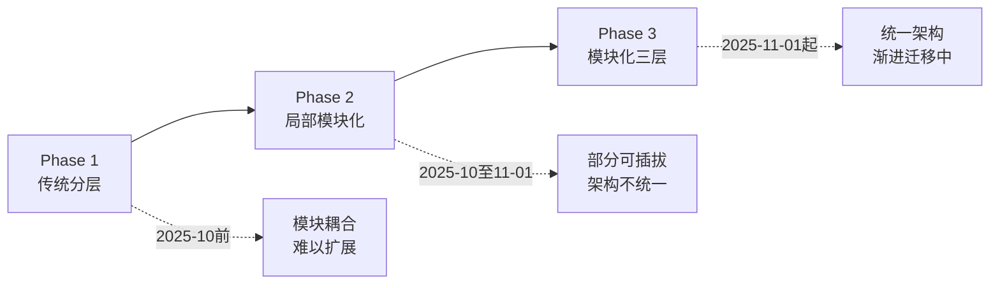
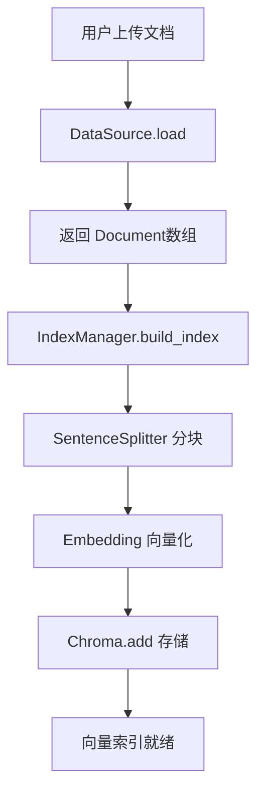
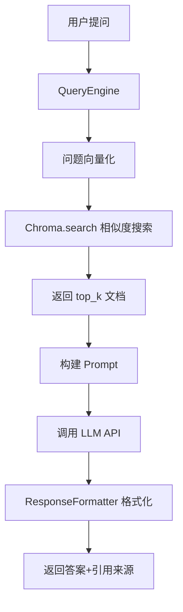

# 架构设计文档

> 系统科学知识库RAG应用的模块化架构设计

## 📊 架构演进历程



**当前阶段**: Phase 3 模块化三层架构（渐进式迁移中）

---

## 🏗️ 模块化三层架构

```
┌─────────────────────────────────────────────────────────────┐
│                    前端层（Presentation）                      │
│  ┌──────────────┐  ┌──────────────┐  ┌──────────────┐     │
│  │  app.py      │  │  pages/      │  │  main.py     │     │
│  │ (Streamlit)  │  │ (设置页)     │  │ (CLI)        │     │
│  └──────┬───────┘  └──────┬───────┘  └──────┬───────┘     │
│         └─────────────────┼─────────────────┘              │
│                    只调用 RAGService                         │
└───────────────────────────┼────────────────────────────────┘
                            │
                            ▼
┌─────────────────────────────────────────────────────────────┐
│                   业务层（Business）                          │
│  ┌──────────────────────────────────────────────────────┐  │
│  │          RAGService (统一服务接口)                    │  │
│  │  query(question) -> RAGResponse                      │  │
│  └───────────────────┬──────────────────────────────────┘  │
│                      │                                      │
│         ┌────────────┼────────────┐                        │
│         ▼            ▼            ▼                        │
│  ┌──────────┐  ┌──────────┐  ┌──────────┐                │
│  │Pipeline  │  │Strategy  │  │Context   │                │
│  │Executor  │  │Manager   │  │Manager   │                │
│  └────┬─────┘  └────┬─────┘  └────┬─────┘                │
│       │             │             │                        │
│  ┌────┴─────────────┴─────────────┴────┐                  │
│  │    能力模块（通过协议协作）            │                  │
│  │  Retriever → Generator → Formatter   │                  │
│  │  → FallbackStrategy                  │                  │
│  └──────────────────────────────────────┘                  │
│                                                             │
│  通过依赖注入获取基础设施层资源                               │
└───────────────────────────┬────────────────────────────────┘
                            │
                            ▼
┌─────────────────────────────────────────────────────────────┐
│               基础设施层（Infrastructure）                    │
│  ┌──────────┐  ┌──────────┐  ┌──────────┐  ┌──────────┐  │
│  │ Config   │  │ Logger   │  │ Phoenix  │  │ Chroma   │  │
│  │ Embedding│  │ Observer │  │DataSource│  │ LLM      │  │
│  └──────────┘  └──────────┘  └──────────┘  └──────────┘  │
│  ┌──────────────────────────────────────┐                  │
│  │  ModuleRegistry (模块注册中心)        │                  │
│  │  - 模块元数据管理                     │                  │
│  │  - 工厂函数创建实例                   │                  │
│  └──────────────────────────────────────┘                  │
│                                                             │
│  向上提供统一服务接口，无业务逻辑                            │
└─────────────────────────────────────────────────────────────┘
```

### 三层职责

| 层次 | 职责 | 特点 |
|------|------|------|
| **前端层** | 用户交互与展示 | 只调用RAGService，不持有业务模块 |
| **业务层** | 核心业务逻辑与编排 | 能力模块通过协议协作，流水线编排 |
| **基础设施层** | 技术基础设施 | 无业务逻辑，提供资源和框架能力 |

### 设计原则

1. **模块化设计** - 职责单一，低耦合高内聚
2. **依赖注入** - 构造函数传递依赖，便于测试
3. **配置驱动** - 集中管理，支持运行时切换
4. **接口契约** - 统一协议，模块可插拔
5. **可观测性优先** - 集成调试追踪，行为透明

---

## 📦 核心模块清单

### 模块化现状

| 模块/功能 | 架构层次 | 状态 | 说明 |
|-----------|---------|------|------|
| **Embedding可插拔** | 基础设施层 | ✅ 完成 | BaseEmbedding + 工厂模式 |
| **DataSource可插拔** | 基础设施层 | ✅ 完成 | base.py + 多种实现 |
| **Observer可观测性** | 基础设施层 | ✅ 完成 | Observer模式 + 工厂 |
| **ResponseFormatter** | 业务层 | ✅ 完成 | 模块化响应格式化 |
| **DataParser** | 基础设施层 | ✅ 完成 | 文档解析器 |
| **ModularQueryEngine** | 业务层 | ✅ 完成 | 模块化查询引擎 |
| **RAGService** | 业务层 | 🔄 待实施 | 统一服务接口（P0） |
| **PipelineExecutor** | 业务层 | 🔄 待实施 | 流水线编排器（P1） |
| **ModuleRegistry** | 基础设施层 | 🔄 待实施 | 模块注册中心（P2） |
| **前端层迁移** | 前端层 | 🔄 待实施 | 改用RAGService（P0） |

**迁移优先级:**
- **P0（核心）**: RAGService + 前端层迁移
- **P1（重要）**: PipelineExecutor + 协议定义
- **P2（建议）**: ModuleRegistry + 配置驱动

---

## 🔄 数据流程

### 索引构建流程



### 查询流程



---

## 🛠️ 核心技术选型

| 组件 | 技术选型 | 说明 |
|------|---------|------|
| **RAG框架** | LlamaIndex | 专为RAG设计，内置引用溯源 |
| **向量数据库** | ChromaDB | 轻量级，支持持久化 |
| **Embedding** | HuggingFace | 本地/API可插拔 |
| **LLM** | DeepSeek API | OpenAI兼容接口 |
| **可观测性** | Phoenix + OpenTelemetry | 实时追踪与可视化 |
| **前端** | Streamlit | 快速原型，易于交互 |

### LlamaIndex核心概念

| LlamaIndex | 本项目 | 说明 |
|-----------|--------|------|
| Document | Document | 原始文档 |
| Node | 自动创建 | 分块后的节点 |
| VectorStoreIndex | IndexManager | 向量索引 |
| VectorStore | ChromaVectorStore | 向量存储后端 |
| Embedding | BaseEmbedding | 可插拔向量化 |
| QueryEngine | ModularQueryEngine | 模块化查询引擎 |

---

## 🔧 扩展指南

### 1. 添加新数据源

1. 在 `src/data_source/` 创建新类，继承 `BaseDataSource`
2. 实现 `load()` 方法，返回 `List[Document]`
3. 在工厂函数中注册
4. 更新配置文件

### 2. 切换Embedding模型

```bash
# .env
EMBEDDING_TYPE=local  # 或 api
EMBEDDING_MODEL=新模型路径
```

### 3. 切换向量数据库

替换 `IndexManager` 中的 `ChromaVectorStore`，LlamaIndex抽象层使切换成本极低。

### 4. 自定义检索策略

在 `ModularQueryEngine` 中配置:
- `retrieval_strategy`: vector / bm25 / hybrid
- `enable_rerank`: 启用重排序
- `similarity_cutoff`: 相似度阈值

### 5. 添加可观测性

在 `src/observers/` 创建新Observer，继承 `BaseObserver`，在工厂中注册。

### 6. 切换LLM

修改 `config.py` 中的 `DEEPSEEK_API_KEY` 和 `DEEPSEEK_API_BASE`，支持任何OpenAI兼容API。

---

## 🔗 相关文档

- [API参考](API.md) - 完整的API接口文档
- [项目结构](PROJECT_STRUCTURE.md) - 代码组织说明
- [项目追踪](TRACKER.md) - 任务管理与进度
- [模块化迁移指南](../agent-task-log/2025-11-01-10_模块化架构整理与迁移指南_实施方案.md)

---

**架构状态**: 渐进式迁移中（Phase 3）  
**最后更新**: 2025-11-01  
**架构目标**: 完整的模块化三层架构，支持可插拔、配置驱动、流水线编排
