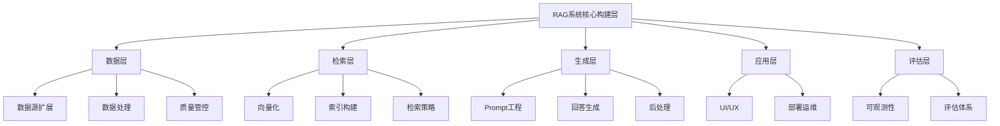
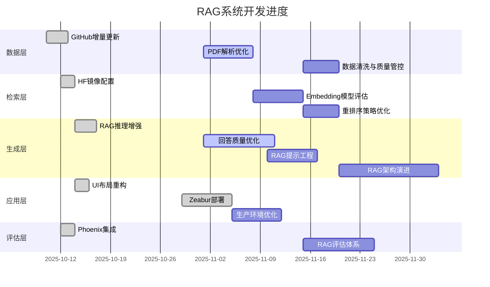

# 项目追踪

> 任务管理与进度追踪看板

**最后更新**: 2025-11-01

---

## 📊 任务分类框架

### 五大核心层

| 层级 | 核心职责 | 包含内容 |
|------|---------|---------|
| **数据层** | 数据源、加载、处理 | 数据源扩展、解析优化、清洗、质量管控 |
| **检索层** | 向量化、索引、检索 | Embedding模型、向量索引、检索策略、重排序 |
| **生成层** | Prompt、生成、后处理 | 提示工程、回答优化、自适应RAG、架构演进 |
| **应用层** | UI、部署、运维 | 用户界面、部署配置、生产优化 |
| **评估层** | 可观测性、评估 | Phoenix集成、RAGAS评估、性能监控 |

---

## 🔥 进行中任务

| 序号 | 任务 | 层级 | 优先级 | 关注重点 |
|------|------|------|--------|---------|
| 2 | 回答质量优化 | 生成层 | ⭐⭐⭐ | 检索精度、Prompt优化、用户反馈 |
| 4 | PDF解析优化 | 数据层 | ⭐⭐⭐ | Tesseract/Unstructured/DeepSeek OCR |

---

## 📋 计划中任务

### 数据层

| 序号 | 任务 | 优先级 | 关注重点 |
|------|------|--------|---------|
| 4 | PDF解析优化与多方案评估 | ⭐⭐⭐ | Tesseract/Unstructured/DeepSeek OCR |
| 12 | 数据清洗与质量管控 | ⭐ | 清洗流程、质量标准、批量验证 |

### 检索层

| 序号 | 任务 | 优先级 | 关注重点 |
|------|------|--------|---------|
| 10 | Embedding模型评估与优化 | ⭐⭐ | MTEB评估、模型对比、可插拔架构 |
| 9 | 重排序策略优化与检索评估 | ⭐⭐ | Re-ranking、检索评估、精度提升 |

### 生成层

| 序号 | 任务 | 优先级 | 关注重点 |
|------|------|--------|---------|
| 2 | 回答质量优化 | ⭐⭐⭐ | 检索精度、Prompt优化、用户反馈 |
| 3 | RAG提示工程与思维链优化 | ⭐⭐⭐ | Zero-shot/Few-shot/CoT/AutoCoT/ToT |
| 5 | RAG架构演进与升级 | ⭐⭐ | 模块化RAG→Agentic RAG、分阶段演进 |
| 7 | 自适应RAG与纠错机制调研 | ⭐⭐ | 自适应RAG、纠错策略 |
| 8 | 模型优化与本地部署能力 | ⭐⭐ | 量化/剪枝/蒸馏、API+本地双模式 |

### 应用层

| 序号 | 任务 | 优先级 | 关注重点 |
|------|------|--------|---------|
| 1 | 生产环境部署优化 | ⭐⭐⭐ | Zeabur数据持久化、安全加固、监控 |
| 11 | UI/UX优化 | ⭐⭐ | 移动端适配、暗色模式、快捷键 |

### 评估层

| 序号 | 任务 | 优先级 | 关注重点 |
|------|------|--------|---------|
| 6 | RAG评估体系构建 | ⭐⭐ | Phoenix/RAGAS/deep EVAL、全方位评估 |

---

## ✅ 已完成任务汇总

### 📊 完成统计

| 层级 | 已完成任务数 | 核心成果 |
|------|-------------|---------|
| **数据层** | 4 | GitHub增量更新、维基百科集成 |
| **检索层** | 1 | HuggingFace镜像与离线模式 |
| **生成层** | 1 | RAG推理能力增强、输出格式化 |
| **应用层** | 9 | UI布局重构、Zeabur部署、Phoenix集成 |
| **评估层** | 1 | RAG可观测性集成 |
| **总计** | **16** | - |

### 🔗 详细记录

**数据层:**
- ✅ [2025-10-10] 知识库扩充
- ✅ [2025-10-10] 维基百科集成
- ✅ [2025-10-10] GitHub增量更新 - [总结](../agent-task-log/2025-10-10-3_GitHub增量更新实施_完成总结.md)
- ✅ [2025-10-12] GitHub数据源架构重构 - [总结](../agent-task-log/2025-10-12_GitHub数据源架构重构_完成总结.md)

**检索层:**
- ✅ [2025-10-12] HuggingFace镜像配置 - [总结](../agent-task-log/2025-10-12_HuggingFace镜像与离线模式配置_实施总结.md)

**生成层:**
- ✅ [2025-10-14] RAG推理能力增强 - [详细过程](../agent-task-log/2025-10-14-1_RAG推理能力增强_详细过程.md)
- ✅ [2025-10-31] 输出解析与格式化机制 - [总结](../agent-task-log/2025-10-31-11_Prompt+Markdown实施完成总结.md)

**应用层:**
- ✅ [2025-10-10] Web流式输出 - [总结](../agent-task-log/2025-10-10-5_Web流式输出改造_实施总结.md)
- ✅ [2025-10-10] 进度条与日志
- ✅ [2025-10-10] 会话自动持久化 - [总结](../agent-task-log/2025-10-10-3_会话自动持久化增强_实施总结.md)
- ✅ [2025-10-14] UI布局重构 - [总结](../agent-task-log/2025-10-14-2_UI布局重构_实施总结.md)
- ✅ [2025-10-15] Claude风格UI改造 - [总结](../agent-task-log/2025-10-15-2_Claude风格UI大改造_实施总结.md)
- ✅ [2025-10-14] GitHub导入移至设置页 - [总结](../agent-task-log/2025-10-14-6_GitHub导入移至设置页_实施总结.md)
- ✅ [2025-10-22] 最小化PaaS部署配置 - [方案](../agent-task-log/2025-10-22-1_最小化PaaS部署_实施方案.md)
- ✅ [2025-10-29] Zeabur部署初步完成
- ✅ [2025-10-10] UI优化与热加载 - [总结](../agent-task-log/2025-10-10-4_UI优化与热加载增强_实施总结.md)

**评估层:**
- ✅ [2025-10-12] RAG可观测性集成 - [总结](../agent-task-log/2025-10-12_RAG可观测性集成_实施总结.md)

---

## 📚 完整记录

### 任务归档
- [📖 Agent任务记录](../agent-task-log/README.md) - AI Agent执行任务完整记录
- [📖 人机协作范式](../agent-task-log/人机协作范式.md) - 协作经验总结

---

## 📈 进度可视化

---

**最后更新**: 2025-11-01  
**维护者**: 项目团队
