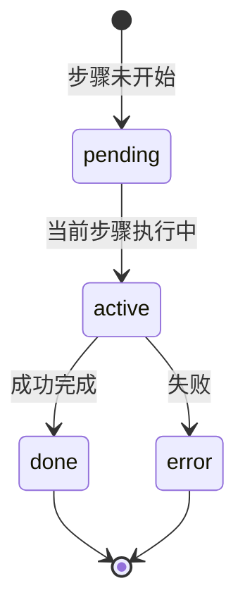

# Thinking 区块 — 可观测性规格（Perplexity × CLDFlow）

> 阶段一设计产出 · 供 Figma `03 — Thinking & Workflow` 与阶段二 API 契约对齐

## 1. 为什么要做

CLDFlow 的核心价值是 **因果分析过程可解释**。用户需要看到 Agent 在回答前做了什么，而不是黑盒 spinner。Perplexity 证明了「分步过程可见」能显著提升信任与等待体验。

## 2. Perplexity 模式（调研摘要）

| 特征 | 说明 |
|------|------|
| 阶段可见 | 检索 → 阅读 → 撰写（用户可扫读） |
| 状态区分 | 进行中 / 已完成（完成态常高亮为 link 色） |
| 过程即内容 | 步骤与最终答案同等重要，非折叠附录 |
| 工具透明 | Pro Search 暴露 `reasoning_steps` / 工具调用（API 层） |

参考：[Perplexity Pro Search Tools](https://docs.perplexity.ai/docs/sonar/pro-search/tools)

## 3. CLDFlow 三步映射（领域语言）

与后端 Pipeline（RAG → CLD → FCM/D2D）对齐的 **默认文案**：

| 步骤 ID | 用户可见标签 | 后端对应（概念） | 完成态示例 |
|---------|--------------|------------------|------------|
| `retrieve` | 检索证据 | 文献/知识库召回 | 找到 N 篇相关论文 |
| `build_cld` | 构建因果图 | CLD 结构与共享图 | 识别 X 变量、Y 条路径 |
| `evaluate` | 评估杠杆 | FCM / D2D / 杠杆排序 | 计算杠杆系数… |

> 动词与计数由 API 结构化字段填充，标签可配置。

## 4. UI 状态机



| 状态 | 视觉（亮模式基准） |
|------|-------------------|
| `pending` | 灰字 + 空心圆 |
| `active` | 主色 spinner + 强调文案 |
| `done` | ✓ + link/accent 色文案 |
| `error` | ✗ + error 色 + 可展开原因 |

## 5. 建议 API 契约（阶段二）

```typescript
type ThinkingStepStatus = "pending" | "active" | "done" | "error";

interface ThinkingStep {
  id: "retrieve" | "build_cld" | "evaluate";
  label: string;
  detail?: string;       // "找到 24 篇相关论文"
  status: ThinkingStepStatus;
  startedAt?: string;
  endedAt?: string;
}

interface ThinkingBlockPayload {
  title?: string;        // 默认 "分析因果关系..."
  steps: ThinkingStep[];
  collapsed?: boolean;
}
```

流式更新：每步 `status` 从 `pending` → `active` → `done`，前端按序渲染，避免整段 `reasoning` 纯文本刷新。

## 6. Figma 组件规格

- **容器**：圆角 8px，1px hairline，背景 `canvas-soft`
- **Header**：14px spinner + 标题（进行中）/ 可折叠 chevron
- **步骤行**：左 16px 状态图标 + 13px 文案；`done` 用 accent/link 色
- **间距**：步骤间距 6–8px；左缩进 22px 对齐 Perplexity 密度

初版 Canonical 中已有三步样例（见 `01 — Canonical` 帧内 Thinking 区块），本规格用于统一七版风格探索与阶段二实现。

## 7. 明确不做（阶段一）

- 来源卡片样式细化
- Leverage 表 / CLD 图交互
- 后端真实流式字段改造（仅文档契约）
