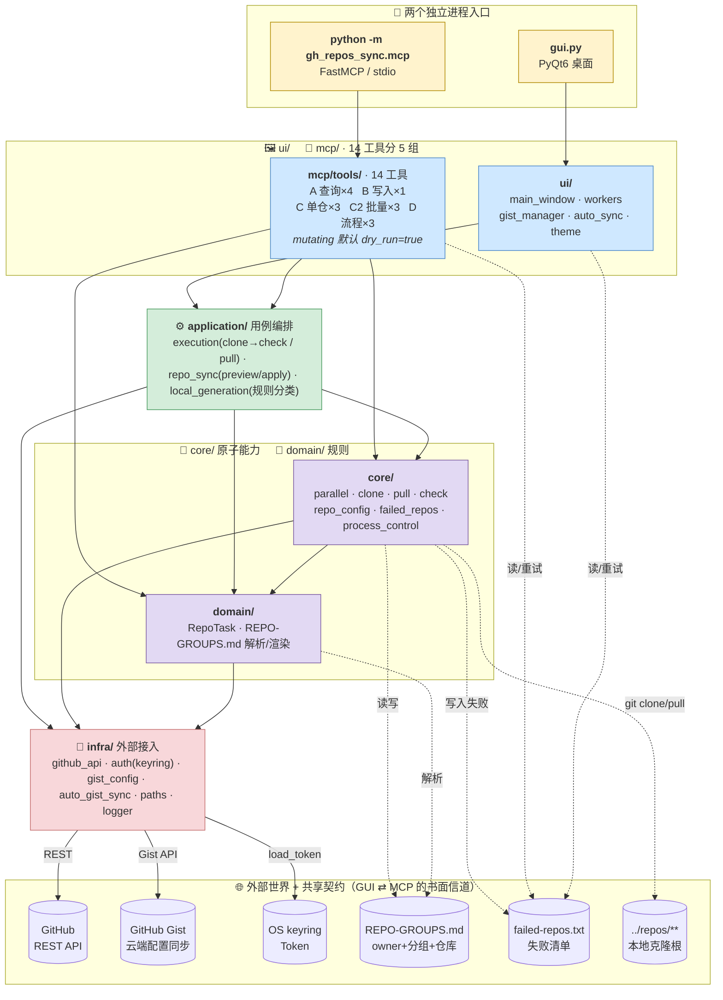
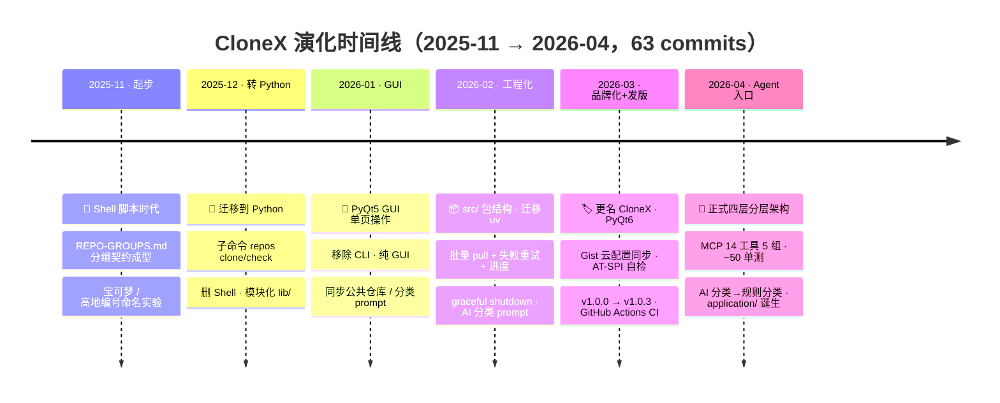

# Cascade Chat Conversation

  Note: _This is purely the output of the chat conversation and does not contain any raw data, codebase snippets, etc. used to generate the output._

### User Input

分析我的github仓库的项目，画一个图，拥有全局视角，方便把握整体构成和演化

### Planner Response

我来分析你的 CloneX 项目并画出全局视角的图。先调用宏观理解 skill 并探索项目结构。

*Invoked skill: general-understanding-research*

*Listed directory [CloneX](file:///home/q/Desktop/CloneX) *

*Viewed [README.md](file:///home/q/Desktop/CloneX/README.md) *

*Viewed [AGENTS.md](file:///home/q/Desktop/CloneX/AGENTS.md) *

### Planner Response

项目定位清楚了。继续深入探索各层细节和演化历史。

*Listed directory [gh_repos_sync](file:///home/q/Desktop/CloneX/src/gh_repos_sync) *

*Listed directory [docs](file:///home/q/Desktop/CloneX/docs) *

*Viewed [pyproject.toml](file:///home/q/Desktop/CloneX/pyproject.toml) *

*Viewed [gui.py](file:///home/q/Desktop/CloneX/gui.py) *

*User accepted the command `git log --oneline --all -n 80`*

### Planner Response

继续深入探索各层和 MCP 工具分组。

*Listed directory [mcp](file:///home/q/Desktop/CloneX/src/gh_repos_sync/mcp) *

*Listed directory [application](file:///home/q/Desktop/CloneX/src/gh_repos_sync/application) *

*Listed directory [core](file:///home/q/Desktop/CloneX/src/gh_repos_sync/core) *

*Listed directory [ui](file:///home/q/Desktop/CloneX/src/gh_repos_sync/ui) *

*Listed directory [infra](file:///home/q/Desktop/CloneX/src/gh_repos_sync/infra) *

*Listed directory [domain](file:///home/q/Desktop/CloneX/src/gh_repos_sync/domain) *

*Listed directory [tools](file:///home/q/Desktop/CloneX/src/gh_repos_sync/mcp/tools) *

*Viewed [server.py](file:///home/q/Desktop/CloneX/src/gh_repos_sync/mcp/server.py) *

*Viewed [__init__.py](file:///home/q/Desktop/CloneX/src/gh_repos_sync/mcp/__init__.py) *

*Viewed [__init__.py](file:///home/q/Desktop/CloneX/src/gh_repos_sync/application/__init__.py) *

*Viewed [execution.py](file:///home/q/Desktop/CloneX/src/gh_repos_sync/application/execution.py) *

*Viewed [repo_sync.py](file:///home/q/Desktop/CloneX/src/gh_repos_sync/application/repo_sync.py) *

*Viewed [local_generation.py](file:///home/q/Desktop/CloneX/src/gh_repos_sync/application/local_generation.py) *

### User Input

分析我的github仓库的项目，画一个图，拥有全局视角，方便把握整体构成和演化

### Planner Response

继续探索 MCP 工具分组、查询工具定义和领域模型。

*Viewed [__init__.py](file:///home/q/Desktop/CloneX/src/gh_repos_sync/mcp/tools/__init__.py) *

*Viewed [queries.py](file:///home/q/Desktop/CloneX/src/gh_repos_sync/mcp/tools/queries.py) *

*Viewed [groups.py](file:///home/q/Desktop/CloneX/src/gh_repos_sync/mcp/tools/groups.py) *

*Viewed [execution.py](file:///home/q/Desktop/CloneX/src/gh_repos_sync/mcp/tools/execution.py) *

*Viewed [batch.py](file:///home/q/Desktop/CloneX/src/gh_repos_sync/mcp/tools/batch.py) *

*Viewed [flows.py](file:///home/q/Desktop/CloneX/src/gh_repos_sync/mcp/tools/flows.py) *

*Viewed [errors.py](file:///home/q/Desktop/CloneX/src/gh_repos_sync/mcp/errors.py) *

*Viewed [context.py](file:///home/q/Desktop/CloneX/src/gh_repos_sync/mcp/context.py) *

### Planner Response

查看领域模型、infra 关键入口和 MCP 完整指南。

*Viewed [models.py](file:///home/q/Desktop/CloneX/src/gh_repos_sync/domain/models.py) *

*Viewed [__init__.py](file:///home/q/Desktop/CloneX/src/gh_repos_sync/domain/__init__.py) *

*Viewed [paths.py](file:///home/q/Desktop/CloneX/src/gh_repos_sync/infra/paths.py) *

*Viewed [__init__.py](file:///home/q/Desktop/CloneX/src/gh_repos_sync/infra/__init__.py) *

*Viewed [github_api.py](file:///home/q/Desktop/CloneX/src/gh_repos_sync/infra/github_api.py) *

*Viewed [MCP-GUIDE.md](file:///home/q/Desktop/CloneX/docs/MCP-GUIDE.md) *

*User accepted the command `git log --oneline --all | wc -l && git log --format='%ai %s' -n 1 && git log --format='%ai %s' --reverse | head -1`*

*User accepted the command `git tag -l --sort=-creatordate | head -10`*

### Planner Response

信息够了。下面按"全局结构 + 演化时间线"两张图交付，重点落在**双入口共用业务核心**与**6 次关键跳跃**。

# CloneX 全局视角

**一句话定位**：同一套 Python 业务核心，以 *开发者 = PyQt6 GUI* 和 *AI Agent = MCP Server* **双入口**输出能力；四层分层（`ui|mcp → application → core|domain → infra`）保证两条入口链路共享同一批原子能力，而不是各写一套。代码证据：`@/home/q/Desktop/CloneX/pyproject.toml:37-39` 同时声明 `clonex` 与 `clonex-mcp` 两个 entry point。

---

## 1. 结构视角：一张图看清全局



### 结构要点

- **依赖方向严格单向**：箭头永远朝下，`ui/mcp` 与 [application](file:///home/q/Desktop/CloneX/src/gh_repos_sync/application:0:0-0:0) 不互相依赖，`core/domain` 不知道上层存在 —— 由 `@/home/q/Desktop/CloneX/AGENTS.md:1-9` 明文约束。
- **MCP 不是重实现，是薄适配**：`@/home/q/Desktop/CloneX/src/gh_repos_sync/mcp/tools/batch.py:120-127` 直接调用 `core.parallel.execute_parallel_clone`，和 GUI 的 [workers.py](file:///home/q/Desktop/CloneX/src/gh_repos_sync/ui/workers.py:0:0-0:0) 共用同一组线程池原语。
- **双入口共享契约是文件，不是调用**：GUI 写 `failed-repos.txt`，MCP 工具 [retry_failed](file:///home/q/Desktop/CloneX/src/gh_repos_sync/mcp/tools/flows.py:185:0-251:5) 读同一份；参见 `@/home/q/Desktop/CloneX/src/gh_repos_sync/mcp/tools/flows.py:186-252`。这是一种**进程隔离下的串行协作模式**（文档明确要求两者不能同时跑）。
- **Agent 安全护栏**：所有写/执行类工具默认 `dry_run=true`，只有显式 `dry_run=false` 才落盘，错误统一 `{success, error:{code,message,hint}}` —— 结构在 `@/home/q/Desktop/CloneX/src/gh_repos_sync/mcp/errors.py:18-31`。

---

## 2. 演化视角：6 次关键跳跃



### 演化要点

- **主线是"抽象层次单调上升"**：Shell → Python CLI → GUI → [src/](file:///home/q/Desktop/CloneX/src:0:0-0:0) 包 → 正式四层分层。每一跳都在前一跳的代码上长出新层，**没有推倒重来**。
- **两次质变点**：
  1. **2026-01 移除 CLI 改纯 GUI**（commit `ac9805d`）—— 从"命令行工具"变成"可视化工具"，用户面从运维者扩展到普通开发者。
  2. **2026-04 引入 MCP + [application/](file:///home/q/Desktop/CloneX/src/gh_repos_sync/application:0:0-0:0)**（commit `e8d77a5`，当前 `HEAD`）—— 从"人用"变成"人 + Agent 共用"，[application/](file:///home/q/Desktop/CloneX/src/gh_repos_sync/application:0:0-0:0) 这一层是为了让 MCP 和 GUI 不得不共享编排而被迫抽出来的。
- **一个反向简化**：早期有 AI 分类器（调 LLM 给仓库贴标签），2026-04 改为 [local_generation.py](file:///home/q/Desktop/CloneX/src/gh_repos_sync/application/local_generation.py:0:0-0:0) 的**纯规则分类**（按 GitHub 返回的 `language` 字段），见 `@/home/q/Desktop/CloneX/src/gh_repos_sync/application/local_generation.py:30-40`。逻辑：分类器交给 Agent 自己做（agent 拿 [list_repos](file:///home/q/Desktop/CloneX/src/gh_repos_sync/mcp/tools/queries.py:37:0-71:78) + 规则提示词），CloneX 本体不再维护 LLM 调用。这和"把能力暴露给 Agent"的主线是一致的。
- **v1.0.x 是工程化分水岭**：从 v1.0.0 起才有正式 tag、CI workflow、AT-SPI 无障碍自检、Gist 云配置 —— 从"个人脚本"走向"可分发产品"。

---

## 3. 速查表

| 维度 | 现状 |
|---|---|
| **入口** | GUI: `@/home/q/Desktop/CloneX/gui.py:17` / MCP: `@/home/q/Desktop/CloneX/src/gh_repos_sync/mcp/server.py:18-27` |
| **分层顺序** | `ui \| mcp → application → core \| domain → infra` |
| **MCP 工具数** | 14 个（A 4 + B 1 + C 3 + C2 3 + D 3） |
| **共享契约文件** | `REPO-GROUPS.md`（配置）· `failed-repos.txt`（失败清单）· OS keyring（token） |
| **外部系统** | GitHub REST API · GitHub Gist · 本地 git |
| **打包产物** | `dist/CloneX`（PyInstaller onefile，GUI）· `clonex-mcp` entry point（MCP） |
| **测试三层** | `tests/mcp/` ~50 单测（内存 MCP） · `scripts/mcp_smoke.py`（真凭证） · MCP Inspector（手工） |

---

**下一步可选**：如果你想把这两张图和要点落到 `docs/ARCHITECTURE.md` 作为长期文档，说一声我就去做。目前输出只在对话里，不落盘。

### User Input

保存

### Planner Response

把上面两张图和要点落到 `docs/ARCHITECTURE.md`。先确认文件不存在。

*Searched filesystem*

*Edited relevant file*

### Planner Response

已保存到 `@/home/q/Desktop/CloneX/docs/ARCHITECTURE.md`。

- 两张 Mermaid 图（结构 + 演化）+ 要点 + 速查表 + 关联文档
- 只改文档，按 [AGENTS.md](file:///home/q/Desktop/CloneX/AGENTS.md:0:0-0:0) 规则**跳过自动重打包**

如果想让它出现在 [README.md](file:///home/q/Desktop/CloneX/README.md:0:0-0:0) 的文档索引里，说一声我就加一行。

*Viewed [ARCHITECTURE.md](file:///home/q/Desktop/CloneX/docs/ARCHITECTURE.md) *

### User Input

commit all and push

### Planner Response

先看下当前 git 状态，确认要提交什么。

*User accepted the command `git status --short && echo "---" && git log --oneline -n 3`*

### Planner Response

只有新增的 [docs/ARCHITECTURE.md](file:///home/q/Desktop/CloneX/docs/ARCHITECTURE.md:0:0-0:0)。一次完成 add + commit + push。

*User accepted the command `git add docs/ARCHITECTURE.md && git commit -m "docs: add architecture overview with structure and evolution diagrams" && git push`*

### Planner Response

完成。

- **commit**: `6b551c1` — `docs: add architecture overview with structure and evolution diagrams`
- **push**: `e8d77a5..6b551c1 main -> main` 到 `github.com:qiao-925/CloneX.git`

### User Input

一个问题，询问你的建议？就是我收集了我的所有AI 项目的使用日志和数据，我认为这有助于帮助我的agent保持长期记忆，我的想法是这些数据使用一个单独的github仓库存储，但是该如何给具体的项目使用呢？具体的项目也是一个github仓库

### Planner Response

这个问题值得慎重思考——既涉及数据架构，也涉及 agent 长期记忆机制。先拉一下评估 skill。

*Invoked skill: critical-thinking-evaluation*

*Invoked skill: roi-value-density*

### Planner Response

# 我的建议

这是一个**方向选择 + 渐进落地**问题。先收敛思路，再给推荐，最后有一个我认为现在必须澄清的问题。

## 先把问题拆成两个轴

你的选择其实不是"用不用 GitHub 仓库存记忆"，而是两件事：

- **读取侧**：具体项目的 agent 如何**触达**记忆？（本地文件？工具调用？远端 API？）
- **写入侧**：记忆怎么**沉淀**？（手工 commit？agent 自动写？两者结合？）

不同组合对应不同工程成本和不同收益。下面的方案围绕"读取侧"展开，写入侧建议从"手工 commit"起步（原因见末尾）。

## 四个主流路径对比

| 路径 | 读取机制 | 上手成本 | 跨设备 | 跨项目检索 | 适合场景 |
|---|---|---|---|---|---|
| **A. 本地 clone + 约定路径** | agent 直接 read/grep `~/ai-memory/**` | 🟢 几分钟 | 需手动 pull | 🟢 自然 | 起步验证 |
| **B. Git submodule / subtree** | 每个项目仓库嵌入记忆子库 | 🟡 中 | 🟢 随项目走 | 🟡 依赖子库范围 | 记忆需要版本绑定项目时 |
| **C. 自建 MCP Server**（`memory-mcp`） | agent 通过工具调用 `search_memory` / `append_memory` | 🔴 1-2 天（你有 CloneX 基础） | 🟢 server 本地跑 | 🟢 天然 | 读写都要、跨项目、热点访问 |
| **D. GitHub MCP + 远端仓库** | 通过官方 GitHub MCP 走 code search / 文件 API | 🟢 零开发 | 🟢 不需本地 | 🟡 受 GitHub 搜索粒度限制 | 偶发查询、不想本地同步 |

我**刻意排除**了两种看起来更"高级"但对你当前不划算的方向：

- **向量数据库 + RAG**：除非记忆量 > 几十 MB 且关键词检索明显不够，否则是典型过度设计。
- **把记忆写进每个项目的 `.claude/`、`.cursor/` 等 IDE 私有目录**：违反"单一来源"，维护代价随项目数线性膨胀。

## 我的推荐：三阶段渐进

### Phase 1：路径 A，先验证"记忆到底有没有用"

- 记忆仓库 clone 到固定路径，例如 `~/ai-memory/`
- 结构先做轻：`global/`（跨项目经验）· `projects/<repo-name>/`（项目专属上下文）· `snippets/`（代码片段/prompt）
- 在每个项目的 [AGENTS.md](file:///home/q/Desktop/CloneX/AGENTS.md:0:0-0:0) 顶部加几行明确**读取入口**，比如：
  ```markdown
  ## 外部长期记忆
  - 全局经验：`~/ai-memory/global/` — 遇到架构/工具决策先查
  - 本项目历史：`~/ai-memory/projects/CloneX/`
  ```
- **写入方式**：手工 —— 每次结束一段 agent 协作，自己精简成一两条要点 commit 到记忆仓库

**为什么先这样**：记忆的真正瓶颈从来不是存储机制，而是**你愿不愿意/能不能沉淀出有价值的记忆**。这个阶段几乎零成本，但能在 1-2 周内回答"记忆到底是不是有用、哪些类型最有用"这个核心问题。

### Phase 2：路径 C，做 `memory-mcp`（只在 Phase 1 证明价值后）

只有当 Phase 1 验证了价值、并且你开始发现"手工写太慢"或"agent 需要频繁检索"时，再上 MCP server：

- `search_memory(query, scope)` — 关键词/路径检索
- `append_memory(scope, title, body)` — agent 主动沉淀
- `list_memory(scope)` — 概览

你已经有 CloneX MCP 的现成模板（[mcp/tools/](file:///home/q/Desktop/CloneX/src/gh_repos_sync/mcp/tools:0:0-0:0) + `dry_run` 护栏），复用成本低。

### Phase 3：看规模决定是否上语义检索

只有当记忆 > 几十 MB 且 grep 明显命中率差时，才加 embedding。否则不做。

## 关键风险和反例

- **反例：submodule 几乎总是坏主意**。每次项目 commit 都要同步一个子模块指针，记忆小改就需要跨仓库双 push。除非记忆和项目生命周期强绑定（几乎不会）。
- **隐私风险**：如果你的记忆仓库是 public，写入时要有机制避免把私有项目里的 token/路径/代码片段带出去。Phase 1 手工 commit 时人把关，Phase 2 做 MCP 要想清楚过滤策略。
- **"长期记忆"可能被高估**：当前主流 agent（Claude Code / Cursor / Windsurf）的检索策略对**结构化目录 + 明确入口指引**响应很好，对"一堆 markdown 堆在某处等被发现"响应一般。所以**入口清晰 > 内容丰富**。你在 [AGENTS.md](file:///home/q/Desktop/CloneX/AGENTS.md:0:0-0:0) 里怎么引导 agent 进入记忆，比记忆本身怎么存更重要。
- **结论力度**：我对"Phase 1 先起步 + 手工写"信心强；对"Phase 2 一定要 MCP"信心中 —— 取决于你能不能积累出高频复用的记忆。

## 我必须问你的一个问题

记忆的**主要用法**是哪一种？这个答案会实质改变推荐：

*Asked user a question*

### Planner Response

基于你选的**跨项目经验复用**，我的推荐变得更明确。

# 最终建议：路径 A 就够了，不要上 MCP

## 为什么不用 MCP

跨项目经验复用的访问模式是 **"每个项目启动时读一两次，写入频率远低于读取"**。这种场景下：

- **agent 原生读文件 + grep 已经足够** —— Claude Code/Cursor/Windsurf 都擅长读 [AGENTS.md](file:///home/q/Desktop/CloneX/AGENTS.md:0:0-0:0) 和约定路径
- **MCP 的真正收益在"工具化封装、流式进度、权限隔离"** —— 你这个场景一个都不沾
- **手工 commit 是特性不是缺陷** —— 强迫你把经验精简成可检索单元，自动写入反而容易堆垃圾

## 具体落地：3 步

### Step 1：记忆仓库结构（专为跨项目经验复用设计）

```text
ai-memory/
├── README.md              # ⭐ agent 入口指引（最关键的一份文件）
├── INDEX.md               # 按关键词→文件的索引（> 50 条经验时再维护）
├── lessons/               # 踩过的坑 + 教训（高频查阅）
│   ├── mcp-stdio-stdout-corruption.md
│   ├── pyinstaller-onefile-paths.md
│   └── git-worktree-detached-head.md
├── decisions/             # 技术选型理由（为什么选 A 不选 B）
│   ├── why-uv-over-poetry.md
│   └── why-local-classify-over-llm.md
├── patterns/              # 可复用模式
│   ├── mcp-dry-run-default.md
│   └── four-layer-dependency.md
└── snippets/              # 代码片段 / prompt 模板
```

**关键设计**：[README.md](file:///home/q/Desktop/CloneX/README.md:0:0-0:0) 是 agent 读的第一份文件，用"遇到 X 类问题 → 先查 Y 目录"的决策表格组织。

### Step 2：每个项目 [AGENTS.md](file:///home/q/Desktop/CloneX/AGENTS.md:0:0-0:0) 加入引用入口

```markdown
## 外部长期记忆（跨项目经验库）

**位置**：`~/ai-memory/`

动手前按需主动查阅：
- 技术选型 → `~/ai-memory/decisions/`
- 新工具/库集成踩坑 → `~/ai-memory/lessons/`
- 设计新模式/架构 → `~/ai-memory/patterns/`

本次协作产出的新教训/决策，**如超过 30 分钟或非平凡**，提醒用户是否沉淀。
```

最后一行是点睛之笔：让 agent **主动提醒你**沉淀，但不擅自写入 —— 把"要不要记"的判断留给你。

### Step 3：写入纪律（定阈值，否则记忆仓库会变成垃圾桶）

只在以下情况 commit：

- 踩坑时间 > 30 分钟
- 做了非平凡技术决策（不是"我用 PyQt6"，而是"为什么选 PyQt6 不选 Qt for Python PySide6"）
- 发现了可复用的抽象/模式

每条 < 150 字，带 3 个标签方便检索。不是日记，是**可检索的教训卡片**。

## 跨设备同步

- 换机器：`git clone git@github.com:qiao-925/ai-memory.git ~/ai-memory`
- 日常：新记忆 `commit && push`
- 可选：一键 `~/ai-memory/scripts/sync.sh`（`git pull --rebase && git push`）

## 明确不建议做什么

| 不要做 | 原因 |
|---|---|
| ❌ 做 `memory-mcp` server | 纯读取场景过度封装；你已经有 CloneX 的 MCP 实战，知道它的开发/维护心智成本不低 |
| ❌ 用 Gist 存 | Gist 适合单文件（像 CloneX 同步 `REPO-GROUPS.md`），不适合知识树 |
| ❌ 用 git submodule 嵌入各项目 | 跨项目经验本质上**不应该和项目生命周期绑定**，submodule 把它们绑错了方向 |
| ❌ 一开始就做 embedding / 向量检索 | 几 MB markdown，grep + 结构化目录完全够用；`INDEX.md` 能解决 95% 的检索需求 |

## 未来触发升级的信号

只有出现下面信号之一，才需要回来重新设计：

- **> 500 条经验且 grep 经常 miss** → 加结构化 `INDEX.md` 或按标签组织
- **你真的开始讨厌手工沉淀** → 做一个 `memory-mcp` 的 `append_memory` 工具（不是完整的）
- **隐私边界问题**（跨 public/private 项目） → 加过滤策略或拆双仓库

在此之前，**专注于"真的把有价值的教训写进去"** —— 记忆系统的瓶颈永远是沉淀质量，不是存储机制。

## 结论力度

- **强信心**：路径 A 是当前最优，不要过度工程化
- **中信心**：手工 commit 是长期可持续的；但如果你发现自己总是忘记沉淀，Phase 2 可以做一个极简 MCP 写入工具
- **开放**：具体目录结构是我的推荐，你可以按自己直觉调整 —— 重点是 [README.md](file:///home/q/Desktop/CloneX/README.md:0:0-0:0) 作为 agent 入口的那份"决策指引"要写清楚

需要我帮你起一份 `ai-memory` 仓库的初始 [README.md](file:///home/q/Desktop/CloneX/README.md:0:0-0:0) 和目录骨架模板吗？（Code 模式下我可以直接生成）

### User Input

并不是只有在项目启动时才访问，在整个生命周期我都希望可以复用经验和上下文

### User Input

mcp是个不错的思路，且项目之间的耦合很低！

### Planner Response

# 修正上一轮的推荐

你的纠正点中要害 —— 我之前的推荐基于"启动时读一两次"的错误假设，所以偏向文件方案。**生命周期内持续访问 + 高频检索**这个场景，MCP 的价值确实出来了。

## 为什么 MCP 在这个场景反而是最优

| 维度 | 文件方案 | MCP 方案 |
|---|---|---|
| **触发时机** | agent 要主动读约定路径，容易忘/漏 | 对话中间随时工具调用，agent 遇到"这个我以前踩过吗"会主动 query |
| **检索质量** | grep 对多关键词/tag 组合弱 | 工具封装结构化查询（tag + 时间 + scope） |
| **写入阻力** | 用户需切换仓库手工 commit | agent 在对话里调 `append_memory`，一键批准即入库 |
| **跨项目耦合** | 每个项目 [AGENTS.md](file:///home/q/Desktop/CloneX/AGENTS.md:0:0-0:0) 要维护引用 | **MCP 客户端配一次，N 个项目全生效** |
| **你的学习成本** | 零 | 极低（CloneX MCP 经验几乎 100% 复用） |

你自己说的"**项目之间耦合低**"是 MCP 最强的卖点：MCP server 是独立进程，项目仓库里**什么都不用加**（甚至不用改 [AGENTS.md](file:///home/q/Desktop/CloneX/AGENTS.md:0:0-0:0)），就能用。

## 最小 MCP 设计（直接复用 CloneX 心智）

### 工具集：起步 5 个

**A 查询组**（只读）
- `search_memory(query, scope?, tags?, limit=10)` — 关键词 + tag 检索
- `read_memory(path)` — 读具体一条
- `list_scopes()` — 列 lessons / decisions / patterns / snippets

**B 写入组**（默认 `dry_run=true`，和 CloneX 一样的护栏）
- `append_memory(scope, title, body, tags, dry_run=true)` — 新增
- `update_memory(path, body, dry_run=true)` — 更新（少用）

**刻意不做**：`delete_memory` —— append-only 为主，删除用手工 `git rm` 更安全。

### 存储后端：先 markdown + git，后续可切

```text
ai-memory/
├── lessons/2026-04-pyinstaller-onefile-paths.md  # 文件名带日期方便排序
├── decisions/uv-vs-poetry.md
└── .memory-index.json  # 可选，server 生成的检索缓存
```

MCP 工具签名不依赖后端实现 —— 等你感到 grep 不够了，再切 SQLite，工具层不变。

### 跨项目接入（你最在意的点）

在 Claude Desktop / Cursor / Windsurf 配一次：

```json
{
  "mcpServers": {
    "memory": {
      "command": "uv",
      "args": ["run", "--project", "/home/q/ai-memory", "python", "-m", "memory_mcp"]
    }
  }
}
```

**所有项目零修改**就能用。这就是你说的"项目间耦合低"。

### 质量门（关键，别省）

写入变容易 → 垃圾会涨。在 `append_memory` 工具签名里强制约束：

- `title` ≤ 60 字符
- `body` ≤ 300 字符（超了要求拆条或放 `snippets/`）
- `tags` 至少 2 个
- 重复 tag 用现有值（可从 `list_scopes` 返回的 tag 集合里选）

工具层把"精简"做成签名级别的约束，比靠人自觉可靠。

## 两个被低估的摩擦点

在你开始干之前，想清楚这两个：

### 1. 多 MCP 客户端并发写入

MCP stdio 是**点对点**的。如果你同时开 Claude Desktop + Cursor，**每个客户端会各拉起一个 `memory-mcp` 进程**，它们会并发读写同一个 git 仓库。

**对策**（任选一）：

- **文件锁**：写入前 `flock` `ai-memory/.lock`（最简单）
- **单实例服务**：改 HTTP/SSE transport，所有客户端连同一个常驻 server（最干净，但开发成本高）
- **约定串行**：同一时刻只让一个 IDE 开着（最省事，你现在就可以这么用）

起步阶段推荐**约定串行 + 文件锁**。

### 2. 跨设备同步策略

```text
时刻      设备A                        设备B
T0       git pull 最新记忆           
T1       agent 写入 3 条新记忆
T2                                    git pull 最新记忆（拿到 T1 的）
T3       (忘记 push)                  agent 写入 2 条
T4                                    git push → T1 那 3 条丢了
```

**对策**：MCP server 启动时自动 `git pull`，写入后自动 `git push`。在 CloneX 里你已经有 [auto_gist_sync.py](file:///home/q/Desktop/CloneX/src/gh_repos_sync/infra/auto_gist_sync.py:0:0-0:0) 的类似心智，可以复用设计。

## 增量推进路径

**不要直接跳到做 MCP**。推荐顺序：

| 阶段 | 内容 | 时间 | 目的 |
|---|---|---|---|
| **Week 1** | 建仓库 + 目录骨架 + 手工填 10-20 条初始经验 | 业余时间几小时 | **验证内容有没有价值** —— 比工具重要得多 |
| **Week 2-3** | 做最小 MCP（5 工具，markdown 后端，文件锁） | 1-2 天 | 接入主力 IDE 试用 |
| **Week 4+** | 按实际使用调工具签名、加索引、加 auto-sync | 随用随改 | 收敛到稳态 |

Week 1 是**真正的关键**。很多人跳过它直接做工具，结果工具很漂亮但仓库是空的，agent 查不到东西就不会再查第二次。

## 结论力度

- **强信心**：MCP 在你这个场景（生命周期持续访问 + 多项目）是对的方向
- **强信心**：Week 1 先手工填内容再做工具，这个顺序不能反
- **中信心**：多客户端并发写是真实风险，但起步阶段约定串行就能绕过
- **开放**：存储后端、检索算法都可以等实际用了再优化，不要一开始钻进去

---

要我帮你起一个 `memory-mcp` 的脚手架吗？—— 我可以生成仓库骨架 + 5 个工具的 stub + [pyproject.toml](file:///home/q/Desktop/CloneX/pyproject.toml:0:0-0:0) + 最小 README，参考 CloneX MCP 的结构。你切 Code 模式我就能直接做。或者你要先花几天填 Week 1 的内容，再回来做工具，也合理。

### User Input

稍等，我的思路是直接使用github官方的mcp，调研一下它的功能是否能满足当前需求？

### Planner Response

好思路。先调研 GitHub 官方 MCP 的实际能力，拿一手资料判断是否匹配。

*Invoked skill: source-quality-control*

*Searched web for GitHub official MCP server tools list capabilities*

*Searched web for github/github-mcp-server README tools*

*Read URL content from /github/github-mcp-server/main/README.md *

*Read URL content from /didier-durand/2970be82fec6c84d522f7953ac7881b4 *

### Planner Response

继续读关键内容（工具清单和 toolsets）。

*Viewed content chunk*

*Viewed content chunk*

*Viewed content chunk*

*Viewed content chunk*

*Viewed content chunk*

### User Input

continue

### Planner Response

继续读关键的 toolsets：repos（文件读写）、issues（记忆载体候选）、search、gists。

*Viewed content chunk*

*Viewed content chunk*

*Viewed content chunk*

*Viewed content chunk*

*Viewed content chunk*

*Viewed content chunk*

### Planner Response

# 官方 GitHub MCP 调研结论

**一句话**：**能用，可以作为 Phase 1 的默认选择**。但在你强调的"生命周期持续访问"场景下有几个真实痛点，等你用一段时间再评估要不要补自建。

> 来源：官方仓库 README `github/github-mcp-server`（P0，直接从 `raw.githubusercontent.com` 读取），结论对应当前 main 分支。

## 对照你的需求的能力盘点

官方 MCP 以 **toolset** 方式组织，关键的对记忆场景有用的工具：

| 操作 | 官方工具 | 说明 |
|---|---|---|
| **读记忆** | `get_file_contents` | 读单个 markdown 文件 |
| **检索记忆** | `search_code` | GitHub 全站代码搜索，支持 `content:xxx repo:you/ai-memory path:lessons/` 语法 |
| **写记忆（单文件）** | `create_or_update_file` | 带 commit message |
| **写记忆（多文件）** | `push_files` | 一次 commit 多个文件 |
| **历史回溯** | `list_commits` + `get_commit` | 带时间范围、路径过滤、含 diff |
| **结构化记忆（备选）** | `issue_write` / `search_issues` / `add_issue_comment` | 如果想用 issue 代替 markdown 做记忆载体 |
| **安全兜底** | `--read-only` 启动参数 | 整个 server 切为只读 |
| **工具瘦身** | Dynamic Tool Discovery | 可按 toolset 按需加载，避免一口气注入 90+ 工具 |

## 核心对比：官方 vs 自建 memory-mcp

| 维度 | 官方 GitHub MCP | 自建 memory-mcp |
|---|---|---|
| 开发成本 | 🟢 0 | 🔴 1-2 天 |
| 维护成本 | 🟢 GitHub 维护 | 🟡 自己担 |
| 跨项目耦合 | 🟢 0（配一次 token） | 🟢 0 |
| 跨设备 | 🟢 完美（都走 API） | 🟡 需管理本地 git pull/push |
| **检索延迟** | 🔴 每次网络往返 ~300ms-1s | 🟢 本地文件 < 10ms |
| **检索粒度** | 🟡 GitHub search 通用但不专精记忆 | 🟢 可定制 |
| **索引新鲜度** | 🔴 code search 有几分钟-几小时索引延迟 | 🟢 实时 |
| token 消耗 | 🟡 search 返回片段长度不可控 | 🟢 可控 |
| **写入护栏** | 🔴 无 dry_run，调了就 commit | 🟢 默认 dry_run |
| 记忆语义原生支持 | 🔴 无（agent 要自己把 lesson/decision 映射到 file） | 🟢 原生 |
| 功能外延 | 🟢 顺带能查 issue/PR/Actions | 🟡 只做记忆 |
| 离线可用 | 🔴 不行 | 🟢 可以 |

## 三个容易被低估的痛点（用久了才会踩）

### 1. 检索延迟 + 索引滞后

`search_code` 的索引**不是实时**的 —— 刚 commit 的记忆要几分钟甚至更久才能被搜到。对你想要的"**agent 在对话里随时沉淀 + 下一次对话立即能引用**"节奏，这是硬伤。临时 workaround：刚写的可以用 `get_file_contents`（走 content API，是实时的），但需要 agent 记得路径。

### 2. 没有写入 dry-run

agent 调 `create_or_update_file` 就是真的 push 到远端。对"让 agent 主动写记忆"的流程，没有你 CloneX 里那种 `dry_run=true` 的预览层。缓解办法是**提示词约束**（"写入前先 show me the content"），但不如类型系统级别约束可靠。

### 3. GitHub search 对"记忆检索"不专精

它是为"找代码"设计的。你想做的复合查询（`最近 1 个月 + 关于 PyInstaller + tags 包含 packaging`）在 GitHub search 语法里拼出来很别扭；agent 不一定能熟练构造查询。

## 我的推荐（修正上一轮）

我上一轮建议"Week 2 就做 MCP"是过早投入。**改进后的渐进路径**：

### Phase 1：直接用官方 GitHub MCP（推荐起点）

1. 建 `qiao-925/ai-memory` 私有仓库
2. 填 **10-20 条初始记忆** `lessons/` `decisions/` `patterns/`
3. IDE 配官方 GitHub MCP（配置示例见下）
4. 每个项目 [AGENTS.md](file:///home/q/Desktop/CloneX/AGENTS.md:0:0-0:0) 顶部加引导：

   ```markdown
   ## 外部长期记忆
   位置：`qiao-925/ai-memory` 私有仓库（通过 github MCP 访问）
   
   进入项目 / 遇到选型决策时主动搜索：
   - `search_code` + 查询 `repo:qiao-925/ai-memory path:lessons/ content:<关键词>`
   - 命中后 `get_file_contents` 读完整内容
   - 新经验建议用户审批后写入（提醒用户，不擅自 commit）
   ```

5. **纯使用 2-4 周**，观察：
   - agent 是不是真的会去检索？
   - 检索延迟能忍吗？
   - 索引滞后对你有多大影响？
   - 你沉淀记忆的动力有没有？

### Phase 2：按需叠加自建薄 MCP（只在 Phase 1 暴露真实痛点）

只做 2 个工具补位：

- `search_memory(query, tags, since)` — 本地 grep，补检索延迟和粒度
- `append_memory(scope, title, body, tags, dry_run=true)` — 补写入护栏

官方 GitHub MCP 保留做**跨设备读取 / fallback**。这时两个 MCP 并存没冲突，agent 根据工具名挑合适的。

**关键纪律**：不要一开始就自建。90% 的可能性是 Phase 1 就够用，自建只为修真实痛点，不为完美主义。

## 直接可用的配置

### 方案 A：远端托管（推荐，零本地依赖）

```json
{
  "mcpServers": {
    "github": {
      "url": "https://api.githubcopilot.com/mcp/",
      "headers": { "Authorization": "Bearer <your_github_pat>" }
    }
  }
}
```

### 方案 B：本地 Docker（完全自控）

```json
{
  "mcpServers": {
    "github": {
      "command": "docker",
      "args": ["run", "-i", "--rm",
        "-e", "GITHUB_PERSONAL_ACCESS_TOKEN",
        "-e", "GITHUB_TOOLSETS=context,repos",
        "ghcr.io/github/github-mcp-server"],
      "env": { "GITHUB_PERSONAL_ACCESS_TOKEN": "<your_pat>" }
    }
  }
}
```

### Toolset 最小化建议

只启用 `context` + `repos` 够了，能把工具数从 90+ 压到 ~15 个。`issues` 按需加（如果你想把记忆做成可讨论的 issue 形态）。其他（`actions` `dependabot` `code_security` `projects`）对记忆场景都是噪音。

加只读护栏：启动时加 `GITHUB_READ_ONLY=1` 先试用，确认 agent 不会瞎搜，再放开写入。

## 结论力度

- **强信心**：官方 GitHub MCP 作为 Phase 1 起点成本极低、功能足够，先用再说
- **强信心**：延迟 + 索引滞后 + 无 dry_run 是真实痛点，但不是 Phase 1 阻塞
- **中信心**：Phase 2 自建薄 MCP 可能有必要，也可能不必要 —— 取决于你实际使用频率和容忍度
- **开放假设**：你的 token 消耗和 API rate limit 在大量检索下是否够用，得实测

## 关键澄清

你的 agent 客户端（Windsurf / Claude Code / Cursor）里**大概率已经**可以直接装官方 GitHub MCP 了。要不要我帮你起一份 `ai-memory` 仓库的初始 README + 目录骨架 + 10 条示范记忆模板？这样 Phase 1 能今天就跑起来。

### User Input

github mcp太丰富了，甚至issue都可以作为外部的存储，我现在十分好奇目前mcp的使用范式和技巧，帮我快速上手github mcp的常用技能

### Planner Response

# GitHub MCP 快速上手

按"范式 → 套路 → 语法 → 配置"组织，每一节都尽量给可复制的 prompt 示例。

## 1. MCP 使用的 5 个核心范式

- **工具不是命令，是能力清单**：你不直接调工具；你描述意图，agent 自主选工具、组合、执行
- **引导词决定命中率**：你在 prompt / [AGENTS.md](file:///home/q/Desktop/CloneX/AGENTS.md:0:0-0:0) 里**明确提示"遇到 X 先查哪里"**，agent 调工具的概率会大幅上升
- **工具描述本身耗 token**：启用的 toolset 越多，每次对话开销越大；默认应按需启用（见第 6 节）
- **权限靠多层护栏**：客户端审批 UI（Cursor/Windsurf/Claude Desktop 都有）+ MCP 的 `read-only` / `dry_run` + PAT 的最小 scope
- **工具链 > 单工具**：典型模式是 `搜索 → 读取 → 判断 → 写入`，agent 会自主编排，你只管描述目标

## 2. GitHub MCP 的 6 种高频套路

### 套路 A：仓库文件做持久化知识库（你当前的 `ai-memory` 场景）

```text
工具链：search_code → get_file_contents → create_or_update_file
```

**触发 prompt 示例**：

- 读：`"在 ai-memory 里搜一下有没有 PyInstaller 相关的教训"` → agent 调 `search_code` with `repo:qiao-925/ai-memory content:PyInstaller`
- 写：`"把今天踩的这个坑记到 ai-memory/lessons/ 下，文件名用日期前缀"` → agent 调 `create_or_update_file`
- 多文件一次写：让 agent 用 `push_files`，避免多次 commit 污染历史

### 套路 B：Issue 作为"可讨论的活记忆"（你问的重点）

```text
工具链：issue_write(create) → add_issue_comment → search_issues
```

**Issue vs 文件 的本质区别**：

| 场景 | 推荐载体 |
|---|---|
| 静态参考（决策理由、模式、代码片段） | **文件** — 可编辑、有 diff、可互链 |
| 长期观察、实验日志、开放问题 | **Issue** — 天然时间线、可关闭、label 灵活 |
| 短笔记 + 多维分类 | **Issue** — label 比目录更灵活（多维分类不必建多级目录） |
| 需要和别人协作讨论 | **Issue** — comment + mention + reaction |

**Issue 作为存储的实操 tips**：

- 用 `label` 做 tag 系统：`type:lesson`、`scope:python`、`status:active` / `status:archived`
- issue **body 放核心结论（稳定）**，**comment 追加观察（流动）**
- `state:open` = 还在关注，`state:closed` = 已归档（相当于软删除）
- 关闭时 `state_reason: completed` 或 `not_planned` 做语义区分
- 搜索：`repo:qiao-925/ai-memory label:lesson is:issue python`

**触发 prompt 示例**：

- 建记忆：`"把这个长期实验开一个 issue 跟踪，打上 type:experiment 和 scope:mcp 标签"`
- 追加观察：`"在那个关于 MCP stdio 的 issue 里追加一条：今天发现 xxx"`
- 归档：`"把 ai-memory 里所有 status:draft 超过 30 天没更新的 issue 关掉，state_reason=not_planned"`

### 套路 C：跨仓库知识联邦

不需要把所有知识堆一个仓库 —— `search_code` / `search_issues` 都能跨仓库。

**prompt 示例**：

- `"搜一下我所有仓库里提到 'uv sync' 的 README"` → `search_code` with `org:qiao-925 content:"uv sync" language:Markdown`
- `"我在其他项目提过类似 PyInstaller 问题吗？"` → `search_issues` with `author:qiao-925 PyInstaller`

### 套路 D：Commit 历史做"决策考古"

```text
工具链：list_commits(path=xxx, since=xxx) → get_commit(sha)
```

**prompt 示例**：

- `"看看 CloneX 的 mcp/tools/ 目录最近 30 天的 commit，总结一下架构怎么演化的"` → agent 先 `list_commits` 带 `path` 和 `since`，再挑关键 sha 逐个 `get_commit`
- `"这个文件最后一次改是什么原因？"` → `list_commits` with `path=xxx per_page=1` 然后读 commit message + diff

### 套路 E：Agent 主动 Triage / 运维

**prompt 示例**：

- `"列一下 ai-memory 里所有 open 的 issue，按 label 分组给我"` → `list_issues state:open` + 本地汇总
- `"帮我把 qiao-925 下 >30 天没动的 issue 找出来"` → `search_issues` with `org:qiao-925 updated:<2026-03-22`
- `"给最近这个 issue 打上 bug 标签"` → `issue_write` with `method:update`, `labels:[bug]`

### 套路 F：CI / 远程执行观察

```text
工具链：actions_list → actions_get → get_job_logs
```

**prompt 示例**：

- `"CloneX 最新一次 CI 挂了吗？如果挂了给我看失败日志"` → `actions_list` 拿最新 run → `get_job_logs` with `failed_only=true`

## 3. GitHub Search Syntax 速查（用好它们命中率翻倍）

### `search_code`（代码/文件搜索）

| 语法 | 说明 |
|---|---|
| `content:"keyword"` | 文件内容包含（带引号做短语） |
| `repo:user/name` | 限定仓库 |
| `org:user` | 限定用户/组织下所有仓库 |
| `path:lessons/` | 限定目录 |
| `language:Markdown` | 限定语言 |
| `extension:md` | 限定扩展名 |
| `filename:README.md` | 限定文件名 |
| `NOT xxx` / `x OR y` | 逻辑组合 |

**组合示例**：`content:PyInstaller repo:qiao-925/ai-memory path:lessons/ language:Markdown`

**⚠️ 局限**：不支持按时间范围过滤（要用 `list_commits` 绕）；刚 commit 的内容有几分钟-几小时索引延迟。

### `search_issues`（Issue/PR 搜索）

| 语法 | 说明 |
|---|---|
| `repo:user/name` / `org:user` | 范围限定 |
| `is:issue` / `is:pr` | 类型 |
| `label:name` | 标签（可多个） |
| `state:open` / `state:closed` | 状态 |
| `author:login` | 创建者 |
| `assignee:login` | 指派人 |
| `created:>=2026-01-01` | 时间过滤（支持 `>=` `<=` `..` 范围） |
| `updated:>2026-04-01` | 更新时间 |
| `in:title` / `in:body` / `in:comments` | 搜索范围 |
| `no:label` / `no:assignee` | 缺字段 |

**组合示例**：`repo:qiao-925/ai-memory is:issue label:lesson label:python state:open updated:>=2026-03-01`

相比 `search_code`，**issue search 索引更快**、对**短文本检索更友好** —— 这是"用 issue 做存储"的一个隐性优势。

## 4. AGENTS.md 里的引导模板（决定 agent 会不会用 MCP）

这一段直接抄到每个项目的 [AGENTS.md](file:///home/q/Desktop/CloneX/AGENTS.md:0:0-0:0) 顶部：

```markdown
## 外部长期记忆

**位置**：`qiao-925/ai-memory`（私有仓库，通过 `github` MCP 访问）

### 读取（主动触发）

遇到以下情况**先搜记忆仓库**再动手：
- 技术选型 / 工具集成 → `search_code repo:qiao-925/ai-memory path:decisions/`
- 遇到陌生报错 / 踩坑 → `search_code repo:qiao-925/ai-memory path:lessons/`
- 设计模式参考 → `search_code repo:qiao-925/ai-memory path:patterns/`
- 长期实验/开放问题 → `search_issues repo:qiao-925/ai-memory is:issue`

### 写入（用户审批后）

新产出的教训/决策如满足以下条件，**提醒用户是否沉淀**（不擅自 commit）：
- 踩坑 >30 分钟
- 做了非平凡的技术决策
- 发现可复用模式

沉淀载体选择：
- 静态参考 → `create_or_update_file` 到对应目录
- 长期跟踪 / 未解决问题 → `issue_write` 开 issue 带 `type:*` label
```

## 5. 实用配置 & 权限纪律

### PAT 最小 scope
- 记忆场景：`repo`（够了）
- 不要给 `admin:*` / `delete_repo` / `workflow`（除非要 CI 场景）
- 私有记忆仓库 → PAT 要有 private repo 访问权限

### 启动参数/env
```bash
GITHUB_READ_ONLY=1                     # 起步先只读，观察 agent 行为
GITHUB_TOOLSETS=context,repos,issues   # 压缩工具数量（90+ → ~20）
```

### Toolset 选择（按场景）
- **纯记忆场景**：`context + repos + issues`
- **加 CI 监控**：`+ actions`
- **代码安全场景**：`+ code_security + dependabot`
- `projects` / `copilot` / `notifications` 对个人使用基本用不上，不启用

## 6. 7 天上手路径

| Day | 做什么 |
|---|---|
| **Day 1** | 建 `ai-memory` 私有仓库，填 3-5 条示范记忆（混合 markdown 和 issue 两种形态）；IDE 配官方 MCP，`GITHUB_READ_ONLY=1` 起步 |
| **Day 2-3** | 只读模式下用自然语言驱动 agent 查询，感受 search 命中率；调整目录/label 策略 |
| **Day 4-5** | 关闭只读，开始让 agent 写入；观察它是用 file 还是 issue，效果如何 |
| **Day 6-7** | 在 1-2 个项目的 [AGENTS.md](file:///home/q/Desktop/CloneX/AGENTS.md:0:0-0:0) 加上第 4 节的引导模板；看 agent 在真实任务中会不会主动查记忆 |
| **Week 2+** | 按实际使用调整：哪些类型的记忆被读得多？哪些从来没被查过？搜索语法哪里命中率低？ |

## 7. 几个容易忽视的 tip

- **Dry run 替代方案**：让 agent **先 `get_file_contents` 确认目标文件当前内容**，再 `create_or_update_file`。这是没有 dry_run 的情况下最接近"预览"的做法
- **Issue ID vs Issue Number**：API 里有 `id` 和 `number` 两个字段；日常引用用 `number`（`#42` 那种），工具调用时一般也是 `number`
- **`push_files` > 多次 `create_or_update_file`**：一次 commit 多文件，历史干净、索引更新更快
- **搜索前先 list_label**：让 agent 知道你的 label 命名规范，别自己造一套（`list_label repo:qiao-925/ai-memory`）
- **Rate limit**：authenticated 5000 req/hour。日常够，但如果 agent 在一次对话里狂搜，可能触发。看到 rate limit 错误就知道该歇会儿了
- **Issue body vs comment 的 diff**：body 没有原生 diff view（GitHub UI 不显示 body 编辑历史），comment 是追加模式天然有时间线。所以**稳定结论写 body，演进观察写 comment**

---

需要我帮你做哪一步？比如：

- 起一份 `ai-memory` 仓库的初始 README + 目录骨架 + 3-5 条混合形态（markdown + issue）的示范记忆
- 把第 4 节那段 [AGENTS.md](file:///home/q/Desktop/CloneX/AGENTS.md:0:0-0:0) 引导模板适配到你当前的 CloneX 项目看效果
- 挑某个具体场景（比如"我想记录 CloneX 开发踩过的坑"）走一遍完整的 MCP 工具链示例

### User Input

直接存仓库和存issue的区别

### Planner Response

# 文件 vs Issue 作为记忆载体

## 核心差异一句话

**文件是文档，issue 是对话**。文件稳定、结构化、可重写；issue 流动、时间线原生、有状态机。

## 多维度对比

| 维度 | 仓库文件（markdown） | Issue |
|---|---|---|
| **数据模型** | 静态文档，整体编辑 | 事件流（body + comments），追加式 |
| **组织方式** | 目录树（严格层级） | Label（多维平铺） |
| **时间维度** | commit 历史 + blame（天然可审计） | issue timeline（创建/评论/状态/label 变化） |
| **可变性语义** | 编辑 = 覆盖，靠 diff 看变化 | body 是稳定结论，comment 是演进观察（语义分层） |
| **生命周期** | 只有"存在 / 删除" | `open` → `closed(completed)` → `closed(not_planned)` → `reopen`（有状态机） |
| **检索工具** | `search_code` | `search_issues` |
| **索引速度** | 🔴 几分钟-几小时延迟 | 🟢 几秒级 |
| **检索语法适配** | 适合**长文本全文检索** | 适合**短文本 + 多维过滤**（label/author/time/state） |
| **协作/讨论** | 无原生讨论（靠 PR 评论） | comment / mention / reaction 原生 |
| **跨条目引用** | 相对路径链接（`../decisions/x.md`） | `#42` 引用（自动双向反链！） |
| **UI 一等公民** | 🟡 web 看 markdown 可以，但需点入 | 🟢 GitHub app / web 列表+搜索即查即走 |
| **附件（图片/截图）** | 🔴 要单独管理路径 | 🟢 拖拽直接嵌入 |
| **批量操作** | `push_files` 一次 commit 多文件 | 🔴 没有批量 issue create，只能逐个 |
| **删除留痕** | `git rm` 留 commit 历史 | `close` 保留；`delete` 永久消失且无历史 |
| **可迁移性** | 🟢 跨仓库 move 只是 git mv | 🟡 只能 `transfer` 到别的仓库，且不保留 label |
| **长度建议** | 几百字到几千字都合适 | body ≤ 1000 字，超了用文件更好 |

## 何时用哪个（决策速查）

### 强烈适合**文件**
- **决策理由 / 技术选型**（为什么选 A 不选 B）—— 结论稳定，要可 diff
- **模式 / 架构 / 速查表**—— 要互相引用、结构化阅读
- **代码片段 / prompt 模板**—— 要被直接复制使用
- **需要版本溯源**的任何内容（靠 commit 历史回答"当时怎么想的"）

### 强烈适合 **Issue**
- **长期实验日志**（一个主题持续追加观察）
- **未解决的开放问题**（需要 `open/closed` 状态，关闭时可以 `not_planned` 或 `completed` 区分）
- **短笔记 + 多维分类**（一条记忆同时属于 `lesson + python + packaging`，目录结构很难表达）
- **需要 mention 他人 / 反应 / 讨论**的内容
- **带截图/图片**的记录（拖拽即传）
- **可以明确"归档"**的内容（close 比 git rm 心理门槛低）

### 两者皆可（看个人风格）
- 单条独立的 lesson / tip
- 代码片段 < 200 字
- 一次性观察（无后续追加）

### 实际上混合使用最划算

几乎没人只用一种。主流玩法：

- **文件做"知识骨架"**：`patterns/`、`decisions/`、`cheatsheets/` —— 稳定、可互链、长期有效
- **Issue 做"活日志"**：正在进行的实验、踩坑观察、未决问题 —— 有时间线、有状态、可关闭

当一个 issue 中的观察**沉淀出稳定结论**了，就把精华摘到对应文件里，关闭 issue 指回文件。这是最干净的流动模式。

## 举个具体例子：记录"MCP 开发踩坑"

### 纯文件做法

```text
ai-memory/lessons/
├── 2026-04-mcp-stdio-stdout-corruption.md  # 每条踩坑一个文件
├── 2026-04-mcp-dry-run-pattern.md
└── 2026-04-mcp-fastmcp-context.md
```

**优**：每条都是独立文档，可精读、可互链。
**劣**：写入前要想好文件名和内容边界；目录越来越多时查找靠 search。

### 纯 issue 做法

```text
issue #12  [type:lesson][scope:mcp][stack:python]  "MCP stdio 输出污染"
  body: 问题描述 + 根本原因 + 解法
  comment #1 (3 天后): "后来发现还有一个变种..."
  comment #2 (1 周后): "相关 issue #17"
```

**优**：label 过滤 `label:lesson label:mcp state:closed` 立刻拿到所有踩过的坑；追加观察零摩擦。
**劣**：body 超过千字就难读了；多篇相关内容要自己维护 `#引用` 关系。

### 混合做法（推荐）

```text
文件：patterns/mcp-dry-run-pattern.md    # 稳定、被引用的模式
文件：patterns/mcp-tool-grouping.md       # 长期有效的设计

Issue #12 [type:experiment][scope:mcp] "试用 FastMCP Context 流式进度"   # 实验中的观察，还没到"结论"
  state: open → (定型后 close) → 把结论提炼到 patterns/fastmcp-progress.md，body 最后加：
  "已归档为 patterns/fastmcp-progress.md，关闭此 issue"
```

**规则**：**凡是结论稳定、会被重复引用的东西 → 文件；凡是演进中、还在观察的 → issue。**

## 三个容易忽视的陷阱

1. **Issue label 改名会断搜索**：如果把 `bug` 改成 `issue:bug`，所有历史 issue 的 label 会批量更新（好），但你 [AGENTS.md](file:///home/q/Desktop/CloneX/AGENTS.md:0:0-0:0) 里写死的 `label:bug` 搜索会失效（坏）。**尽量一开始定好 label schema**，别频繁改名。

2. **文件间引用 vs issue 引用的反链机制**：issue `#42` 引用是**双向反链**（A 里写 `#B`，B 的 timeline 会自动显示"A mentioned this"）。文件间的 `../x.md` 链接**没有反链**。这是 issue 的一个隐性大优势 —— 知识图谱感更强。

3. **`search_code` 的索引延迟比你想象的长**：刚 commit 的 markdown 可能要几分钟到几小时才能被 `search_code` 检索到。如果你期望"写入立刻能被 agent 引用"，**issue 会好得多**（索引是秒级的）。这直接影响你能不能在同一次对话里"沉淀完立刻引用"。

## 一句话总结决策

**先建文件骨架（结论 + 模式），issue 承接"还没到结论"的流动内容**。Issue 定型后把精华提炼回文件，关闭 issue 指向文件。这种流动是知识沉淀的自然节奏。

### User Input

我目前的思路是存储所有与agent的对话记录，目前的思路是从issue到文件，先全部放issue，定期整理高价值对话到文件并做提纯处理，方便复用

### Planner Response

# 思路评估：方向对，但有两个关键陷阱

你的"issue 作原始层，文件作精华层"本质是**冷热分层 + 精炼流**，这是经典知识管理模式（日志 → 数据仓库 → 报表）。整体思路站得住。

但有两个细节必须警惕，否则这套架构会在 3 个月后变成一个**全是 issue、一个提纯文件都没有**的垃圾堆。

## 思路的对与风险

### ✅ 对的地方

- **分层本身正确**：原始数据层（流动、高频）+ 精炼层（稳定、可复用）是成熟模式
- **Issue 作原始层非常合适**：索引秒级、天然时间线、label 多维、可 close 做生命周期
- **文件作精炼层也对**：稳定、可互链、长期有效

### ⚠️ 两个真实风险

#### 风险 1：**"存储所有对话"是伪需求**

对话数据的价值分布非常不均：

- **80% 是低价值**：一次性 bug fix、语法问题、简单改名 —— 这些存下来只会稀释有价值数据的密度，让检索变差
- **长对话塞不下 issue body**：GitHub issue body 有 ~65KB 限制，一次 10K+ token 的深度协作会爆
- **隐私/token 泄漏风险**：对话里经常带路径、token 片段、私有代码 —— 全存到仓库（哪怕 private）也要脱敏

**更好的筛选阈值**：只有满足以下任一条件才建 issue：

- 出现了**决策**（"我们选 A 不选 B"）
- 出现了**教训**（"原来这样会出错"）
- 出现了**可复用 pattern / prompt 模板**
- 对话 > 30 分钟 / 消息 > 30 条

#### 风险 2：**"定期整理"几乎一定不会发生**

这是整套架构里最危险的环节。原因：

- 写入（建 issue）成本低、动力足
- 提纯成本高、没有外部压力
- 两周后就开始拖延，三个月后仓库里 300 个 open issue、0 个提纯文件 —— **这不是假设，是绝大多数个人知识库的真实结局**

**不要用"定期"这个词**。它听起来像一个计划，实际是一个借口。

## 三个关键优化

### 优化 1：写入阶段就分好**"可提纯" vs "仅留痕"**

建 issue 时就用 label 分类，别把所有东西放一起：

| Label | 含义 | 后续处理 |
|---|---|---|
| `status:raw` | 刚发生，还在观察 | 后续可能提纯 |
| `status:refining` | 已经有提纯意向 | 下一次 session 就提纯 |
| `status:sealed` | 已提纯到文件 | close，body 指向文件 |
| `status:log-only` | 只是留痕，不提纯 | 直接 close，永远不整理 |

**关键**：`log-only` 这个 label 是你的救命稻草 —— 它允许你"存了但明确不整理"，避免堆积未分类债务。

### 优化 2：用 **close 时机**代替"定期整理"

把提纯绑死到 issue 的生命周期上：

**每次要 close 一个 issue 时，agent 必须问**：

```text
这个 issue 要关闭了，请选：
  [A] 提纯到 lessons/xxx.md  → agent 起草，你审核
  [B] 提纯到 decisions/xxx.md
  [C] 提纯到 patterns/xxx.md
  [D] 还没想清楚 → 改 label 为 status:refining，暂不关闭
  [E] 不值得提纯 → state_reason=not_planned 关闭
```

这样**提纯不再是独立任务，而是关闭流程的一部分**。没有"以后再说"的逃生通道。

写进 [AGENTS.md](file:///home/q/Desktop/CloneX/AGENTS.md:0:0-0:0)：

```markdown
## 记忆 issue 关闭规约

任何 `ai-memory` 仓库的 issue 在 close 前必须完成以下之一：
1. 提纯到对应 `.md` 文件，并在 issue body 末尾加 `sealed_at: path/to/file.md`
2. 确认无提纯价值，`state_reason=not_planned`
3. 不够成熟 → 改 `status:refining` 保持 open

不接受"默认 close"。
```

### 优化 3：建立**双向反链**（这个细节巨关键）

提纯时做两件事：

**Issue 侧**（最后一条 comment）：
```markdown
已提纯至 `decisions/uv-vs-poetry.md`，关闭此 issue。
```

**文件侧**（frontmatter 或末尾）：
```markdown
---
source_issues: [qiao-925/ai-memory#42, #51]
sealed_at: 2026-04-22
---

# 为什么选 uv 不选 poetry

...（提纯内容）...
```

**价值**：6 个月后你看到 `decisions/uv-vs-poetry.md` 想问"当时具体是怎么讨论的？" —— 顺着 `source_issues` 回到原始对话，保留完整的推理链。这是纯文件方案给不了的。

## 端到端工作流示例

### 阶段 1：对话结束时（建 issue）

```text
你：今天和 agent 讨论了一上午 MCP dry_run 的设计
Agent（在项目 AGENTS.md 引导下）：
  这次对话含有 pattern 级发现，建议建 issue 跟踪？
你：好
Agent 草拟：
  title: "MCP dry_run 默认开启的必要性"
  body:
    ## 背景
    ...
    ## 关键发现
    ...
    ## 相关代码 / 文件
    CloneX: mcp/tools/batch.py
  labels: [status:raw, type:pattern, scope:mcp]
你：审核 → 发 issue_write(create)
```

### 阶段 2：后续累积（可能几天/几周）

相关新发现直接 `add_issue_comment` 追加，或开关联 issue `#引用`。此时 `search_issues label:scope:mcp` 就能看到所有相关记录。

### 阶段 3：提纯（issue close 时触发）

```text
Agent：要 close 这个 issue 了，提纯选项：
  A. patterns/mcp-dry-run-default.md（推荐）
  B. 暂不提纯（改 status:refining）
  C. 不值得（not_planned）
你：A
Agent：
  1. 起草 patterns/mcp-dry-run-default.md：
     frontmatter 加 source_issues: [#42]
     主体按 pattern 模板：适用场景 / 代码示例 / 反模式
  2. create_or_update_file 写入
  3. 在 issue 加 comment：`sealed_at: patterns/mcp-dry-run-default.md`
  4. 改 label: status:sealed
  5. issue_write(method=update, state=closed, state_reason=completed)
你：审核 → 批准
```

### 阶段 4：后续引用

```text
你：我之前 MCP 设计里那个 dry_run 的决定在哪？
Agent：search_code repo:qiao-925/ai-memory path:patterns/ content:dry_run
  → 命中 patterns/mcp-dry-run-default.md
  → 读完整内容
  → 如需原始讨论：顺着 source_issues #42 追溯
```

## 三个模板（提纯成品标准化）

避免提纯时每次想"该怎么写"。先定好模板，大幅降低提纯成本：

### `lessons/*.md` 模板
```markdown
---
source_issues: [#N]
sealed_at: YYYY-MM-DD
tags: [scope, stack]
---
# <教训标题，动词短句>

## 问题
<一两句话>

## 根因
<本质原因>

## 解法
<可复制的步骤或代码>

## 适用范围
<什么情况下这个教训有效>
```

### `decisions/*.md` 模板
```markdown
---
source_issues: [#N]
sealed_at: YYYY-MM-DD
---
# 为什么选 A 不选 B

## 目标 / 约束
## 候选方案
- A: ...
- B: ...
## 决策：A
## 理由
## 放弃 B 的原因
## 反悔条件 / 未来触发重新评估的信号
```

### `patterns/*.md` 模板
```markdown
---
source_issues: [#N]
tags: [scope]
---
# 模式名

## 适用场景
## 做法（代码 / 伪代码）
## 反模式（什么情况下不要用）
## 已在哪些项目使用
```

模板不必严格，**短 > 完整**。一篇 100 字的 lesson 比一篇永远不写完的 500 字草稿有价值得多。

## 反惰性的几个具体做法

| 措施 | 作用 |
|---|---|
| `status:log-only` label | 允许"只留痕不提纯"，避免所有东西都变成债务 |
| `close 即提纯`规约（写进 AGENTS.md） | 把提纯绑进生命周期，不靠意志力 |
| 模板标准化 | 降低单次提纯的认知成本 |
| 双向反链 | 不怕"提纯后失去细节"，敢于大胆压缩 |
| 提纯成品**可以很短** | 100-200 字的 lesson 完全合格，别追求完整 |
| agent 主动提醒 | 在 AGENTS.md 里写"看到 `status:refining` >7 天的 issue 主动问要不要提纯" |

## 总结

你的**核心思路是对的**：分层 + 提纯流。两个落地要点：

1. **写入时就做筛选**（不要存所有对话，用 label 分出"可提纯" vs "仅留痕"）
2. **提纯绑到 close 时机**（不要"定期整理"，用强制机制对抗惰性）

加上双向反链 + 模板标准化，这套架构就能跑得下去。

---

要我帮你起一份初始化包吗？包括：

- `ai-memory` 仓库的 [README.md](file:///home/q/Desktop/CloneX/README.md:0:0-0:0)（说明分层规则）
- Label schema（`status:*` / `type:*` / `scope:*`）
- 三个提纯模板（`lessons/` `decisions/` `patterns/`）
- 放到 CloneX [AGENTS.md](file:///home/q/Desktop/CloneX/AGENTS.md:0:0-0:0) 的引导段
- 2-3 个示范 issue 的 body 草稿（取自我们这几轮对话里的真实内容，比如 MCP dry_run / 官方 GitHub MCP 选型）

你切 Code 模式我就能生成。