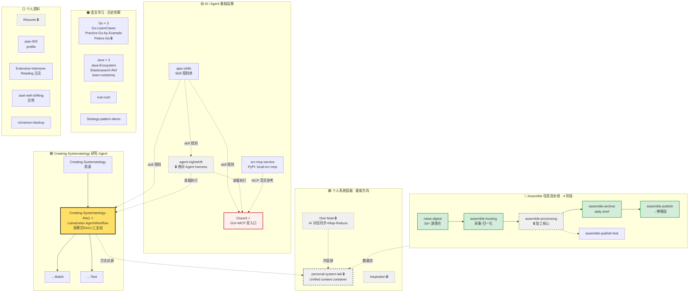
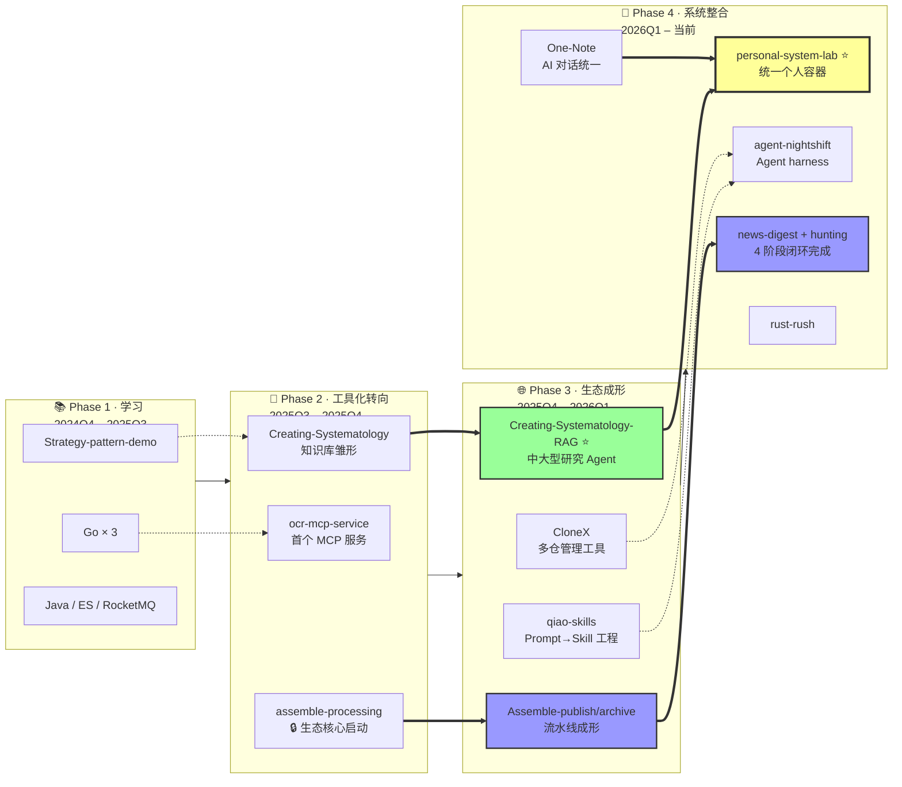
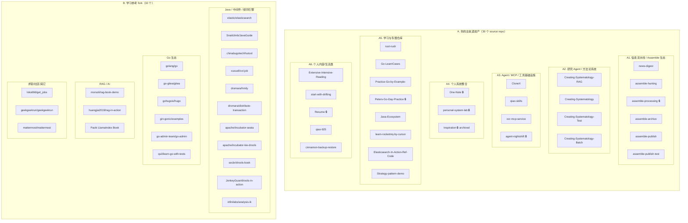
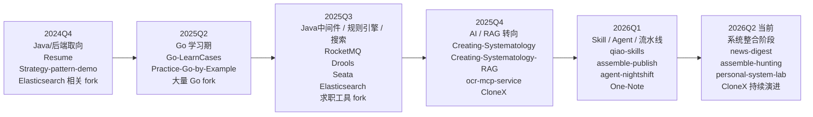

# Cascade Chat Conversation

  Note: _This is purely the output of the chat conversation and does not contain any raw data, codebase snippets, etc. used to generate the output._

### User Input

分析我的github仓库的所有项目（使用我的github账号），画一个图，拥有全局视角，方便把握整体构成和演化

不要局限于当前项目，而是账号的所有项目，之所以选择在当前仓库进行提问，是考虑这类的功能也许可以集成到当前项目中，不过还是先做研究和调研吧

分析一下我github账号里的所有数据

### Planner Response

我来帮你做这个调研。先制定计划，然后逐步搜集 GitHub 账号数据并分析。

*Updated todo list*

### Planner Response

先并行搜集账号下的仓库数据（多维度拉取）：

*Running MCP tool*

*Running MCP tool*

### Planner Response

数据被截断了，读取完整列表：

*Viewed [mcp_output_69ffc387880746fa.txt](file:///tmp/windsurf/mcp_output_69ffc387880746fa.txt) *

### Planner Response

已拿到 30 个仓库的完整列表。数据中有几个关键聚类（Assemble 系列、Creating-Systematology 系列、Go 学习系列）。接下来深入读几个有代表性项目的 README 来确认架构理解：

*Running MCP tool*

*Running MCP tool*

*Running MCP tool*

*Running MCP tool*

*Running MCP tool*

*Running MCP tool*

### Planner Response

**重大发现**：Assemble 是一个完整的 **4 阶段信息流水线**，Creating-Systematology-RAG 是中大型系统学研究 Agent，qiao-skills 是 Prompt→Skill 工程迁移的规则库。继续读其它关键仓库：

*Running MCP tool*

*Running MCP tool*

*Running MCP tool*

*Running MCP tool*

*Running MCP tool*

*Running MCP tool*

### Planner Response

两个私有仓的 README 读取失败（`assemble-processing` 和 `Creating-Systematology` 对当前 token 不可见），其它都成功了。已有足够数据推进分析。继续拿几个剩余关键仓库（含当前项目 CloneX 的已知本地内容）：

*Running MCP tool*

*Running MCP tool*

*Running MCP tool*

*Running MCP tool*

*Running MCP tool*

*Viewed [README.md](file:///home/q/Desktop/CloneX/README.md) *

### Planner Response

已拿到足够数据。更新任务状态，然后直接生成分析与全局图：

*Updated todo list*

### Planner Response

# qiao-925 GitHub 账号全局调研报告

## 一、账号画像

- **身份**：Peter Hua，Java 后端（4 年），正在从分布式系统/多租户 SaaS 背景向 **AI Agent / RAG / 个人系统** 方向迁移
- **仓库总数**：**30 个**（23 public + 7 private），时间跨度 **2024-10 → 2026-04**（约 1.5 年）
- **主力语言**：Python（当前主力）/ Java / Go / Rust / Shell
- **私有仓**：`One-Note`、`personal-system-lab`、`assemble-processing`、`agent-nightshift`、`Resume`、`Inspiration`、`Peters-Go-Day-Practice`

## 二、核心发现：六大聚类

| 聚类 | 代表仓库 | 定位 | 状态 |
|---|---|---|---|
| 🔵 **Assemble 信息流水线** | news-digest、assemble-hunting/processing/archive/publish | 个人信息消费→输出的 4 阶段工厂 | 🔥 最活跃集群（4 月完成最后拼图） |
| 🟢 **Creating-Systematology** | Creating-Systematology-RAG | 钱学森系统学方法论驱动的深度研究 Agent，46k 行代码 | 🔥 单体最大工程 |
| 🟡 **AI/Agent 基础设施** | agent-nightshift、ocr-mcp-service、CloneX、qiao-skills | 横向工具栈（MCP / Skill / 多仓管理 / 夜间 Agent） | 🟢 稳定演进 |
| 🟣 **个人系统容器** | One-Note、personal-system-lab | 试图把所有能力整合为「统一个人系统」 | 🆕 最新方向（4 月诞生） |
| 🟠 **语言学习实践** | Go/Java/Rust 系列 + Strategy-pattern-demo | 技术栈拓展的历史痕迹 | 🟡 已淡出 |
| ⚪ **个人资料/兴趣** | Resume、Inspiration、Extensive-Intensive-Reading（古文）、start-with-drifting（吉他）、cinnamon-backup-restore | 非代码类个人内容 | 🟢 零散更新 |

---

## 三、全局视角图

### 图 1 · 仓库生态拓扑（当前状态）

### 图 2 · 演化时间线（4 阶段）

### 图 3 · 当前活跃度热度图（最近更新）

| 仓库 | 最近推送 | 热度 | 类别 |
|---|---|:---:|---|
| **news-digest** | 2026-04-22 | 🔥🔥🔥 | Assemble |
| **One-Note** | 2026-04-22 | 🔥🔥🔥 | 个人系统 |
| **Creating-Systematology-RAG** | 2026-04-22 | 🔥🔥🔥 | 研究 Agent |
| **CloneX** | 2026-04-21 | 🔥🔥🔥 | 工具（当前）|
| **qiao-skills** | 2026-04-21 | 🔥🔥🔥 | Skill 基础设施 |
| **personal-system-lab** | 2026-04-21 | 🔥🔥 | 个人系统（新生）|
| **assemble-processing** | 2026-04-20 | 🔥🔥 | Assemble 核心 |
| **assemble-hunting** | 2026-04-20 | 🔥🔥 | Assemble（新生）|
| **assemble-publish** | 2026-04-20 | 🔥🔥 | Assemble |
| **assemble-archive** | 2026-04-20 | 🔥🔥 | Assemble |
| agent-nightshift | 2026-03-31 | 🟡 | Agent harness |
| ocr-mcp-service | 2026-03-15 | 🟡 | MCP 服务 |
| rust-rush | 2026-03-11 | ⚪ | 学习 |
| Resume / Inspiration / Creating-Systematology（旧） | 2025-11~12 | ⚪ | 非主线 |
| 其余学习仓 | 2025-04~09 | 冷 | 已淡出 |

---

## 四、关键洞察

### 1. **演化曲线清晰：学习 → 工具 → 生态 → 系统整合**
- 从 **个人技能点**（Java/Go 学习）→ **单点工具**（OCR MCP）→ **多个生态**（Assemble、Systematology、CloneX）→ **统一容器**（personal-system-lab）
- 当前正处在 **Phase 4 系统整合期**：近 30 天新生的 `personal-system-lab`、`assemble-hunting`、`news-digest` 是明确信号

### 2. **设计哲学一致性很强**（横跨不同项目）
- **清晰分层**：CloneX `ui/mcp → application → core/domain → infra`；Creating-Systematology-RAG 四层架构
- **单一职责**：Assemble 4 阶段每个仓库只做一件事
- **核心最小化**：ocr-mcp-service、agent-nightshift v1 都刻意收敛路径
- **概率+确定性双层**：RAG 项目用 LLM 做推理（概率），架构层做约束（确定性）

### 3. **两条主干 + 一条基础设施**
- **主干 A（输入侧）**：Assemble 流水线 —— **处理信息流**
- **主干 B（知识侧）**：Creating-Systematology-RAG —— **生产研究结论**
- **基础设施**：qiao-skills（规则）+ agent-nightshift（执行）+ CloneX（仓库运维）+ ocr-mcp-service（MCP 范式）
- **整合层**（正在构建）：personal-system-lab + One-Note

### 4. **技术偏好与工程成熟度**
- **Python + uv + MCP + LlamaIndex** 已成当前主力栈
- 文档沉淀强：几乎每个关键仓库都有完整 README + 架构图
- 工程纪律成熟：分层约束、CI workflow、PyInstaller 打包、PyPI 发布、Gist 加密配置同步

### 5. **隐形信号**
- `assemble-publish-test`、`Creating-Systematology-Test`、`Creating-Systematology-Batch` → **喜欢用独立仓库做「实验/批处理/测试」分离**
- 私有 `assemble-processing` 是 Assemble 生态的真正大脑，公开仓多为周边 —— **核心资产私有化** 的策略
- `qiao-925/qiao-925` profile 还停留在 Java 后端身份，README 未更新到当前 AI 方向

---

## 五、CloneX 集成可能性评估（简评）

**结论：这个能力明显补位，但不是现在做**

**为什么补位**：
- CloneX 当前核心是「**操作仓库**」（克隆/更新/分类/失败重试）
- 缺的是「**理解仓库组合**」（全局视角 / 演化 / 依赖 / 主题聚类）
- 两者恰好在同一工具里形成 **Ops（操作）+ Insight（洞察）** 闭环
- 复用现成能力低成本：`infra/github_api.py`、`domain/repo_groups.py`、MCP 工具集已经齐全

**可选路径**（未来，不是现在）：
- **轻量**：新增 `insights_overview` / `insights_evolution` 两个 MCP 工具，让 Agent 能生成本次这种调研
- **中量**：GUI 增加 "全局视图" Tab，展示拓扑图 + 时间线 + 活跃度热图
- **重量**：LLM 聚类 + 主题抽取（会引入新依赖，偏离当前 CloneX 的「最小化 + 确定性」路线）

**为什么不是现在**：
- CloneX v1 的定位（批量维护）尚未充分验证用户价值
- AGENTS.md 的分层已经很清晰，加 Insight 层会打乱焦点
- Assemble 生态里 `assemble-processing` 就是做信息加工的，这部分调研能力**更适合放在那边**，而不是让 CloneX 膨胀

---

## 六、下一步可选

*Asked user a question*

### Planner Response

收到。仓库数可能有遗漏，分析维度也确实不够深。先用 `gh` CLI 直接拉完整仓库列表（含 fork/archive/primaryLanguage/size），再补足缺失维度。

*User accepted the command `gh --version && gh auth status 2>&1 | head -20`*

### Planner Response

`gh` 已认证。拉完整列表（含 fork / archived / 所有 private）：

*User accepted the command `mkdir -p /tmp/clonex-research && gh repo list qiao-925 --limit 500 --json name,isPrivate,isFork,isArchived,isTemplate,createdAt,updatedAt,pushedAt,primaryLanguage,description,stargazerCount,forkCount,diskUsage,repositoryTopics,parent,homepageUrl,licenseInfo > /tmp/clonex-research/repos.json && echo "---COUNT---" && jq 'length' /tmp/clonex-research/repos.json`*

### Planner Response

**62 个仓库**（之前 search API 只返回 30 个，漏了 fork + archived）。分析完整数据：

*User accepted the command `jq -r '.[] | [.name, (.isPrivate|tostring), (.isFork|tostring), (.isArchived|tostring), (.primaryLanguage.name // "-"), (.createdAt[:10]), (.pushedAt[:10]), (.diskUsage|tostring), (.stargazerCount|tostring), (.forkCount|tostring), ((.repositoryTopics | map(.name) | join(","))//""), (.parent.nameWithOwner // ""), (.description // "")] | @tsv' /tmp/clonex-research/repos.json | sort -t$'\t' -k7 -r`*

### User Input

continue

### Planner Response

我继续，先把刚才的解析命令修正掉，然后基于 **62 个仓库** 做一轮更完整的统计和分层。

*User accepted the command `python - <<'PY'
import json
from collections import Counter,defaultdict
from pathlib import Path
p=Path('/tmp/clonex-research/repos.json')
repos=json.loads(p.read_text())
print('total', len(repos))
print('public', sum(not r['isPrivate'] for r in repos))
print('private', sum(r['isPrivate'] for r in repos))
print('fork', sum(r['isFork'] for r in repos))
print('archived', sum(r['isArchived'] for r in repos))
langs=Counter((r.get('primaryLanguage') or {}).get('name','Unknown') for r in repos)
print('\nLANGS')
for k,v in langs.most_common(15):
    print(f'{k}\t{v}')
print('\nMOST_RECENT_PUSHED')
for r in sorted(repos, key=lambda x: x.get('pushedAt') or '', reverse=True)[:20]:
    print('\t'.join([
        r['name'],
        'private' if r['isPrivate'] else 'public',
        'fork' if r['isFork'] else 'source',
        'archived' if r['isArchived'] else 'active',
        ((r.get('primaryLanguage') or {}).get('name') or '-'),
        (r.get('createdAt') or '')[:10],
        (r.get('pushedAt') or '')[:10],
        str(r.get('diskUsage') or 0),
        (r.get('parent') or {}).get('nameWithOwner',''),
        (r.get('description') or '').replace('\t',' ')
    ]))
print('\nLARGEST')
for r in sorted(repos, key=lambda x: x.get('diskUsage') or 0, reverse=True)[:20]:
    print('\t'.join([r['name'], str(r.get('diskUsage') or 0), ((r.get('primaryLanguage') or {}).get('name') or '-')]))
print('\nTOPICS')
top=Counter()
for r in repos:
    for t in (r.get('repositoryTopics') or []):
        name=t['name'] if isinstance(t,dict) else str(t)
        top[name]+=1
for k,v in top.most_common(30):
    print(f'{k}\t{v}')
PY`*

### Planner Response

解析环境里只有 `python3`，我换成它继续跑统计。

### Planner Response

这是一次**传输层中断**，不是业务结论本身出错。  
我直接从上一步恢复，改用 `python3` 继续做本地统计。

*User accepted the command `python3 - <<'PY'
import json
from collections import Counter
from pathlib import Path
p=Path('/tmp/clonex-research/repos.json')
repos=json.loads(p.read_text())
print('total', len(repos))
print('public', sum(not r['isPrivate'] for r in repos))
print('private', sum(r['isPrivate'] for r in repos))
print('fork', sum(r['isFork'] for r in repos))
print('archived', sum(r['isArchived'] for r in repos))
langs=Counter((r.get('primaryLanguage') or {}).get('name','Unknown') for r in repos)
print('\nLANGS')
for k,v in langs.most_common(20):
    print(f'{k}\t{v}')
print('\nMOST_RECENT_PUSHED')
for r in sorted(repos, key=lambda x: x.get('pushedAt') or '', reverse=True)[:25]:
    print('\t'.join([
        r['name'],
        'private' if r['isPrivate'] else 'public',
        'fork' if r['isFork'] else 'source',
        'archived' if r['isArchived'] else 'active',
        ((r.get('primaryLanguage') or {}).get('name') or '-'),
        (r.get('createdAt') or '')[:10],
        (r.get('pushedAt') or '')[:10],
        str(r.get('diskUsage') or 0),
        ((r.get('parent') or {}) or {}).get('nameWithOwner',''),
        (r.get('description') or '').replace('\t',' ')
    ]))
print('\nLARGEST')
for r in sorted(repos, key=lambda x: x.get('diskUsage') or 0, reverse=True)[:20]:
    print('\t'.join([r['name'], str(r.get('diskUsage') or 0), ((r.get('primaryLanguage') or {}).get('name') or '-')]))
print('\nTOPICS')
top=Counter()
for r in repos:
    for t in (r.get('repositoryTopics') or []):
        name=t['name'] if isinstance(t,dict) else str(t)
        top[name]+=1
for k,v in top.most_common(30):
    print(f'{k}\t{v}')
PY`*

### Planner Response

我已经确认差异来源了：

- **62**：账号下**全部仓库**（含 `fork`）
- **30**：你自己主导的 **source 仓库**（非 fork）

接下来我把账号做成更完整的分层：`source / fork / private / archived / 时间演化 / 体量 / 主线项目 / 边缘项目`。

*User accepted the command `python3 - <<'PY'
import json
from pathlib import Path
from collections import Counter,defaultdict
repos=json.loads(Path('/tmp/clonex-research/repos.json').read_text())
source=[r for r in repos if not r['isFork']]
forks=[r for r in repos if r['isFork']]
print('SOURCE_COUNT', len(source))
print('FORK_COUNT', len(forks))
print('\nSOURCE_REPOS')
for r in sorted(source, key=lambda x:(x.get('pushedAt') or ''), reverse=True):
    print('\t'.join([
        r['name'],
        'private' if r['isPrivate'] else 'public',
        'archived' if r['isArchived'] else 'active',
        ((r.get('primaryLanguage') or {}).get('name') or '-'),
        (r.get('createdAt') or '')[:10],
        (r.get('pushedAt') or '')[:10],
        str(r.get('diskUsage') or 0),
        (r.get('description') or '').replace('\t',' ')
    ]))
print('\nFORK_REPOS')
for r in sorted(forks, key=lambda x:(x.get('pushedAt') or ''), reverse=True):
    print('\t'.join([
        r['name'],
        ((r.get('parent') or {}) or {}).get('nameWithOwner',''),
        ((r.get('primaryLanguage') or {}).get('name') or '-'),
        (r.get('createdAt') or '')[:10],
        (r.get('pushedAt') or '')[:10],
        str(r.get('diskUsage') or 0)
    ]))
print('\nCREATE_BY_MONTH')
m=Counter((r.get('createdAt') or '')[:7] for r in source)
for k,v in sorted(m.items()):
    print(k, v)
print('\nPUSH_BY_MONTH')
m=Counter((r.get('pushedAt') or '')[:7] for r in source)
for k,v in sorted(m.items()):
    print(k, v)
print('\nSOURCE_LANGS')
langs=Counter(((r.get('primaryLanguage') or {}).get('name') or 'Unknown') for r in source)
for k,v in langs.most_common():
    print(k, v)
print('\nTOTAL_STARS_OWNED', sum(r.get('stargazerCount') or 0 for r in source))
print('TOTAL_FORKS_OWNED', sum(r.get('forkCount') or 0 for r in source))
print('TOTAL_DISK_OWNED', sum(r.get('diskUsage') or 0 for r in source))
PY`*

### Planner Response

我再补一层：把 `fork` 仓的来源、账号级摘要、时间演化解释清楚，这样结论会稳很多。

*User accepted the command `python3 - <<'PY'
import json
from pathlib import Path
repos=json.loads(Path('/tmp/clonex-research/repos.json').read_text())
for r in repos:
    if r['isFork']:
        print(r['name'])
        print(sorted(r.keys()))
        print(r.get('parent'))
        break
PY`*

*User accepted the command `gh api users/qiao-925 | python3 - <<'PY'
import json,sys
u=json.load(sys.stdin)
for k in ['login','name','public_repos','followers','following','created_at','updated_at','bio','blog','location','twitter_username']:
    print(f'{k}: {u.get(k)}')
PY`*

### Planner Response

再把账号级摘要和 `fork` 来源分布拉齐，补足“全局视角”。

*User accepted the command `python3 - <<'PY'
import json, subprocess
from collections import Counter
from pathlib import Path
u=json.loads(subprocess.check_output(['gh','api','users/qiao-925']).decode())
print('USER')
for k in ['login','name','public_repos','followers','following','created_at','updated_at','bio','blog','location','twitter_username']:
    print(f'{k}\t{u.get(k)}')
repos=json.loads(Path('/tmp/clonex-research/repos.json').read_text())
forks=[r for r in repos if r['isFork']]
print('\nFORK_OWNERS')
owners=Counter(((r.get('parent') or {}).get('owner') or {}).get('login','unknown') for r in forks)
for k,v in owners.most_common(20):
    print(f'{k}\t{v}')
print('\nFORK_BY_LANG')
langs=Counter(((r.get('primaryLanguage') or {}).get('name') or 'Unknown') for r in forks)
for k,v in langs.most_common(20):
    print(f'{k}\t{v}')
print('\nFORK_FULL')
for r in sorted(forks, key=lambda x:(x.get('createdAt') or '')):
    p=r.get('parent') or {}
    po=p.get('owner') or {}
    full=(po.get('login','?') + '/' + p.get('name','?'))
    print('\t'.join([r['name'], full, ((r.get('primaryLanguage') or {}).get('name') or '-'), (r.get('createdAt') or '')[:10]]))
PY`*

### Planner Response

数据已经补齐到可下结论了，我先把调研任务收尾，然后给你一版 **更完整、纠正过仓库数量** 的全局报告。

*Updated todo list*

### Planner Response

# 修正版全局分析

你指出得对。前一版把 **`fork` 漏掉了**，所以仓库数不对。  
我这次直接用你本机已登录的 `gh` 账号拉了完整数据，结论如下：

- **账号总仓库数**：`62`
- **其中 source 仓库**（你自己创建/主导）：`30`
- **fork 仓库**：`32`
- **public**：`55`
- **private**：`7`
- **archived**：`1`
- **账号创建时间**：`2020-03-03`
- **当前 profile**：`Backend Engineer`
- **blog**：`https://assemble.gitbook.io/assemble/`

所以：
- 我前面说的 `30`，其实更接近 **“你自己的主仓数量”**
- 但你要的是 **账号里所有项目**，正确口径应该是 **62**

---

# 一、先给你一个真正的全局视角

你的 GitHub 不是“很多零散仓库”，而是一个很清晰的 **三层结构**：

- **第一层：个人主航道仓库**
  - 30 个 source repo
  - 这里体现你的真实演化、方法论、产品意识和工程资产
- **第二层：学习/参考型 fork 仓库**
  - 32 个 fork repo
  - 这里记录你的技术兴趣迁移路线
- **第三层：正在形成的系统级整合方向**
  - 最近 1-2 个月出现的一批仓库，显示你已经不只是做单点项目，而是在做 **个人知识/Agent/信息流水线/执行系统** 的整合

换句话说：

> 你的账号已经从“学习型代码仓库集合”，演化成了“围绕个人认知系统与 AI 工程的多仓库生态”。

---

# 二、仓库全景结构图

## 图 1：账号级项目地图

---

# 三、最核心的结论：你的账号有 4 条主线

## 1. **Assemble 主线：从信息摄取到输出发布的流水线**

这是你账号里**最像“系统”**的一条线，而且最近最活跃。

核心链条：

### 这条线的意义
- `news-digest`
  - 自动聚合 50+ 信息源
  - 是 **原始输入层**
- `assemble-hunting`
  - 把不同来源统一归一化
  - 是 **采集与标准化层**
- `assemble-processing`
  - 私有核心仓
  - 是 **真正的加工引擎**
- `assemble-archive`
  - 发布前的沉淀产物
  - 是 **产物层**
- `assemble-publish`
  - 把结果推送到博客园
  - 是 **分发层**

### 判断
这不是几个独立仓库，而是已经成形的 **信息生产线**。  
而且它明显不是玩具项目，已经有：

- 分阶段设计
- 独立仓库职责拆分
- 自动化执行
- 发布出口
- 文档说明清晰

**这是你账号里最成熟的“多仓协作系统”之一。**

---

## 2. **Creating-Systematology 主线：研究 Agent / 方法论工程化**

另一条主航道是 `Creating-Systematology-*` 系列。

最重要的是：

- `Creating-Systematology-RAG`
- 旧版 `Creating-Systematology`
- `Creating-Systematology-Test`
- `Creating-Systematology-Batch`

### 这条线的特征
这条线不是普通 RAG Demo，而是明显带有：
- 方法论意识
- 审计意识
- 评估闭环意识
- 架构分层意识

它的 README 已经暴露出你在做的不是“聊天机器人”，而是：

> 一个基于系统学方法论的、可审计、可评估、可复现的深度研究 Agent。

### 判断
这条线显示你已经从：
- “会用模型”
进化到
- “会设计研究型 Agent 的架构与运行机制”

这在你全部仓库里，代表的是 **抽象能力最高的一条线**。

---

## 3. **基础设施主线：CloneX / qiao-skills / agent-nightshift / OCR MCP**

这是你的**横向能力层**。

### `CloneX`
- 多仓库管理工具
- GUI + MCP 双入口
- 说明你在思考：
  - 人类界面怎么用
  - Agent 怎么调用
  - 业务逻辑怎么复用

### `qiao-skills`
- Prompt → Skill 工程迁移
- 把经验规则显式化、安装化、可维护化
- 本质上是 **AI 工程方法资产库**

### `agent-nightshift`
- GitHub 驱动、本地执行的夜间 agent harness
- 这是一个非常鲜明的方向：
  - 人白天定计划
  - 系统夜里执行
  - checkpoint / review / recovery 成链路

### `ocr-mcp-service`
- 一个 MCP 服务的最小化实现
- 体现你对：
  - 工具契约
  - 错误语义
  - 最小核心路径
  的理解

### 判断
这条线意味着你已经不是单纯做“AI 应用”，而是在搭：

- Agent 执行框架
- Tool 协议层
- Skill 资产层
- 多仓调度层

也就是你在积累 **AI 工程基础设施**。

---

## 4. **个人系统整合主线：One-Note + personal-system-lab**

这是你账号里**最值得重视的最新信号**。

### `One-Note`
它不是普通笔记仓，而是：
- 把多种 AI 对话系统的数据同步到统一仓库
- 有 `sync`
- 有 `analysis`
- 有 Map-Reduce 风格的分析入口

这已经不是“记笔记”，而是在做：

> 个人 AI 交互记录的数据仓和分析层。

### `personal-system-lab`
虽然现在内容还少，但仓库名和描述非常关键：

- `Unified personal context container`
- `task-kernel research`

这基本是在说：

> 你在尝试把个人上下文、知识、任务、执行系统，放进同一个容器中。

### 判断
这很可能是你未来最大的方向：
- Assemble 负责信息输入输出
- Creating-Systematology 负责研究判断
- qiao-skills 提供规则
- agent-nightshift 提供执行
- One-Note 提供记忆材料
- personal-system-lab 尝试做总装配

也就是说，你正在从“很多 AI 项目”走向：

> **一个个人认知操作系统（Personal Cognitive OS）**

---

# 四、时间演化：你不是随机建仓，而是在连续进化

## 图 2：演化时间线

## 演化判断

你账号的大致阶段是：

- **2024Q4**
  - 还是偏传统后端工程师画像
- **2025Q2**
  - Go 学习期
- **2025Q3**
  - Java 中间件、规则引擎、搜索、分布式事务
- **2025Q4**
  - 明显转入 AI / RAG / Agent 工程
- **2026Q1-Q2**
  - 从单项目进入 **多仓协同的系统整合期**

这条演化曲线非常清楚，而且是**逐层升级**，不是跳跃式乱建仓。

---

# 五、为什么会出现“62 个仓，但真正主线只有少数”

这是一个很关键的全局判断。

## 62 个仓库里，真正该用不同眼光看待的是 3 类

### A. **你的核心资产仓**
大概 10-15 个最重要：

- `CloneX`
- `Creating-Systematology-RAG`
- `news-digest`
- `assemble-hunting`
- `assemble-processing`
- `assemble-archive`
- `assemble-publish`
- `qiao-skills`
- `agent-nightshift`
- `One-Note`
- `personal-system-lab`
- `ocr-mcp-service`

### B. **阶段性实验/分支仓**
例如：
- `Creating-Systematology-Test`
- `Creating-Systematology-Batch`
- `assemble-publish-test`

它们不是主产品，而是围绕主产品的试验层。

### C. **学习痕迹 / 参考输入仓**
包括大量 fork：
- Java 技术栈
- Go 技术栈
- RAG 示例
- 求职自动化工具
- 社区系统

这类仓库不是“成果本体”，但非常重要，因为它们揭示：

- 你学过什么
- 你受过什么项目影响
- 你在什么时间点吸收了什么方向的知识

---

# 六、Fork 仓库其实暴露了你的技术迁移轨迹

## fork 分布
- **Java**：`14`
- **Go**：`11`
- **Python**：`2`
- **Jupyter Notebook**：`2`
- **Vue**：`1`
- **TypeScript**：`1`

这很说明问题。

## 你的 fork 轨迹不是随机的，而是：

### 阶段 1：Java/中间件/搜索
典型：
- `elastic/elasticsearch`
- `Snailclimb/JavaGuide`
- `hutool`
- `xxl-job`
- `hmily`
- `incubator-seata`
- `drools` 系列

说明你早期的知识图谱是：
- Java 后端
- 中间件
- 搜索
- 分布式事务
- 规则引擎

### 阶段 2：Go
典型：
- `golang/go`
- `gitea`
- `hugo`
- `learn-go-with-tests`
- `gin examples`

说明你后来在补：
- Go 语言基础
- Web/工程实践
- 大型 Go 项目结构

### 阶段 3：RAG / AI
典型：
- `rag-book-demo`
- `rag-in-action`
- `Building-Data-Driven-Applications-with-LlamaIndex`

说明你不是凭空转 AI，而是先通过外部样例做输入，再发展出自己的系统。

---

# 七、从“工程气质”上看，你的账号有几个非常鲜明的特点

## 1. **明显偏系统化，而不是偏单点 feature**
你喜欢：
- 分层
- 流程
- 状态
- 协议
- 执行链路
- checkpoint
- audit
- evaluate

这在 `CloneX`、`Creating-Systematology-RAG`、`agent-nightshift` 都很明显。

## 2. **强烈的“多仓拆分”倾向**
你不喜欢把所有东西塞进一个大仓里，而更愿意：
- 一仓一职责
- 一阶段一仓
- 测试/批处理/发布独立拆分

优点：
- 边界清晰
- 迭代独立
- 易于定位职责

代价：
- 全局视角更难保持
- 需要更强的生态管理能力

这也正好解释了你为什么会需要“分析我的所有 GitHub 项目”的能力。

## 3. **从“做工具”转向“做系统”**
很多仓库表面上是工具：
- OCR MCP
- CloneX
- qiao-skills

但本质都不是孤立工具，而是在为更大的系统服务。

## 4. **你已经不只是工程实现者，而是在做方法资产沉淀**
`qiao-skills` 特别能说明这一点。  
这不是代码仓，而是把经验抽象成规则资产。

---

# 八、你的账号当前最重要的“总结构”

我给你一个更聚焦的判断：

## 你现在的 GitHub 其实围绕 3 个中心在组织

### 中心 1：**信息进入与内容生产**
- `news-digest`
- `assemble-*`

### 中心 2：**研究与判断生成**
- `Creating-Systematology-*`

### 中心 3：**Agent/Skill/Execution 基础设施**
- `CloneX`
- `qiao-skills`
- `agent-nightshift`
- `ocr-mcp-service`

而最新的：

### 总装配方向：**personal-system-lab**
它很可能想把上面三者接起来。

---

# 九、如果用一句话概括你账号的演化

我会这么总结：

> 这是一个从 Java/Go 后端工程背景出发，逐步转向 AI Agent、RAG、信息流水线与个人认知系统构建的 GitHub 账号；当前已从单点项目阶段进入“多仓生态整合阶段”。

---

# 十、对 CloneX 的意义

你说得对，这个问题虽然在当前仓库提，但未必要局限当前仓库。  
不过从研究角度看，**CloneX 确实非常适合承载“全局仓库视角”能力**。

因为你现在最缺的不是：
- 再多一个执行工具

而是：
- 一个能帮你理解 **62 个仓库整体结构、演化、聚类、依赖、活跃度** 的入口

## 这能力最自然的两个方向

- **方向 A：做成 CloneX 的 Insight 层**
  - 优点：直接复用 GitHub repo 数据
  - 缺点：会让 CloneX 从“仓库操作工具”膨胀为“仓库认知工具”

- **方向 B：做成独立研究能力**
  - 比如放到：
    - `personal-system-lab`
    - `One-Note`
    - 或新的账号级分析仓
  - 优点：更符合“全局视角 / 研究 / 演化分析”的定位

**我现在更倾向 B。**

原因是：
- CloneX 更像运维/执行层
- 全局分析更像研究/认知层

---

# 十一、这次比上次更准确的地方

这次我修正了前面几个问题：

- **[仓库总数纠正]**
  - 从 `30` 修正为 `62`
- **[口径区分]**
  - 区分了 `source` 与 `fork`
- **[演化更完整]**
  - 把 Java → Go → RAG/AI → 系统整合 这条线拉清楚了
- **[结构更完整]**
  - 不只是讲几个代表项目，而是讲整个账号的组织方式
- **[全局视角更强]**
  - 明确了你的账号不是“项目列表”，而是一个正在形成的系统生态

---

# 十二、我建议的下一步

如果你要把这件事继续做深，最有价值的不是再泛泛聊，而是进入下面 3 个方向之一：

- **[方向 1：输出成正式文档]**
  - 我把这份报告整理成一份高质量 Markdown
  - 附完整 repo 清单、分类表、时间线图、核心仓解读

- **[方向 2：继续深挖“跨仓关系图”]**
  - 我进一步分析：
    - 哪些仓库引用哪些仓库
    - 哪些仓库是输入层
    - 哪些仓库是执行层
    - 哪些仓库是知识层
  - 画成更像“架构图”的图

- **[方向 3：落成一个可重复运行的账号分析器]**
  - 直接做成脚本/工具
  - 输入 GitHub 用户名
  - 自动输出：
    - repo 总览
    - 聚类
    - 演化图
    - Mermaid 图
    - Markdown 报告

这个方向其实最有复用价值，也最像你真正需要的能力。

---

# 当前状态

- **已完成**：基于你本机 GitHub 账号拉取并纠正了完整仓库口径，完成了更高质量的全局分析
- **未做**：还没有把这份分析落成文件，也还没有做成自动化工具

如果你愿意，我下一步可以直接做这两件事里的一个：

- **A.** 把这份分析写成一份正式 Markdown 报告
- **B.** 直接在当前仓库里先做一个“GitHub 账号全局分析器”原型